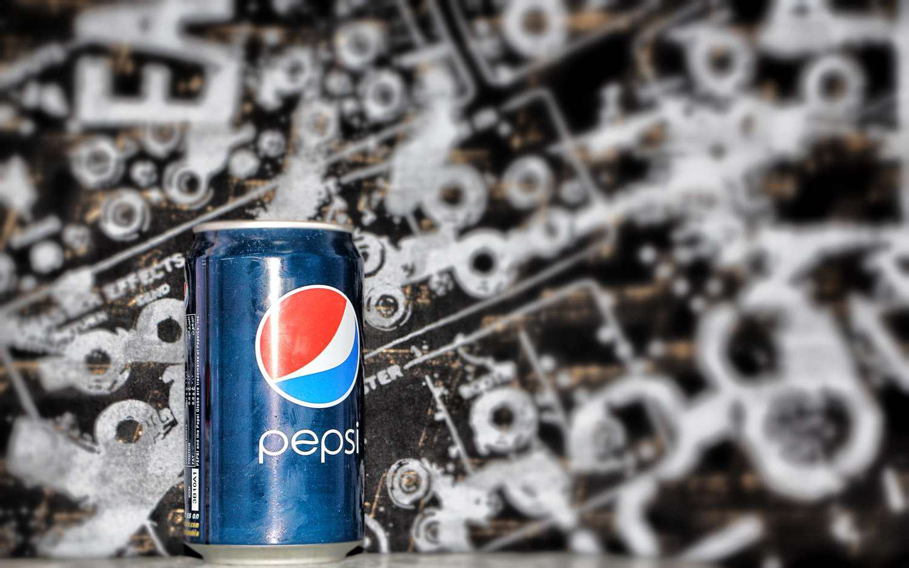

PepsiCo, Inc. (NASDAQ: PEP) is a leading global food and beverage company renowned for a vast array of popular brands that have substantial market penetration. These brands include iconic names such as Pepsi, Mountain Dew, Lay’s, Gatorade, Tropicana, and Quaker, each enjoying significant consumer following and contributing to PepsiCo's robust market presence. The company's stock, traded under the ticker symbol PEP on the Nasdaq stock market, represents a significant point of interest for both institutional and individual investors due to its stable performance, comprehensive corporate strategy, and diverse portfolio.

This article aims to provide a comprehensive examination of PepsiCo stock ownership, with a strong focus on identifying major shareholders and analyzing their influence. The role of algorithmic trading, which involves utilizing complex algorithms for executing stock trades at high speed and volume, will also be explored. This trading methodology has increasingly become pivotal in optimizing investments in PepsiCo stock, reacting adeptly to market changes and enhancing liquidity.



Furthermore, insights into PepsiCo's market performance will be discussed, highlighting historical ownership trends and assessing how these trends have shaped the current landscape of the company’s stock ownership. The impact of automated trading on the stock will also be evaluated, considering how it affects stock price stability and investor confidence. Through this exploration, the article seeks to offer valuable understanding for potential and current investors interested in the dynamics of PEP stock, as well as the broader implications of shareholder and trading developments on its future market trajectory.

## Table of Contents

## PepsiCo Overview

Founded in 1965 through the merger of Pepsi-Cola and Frito-Lay, PepsiCo is a multinational corporation with its headquarters located in Purchase, New York. It operates in more than 200 countries, which underscores its expansive reach in the global market. The company's strategic vision is shaped by its influential top executives and shareholders, contributing to its growth and adaptability in the evolving food and beverage sector.

PepsiCo's product portfolio is diverse and includes a number of well-known and successful brands. Notably, its flagship brand, Pepsi, has long been a competitor in the soft drink market, rivaling other major brands. In addition to soft drinks, PepsiCo offers a range of beverages through Gatorade, a brand synonymous with sports drinks, and Tropicana, known for its fruit-based beverages. Quaker, another pillar of PepsiCo's portfolio, represents the company's foray into the nutrition and breakfast segments with its cereals and snacks.

The company's business structure is designed to support this diverse portfolio, optimizing resources across different product categories while allowing for regional and market-specific adjustments. This structure aids PepsiCo's adaptability in meeting consumer demands and leveraging emerging market opportunities.

Financially, PepsiCo is a powerhouse in the food and beverage industry. Its market capitalization and annual revenue figures are substantial, indicating its prominent standing and economic impact. For instance, in 2022, PepsiCo reported net revenues of over $86 billion, illustrating significant financial health and influence. This economic footprint is further highlighted by the company's continuous investment in product innovation and sustainability initiatives, aligning with global trends toward health and environmental responsibility. 

In conclusion, PepsiCo's combination of a robust brand portfolio, strategic leadership, and solid financial performance supports its status as a leading entity in the food and beverage industry.

## Top Individual Shareholders of PepsiCo

Indra Nooyi, who served as PepsiCo's CEO from 2006 to 2018, played a pivotal role in shaping the company's strategic trajectory and holds a significant number of PepsiCo shares. During her tenure, she focused on product diversification and global expansion, leading to a period of considerable growth for the company. Her substantial stock holdings reflect both her long-term commitment to PepsiCo and the confidence she has in its continued success.

Bob Pohlad, a key figure connected through PepsiAmericas—a bottling company later acquired by PepsiCo—also maintains significant share ownership. The Pohlad family has been an integral part of PepsiCo's bottling operations, establishing a symbiotic relationship that underscores their investment in the company. This historical business alignment with PepsiCo ensures that Pohlad's interests remain closely tied to the company's performance.

Albert Carey once held the position of CEO of PepsiCo North America and contributed significantly to PepsiCo's strategic objectives. His role enabled him to accumulate a noteworthy quantity of shares, aligning him additionally with the company's long-term growth ambitions.

Hugh Johnston, who serves as Vice Chairman and CFO, has been a critical asset to PepsiCo, managing financial strategies and expansion initiatives. His in-depth knowledge of PepsiCo's financial dynamics has facilitated his accumulation of substantial holdings, reinforcing his vested interest in the company's ongoing prosperity.

Thomas Greco, a former CEO of Frito-Lay North America, a division of PepsiCo, also possesses significant holdings. His leadership in one of PepsiCo’s most profitable segments underscores his alignment with the company's objectives, manifesting in his stock acquisitions.

These individuals, through both their leadership roles and shareholdings, have had a substantial impact on PepsiCo, indicating a strong alignment between their interests and those of the company. Their stock ownership serves as a testament to their confidence in PepsiCo's strategic direction and long-term potential.

## Institutional Ownership of PepsiCo

Institutional investors hold a significant position in PepsiCo's ownership structure, with over 73% of the company's stock owned by large investment funds. This high level of institutional ownership indicates a strong interest and confidence from substantial market entities in PepsiCo's business and financial prospects.

Among the key institutional shareholders, Vanguard Group Inc., BlackRock Inc., and State Street Corp. stand out as major stakeholders. These investment management firms are renowned for their extensive portfolio management and are frequently involved in passive investment strategies, such as index fund management, which often lead to long-term holding patterns. The presence of such giants in PepsiCo's shareholder list not only reflects the company's ability to attract stable and long-term oriented investors but also contributes significantly to the stock's price stability.

Institutional investors such as Vanguard, BlackRock, and State Street play several critical roles beyond mere stockholding. They actively engage in corporate governance by voting on shareholder proposals and interacting with company management, thereby influencing corporate policies and strategic decisions. Their substantial holdings often afford them greater leverage in these dialogues, ensuring that PepsiCo's management aligns with shareholders' interests over the long term.

Furthermore, the involvement of these institutional investors can provide insights into the overall market confidence in PepsiCo. For instance, significant changes in their holdings can indicate shifts in market perception about PepsiCo’s future growth prospects or the broader economic context affecting the company. Monitoring these changes can offer invaluable information for other investors considering PepsiCo as part of their portfolio.

In conclusion, the strong institutional ownership of PepsiCo stock underscores the company's attractiveness to major financial entities and highlights the role these investors play in shaping both corporate governance and market perceptions.

## Algorithmic Trading in PepsiCo Stock

Algorithmic trading has revolutionized the way stocks are traded, including those of prominent companies like PepsiCo. This trading strategy employs complex algorithms, which are sets of rules and instructions formulated to perform autonomous trading at high speeds and volumes. These algorithms are designed to analyze multiple market variables and execute trades in fractions of a second, thereby capitalizing on market inefficiencies.

The primary advantage of [algorithmic trading](/wiki/algorithmic-trading) in PepsiCo stock lies in its ability to optimize trade execution by promptly responding to market fluctuations. This real-time analysis and execution outperform human capabilities in speed and precision, making it instrumental in maintaining competitive trading positions. By continuously monitoring price movements, market demands, and other significant indicators, algorithmic systems can identify profitable opportunities and minimize risks associated with human error or emotional interference in trading decisions.

Moreover, algorithmic trading enhances [liquidity](/wiki/liquidity-risk-premium), which is crucial for the efficient functioning of financial markets. Liquidity refers to the ease with which an asset can be converted to cash without impacting its market price. Improved liquidity facilitates the smoother execution of large trades without causing substantial price shifts, which is especially beneficial for institutional investors holding significant shares of PepsiCo stock. Increased liquidity also attracts more market participants, contributing to the overall stability and robustness of the trading environment.

Algorithmic trading systems employ various strategies, including market-making, statistical [arbitrage](/wiki/arbitrage), and trend-following tactics. Market-making algorithms, for instance, provide quotes for both buying and selling prices and seek to profit from the bid-ask spread, thereby adding liquidity to the market. Statistical arbitrage involves identifying pricing inefficiencies between correlated stocks to execute profit-generating trades. Such techniques make algorithmic trading not only a tool for execution but also a strategic advantage for portfolio management.

Python and other programming languages are commonly used to implement these algorithms. A basic Python algorithm for trading PepsiCo stock might analyze historical price data to predict future movements and automatically execute buy or sell orders based on predefined criteria. The integration of [machine learning](/wiki/machine-learning) techniques can further enhance the predictive accuracy of these algorithms, allowing traders to better anticipate market trends and behavior.

In summary, algorithmic trading plays a pivotal role in the trading of PepsiCo stock by optimizing execution, enhancing market liquidity, and improving trading efficiency. As technology continues to advance, the reliance on algorithmic trading is likely to grow, presenting both opportunities and challenges for investors navigating the dynamic landscape of stock markets.

## Market Performance and Trends

PepsiCo's stock performance, like that of many large multinational corporations, is influenced by a variety of market factors. These include consumer demand, competitive pressures, economic conditions, and external events such as regulatory changes. Analyzing these factors is crucial for investors to understand both historical trends and potential future performance of PepsiCo's stock (PEP).

Consumer demand plays a critical role in influencing PepsiCo's market performance. As a leading global food and beverage company, PepsiCo caters to a wide range of consumer preferences across various regions. Seasonal demand fluctuations, changing dietary habits, and shifts towards health-conscious products can have a significant impact on sales and, consequently, stock performance. For instance, an increased consumer preference for low-sugar and healthier beverage options might affect sales of traditional soda products, thereby impacting the company's revenues and stock.

Competitive pressures also significantly affect PepsiCo's market performance. The food and beverage industry is highly competitive, with major players like Coca-Cola, Nestlé, and Mondelez International constantly vying for market share. PepsiCo’s ability to innovate, market effectively, and expand its product lines influences its ability to maintain a competitive edge. This, in turn, affects investor perceptions and can lead to fluctuations in the stock price.

Historical stock trends of PepsiCo provide valuable insights into its market performance. By analyzing past data, investors can identify patterns that might suggest future movements. For example, historical pricing data can be evaluated using technical analysis indicators such as moving averages or relative strength indices (RSI). These tools help investors forecast potential price movements and [volatility](/wiki/volatility-trading-strategies), aiding in making informed decisions.

Understanding broader market indicators is also crucial for investors in assessing PepsiCo's stock performance. Economic indicators such as GDP growth rates, inflation, and interest rates can indirectly impact stock performance by affecting consumer purchasing power and spending habits. Additionally, global events, such as trade agreements or geopolitical tensions, can introduce uncertainty, affecting investor confidence and market stability.

Investors often employ statistical models and simulations to evaluate risk and potential returns. Using Python, one could employ libraries such as `pandas` and `matplotlib` to analyze PepsiCo’s historical stock data. For instance, calculating a moving average might involve:

```python
import pandas as pd
import matplotlib.pyplot as plt

# Load historical stock data
data = pd.read_csv('pepsico_stock_data.csv')

# Calculate 30-day moving average
data['30_MA'] = data['Close'].rolling(window=30).mean()

# Plot the stock closing prices and 30-day moving average
plt.figure(figsize=(10, 5))
plt.plot(data['Date'], data['Close'], label='PEP Close Price')
plt.plot(data['Date'], data['30_MA'], label='30-day MA', color='orange')
plt.xlabel('Date')
plt.ylabel('Price in USD')
plt.title('PepsiCo Stock Price with 30-day Moving Average')
plt.legend()
plt.show()
```

In conclusion, PepsiCo's stock performance is intricately linked with market factors including consumer demand, competition, and economic conditions. By analyzing historical trends and understanding key market indicators, investors can better predict future stock movements and strategize their investments accordingly.

## Conclusion

PepsiCo's shareholder landscape is marked by diversity, encompassing individual, institutional, and increasingly sophisticated algorithmic trading actors. This multiplicity forms the cornerstone of the company's resilient market position. The substantial ownership stakes held by both major individual and institutional shareholders not only testify to the confidence in PepsiCo's long-term prospects but also actively contribute to the stability and predictability of its stock, traded under the ticker PEP (NASDAQ).

Investors seeking to understand the dynamics of PepsiCo stock will find it crucial to assess the influence wielded by these significant shareholders. The interconnection between their decisions and the stock's performance can provide nuanced insights into market movements and potential strategic shifts within the company. Institutional investors, in particular, play an outsized role, offering a measure of market confidence and facilitating liquidity, both essential for robust stock performance.

The rise of algorithmic trading introduces a layer of technological sophistication to the trading process, optimizing transactions through real-time data analysis and execution. These algorithms enhance liquidity and ensure efficient market operations by enabling swift adjustments to market fluctuations. The impact of such technologies underscores a modern trading ecosystem reliant on both human and machine intelligence.

Looking forward, successful navigation through the stock market will require stakeholders to stay attuned to evolving technological trends, with algorithmic trading likely to become even more prevalent. Additionally, shifting consumer preferences will continue to steer PepsiCo's operational focus and market strategies, demanding adaptability and foresight from investors and the company alike. Understanding these variables will be key to maintaining a competitive edge and harnessing the full potential of PepsiCo's market presence.

## References & Further Reading

[1]: ["The PepsiCo Story."](https://www.company-histories.com/PepsiCo-Inc-Company-History.html) PepsiCo Official Website.

[2]: Malkiel, B. G. (2019). ["A Random Walk Down Wall Street: The Time-Tested Strategy for Successful Investing"](https://yourknowledgedigest.org/wp-content/uploads/2020/04/a-random-walk-down-wall-street.pdf). W. W. Norton & Company.

[3]: Narang, R. (2013). ["Inside the Black Box: A Simple Guide to Quantitative and High-Frequency Trading"](https://onlinelibrary.wiley.com/doi/book/10.1002/9781118662717). Wiley.

[4]: ["Behavioral Investing: A Practitioner's Guide to Applying Behavioral Finance"](https://www.amazon.com/Behavioural-Investing-Practitioners-Applying-Finance/dp/0470516704) by James Montier

[5]: ["The Little Book of Common Sense Investing: The Only Way to Guarantee Your Fair Share of Stock Market Returns"](https://www.amazon.com/Little-Book-Common-Sense-Investing/dp/1119404509) by John C. Bogle