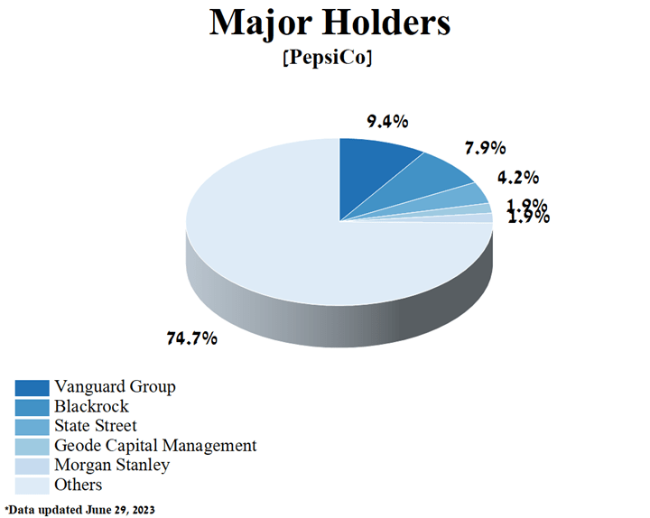

## Table of Contents

## What is a major shareholder?

A major shareholder is someone who owns a big part of a company's stock. This means they have a lot of the company's shares. When someone owns a lot of shares, they can have more say in how the company is run. Usually, if someone owns more than 5% or 10% of the company's stock, they are considered a major shareholder.

Major shareholders can influence the company's decisions. They might get to vote on important things like who should be on the board of directors or whether the company should merge with another company. Because they own so much, what they say can really matter. Sometimes, major shareholders are the founders of the company or big investors who believe in the company's future.

## Who are the current major shareholders of PepsiCo?

The Vanguard Group is one of the biggest shareholders of PepsiCo. They own a lot of PepsiCo's stock, which means they have a big say in what the company does. Vanguard is a big investment company that manages money for lots of people. They invest in many different companies, and PepsiCo is one of their major investments.

Another major shareholder of PepsiCo is BlackRock. Like Vanguard, BlackRock is also a huge investment company. They own a large amount of PepsiCo's shares, which gives them influence over the company's decisions. BlackRock manages money for lots of people and invests in many companies around the world.

State Street Corporation is also a major shareholder of PepsiCo. They own a significant portion of PepsiCo's stock. State Street is another big investment company that helps manage money for people and institutions. Their investment in PepsiCo shows they believe in the company's future.

## What percentage of PepsiCo does each major shareholder own?

The Vanguard Group owns about 9% of PepsiCo's stock. This means they have a big say in what the company does. Vanguard is a big investment company that manages money for lots of people. They invest in many different companies, and PepsiCo is one of their major investments.

BlackRock owns around 7% of PepsiCo's shares. Like Vanguard, BlackRock is also a huge investment company. They manage money for lots of people and invest in many companies around the world. Their ownership in PepsiCo gives them a lot of influence over the company's decisions.

State Street Corporation owns about 4% of PepsiCo's stock. They are another big investment company that helps manage money for people and institutions. Their investment in PepsiCo shows they believe in the company's future and have a significant role in its governance.

## How has the ownership of PepsiCo's major shareholders changed over the past year?

Over the past year, the ownership of PepsiCo's major shareholders has seen some changes, but they are still the big players. The Vanguard Group, which is one of the biggest shareholders, has slightly increased its stake in PepsiCo. They now own around 9% of the company's stock, up from about 8.8% a year ago. This small increase shows that Vanguard still believes in PepsiCo and wants to have a bigger say in the company's decisions.

BlackRock, another major shareholder, has also seen a slight change in its ownership. Last year, they owned about 6.9% of PepsiCo's shares, and now they own around 7%. This tiny increase means BlackRock is still very interested in PepsiCo and wants to keep its strong influence over the company. State Street Corporation, the third major shareholder, has kept its ownership pretty steady. They owned about 4% of PepsiCo's stock last year, and it's still around 4% now. This shows that State Street is happy with its current level of investment in PepsiCo and doesn't feel the need to change much.

## What is the role of institutional investors in PepsiCo's shareholder structure?

Institutional investors play a big role in PepsiCo's shareholder structure. They are big organizations like The Vanguard Group, BlackRock, and State Street Corporation that own a lot of PepsiCo's stock. These investors manage money for lots of people, like retirement funds or big investment portfolios. Because they own so much of PepsiCo, they have a lot of say in what the company does. They can vote on important decisions, like who should be on the board of directors or if the company should merge with another company.

Having institutional investors as major shareholders can be good for PepsiCo. It shows that big and smart investors believe in the company's future and want to be part of it. These investors often do a lot of research before they buy a lot of stock, so their investment can make other people more confident in PepsiCo too. But it also means that PepsiCo needs to keep these big investors happy. If they are not happy with how the company is doing, they might sell their shares, which could affect the stock price and the company's reputation.

## How does PepsiCo's shareholder composition compare to its main competitors?

PepsiCo's main competitors include companies like Coca-Cola and Mondelez International. PepsiCo's shareholder composition is similar to these companies because they all have a lot of institutional investors like The Vanguard Group and BlackRock as major shareholders. For example, The Vanguard Group owns about 9% of PepsiCo, 8% of Coca-Cola, and 9% of Mondelez. BlackRock owns around 7% of PepsiCo, 6% of Coca-Cola, and 7% of Mondelez. These big investors help show that these companies are seen as good investments by smart money managers.

However, there are some differences too. Coca-Cola has a bit more of its shares owned by individual investors compared to PepsiCo. This means that more regular people own Coca-Cola stock than PepsiCo stock. Mondelez, on the other hand, has a slightly higher percentage of its shares owned by mutual funds compared to PepsiCo. This shows that different types of investors might be more interested in one company over the other, even though they are all in the same industry. Overall, the big picture is that all these companies have strong backing from institutional investors, but the details can vary.

## What impact do major shareholders have on PepsiCo's corporate governance?

Major shareholders have a big impact on PepsiCo's corporate governance because they own a lot of the company's stock. When someone owns a lot of stock, they get to vote on important decisions, like who should be on the board of directors. The board of directors is a group of people who help run the company and make big decisions. So, if major shareholders like The Vanguard Group or BlackRock are not happy with the board, they can vote to change it. This means they can influence who is making the big decisions at PepsiCo.

Also, major shareholders can affect other parts of corporate governance, like how the company is managed and what strategies it follows. If they think the company is not doing well, they might suggest changes or even push for a new CEO. Because they own so much of the company, other shareholders and the company itself have to listen to them. This can lead to better decisions for the company, but it also means that PepsiCo needs to keep these big investors happy to keep their support.

## How do PepsiCo's major shareholders influence the company's strategic decisions?

Major shareholders like The Vanguard Group, BlackRock, and State Street Corporation have a big say in PepsiCo's strategic decisions because they own a lot of the company's stock. When they own a lot of stock, they can vote on important things, like who should be on the board of directors. The board of directors helps make big decisions for the company. So, if these major shareholders think the company should do something different, they can vote to change the board and bring in people who agree with them. This way, they can guide the company's strategies, like deciding to focus more on healthy snacks or expanding into new markets.

Also, these big investors can talk directly to PepsiCo's management. They might meet with the CEO or other top leaders to share their ideas about what the company should do. If they think PepsiCo should change its marketing plan or invest in new technology, they can suggest these things. Because they own so much of the company, PepsiCo's leaders listen to them. This can lead to better decisions for the company, but it also means PepsiCo needs to keep these big investors happy. If they are not happy, they might sell their shares, which could affect the stock price and the company's future.

## What are the voting rights associated with PepsiCo's shares, and how do they affect major shareholders?

PepsiCo's shares come with voting rights that let shareholders have a say in important company decisions. Each share of PepsiCo stock gives the owner one vote. This means the more shares someone owns, the more votes they get. Major shareholders like The Vanguard Group, BlackRock, and State Street Corporation own a lot of PepsiCo's stock, so they have a lot of votes. This gives them a big influence over things like who gets to be on the board of directors or if the company should merge with another company.

Because major shareholders have so many votes, they can really affect what PepsiCo does. If they are not happy with the board of directors, they can vote to change it and bring in people who agree with them. This can lead to changes in the company's strategies and goals. Major shareholders can also talk directly to PepsiCo's top leaders and suggest new ideas or changes. So, their voting power helps them guide the company's future and make sure their interests are considered in big decisions.

## How do insider ownership and major shareholder positions correlate at PepsiCo?

Insider ownership at PepsiCo refers to the shares owned by people who work at the company, like the CEO or other top leaders. Major shareholders, like The Vanguard Group or BlackRock, own a lot of PepsiCo's stock but are not part of the company. At PepsiCo, insider ownership is much smaller compared to the shares owned by major shareholders. Insiders might own around 0.1% of the company's stock, while major shareholders own much more, like 9% for Vanguard.

Even though insider ownership is small, it still matters because it shows that the people running the company believe in its future. Major shareholders, with their big ownership, have a lot of say in what PepsiCo does. They can vote on important things and talk directly to the company's leaders. So, while insiders own less, major shareholders have more power to influence the company's decisions.

## What are the recent trends in PepsiCo's shareholder activism?

Recently, there hasn't been a lot of big shareholder activism at PepsiCo. This means that big investors who own a lot of the company's stock haven't been pushing for big changes. PepsiCo has been doing well, so most shareholders are happy with how the company is being run. They trust the board of directors and the CEO to make good decisions. Because of this, there haven't been many cases where shareholders have tried to change things at the company.

However, there have been some small actions. For example, some investors have asked PepsiCo to focus more on being good for the environment and helping the community. They want the company to do more to fight climate change and support social causes. Even though these requests are not big changes, they show that some shareholders care about more than just making money. They want PepsiCo to be a responsible company too.

## How do global economic factors influence the investment decisions of PepsiCo's major shareholders?

Global economic factors can really affect what PepsiCo's major shareholders decide to do with their investments. When the world economy is doing well, these big investors might feel more confident and decide to buy more PepsiCo stock. They might think that if the economy is growing, people will buy more of PepsiCo's products, like snacks and drinks, which could make the company's stock price go up. On the other hand, if the world economy is struggling, like during a recession, these investors might be more cautious. They might sell some of their PepsiCo stock or not buy more, because they're worried that people will spend less money on snacks and drinks, which could hurt PepsiCo's profits and stock price.

Also, things like interest rates and inflation can play a big role in these decisions. If interest rates are low, borrowing money is cheaper, and companies like PepsiCo might take out loans to grow their business. This can be good for shareholders because it might lead to more profits. But if inflation is high, it can make things more expensive for PepsiCo, like the ingredients they need to make their products. This could squeeze their profits, and shareholders might decide to sell some of their stock to avoid losing money. So, major shareholders always keep an eye on these global economic factors to decide whether to buy more, hold, or sell their PepsiCo stock.

## References & Further Reading

[1]: ["The PepsiCo Story."](https://www.company-histories.com/PepsiCo-Inc-Company-History.html) PepsiCo Official Website.

[2]: Malkiel, B. G. (2019). ["A Random Walk Down Wall Street: The Time-Tested Strategy for Successful Investing"](https://yourknowledgedigest.org/wp-content/uploads/2020/04/a-random-walk-down-wall-street.pdf). W. W. Norton & Company.

[3]: Narang, R. (2013). ["Inside the Black Box: A Simple Guide to Quantitative and High-Frequency Trading"](https://onlinelibrary.wiley.com/doi/book/10.1002/9781118662717). Wiley.

[4]: ["Behavioral Investing: A Practitioner's Guide to Applying Behavioral Finance"](https://www.amazon.com/Behavioural-Investing-Practitioners-Applying-Finance/dp/0470516704) by James Montier

[5]: ["The Little Book of Common Sense Investing: The Only Way to Guarantee Your Fair Share of Stock Market Returns"](https://www.amazon.com/Little-Book-Common-Sense-Investing/dp/1119404509) by John C. Bogle