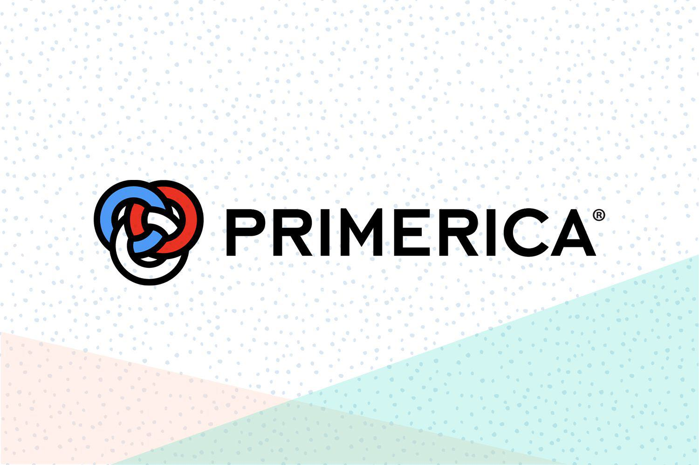

## Table of Contents

## What is Primerica, Inc. and what does it do?

Primerica, Inc. is a financial services company based in the United States. It helps people with their money by offering different kinds of financial products and services. The company focuses on helping middle-income families plan for their future and protect their loved ones.

One of the main things Primerica does is sell life insurance. This helps families have money if something happens to the person who earns it. They also help people invest their money in ways that can grow over time, like mutual funds. Primerica works through a network of independent representatives who meet with people in their homes to explain these financial options.

Overall, Primerica aims to educate people about money and help them make smart choices. They want to make sure families are prepared for the future and can handle unexpected events. By offering simple and clear financial solutions, Primerica tries to make a big difference in people's lives.

## Who are the major shareholders of Primerica, Inc.?

The biggest shareholders of Primerica, Inc. are big investment companies and funds. Some of the top ones are The Vanguard Group, BlackRock, and Fidelity Investments. These companies buy a lot of shares in Primerica because they think it's a good investment. They own a big part of the company, but they don't run it. Instead, they let the people at Primerica make the decisions.

Regular people can also buy shares in Primerica if they want to. They can do this through a stock market or a broker. But the big investment companies own most of the shares. Sometimes, the people who work at Primerica, like the CEO or other top people, also own some shares. This can make them want to do a good job because the company doing well can make their shares worth more money.

## What percentage of Primerica, Inc. is owned by institutional investors?

A big part of Primerica, Inc. is owned by institutional investors. These are big companies like The Vanguard Group, BlackRock, and Fidelity Investments. They own around 90% of Primerica's shares. This means they have a lot of say in how the company is doing, even though they don't run it every day.

These big investors buy a lot of shares because they think Primerica is a good place to put their money. They want to make more money over time by investing in the company. Regular people can also buy shares in Primerica, but they own a much smaller part of the company compared to these big investors.

## Who is the largest individual shareholder of Primerica, Inc.?

The biggest single person who owns shares in Primerica, Inc. is usually someone who works at the company, like the CEO or another top leader. For example, in recent years, Glenn J. Williams, who is the CEO of Primerica, has been one of the largest individual shareholders. He owns a lot of shares because he believes in the company and wants it to do well.

Owning a lot of shares can make these leaders work harder to make the company successful. If Primerica does well, the value of their shares goes up, and they can make more money. This is why many top people at Primerica have a big stake in the company.

## How has the ownership structure of Primerica, Inc. changed over the past five years?

Over the past five years, the ownership structure of Primerica, Inc. has stayed mostly the same. Big investment companies like The Vanguard Group, BlackRock, and Fidelity Investments still own around 90% of the shares. These companies keep buying and selling shares, but their overall ownership hasn't changed much. They still have a big say in how the company is doing because they own so many shares.

The number of shares owned by individual people, like the CEO Glenn J. Williams, has also stayed pretty steady. Top leaders at Primerica continue to own a good amount of shares because they believe in the company and want it to do well. Even though there might be small changes in how many shares they own, the overall picture of who owns Primerica hasn't changed a lot in the last five years.

## What is the role of insider ownership in Primerica, Inc.?

Insider ownership in Primerica, Inc. means that people who work at the company, like the CEO or other top leaders, own shares of the company. This is important because it shows that these insiders believe in Primerica and think it will do well in the future. When insiders own a lot of shares, it can make them work harder to make the company successful. If Primerica does well, the value of their shares goes up, and they can make more money.

Over the past few years, the amount of shares owned by insiders at Primerica has stayed pretty steady. This means that the top leaders continue to have a big stake in the company. It shows that they are committed to making Primerica a good place for their employees and a good investment for everyone who owns shares. Insider ownership helps align the goals of the company's leaders with the goals of all the shareholders, making sure everyone wants the same thing: for Primerica to do well.

## How does the shareholder composition of Primerica, Inc. influence its corporate governance?

The shareholder composition of Primerica, Inc. has a big impact on how the company is run. With about 90% of the shares owned by big investment companies like The Vanguard Group, BlackRock, and Fidelity Investments, these institutional investors have a lot of power. They can influence important decisions like who gets to be on the board of directors and what big moves the company makes. Even though they don't run the company day-to-day, their big stake means they care a lot about how Primerica does and can push for changes if they think it's needed.

On the other hand, insider ownership, like the shares owned by the CEO and other top leaders, also plays a key role. When these insiders own a lot of shares, it shows they believe in Primerica and want it to succeed. This can make them work harder to make good decisions that help the company grow. It also means their goals are more in line with what all shareholders want, which is for Primerica to do well. So, the mix of big investors and insider ownership helps keep the company focused on doing what's best for everyone who owns a piece of it.

## What are the voting rights associated with different classes of Primerica, Inc. shares?

Primerica, Inc. has only one class of common stock, which means all shares have the same voting rights. Each share of Primerica's common stock gives the owner one vote on company matters. This is important because it means that whether you own a lot of shares or just a few, each share you own counts the same in votes.

This simple voting structure helps make sure that everyone who owns shares in Primerica has a say in big decisions. It's fair because no one gets more votes just because they own a different type of share. This way, all shareholders, big or small, can help decide things like who should be on the board of directors or other important company choices.

## How do the major shareholders of Primerica, Inc. impact its strategic decisions?

The big shareholders of Primerica, Inc., like The Vanguard Group, BlackRock, and Fidelity Investments, have a lot of influence over the company's big decisions. Because they own about 90% of the shares, they can vote on important things like who should be on the board of directors. The board helps run the company and makes big choices about what Primerica should do next. So, these big investors can push for changes if they think the company needs to go in a different direction. They want Primerica to do well because it makes their investment worth more money.

The people who work at Primerica, like the CEO, also own shares and can impact decisions. When these insiders own a lot of shares, it shows they believe in the company and want it to succeed. This can make them work harder to make good choices that help Primerica grow. Their goals match up with what all shareholders want, which is for the company to do well. So, both the big investors and the insiders help guide Primerica's future by influencing its strategic decisions.

## What are the recent insider transactions at Primerica, Inc. and what do they indicate about shareholder confidence?

Recently, there have been some insider transactions at Primerica, Inc. Insiders, like the CEO and other top leaders, have been buying and selling shares. For example, Glenn J. Williams, the CEO, has bought more shares in the past year. This shows that he believes in the company and thinks it will do well in the future. When insiders buy more shares, it can be a good sign that they are confident about Primerica's growth and success.

On the other hand, some insiders have also sold some of their shares. This can happen for many reasons, like personal financial planning or other needs. But when insiders are selling more than they are buying, it might make some people wonder if they are less confident about the company's future. Overall, looking at the recent insider transactions, there seems to be a mix of buying and selling. This suggests that while some insiders are very confident about Primerica, others might be taking a more cautious approach.

## How does the geographic distribution of Primerica, Inc.'s shareholders affect its market strategy?

The geographic distribution of Primerica, Inc.'s shareholders can shape its market strategy in important ways. If a lot of shareholders are from the United States, Primerica might focus more on growing its business there. They might want to make sure they are doing well in the places where their investors live. This can mean opening more offices, hiring more people, or offering new services in those areas to keep their American shareholders happy and confident in the company.

On the other hand, if Primerica has a lot of shareholders from other countries, they might want to expand their business outside the U.S. too. They could look for new markets where they can sell their financial products and services. By doing well in different countries, Primerica can show all its shareholders that it is a strong company that can grow and succeed in many places. This can help keep everyone's confidence high, no matter where they live.

## What are the potential risks and benefits for Primerica, Inc. from its current shareholder base?

The current shareholder base of Primerica, Inc. brings both benefits and risks. One big benefit is that having big investors like The Vanguard Group, BlackRock, and Fidelity Investments can be good for the company. These investors have a lot of money and experience, so they can help guide Primerica to make smart decisions. They want the company to do well because they own a lot of shares, so they can push for changes that help Primerica grow. Also, when top leaders like the CEO own shares, it shows they believe in the company and want it to succeed. This can make them work harder to make good choices.

On the other hand, there are some risks too. If these big investors decide they don't like what Primerica is doing, they might sell their shares. This can make the stock price go down and make it harder for the company to get more money in the future. Also, if insiders start selling more shares than they are buying, it might make other people worried about the company's future. This can shake confidence in Primerica. So, while the current shareholders can help the company a lot, they can also cause problems if things don't go well.

## References & Further Reading

[1]: Yahoo! Finance. ["Primerica, Inc. (PRI) Stock Analysis & Price."](https://finance.yahoo.com/quote/PRI/)

[2]: Primerica, Inc. ["Annual Report 2022."](https://investors.primerica.com/sec-filings/annual-reports-proxy-statements)

[3]: Vanguard Group. ["Vanguard Group's Investment Strategy and Portfolio Details."](https://corporate.vanguard.com/content/corporatesite/us/en/corp/what-we-think/investment-strategy-group.html)

[4]: BlackRock. ["BlackRock's Approach to Investment and Stakeholder Information."](https://en.wikipedia.org/wiki/BlackRock)

[5]: Investopedia. ["Algorithmic Trading: Basics and Strategies."](https://www.investopedia.com/articles/active-trading/101014/basics-algorithmic-trading-concepts-and-examples.asp)