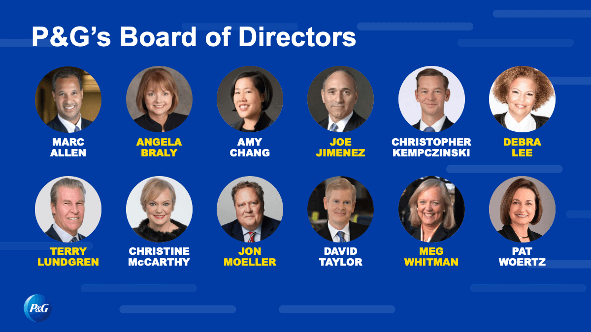

## Table of Contents

## What is a major shareholder?

A major shareholder is someone who owns a big part of a company's stock. When you own stock, you own a piece of the company. If you own a lot of stock, you have a lot of say in what the company does. Usually, a major shareholder owns at least 5% or 10% of the company's total stock. This gives them a lot of power and influence over the company's decisions.

Major shareholders can affect the company in many ways. They can vote on important issues at shareholder meetings, like who should be on the board of directors or whether to approve big company changes. Sometimes, major shareholders can even push the company to make decisions that they think are best. Because they own so much stock, what they say and do can really matter to the company's future.

## Who are the major shareholders of Procter & Gamble?

The biggest shareholder of Procter & Gamble is The Vanguard Group, which owns about 9% of the company's stock. This means they have a lot of say in what Procter & Gamble does. Another big shareholder is BlackRock, with around 7% of the stock. These two companies together own a big part of Procter & Gamble, so they can influence the company a lot.

Besides these big investment firms, there are also some individual major shareholders. For example, some of Procter & Gamble's executives and board members own a good amount of stock. However, their shares are usually less than the big investment firms. Overall, the major shareholders of Procter & Gamble are a mix of big investment companies and some key people inside the company.

## What percentage of Procter & Gamble do the major shareholders own?

The biggest shareholder of Procter & Gamble is The Vanguard Group, which owns about 9% of the company's stock. This means they have a big say in what the company does. Another major shareholder is BlackRock, with around 7% of the stock. Together, these two big investment firms own about 16% of Procter & Gamble.

Besides these big firms, some people inside the company also own a good amount of stock. For example, some of Procter & Gamble's executives and board members are major shareholders too. But their shares are usually less than what the big investment firms own. So, while the big firms have the most influence, the insiders also have some say in the company's decisions.

## How has the ownership of major shareholders in Procter & Gamble changed over the past year?

Over the past year, the ownership of major shareholders in Procter & Gamble has seen some changes. The Vanguard Group, which is the biggest shareholder, has slightly increased its stake in the company. They now own about 9% of Procter & Gamble's stock, up from around 8.8% a year ago. This small increase shows that The Vanguard Group still believes in the company and wants to have a bigger say in its future.

BlackRock, another major shareholder, has also seen a small change in its ownership. Last year, BlackRock owned about 6.9% of Procter & Gamble's stock, and now they own around 7%. This slight increase means BlackRock is also more invested in the company. Together, these two big investment firms now own about 16% of Procter & Gamble, which is a bit more than they did last year. This shows that the major shareholders are still very interested in the company and want to keep influencing its decisions.

## What is the role of institutional investors in Procter & Gamble's shareholder structure?

Institutional investors play a big role in Procter & Gamble's shareholder structure. They are big organizations like The Vanguard Group and BlackRock that own a lot of the company's stock. These investors have a lot of power because they own so much stock. For example, The Vanguard Group owns about 9% of Procter & Gamble, and BlackRock owns around 7%. This means they can influence the company's decisions a lot.

These institutional investors are important because they help guide the company. They vote on important issues at shareholder meetings, like who should be on the board of directors or whether to approve big changes. Because they own so much stock, what they say and do can really affect Procter & Gamble's future. Over the past year, these big investors have slightly increased their ownership, showing they still believe in the company and want to keep influencing its direction.

## How do insider ownership and major shareholders influence Procter & Gamble's corporate governance?

Insider ownership and major shareholders both have a big impact on Procter & Gamble's corporate governance. Insiders, like the company's executives and board members, own some of the company's stock. When they own stock, they have a say in what the company does. They can vote on important decisions at shareholder meetings, like who should be on the board of directors or whether to approve big changes. This means insiders can help guide the company in a way that they think is best for everyone.

Major shareholders, like big investment firms such as The Vanguard Group and BlackRock, own a lot more stock than insiders. They have even more power to influence the company's decisions. For example, The Vanguard Group owns about 9% of Procter & Gamble, and BlackRock owns around 7%. This gives them a lot of say in what the company does. They can vote on important issues and even push the company to make decisions they think are best. Together, insiders and major shareholders help shape Procter & Gamble's future by influencing its corporate governance.

## What are the voting rights associated with the shares held by major shareholders of Procter & Gamble?

The voting rights that come with the shares held by major shareholders of Procter & Gamble are very important. Each share of stock gives the owner one vote at shareholder meetings. So, if you own a lot of shares, you have a lot of votes. Major shareholders like The Vanguard Group and BlackRock own a big part of the company's stock. This means they have a lot of votes and can influence what happens at these meetings.

At these meetings, shareholders vote on big decisions like who should be on the board of directors or whether to approve big changes in the company. Because major shareholders have so many votes, they can really affect these decisions. For example, they might vote to keep certain people on the board or to change the company's direction. This power helps them guide Procter & Gamble in ways they think are best.

## How do major shareholders impact Procter & Gamble's strategic decisions?

Major shareholders have a big impact on Procter & Gamble's strategic decisions because they own a lot of the company's stock. When you own stock, you get to vote on important things at shareholder meetings. The Vanguard Group and BlackRock, which own about 9% and 7% of Procter & Gamble's stock, have a lot of votes. This means they can help decide who should be on the board of directors or whether to make big changes in the company. Their votes can really steer the company in the direction they think is best.

These major shareholders can also talk directly to the company's leaders. They might suggest new strategies or ways to grow the business. Because they own so much stock, the company listens to what they say. For example, if The Vanguard Group thinks Procter & Gamble should focus more on certain products, they can push for that. This influence helps shape the company's future plans and decisions, making sure they align with what the major shareholders believe will be successful.

## What is the historical trend of major shareholder involvement in Procter & Gamble?

Over the years, major shareholders have become more and more involved in Procter & Gamble's decisions. In the past, big investment firms like The Vanguard Group and BlackRock have slowly increased their ownership in the company. For example, The Vanguard Group used to own around 8.8% of Procter & Gamble's stock a year ago, but now they own about 9%. This shows that these big shareholders are getting more interested in the company and want to have a bigger say in its future.

As their ownership has grown, so has their influence on Procter & Gamble's strategic decisions. Major shareholders now have a lot of votes at shareholder meetings, where they can decide things like who should be on the board of directors or whether to make big changes. They also talk directly to the company's leaders, suggesting new strategies or ways to grow the business. This means that Procter & Gamble's plans and decisions are more and more shaped by what these major shareholders think is best for the company.

## How do major shareholders of Procter & Gamble engage with environmental, social, and governance (ESG) issues?

Major shareholders like The Vanguard Group and BlackRock are getting more involved in environmental, social, and governance ([ESG](/wiki/esg-investing)) issues at Procter & Gamble. They care about things like reducing the company's impact on the environment, making sure the company treats its workers and communities well, and ensuring the company is run fairly. These big investors often vote on ESG-related proposals at shareholder meetings. For example, they might vote to make the company report more about its environmental efforts or to improve its policies on social issues.

These shareholders also talk directly to Procter & Gamble's leaders about ESG. They might suggest ways for the company to be more sustainable or to support social causes. Because they own so much stock, the company listens to what they say. Over time, this engagement has pushed Procter & Gamble to focus more on ESG issues. The company has made commitments to reduce its environmental footprint and improve its social responsibility, influenced by the priorities of its major shareholders.

## What are the potential conflicts of interest between major shareholders and other stakeholders at Procter & Gamble?

Major shareholders like The Vanguard Group and BlackRock own a lot of Procter & Gamble's stock. They want the company to make more money because that makes their stock worth more. But other stakeholders, like the company's employees, customers, and the communities where Procter & Gamble operates, might want different things. Employees might want better pay and working conditions, while customers might want cheaper products. These different wants can cause conflicts. For example, if major shareholders push for cost-cutting measures to increase profits, it might mean lower wages for employees or higher prices for customers.

Sometimes, major shareholders might also focus on short-term gains, like making a lot of money quickly, while other stakeholders might care more about the company's long-term health. For instance, major shareholders might want Procter & Gamble to invest less in sustainable practices to save money now, but this could harm the environment and the company's reputation in the future. This can create tension because what's good for the shareholders in the short term might not be good for the company or other stakeholders in the long run. Balancing these different interests is a big challenge for Procter & Gamble's leaders.

## How do changes in major shareholder composition affect Procter & Gamble's stock performance?

Changes in who owns a big part of Procter & Gamble's stock can really affect how the stock does. When big investors like The Vanguard Group or BlackRock buy more stock, it often makes other people think the company is doing well. This can make the stock price go up because more people want to buy it. On the other hand, if these big shareholders start selling their stock, it can make others worry that something is wrong with the company. This can cause the stock price to go down because fewer people want to buy it.

But it's not just about buying and selling. If new big shareholders come in with different ideas about how the company should be run, it can also change the stock price. For example, if a new major shareholder wants Procter & Gamble to focus more on green products, this could make some investors happy and others worried. Happy investors might buy more stock, pushing the price up, while worried investors might sell, pushing the price down. So, the mix of major shareholders and what they want can really shake things up for Procter & Gamble's stock.

## References & Further Reading

[1]: Hendershott, T., & Riordan, R. (2013). ["Algorithmic Trading and the Market for Liquidity."](https://www.jstor.org/stable/43303831) Journal of Financial and Quantitative Analysis.

[2]: ["Advances in Financial Machine Learning"](https://www.amazon.com/Advances-Financial-Machine-Learning-Marcos/dp/1119482089) by Marcos Lopez de Prado.

[3]: ["Machine Learning for Algorithmic Trading"](https://github.com/PacktPublishing/Machine-Learning-for-Algorithmic-Trading-Second-Edition) by Stefan Jansen.

[4]: ["Quantitative Trading: How to Build Your Own Algorithmic Trading Business"](https://www.amazon.com/Quantitative-Trading-Build-Algorithmic-Business/dp/1119800064) by Ernest P. Chan. 

[5]: ["Evidence-Based Technical Analysis: Applying the Scientific Method and Statistical Inference to Trading Signals"](https://www.amazon.com/Evidence-Based-Technical-Analysis-Scientific-Statistical/dp/0470008741) by David Aronson.