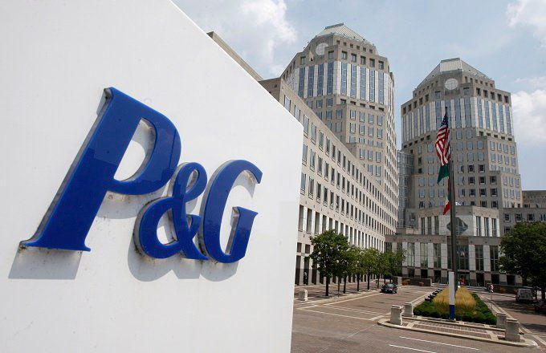

In the rapidly evolving world of finance, investors are continually seeking ways to leverage technology to enhance their portfolios. One prominent name that consistently captures the attention of shareholders and investors globally is Procter & Gamble (P&G), a multinational consumer goods giant with a diverse product portfolio and substantial market presence. Founded in 1837, P&G operates in over 180 countries, offering a range of products from household cleaning to personal care, including well-known brands like Pampers, Tide, and Gillette.

P&G's robust market position and resilience in challenging economic environments make it a focal point for investment strategies. With a market capitalization approaching $400 billion, P&G's stock is a significant component of global equity indexes, thereby attracting a vast array of institutional and individual investors. To succeed in this competitive landscape, understanding the dynamics within P&G's shareholder base, alongside market performance indicators, is crucial for stakeholders.



Central to modern investment approaches is algorithmic trading, a technology that automates trading decisions using sophisticated mathematical models and data analysis. This article explores the intersection of P&G investments with algorithmic trading strategies, a combination that highlights the transformative power of technology in financial markets. By examining P&G's shareholder structure and the influence of algorithmic trading on its stock movements, investors gain valuable insights into optimizing their investment strategies.

Algorithmic trading offers potential advantages by executing trades at high speeds and volumes, significantly impacting stock liquidity and price stability. As such, analyzing P&G's market performance, shareholder dynamics, and the role of technological advancements like algorithmic trading is essential for investors aiming to navigate the complexities of modern financial markets effectively. The integration of these elements positions P&G as both a traditional investment opportunity and a participant in the broader technological evolution of trading practices.

## Table of Contents

## Understanding P&G's Shareholder Dynamics

Procter & Gamble (P&G) stands as a titan in the consumer goods sector, reaching billions of consumers across the globe through an extensive range of products. P&G's shareholder base is diverse, featuring prominent institutional investors such as Vanguard, BlackRock, and State Street Corporation. These firms collectively hold considerable stakes in P&G, exerting significant influence over its corporate strategy and financial planning due to their investment power.

The substantial presence of these institutional investors is a common characteristic among multinational corporations, as it provides a stable financial backing and allows for sustained strategic initiatives. According to reports, these institutional entities are instrumental in facilitating P&G's long-term vision due to their preference for steady growth and dividends. Vanguard, BlackRock, and State Street Corporation are particularly renowned for their passive investment strategies, primarily through index funds, which leads them to hold substantial portions of blue-chip stocks like P&G.

In addition to these institutional stakeholders, P&G's shareholder dynamics include influential individual shareholders, namely the company's key executives, such as Jon R. Moeller, the company's Chairman, Shailesh Jejurikar, Chief Operating Officer, and Ma. Fatima D. Francisco, who heads the Baby, Feminine & Family Care. These individuals typically acquire shares through performance-based compensation packages, aligning their personal financial interests with the company's broader objectives, which facilitates a cohesive leadership strategy.

The intersection of institutional and individual shareholders creates a varied investment landscape, providing P&G with a mix of stability and strategic agility. Institutional investors bring a wealth of resources and focus on long-term profitability, while individual shareholders from within the company ensure that management's interests align with shareholder goals, fostering an environment that is conducive to sustained operational success. This shareholder structure underscores the multifaceted interest in P&G as a conglomerate, combining institutional stability with insights from experienced internal leadership.

## Procter & Gamble's Market Position and Performance

Procter & Gamble (P&G), as of mid-2024, holds a market capitalization of approximately $400 billion, emphasizing its strong presence in the global market. This valuation is a testament to the company's ability to maintain and enhance its market position amidst competitive pressures within the consumer goods industry. The company's 52-week price range reflects market [volatility](/wiki/volatility-trading-strategies), a crucial consideration for traders employing algorithmic strategies to optimize trading opportunities and manage risks.

P&G's operations across 180 countries ensure robust and diversified revenue streams, contributing to a total revenue of $84 billion over a recent 12-month period. This extensive global footprint enables P&G to capitalize on varying market dynamics and consumer preferences across regions, providing a stable foundation for revenue generation. Moreover, the company's established brands such as Crest, Gillette, and Pampers play a critical role in its stable growth trajectory. These brands have not only fostered brand loyalty but also sustained P&G's competitive edge by continually meeting consumer needs effectively.

Financial prudence remains central to P&G’s strategy, evidenced by its regular quarterly dividend returns. This practice reinforces investor confidence, as consistent dividends signal financial stability and a commitment to shareholder value. By balancing growth initiatives with financial discipline, P&G continues to attract and retain a diverse base of investors. Thus, its strategic emphasis on maintaining brand strength and operational excellence underpins its longstanding market leadership.

## The Rise of Algorithmic Trading

Algorithmic trading has dramatically reshaped the way investors approach the stock market by automating trading decisions based on predefined algorithms. These algorithms, using sophisticated mathematical models, analyze large datasets and execute trades at speeds and frequencies far surpassing human capabilities. This capability is particularly beneficial for trading in high-[volume](/wiki/volume-trading-strategy) stocks such as Procter & Gamble (P&G), where even a slight edge in market timing can translate into significant returns.

The primary advantage of [algorithmic trading](/wiki/algorithmic-trading) lies in its ability to optimize market timing and efficiency. By leveraging vast quantities of historical stock data and real-time market information, these algorithms can execute trades instantly when conditions specified in their programming are met. This eliminates the delay associated with human decision-making and minimizes the potential for emotional bias. As shown by [Hendershott & Riordan](https://papers.ssrn.com/sol3/papers.cfm?abstract_id=1685861), algorithms have improved the [liquidity](/wiki/liquidity-risk-premium) and price efficiency of equity markets by rapidly assimilating information and adjusting strategies in response to market changes.

For P&G shareholders, the implementation of algorithmic trading presents a competitive edge in managing extensive stock holdings. Using such technological tools allows traders to diversify their portfolios effectively, distributing risk across different asset classes and market conditions. This diversification is crucial for large-cap stocks like P&G, where market movements can be influenced by a variety of global and macroeconomic factors.

Consider a simple Python example illustrating a basic algorithmic trading strategy using historical data:

```python
import pandas as pd

# Load historical stock data
data = pd.read_csv('PG_stock_data.csv')
# Calculate moving average
data['MA50'] = data['Close'].rolling(window=50).mean()
data['MA200'] = data['Close'].rolling(window=200).mean()

# Define a basic algorithmic trading rule
data['Signal'] = 0
data['Signal'][50:] = np.where(data['MA50'][50:] > data['MA200'][50:], 1, -1)

# Execute trades based on the rule
data['Position'] = data['Signal'].shift(1)
```

In this example, the algorithm evaluates moving averages over 50 and 200 days to generate buy/sell signals based on crossover points. Such strategies, albeit simplistic, form the foundation for more complex algorithms utilized in larger institutional trading operations.

Moreover, algorithmic trading facilitates superior risk management by enabling precise execution of sophisticated strategies such as statistical [arbitrage](/wiki/arbitrage) and hedging. This ensures that portfolios are balanced in response to fluctuations within the market, safeguarding investor interests.

In summary, as algorithmic trading continues to permeate the financial landscape, it offers significant benefits in enhancing market operation efficiencies, reducing trading costs, and optimizing portfolio management. This technological leap is especially pronounced for large-cap entities like Procter & Gamble, where shareholder interests are increasingly intertwined with advances in automated trading systems.

## Impact of Algorithmic Trading on P&G's Stock Movements

High-frequency trades executed by sophisticated algorithms significantly contribute to the liquidity of Procter & Gamble's (P&G) stocks. The algorithms, often operated by institutional investors and hedge funds, are designed to capitalize on minute price discrepancies, conducting rapid buy-sell transactions to stabilize market fluctuations over time. This mechanized approach ensures that P&G stocks have ample liquidity, enabling large volumes of shares to be traded without substantial impact on the stock's price.

Institutional algorithms play a pivotal role in influencing P&G's share price movements. By observing stock trends in real-time, these algorithms attempt to maximize profit margins through strategic trade execution. This involves complex decision-making processes that incorporate various data inputs such as historical pricing data, news feeds, financial statements, and broader market indices. The speed and accuracy with which high-frequency trading systems operate allow them to react swiftly to market signals, thereby affecting the price dynamics of P&G shares.

These algorithm-driven movements present both opportunities and challenges for traditional investors. On one hand, the liquidity and efficiency introduced by algorithmic trading can lead to tighter bid-ask spreads, reducing transaction costs for regular investors. On the other hand, the quick execution and large volume of trades may cause price movements that are difficult for non-algorithmic traders to anticipate or capitalize on. This competitive landscape necessitates that traditional investors develop a robust understanding of algorithmic patterns to predict longer-term market trends and make informed investment decisions.

To navigate the complex environment shaped by algorithmic trading, shareholders might consider utilizing analytical tools and algorithm-based strategies themselves. By employing data analytics and [machine learning](/wiki/machine-learning) models, they can gain insights into trading patterns and potentially forecast stock movements with greater accuracy. Investors can also benefit from real-time monitoring tools that alert them to significant market changes, allowing for timely strategic adjustments to their portfolios. 

Ultimately, the influence of algorithmic trading on P&G's stock dynamics underscores the importance of technological acumen in modern investment strategies. Investors who stay informed about these technological advancements and their impact on stock movements are better positioned to harness the full potential of their investments in P&G.

## Conclusion

The integration of algorithmic trading within Procter & Gamble's investment framework mirrors the significant technological advancements reshaping the contemporary stock market. As both institutional and individual investors increasingly rely on these sophisticated tools, they adapt their strategies to optimize returns and enhance strategic decision-making. Algorithmic trading allows for precise and high-frequency transactions, significantly benefiting P&G investors by providing a more efficient means to handle large volumes of trades and navigate market complexities.

Procter & Gamble remains a formidable force in the consumer goods industry, bolstered by a diversified shareholder base and innovative investment technologies. Advancements in algorithmic trading technology offer P&G's investors a competitive edge, allowing them to efficiently manage their portfolios and align with the swiftly evolving nature of modern financial markets. Engaging actively with these tools can lead to improved portfolio performance, offering the potential for greater returns and enhanced risk management.

To fully leverage these opportunities, investors need to remain vigilant about technological progress and market changes. This knowledge equips them to make informed decisions and capitalize on investment prospects within P&G. By understanding and integrating these advancements, investors can optimize their strategies, ensuring they maximize their potential returns and contribute to sustained growth in their investment portfolios. As the financial landscape continues to evolve, staying informed becomes paramount to harnessing the full potential of investments in companies like Procter & Gamble.

## References & Further Reading

[1]: Hendershott, T., & Riordan, R. (2013). ["Algorithmic Trading and the Market for Liquidity."](https://www.jstor.org/stable/43303831) Journal of Financial and Quantitative Analysis.

[2]: ["Advances in Financial Machine Learning"](https://www.amazon.com/Advances-Financial-Machine-Learning-Marcos/dp/1119482089) by Marcos Lopez de Prado.

[3]: ["Machine Learning for Algorithmic Trading"](https://github.com/PacktPublishing/Machine-Learning-for-Algorithmic-Trading-Second-Edition) by Stefan Jansen.

[4]: ["Quantitative Trading: How to Build Your Own Algorithmic Trading Business"](https://www.amazon.com/Quantitative-Trading-Build-Algorithmic-Business/dp/1119800064) by Ernest P. Chan. 

[5]: ["Evidence-Based Technical Analysis: Applying the Scientific Method and Statistical Inference to Trading Signals"](https://www.amazon.com/Evidence-Based-Technical-Analysis-Scientific-Statistical/dp/0470008741) by David Aronson.