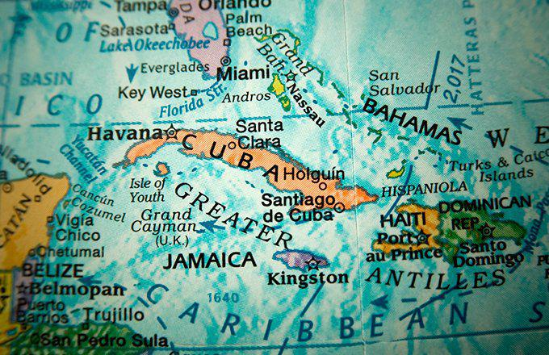

The Caribbean, widely recognized for its stunning beaches and vibrant tourism sector, is also home to a growing network of financial markets. These markets, anchored by various regional stock exchanges, are gaining prominence and attracting attention from global investors. While the region's appeal has traditionally revolved around its natural beauty and cultural richness, its financial landscape is becoming an area of significant economic potential.

Recent developments in the Caribbean financial sector highlight a broadening scope of opportunities beyond leisure and tourism. The economic framework within this region consists of multiple island nations, each contributing unique elements to a diverse financial ecosystem. This includes the presence of notable stock exchanges, which are pivotal in fostering regional economic growth. With major financial hubs situated in countries like Barbados, Jamaica, and Trinidad and Tobago, the Caribbean stock exchanges offer platforms for trading stocks, bonds, and other financial instruments. These platforms are vital for channeling capital investments towards regional development projects and supporting local businesses.



One emerging trend contributing to the evolution of Caribbean financial markets is the integration of algorithmic trading techniques. This technological advancement enables high-frequency trading and enhances market efficiency by allowing trades to be executed at exceptionally rapid speeds. As a result, algorithmic trading has the potential to transform the operation of Caribbean stock exchanges, making them more attractive to both regional and international investors.

For investors seeking to engage with these markets, understanding the operational dynamics of Caribbean financial entities is crucial. Beyond traditional investment vehicles, these exchanges are also beginning to explore innovative technologies and strategies that could reshape the region's economic landscape. Recognizing the evolving nature of these financial institutions and the emerging trends within them provides a strategic advantage to investors aiming to leverage the Caribbean's economic growth.

In summary, the Caribbean is not just a prime location for vacationers but also a promising frontier for financial investments. Exploring the region's stock exchanges and embracing technological advancements such as algorithmic trading present substantial opportunities for investors looking to tap into the Caribbean's burgeoning economic potential.

## Table of Contents

## Overview of Caribbean Financial Markets

The Caribbean, comprising numerous island nations, presents a diverse financial landscape, characterized by unique financial infrastructures that cater to a variety of economic activities. Each nation has developed its financial systems and regulations while contributing to regional economic integration. Key players within the Caribbean financial markets include Barbados, Jamaica, Trinidad and Tobago, and the Organisation of Eastern Caribbean States (OECS), each offering distinct investment climates and opportunities.

Barbados stands out as a significant financial hub, with an economy grounded in international business and tourism. The country has established itself as a reputable location for financial and wealth management services, bolstered by a well-regulated financial sector. In addition, its stock exchange, the Barbados Stock Exchange, offers trading in local and international securities, attracting both local and foreign investors.

Jamaica, with its vibrant economy, hosts the Jamaica Stock Exchange (JSE), one of the largest in the region. The JSE provides a platform for the trading of equities, fixed income securities, and derivatives, and boasts a strong regulatory framework that promotes investor confidence. The Jamaican financial market has been instrumental in fostering economic growth and attracting foreign direct investment through various listed entities.

Trinidad and Tobago, noted for its energy-rich resources, plays a pivotal role in the Caribbean’s financial markets. The Trinidad and Tobago Stock Exchange (TTSE) enables the trading of a wide array of financial instruments, including stocks and government bonds. The energy sector significantly influences its financial markets, contributing to higher market capitalization and [liquidity](/wiki/liquidity-risk-premium) compared to its regional counterparts.

The Organisation of Eastern Caribbean States (OECS) comprises smaller island economies, each contributing to a collective financial ecosystem. The Eastern Caribbean Central Bank (ECCB) regulates the financial institutions in OECS member countries, promoting monetary stability. Additionally, the Eastern Caribbean Securities Exchange (ECSE) provides a regional platform for securities trading, enhancing market accessibility and integration for member states.

Investment opportunities across these financial markets range from traditional equities and bonds to more advanced derivatives. The diversity within these markets supports wealth accumulation and economic development, presenting investors with a robust range of avenues for capital appreciation and risk management. As regional integration efforts continue, these markets are poised to offer increasingly sophisticated financial products and services, aligning more closely with global financial standards.

Each player in the Caribbean financial landscape offers unique opportunities and faces specific challenges. The region's collective focus on modernization, regulation, and integration aims to optimize financial market infrastructure, attracting investors globally while contributing to sustained economic growth.

## Major Stock Exchanges in the Caribbean

The Caribbean region hosts several prominent stock exchanges, each playing a crucial role in its financial landscape. A key player is the Eastern Caribbean Securities Exchange (ECSE), which is headquartered in St. Kitts. The ECSE stands out with its fully electronic trading platform, designed to facilitate the seamless exchange of securities. This platform enhances trading efficiency and accessibility, making it a pivotal component of the Eastern Caribbean financial market. The ECSE caters primarily to the member states of the Organisation of Eastern Caribbean States (OECS), providing a framework for trading government securities and equities.

Another major exchange, the Jamaica Stock Exchange (JSE), has attained significant stature in the Caribbean. Known for its robust market capitalization, the JSE is one of the largest exchanges in the region. It offers a variety of financial instruments including common stocks, exchange-traded funds (ETFs), and corporate bonds. The JSE has been recognized for its innovation and has consistently been deemed one of the best-performing stock exchanges globally, particularly for its impressive returns and growing investor interest.

Similarly, the Trinidad and Tobago Stock Exchange (TTSE) plays a vital role in the regional economy. The TTSE offers a platform for trading in shares of numerous companies and government bonds, reflecting the diversified economic activities of Trinidad and Tobago. With its stable economic environment underpinned by the country’s natural resources, the TTSE remains a compelling destination for both local and international investors.

The Barbados Stock Exchange (BSE) adds further depth to the Caribbean's financial markets. The BSE provides a mixture of local and international listings, including equities and mutual funds. This variety allows investors to explore different investment opportunities within a stable and well-regulated environment. The BSE’s collaboration with international exchanges aids in fostering cross-border investments, further enhancing its attractiveness to a global investor base.

Collectively, these stock exchanges represent the dynamic and evolving nature of Caribbean financial markets. They play an indispensable role in facilitating capital flows, enabling economic growth, and integrating regional economies into the global financial system.

## Algorithmic Trading in Caribbean Stock Exchanges

Algorithmic trading, commonly referred to as "algo trading," is increasingly prominent in the Caribbean stock markets, catalyzed by advancements in technology and enhanced accessibility to financial data. This form of trading employs computer algorithms to automate trading processes, enabling rapid execution of trades that would be impractical for human traders due to speed and [volume](/wiki/volume-trading-strategy) constraints. 

These systems have the capacity to process complex computations in real-time, analyze numerous variables, and execute trades across multiple exchanges simultaneously. This can lead to increased market efficiency by reducing the time lag between price discovery and execution. For instance, by utilizing historical and real-time market data, [algorithmic trading](/wiki/algorithmic-trading) can detect trends and discrepancies, thereby facilitating [arbitrage](/wiki/arbitrage) opportunities and optimizing trading strategies.

Caribbean stock exchanges, such as the Jamaica Stock Exchange (JSE) and the Trinidad and Tobago Stock Exchange (TTSE), are investigating how best to integrate algorithmic trading. This integration is part of a broader strategy to modernize their operations and appeal to a global pool of investors. By embracing these technologies, exchanges aim to provide a trading environment that rivals larger, international markets. This effort includes evaluating infrastructure capabilities, modifying regulatory frameworks to accommodate automated trading, and ensuring that they have the capacity to support high-frequency trading ([HFT](/wiki/high-frequency-trading-strategies)) systems.

Furthermore, algorithmic trading presents an opportunity for regional exchanges to attract foreign investment by offering sophisticated trading tools found in established markets like New York or London. By doing so, Caribbean exchanges not only enhance competitiveness but also contribute to regional economic growth. The challenge remains to ensure that these systems are implemented with robust risk management practices to mitigate potential issues such as market manipulation and systemic risk.

In summary, the ongoing exploration and adoption of algorithmic trading within Caribbean stock exchanges represent a significant step towards advancing their financial markets. Embracing this technological evolution can lead to improved market liquidity, greater investor participation, and ultimately, a stronger position in the global financial landscape.

## Challenges and Opportunities

Caribbean stock exchanges are grappling with several challenges that hinder their full potential in the global financial landscape. A primary issue is the lower liquidity compared to more established markets. Lower liquidity can lead to higher [volatility](/wiki/volatility-trading-strategies) and increased transaction costs, making it difficult for investors to enter and [exit](/wiki/exit-strategy) positions without affecting prices significantly. This can dissuade both local and international investors from engaging in these markets.

Technological infrastructure is another critical concern. Many Caribbean exchanges require upgrades to their trading platforms and systems to match the efficiency and sophistication found in leading global exchanges. These technological enhancements are essential to ensure seamless trading experiences, minimize system outages, and improve transaction speeds, which are vital for maintaining investor confidence and attracting new participants.

Despite these challenges, there are substantial opportunities for growth and development. One promising avenue is the prospect of cross-listing with international markets. Cross-listing allows companies based in the Caribbean to expand their investor base by tapping into overseas markets, thus enhancing visibility and potentially improving stock liquidity. This strategy can also attract foreign direct investment, bolstering the local economies.

Furthermore, the rise of algorithmic trading offers an exciting opportunity for Caribbean exchanges to modernize their operations. Algorithmic trading involves using computer programs to execute trades based on pre-set criteria, which can significantly increase the speed and efficiency of trading transactions. For example, consider a simple trading algorithm implemented in Python:

```python
# A basic moving average crossover algorithm
def moving_average(prices, window_size):
    return [sum(prices[i:i+window_size])/window_size for i in range(len(prices)-window_size+1)]

def crossover_strategy(prices, short_window, long_window):
    short_ma = moving_average(prices, short_window)
    long_ma = moving_average(prices, long_window)
    signals = []

    for short, long in zip(short_ma, long_ma):
        if short > long:
            signals.append('Buy')
        elif short < long:
            signals.append('Sell')
        else:
            signals.append('Hold')
    return signals

prices = [100, 102, 101, 105, 107, 110, 108, 107, 111, 115]
signals = crossover_strategy(prices, 3, 5)
print(signals)
```

By adopting algorithmic trading, Caribbean stock exchanges can enhance market efficiency, reduce transaction costs, and provide more attractive trading conditions for both institutional and retail investors. This can also encourage the entry of high-frequency trading firms and large investment funds, further boosting liquidity.

In conclusion, while Caribbean stock exchanges face significant challenges, particularly in liquidity and technological infrastructure, these can be countered by strategic initiatives such as cross-listing and the integration of advanced trading technologies. These steps can transform the Caribbean financial markets, making them more competitive on a global scale and attracting a diverse range of investors seeking new opportunities.

## Future Outlook

The future of Caribbean financial markets appears promising and poised for significant growth as regional stock exchanges work to improve their services and infrastructure. The integration of technology and innovation is expected to play a critical role in positioning the Caribbean as a significant participant in the global financial market. This strategic focus on technological advancement will enable the Caribbean markets to modernize, making them more attractive to international investors and increasing their competitiveness on a global scale.

The adoption of algorithmic trading within Caribbean stock exchanges signifies a substantial step towards enhancing market efficiency. Algorithmic trading systems process large amounts of market data to execute trades at optimal times, boosting trading volumes and market liquidity. As exchanges invest in technology, they can better accommodate these systems, providing faster and more reliable trading services. This technological shift will likely attract tech-savvy investors seeking to benefit from higher efficiency and reduced transaction costs.

Strategic collaborations among Caribbean exchanges and with more established international markets are likely to further strengthen the region's financial landscape. Initiatives to facilitate cross-listing of securities can provide investors with diversified investment opportunities while increasing market accessibility for local issuers. These collaborations can drive economic growth by attracting foreign investments, creating joint ventures, and enabling knowledge exchange.

Additionally, regulatory improvements and policy support will be crucial in nurturing a conducive environment for financial innovation. Policymakers must ensure that the regulatory framework supports technological advancements while safeguarding market integrity and investor protection. By establishing clear, transparent regulations, the Caribbean financial markets can build investor confidence and encourage broader participation.

Furthermore, the focus on sustainable investing presents an opportunity for Caribbean markets to align with global trends. By developing financial products that cater to environmentally and socially responsible investment preferences, Caribbean exchanges can appeal to a growing demographic of sustainability-conscious investors.

In conclusion, the Caribbean financial markets are on the cusp of a transformative period. By embracing technology, fostering innovation, enhancing collaboration, and ensuring supportive regulatory environments, the region is well-positioned to expand its role in the global financial ecosystem. This dynamic development can ultimately lead to increased capital flows, economic growth, and prosperity for the Caribbean region.

## References & Further Reading

[1]: Ivey, D. (2019). ["The Caribbean is More Than Sun, Sea, and Sand – It’s an Emerging Financial Hub."](https://www.sciencedirect.com/science/article/pii/S266727822200044X) Forbes.

[2]: Lopez de Prado, M. (2018). ["Advances in Financial Machine Learning."](https://www.amazon.com/Advances-Financial-Machine-Learning-Marcos/dp/1119482089) Wiley.

[3]: Aronson, D. R. (2007). ["Evidence-Based Technical Analysis: Applying the Scientific Method and Statistical Inference to Trading Signals."](https://www.amazon.com/Evidence-Based-Technical-Analysis-Scientific-Statistical/dp/0470008741) Wiley.

[4]: Jansen, S. (2020). ["Machine Learning for Algorithmic Trading."](https://github.com/stefan-jansen/machine-learning-for-trading) Packt Publishing.

[5]: Chan, E. P. (2008). ["Quantitative Trading: How to Build Your Own Algorithmic Trading Business."](https://github.com/ftvision/quant_trading_echan_book) Wiley.