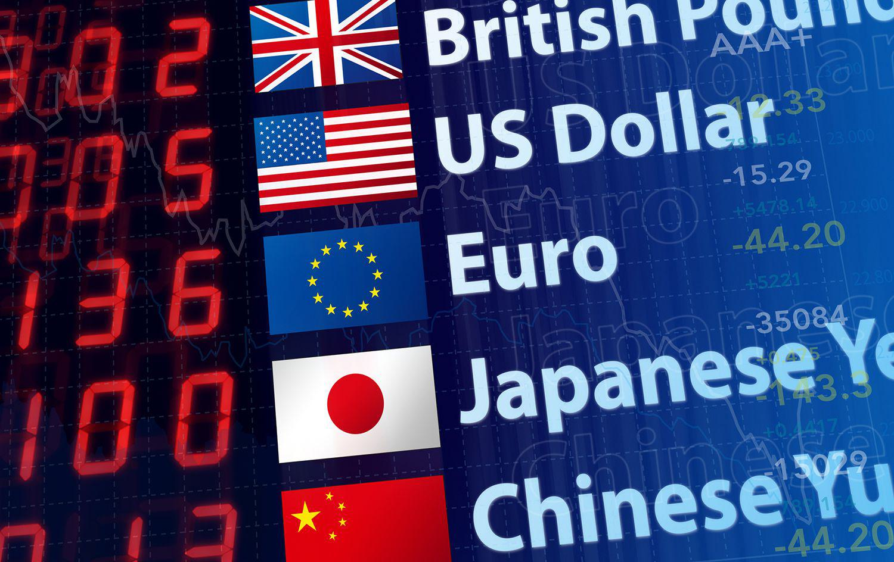

The foreign exchange market (Forex) stands as the largest financial market globally, with an estimated daily trading volume exceeding $6 trillion as of 2021. This vast marketplace operates the exchange of currencies, facilitating international trade and investment by enabling businesses and individuals to convert one currency into another. Due to its immense volume and continuous operation—trading occurs 24 hours a day during weekdays—Forex presents unique opportunities for traders and institutions alike.

Understanding the most widely traded currencies and the role of algorithmic trading is crucial in navigating the complex landscape of Forex. Popular currencies, such as the US Dollar (USD), Euro (EUR), and Japanese Yen (JPY), dominate market transactions due to their stability, liquidity, and global economic influence. Keeping abreast of these currencies is vital for traders who wish to make informed decisions and effectively manage risk.



Algorithmic trading, often known as algo trading, has revolutionized trading activities across Forex and other financial markets. Utilizing computer programs to execute trades at speeds and frequencies beyond human capability, algorithmic trading offers numerous advantages: speed, accuracy, and efficiency. These systems can analyze vast amounts of data and execute orders based on predetermined criteria with minimal human intervention. The ability to handle complex calculations rapidly reduces human error and enhances decision-making processes, empowering traders to capitalize on fleeting market opportunities.

This article aims to explore the dynamics of popular currencies within the Forex market and the impact of algorithmic trading. It will begin by elucidating fundamental mechanics of the Forex market, examining key currency pairs, and highlighting the importance of liquidity. The discussion will then shift to outline the most traded currencies and their appeal. A comprehensive analysis of algorithmic trading in Forex will follow, describing different algorithm types and dissecting their benefits. Subsequently, the article will address the risks associated with algo trading and conclude with an exploration of future trends and technological advancements that are poised to shape Forex trading. Through this exploration, readers are encouraged to enhance their understanding of market fundamentals and technological developments, ensuring they are well-prepared to navigate the evolving Forex landscape.

## Table of Contents

## Understanding the Forex Market

The Forex market, also known as the foreign exchange market, operates as a global decentralized network for the trading of currencies. This market enables participants to buy, sell, exchange, and speculate on currencies. Unlike stock markets, Forex is not centered in a physical location or an exchange; instead, it operates across a network of banks, dealers, and brokers, accessible round-the-clock across different time zones.

The Forex market is comprised of several key players, each playing a crucial role in its dynamic operations. Central banks, for instance, are pivotal as they manage national monetary policy and influence currency value through interest rates and open market operations. Financial institutions such as banks and hedge funds contribute significant liquidity to the Forex market, engaging in currency trading both as a service to clients and for their own institutional strategies. Individual traders also participate but on a much smaller scale, often taking advantage of online trading platforms that provide access to global currencies.

Currency trading in Forex involves currency pairs, which are quotes of two different currencies. Each currency pair is composed of a base currency and a quote currency, such as EUR/USD where the euro is the base currency and the US dollar is the quote currency. The significance of currency pairs lies in their function as the instruments for trading; they determine how much of the quote currency is needed to purchase one unit of the base currency. Major currency pairs like EUR/USD, USD/JPY, and GBP/USD are heavily traded and known for their [liquidity](/wiki/liquidity-risk-premium), offering tighter spreads and less [volatility](/wiki/volatility-trading-strategies) relative to minor and exotic pairs.

Liquidity is a defining characteristic of the Forex market, referring to the ease with which a currency can be bought or sold in the market without affecting its price. High liquidity in Forex results in swift transaction completion and narrower bid-ask spreads, which are vital for traders aiming to execute high-frequency trades. This liquidity is primarily driven by the aggregation of buy and sell orders globally and is highest during the market's overlap between major financial centers such as London and New York.

However, trading in the Forex market presents challenges alongside opportunities. One notable challenge is market volatility, as prices can fluctuate rapidly due to geopolitical developments, economic news, and unexpected events, thereby impacting trading strategies and outcomes. Conversely, such volatility also presents opportunities for significant gains if traders can accurately predict market movements. Additionally, the global and decentralized nature of the Forex market offers traders the opportunity to leverage time differences and trade around the clock, although this also necessitates continuous market monitoring and swift reaction times.

In summary, understanding the Forex market requires recognizing its complex structure, the significant role of its participants, the critical function of currency pairs, and the integral nature of liquidity. These fundamentals form the backbone of a highly volatile yet opportunity-rich marketplace.

## Popular Currencies in Forex Trading

The Forex market, known for its vast size and liquidity, is primarily driven by the trading of major and minor currency pairs. Understanding these pairs is crucial for traders aiming to navigate the complexities of currency markets effectively. 

### Major and Minor Currency Pairs

Currency pairs in Forex trading are classified into two broad categories: major pairs and minor pairs. Major currency pairs consist of the most traded currencies globally, typically paired with the U.S. dollar (USD). They include EUR/USD, USD/JPY, GBP/USD, and USD/CHF. These pairs exhibit high liquidity and usually experience lower volatility, making them attractive to many traders.

Minor pairs, on the other hand, do not include the USD and often present higher volatility and lower liquidity compared to major pairs. Examples include EUR/GBP, EUR/AUD, and GBP/JPY. While they are less frequently traded, minor pairs can offer unique opportunities and risks due to their volatility.

### Profiles on Top-Traded Currencies

- **USD (U.S. Dollar):** As the world's primary reserve currency, the USD is involved in roughly 88% of all Forex transactions.[^1] Its strength is derived from the U.S.'s economic stability, its role as a global benchmark in commodities trading, and its widespread use in international trade.

- **EUR (Euro):** The euro is the second most traded currency, representing the economic prowess and stability of the Eurozone. Despite being a relatively young currency, its significant role in international finance and trade consolidates its position as a major currency.

- **JPY (Japanese Yen):** The yen is Asia's most traded currency, acting as a benchmark for the region. Often seen as a safe-haven currency, the yen's value is influenced by Japan's economic fundamentals and geopolitical stability in Asia.

- **GBP (British Pound):** The British pound is one of the oldest currencies still in use, with significant historical importance in the global financial system. Its value is often influenced by political and economic events in the UK, including Brexit-related developments.

- **AUD (Australian Dollar):** The Australian dollar is popular due to Australia's vast natural resources, making it a proxy for global commodity prices. Its relationship with major Asian economies, like China, also affects its trading dynamics.

- **CAD (Canadian Dollar):** The Canadian dollar, often touted as a commodity currency, closely follows the trends in crude oil prices, given Canada's position as a major oil exporter.

### Factors Contributing to Currency Popularity

Several factors contribute to the popularity of these currencies. Economic stability, political factors, [interest rate](/wiki/interest-rate-trading-strategies) differentials, and overall participation in global trade elevate these currencies as prime choices for traders. In addition, the presence of robust financial markets and central bank policies play pivotal roles in maintaining their status.

### Impact of Geopolitical Events

Geopolitical events exert a profound impact on currency popularity and value. For instance, economic sanctions, trade agreements, and political stability can lead to significant fluctuations. Brexit's influence on the GBP and geopolitical tensions affecting the USD and JPY showcase the currency markets' sensitivity to such events.

### Reserve Currencies vs. Traded Currencies

The concept of reserve currencies extends beyond mere trading [volume](/wiki/volume-trading-strategy). Reserve currencies, like the USD and EUR, are held in significant quantities by governments and institutions as part of foreign exchange reserves, providing a hedge against economic instability. While all reserve currencies are traded currencies, not all traded currencies attain the status of reserve currency. Reserve currencies typically reflect the economic strength and stability of the issuing country or economic bloc, influencing global financial stability.

In summary, the Forex market’s complexity is partially derived from the diverse factors influencing currency trading. Understanding these elements is crucial for traders looking to capitalize on the opportunities that arise within this dynamic marketplace.

[^1]: https://www.bis.org/statistics/rpfx23_fx.htm

## Algorithmic Trading in Forex

Algorithmic trading, often abbreviated as algo trading, refers to the use of computer programs and systems to execute trades in financial markets according to a predefined set of rules and algorithms. Its emergence in the Foreign Exchange (Forex) market represents a significant shift towards automation and efficiency. This trading approach has gained prominence over the past few decades, particularly due to advancements in technology and increased accessibility to market data.

**Types of Algorithms Used in the Forex Market**

Algorithmic trading in Forex encompasses various types of algorithms, each designed to achieve specific trading objectives:

1. **Trend Following Algorithms**: These algorithms identify market trends and execute trades based on the assumption that the trends will continue. They are primarily reliant on technical indicators such as moving averages.

2. **Arbitrage Algorithms**: Exploit price differentials in different markets or instruments. For instance, triangular arbitrage in Forex involves taking advantage of discrepancies between three currency pairs.

3. **Market Making Algorithms**: Provide liquidity by placing both buy and sell orders in the market. Market makers profit from the spread between the bid and ask prices.

4. **Mean Reversion Algorithms**: Based on the theory that prices will revert to their historical average, these algorithms identify when a currency pair has deviated significantly from its average value and execute trades anticipating a reversal.

5. **Sentiment Analysis Algorithms**: Utilize natural language processing to analyze news and social media sentiment, subsequently executing trades based on the derived market sentiment.

**Advantages of Algorithmic Trading**

Algorithmic trading offers numerous advantages, making it an attractive approach for both institutional and individual traders:

- **Efficiency**: Automated systems can process large volumes of data and execute trades much faster than human traders.

- **Reduced Human Error**: By removing human intervention, algo trading minimizes emotional decision-making, leading to more consistent trading performances.

- **Time-Saving**: Algorithms can conduct market analysis and execute trades 24/7 without the need for constant human supervision.

**High-Frequency Trading (HFT) and Its Impact on Forex**

High-frequency trading is a subset of [algorithmic trading](/wiki/algorithmic-trading) characterized by the rapid execution of a large number of orders. It utilizes ultra-fast data feeds and high-speed execution platforms to capitalize on small price movements. In the Forex market, [HFT](/wiki/high-frequency-trading-strategies) contributes to liquidity and tighter spreads but also increases market volatility due to the sheer volume and speed of transactions. HFT requires significant technological investment and access to the latest market data.

**Examples of Successful Algorithmic Trading Strategies in Forex**

1. **Statistical Arbitrage**: This involves the use of statistical techniques to identify trading opportunities across different currency pairs. A trader might employ a pair trading strategy, where they identify two historically correlated currencies and trade based on the divergence and subsequent convergence of their prices.

   Example Python code snippet for a simple mean reversion strategy:

   ```python
   import numpy as np
   import pandas as pd

   def mean_reversion_signal(prices, window=20, z_threshold=2):
       # Calculate moving average and standard deviation
       moving_avg = prices.rolling(window=window).mean()
       moving_std = prices.rolling(window=window).std()

       # Calculate Z-score
       z_score = (prices - moving_avg) / moving_std

       # Generate buy/sell signals
       signals = np.where(z_score > z_threshold, -1, np.where(z_score < -z_threshold, 1, 0))
       return signals

   # Example usage with a time series of prices
   prices = pd.Series([1.2, 1.3, 1.25, 1.4, 1.35, 1.5, 1.45])
   signals = mean_reversion_signal(prices)
   print(signals)
   ```

2. **News-based Trading**: Algorithms can analyze economic news releases and market sentiment to make informed trading decisions. By processing natural language data at high speeds, these algorithms react to news faster than traditional traders.

3. **Scalping**: Short-term strategy focusing on high trading frequency to extract small profits from each trade over a short period. Scalping relies heavily on algos due to the need for quick entry and exit.

Algorithmic trading continues to shape the Forex landscape, enabling traders to harness technology for improved trading outcomes and increased market participation. The blend of complex algorithms, substantial computational power, and vast data processing capabilities embodies the future of trading in the Forex market.

## Risks and Challenges of Algo Trading in Forex

Algorithmic trading in the Forex market, while offering various benefits, also introduces several risks and challenges. Understanding these is crucial for traders and financial institutions relying on algorithmic systems.

### Potential Risks Associated with Algorithmic Trading

**Market Volatility:** Algorithmic trading can contribute to increased market volatility. The use of high-frequency trading (HFT) strategies, which execute trades in fractions of a second, can lead to rapid and large price swings. This is exacerbated when multiple algorithms respond to the same market signals, creating a cascade effect that can disrupt market stability.

**Technical Failures:** Algorithms depend on technology, making them susceptible to technical glitches and failures. These can arise from software bugs, network outages, or hardware malfunctions, potentially leading to unintended orders and substantial financial losses. The 'Flash Crash' of May 6, 2010, is a prime example, where the Dow Jones Industrial Average plunged about 1,000 points within minutes before recovering.

### Impact on Market Dynamics

Algorithmic trading affects the traditional dynamics of the Forex market. With algorithms, especially those employing HFT, dominating trading volumes, traditional traders often find their strategies disrupted by rapid price changes and reduced spreads. This can lead to a market environment where liquidity is abundant yet fleeting, complicating the execution of large trades without significant price impact.

### Comparison Between Manual and Algorithmic Trading Risks

Manual trading involves risks linked to human error, emotional decision-making, and slower execution times. Conversely, algorithmic trading eliminates these human elements but introduces technical and systemic risks. For instance, while a manual trader may miss out on trading opportunities due to slow execution, an algorithmic trader may face risks from erroneous code or unexpected market conditions beyond the algorithm's designed parameters.

### Regulatory Concerns and Measures

Given the potential systemic risks posed by algorithmic trading, regulatory bodies have implemented measures to enhance market stability. These include circuit breakers, which temporarily halt trading if large price movements are detected, and requirements for algorithm testing and risk controls prior to deployment. The European Union's Markets in Financial Instruments Directive II (MiFID II) is an example of regulatory efforts aimed at increasing transparency and reducing risks associated with HFT and algorithmic trading.

### Strategies to Manage and Mitigate Risks

To effectively manage and mitigate risks associated with algorithmic trading, several strategies can be employed:

1. **Robust Testing and Validation:** Before deploying algorithms, they should undergo rigorous backtesting and forward testing under various market conditions to ensure reliability and performance.

2. **Risk Management Protocols:** Implementing stop-loss limits, position size controls, and real-time monitoring systems can help manage potential losses and monitor algorithmic behavior.

3. **Diversification of Strategies:** Relying on a diversified portfolio of algorithms can reduce exposure to the risk associated with any single algorithm failure or inefficiency.

4. **Continuous Monitoring and Maintenance:** Algorithms should be continuously monitored and updated to adapt to changing market conditions and correct any identified flaws.

5. **Fail-Safe Mechanisms:** Incorporating mechanisms that automatically shut down or alter algorithmic operations in case of abnormal behavior or market conditions can prevent escalations into significant losses.

Incorporating these strategies can help traders and institutions mitigate the risks and challenges of algorithmic trading in the Forex market, ensuring that the benefits of speed and efficiency are leveraged while minimizing potential downsides.

## The Future of Currency Trading and Algorithmic Trading

The future of currency trading is poised to be significantly shaped by algorithmic trading, an area continually evolving due to technological advancements. Emerging trends indicate a shift towards more sophisticated and adaptive algorithms, driven largely by developments in [artificial intelligence](/wiki/ai-artificial-intelligence) (AI) and [machine learning](/wiki/machine-learning) (ML). These technologies are likely to enhance the predictive accuracy and execution efficiency of trading strategies.

**Emerging Trends in Algorithmic Trading**

One of the most prominent trends in algorithmic trading is the increasing use of AI and ML. These technologies are set to transform trading strategies by analyzing vast datasets faster and more accurately than ever before. AI and ML algorithms can identify patterns and correlations in trading data that traditional methods may miss, increasing the potential for profitable trades. Additionally, the use of cloud computing and big data is expected to expand, providing traders with access to more comprehensive and diverse datasets, which can enhance decision-making processes.

**Technological Advancements and Their Impact**

The ongoing advancement of blockchain technology is another trend that could have a profound impact on Forex trading. By providing a decentralized ledger system, blockchain can enhance transparency, reduce fraud, and streamline the settlement process in currency trading operations. Quantum computing, though in its nascent stages, is anticipated to further revolutionize algorithmic trading. Its potential for high-speed data processing could enable the analysis of complex trading scenarios in real time, offering a competitive edge to traders.

**AI and Machine Learning in Future Trading Algorithms**

AI and ML are crucial in developing more responsive and autonomous trading algorithms. Future advancements in natural language processing (NLP) are expected to aid in interpreting financial news and social media sentiment, incorporating them into trading models for better predictive capabilities. Reinforcement learning, a branch of ML, may be utilized to continually optimize trading strategies based on past performance data, enhancing their profitability over time. 

Here's an illustrative Python snippet showcasing a simple [reinforcement learning](/wiki/reinforcement-learning) framework using an environment that simulates Forex trading decisions:

```python
import gym
from stable_baselines3 import PPO

# Create a Forex trading environment
env = gym.make('Forex-v0')

# Initialize the reinforcement learning model
model = PPO("MlpPolicy", env, verbose=1)

# Train the model
model.learn(total_timesteps=10000)

# Test the model
obs = env.reset()
for _ in range(1000):
    action, _states = model.predict(obs)
    obs, rewards, done, info = env.step(action)
    if done:
        obs = env.reset()
```

**Predictions for Currency Market Dynamics**

Over the next decade, currency markets are expected to become more volatile due to geopolitical uncertainties and economic policy shifts. However, algorithmic trading powered by AI will improve traders' ability to respond swiftly to market changes, capitalizing on short-term price inefficiencies. The integration of [ESG](/wiki/esg-investing) (environmental, social, and governance) criteria into trading models is also anticipated to affect currency valuations, reflecting growing global sustainability concerns.

**Adapting to Future Trends**

Traders, both individual and institutional, must adapt to remain competitive in this evolving landscape. Continuous learning and investment in technology infrastructure will be crucial. Embracing AI-driven tools and staying abreast of regulatory changes will enable traders to leverage advancements while managing the associated risks. Collaborating with technology firms and investing in skills development for data analytics will ensure that traders can fully harness the potential of AI and algorithmic trading, maintaining their edge in the fast-paced Forex market.

## Conclusion

In this comprehensive exploration of the Forex market, we've highlighted the significance of understanding both market fundamentals and the technological innovations reshaping currency trading. The Forex market remains the largest and most liquid financial market globally, driven by major players like central banks, financial institutions, and individual traders. It's crucial for participants to grasp the dynamics of popular currencies, such as USD, EUR, JPY, GBP, AUD, and CAD, each influenced by various economic factors and geopolitical events.

Algorithmic trading has emerged as a transformative force in this arena, providing speed, accuracy, and efficiency while reducing human error. This advancement, particularly through high-frequency trading, has altered the landscape of Forex trading, introducing new strategies and presenting both opportunities and challenges. However, the increased prominence of algorithmic strategies underscores the need for stringent risk management and awareness of the potential technical and market-related risks involved.

As we look to the future, embracing technological advancements, including AI and machine learning, will be pivotal for traders seeking to maintain a competitive edge. It is essential for both individual and institutional traders to remain informed and adaptable to navigate the inevitable shifts in market dynamics over the coming decade.

Balancing innovation with risk management is vital, emphasizing the importance of a solid understanding of market fundamentals alongside sophisticated trading technologies. For traders looking to deepen their knowledge and expertise, engaging with educational resources on Forex and algorithmic trading will be invaluable. As the market continues to evolve, being well-informed and proactive will be key to thriving in this dynamic financial environment.

## References & Further Reading

[1]: Bank for International Settlements. ["Triennial Central Bank Survey: Foreign exchange turnover in April 2022"](https://www.bis.org/statistics/rpfx22_fx.pdf).

[2]: Lopez de Prado, M. (2018). ["Advances in Financial Machine Learning."](https://www.amazon.com/Advances-Financial-Machine-Learning-Marcos/dp/1119482089) John Wiley & Sons.

[3]: Aronson, D. R. (2007). ["Evidence-Based Technical Analysis: Applying the Scientific Method and Statistical Inference to Trading Signals."](https://onlinelibrary.wiley.com/doi/book/10.1002/9781118268315) John Wiley & Sons.

[4]: Jansen, S. (2018). ["Machine Learning for Algorithmic Trading."](https://github.com/stefan-jansen/machine-learning-for-trading) Packt Publishing.

[5]: Chan, E. P. (2008). ["Quantitative Trading: How to Build Your Own Algorithmic Trading Business."](https://github.com/ftvision/quant_trading_echan_book) John Wiley & Sons.