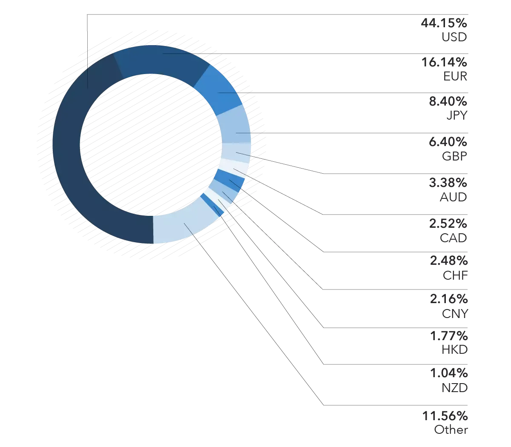

## Table of Contents

## What are major traded currencies?

The major traded currencies are the ones that are most commonly bought and sold in the foreign exchange market. These include the US dollar (USD), the Euro (EUR), the Japanese yen (JPY), the British pound (GBP), the Australian dollar (AUD), the Canadian dollar (CAD), and the Swiss franc (CHF). These currencies are considered major because they are widely used in international trade and finance, and they have high liquidity, meaning they can be easily bought and sold in large amounts without affecting their price much.

These major currencies are often traded in pairs, like EUR/USD or USD/JPY. The first currency in the pair is called the base currency, and the second is the quote currency. The exchange rate tells you how much of the quote currency you need to buy one unit of the base currency. For example, if the EUR/USD rate is 1.20, it means you need 1.20 US dollars to buy one Euro. Trading these currency pairs is a big part of the foreign exchange market, which is the largest financial market in the world.

## Which currencies are considered major in the forex market?

In the forex market, the major currencies are the ones that are traded the most. These include the US dollar (USD), the Euro (EUR), the Japanese yen (JPY), the British pound (GBP), the Australian dollar (AUD), the Canadian dollar (CAD), and the Swiss franc (CHF). These currencies are called major because they are used a lot in global trade and finance. They are also very liquid, which means you can buy and sell them easily without big price changes.

These major currencies are usually traded in pairs, like EUR/USD or USD/JPY. The first currency in the pair is the base currency, and the second is the quote currency. The exchange rate shows how much of the quote currency you need to buy one unit of the base currency. For example, if the EUR/USD rate is 1.20, you need 1.20 US dollars to buy one Euro. Trading these pairs is a big part of the [forex](/wiki/forex-system) market, which is the world's largest financial market.

## What factors determine the value of major currencies?

The value of major currencies is influenced by several key factors. One important [factor](/wiki/factor-investing) is the interest rates set by a country's central bank. When interest rates are high, it can attract foreign investors looking for better returns on their investments, which increases demand for that currency and can make it stronger. Another factor is the economic health of a country. If a country has a strong economy with good growth and low unemployment, its currency is often seen as more valuable. This is because a strong economy can lead to more demand for its currency from other countries wanting to buy its goods and services.

Political stability and government policies also play a big role in determining currency value. If a country is politically stable and has policies that support economic growth, its currency is likely to be stronger. On the other hand, political uncertainty or policies that might hurt the economy can weaken a currency. Additionally, the balance of trade affects currency value. If a country exports more than it imports, it has a trade surplus, which can strengthen its currency. Conversely, a trade deficit, where imports exceed exports, can weaken a currency.

Lastly, market sentiment and speculation can cause currency values to fluctuate. Traders and investors often buy and sell currencies based on their predictions about future economic conditions. If they think a currency will get stronger, they will buy it, which can drive up its value. If they think it will weaken, they will sell it, which can push its value down. All these factors together determine the value of major currencies in the global market.

## How do major currencies impact global trade?

Major currencies have a big impact on global trade because they are used to buy and sell goods and services between countries. When a country's currency is strong, it means that its exports become more expensive for other countries. This can make it harder for that country to sell its products abroad. On the other hand, a strong currency makes imports cheaper, which can be good for consumers but might hurt local businesses that compete with imported goods. For example, if the US dollar is strong, American products might be too expensive for people in other countries, but it's easier for Americans to buy things from places like China or Europe.

The value of major currencies can also affect how much money countries make from their exports. If a country's currency is weak, its exports become cheaper and more attractive to foreign buyers. This can help increase the amount of goods a country sells to other countries, boosting its economy. However, a weak currency can also make imports more expensive, which might lead to higher prices for things like food and fuel. For instance, if the Japanese yen is weak, Japanese cars might sell better in the US, but it might cost more for Japan to buy oil from the Middle East.

Overall, the strength and stability of major currencies like the US dollar, Euro, and Japanese yen play a crucial role in shaping global trade patterns. Businesses and governments need to keep an eye on currency values to make smart decisions about where to buy and sell their products. Changes in currency values can create both opportunities and challenges in the global market, affecting everything from the price of everyday goods to the health of entire economies.

## What is the role of central banks in managing major currencies?

Central banks play a big role in managing major currencies. They do this by setting interest rates, which can affect how much people want to hold or invest in a currency. If a central bank raises interest rates, it can make the currency more attractive to investors because they can earn more from their investments. This can make the currency stronger. On the other hand, if the central bank lowers interest rates, the currency might become less attractive, and it could weaken. Central banks also use other tools like buying and selling their own currency in the market to influence its value.

Another way central banks manage currencies is by keeping the economy stable. They try to control inflation, which is when prices go up over time. If inflation is too high, people might not want to hold onto the currency because it loses value quickly. Central banks can raise interest rates to fight inflation, which can make the currency stronger. They also keep an eye on the overall health of the economy. If the economy is doing well, the currency is usually stronger. But if the economy is struggling, the central bank might take steps to help it recover, which can affect the currency's value too.

## How does the trading volume of major currencies compare to others?

The trading [volume](/wiki/volume-trading-strategy) of major currencies is much higher than that of other currencies. Major currencies like the US dollar, Euro, Japanese yen, British pound, Australian dollar, Canadian dollar, and Swiss franc are traded a lot every day. They make up a big part of the foreign exchange market, which is the biggest financial market in the world. People and businesses all over the world use these currencies to buy and sell things, so they are always in high demand. This high demand means that there are always a lot of these currencies being traded, making their trading volume very high.

Other currencies, often called minor or exotic currencies, have much lower trading volumes. These currencies are not used as much in global trade and finance. For example, the currencies of smaller countries or those with less developed economies might not be traded as often. Because fewer people want to buy and sell these currencies, their trading volumes are lower. This can make it harder to trade them because there might not be as many buyers and sellers, which can lead to bigger price changes when trades do happen.

## What are the most common currency pairs involving major currencies?

The most common currency pairs involving major currencies are known as the "major pairs." These pairs include the US dollar (USD) paired with other major currencies. The most traded pairs are EUR/USD, which is the Euro against the US dollar, USD/JPY, which is the US dollar against the Japanese yen, and GBP/USD, which is the British pound against the US dollar. These pairs are popular because they are used a lot in global trade and finance, and they have high [liquidity](/wiki/liquidity-risk-premium), meaning you can buy and sell them easily without big price changes.

There are also other common pairs that include major currencies. These include USD/CHF, which is the US dollar against the Swiss franc, AUD/USD, which is the Australian dollar against the US dollar, and USD/CAD, which is the US dollar against the Canadian dollar. These pairs are also very liquid and are often traded because they involve major economies. Trading these pairs is a big part of the foreign exchange market, which is the world's largest financial market.

## How do geopolitical events affect major traded currencies?

Geopolitical events can have a big impact on major traded currencies. These events can include things like wars, political changes, or big policy decisions by governments. When something big happens in a country, it can make people worried about the future of that country's economy. If people think the economy might get worse, they might want to sell the currency of that country. This can make the currency weaker. For example, if there is a war in a country, people might think it's not safe to invest there, so they might sell that country's currency, making it lose value.

On the other hand, if a geopolitical event makes a country look stronger or more stable, it can make its currency stronger. For instance, if a country signs a big trade deal with another country, it might make people think that the country's economy will do well. This can make more people want to buy that country's currency, which can make it stronger. So, geopolitical events can cause big changes in the value of major currencies because they affect how people feel about the future of different countries' economies.

## What are the historical trends of major currency values?

Over the years, major currency values have gone through a lot of changes. One big thing that happened was after World War II, when many countries decided to use the US dollar as the main currency for international trade. This made the US dollar very important and strong. But over time, other currencies like the Euro and the Japanese yen became more important too. The Euro, which started in 1999, brought together many European countries and made their currency stronger. The value of these currencies can go up and down because of things like how well their economies are doing, what their governments are doing, and even big events around the world.

In the last few decades, we've seen some big ups and downs with major currencies. For example, the US dollar had some big changes in the 1980s and 1990s. It got really strong in the early 1980s, but then it started to weaken in the late 1980s and early 1990s. The Euro also had its ups and downs. It started off strong, but then it had some tough times during the European debt crisis in the early 2010s. The Japanese yen has also had big changes, sometimes getting very strong and sometimes getting weaker. All these changes show how the value of major currencies can be affected by many different things happening around the world.

## How can traders use technical analysis on major currencies?

Traders use technical analysis to look at past prices and trading volumes of major currencies to predict where the prices might go next. They do this by drawing lines and shapes on charts, like trend lines and support and resistance levels. Trend lines help traders see if a currency is going up or down over time. Support levels are prices where the currency has stopped falling before, and resistance levels are prices where it has stopped rising. By looking at these lines and shapes, traders can guess if a currency will keep going in the same direction or if it might change direction soon.

Traders also use something called indicators, which are special calculations based on price and volume data. Common indicators include moving averages, which smooth out price data to show trends more clearly, and the Relative Strength Index (RSI), which helps traders see if a currency is overbought or oversold. Overbought means the currency might be too expensive and could fall soon, while oversold means it might be too cheap and could rise soon. By using these tools, traders can make better guesses about when to buy or sell major currencies, trying to make a profit from the small changes in their values.

## What are the implications of currency swaps involving major currencies?

Currency swaps involving major currencies can have big effects on the global economy. When countries or big companies do a currency swap, they agree to exchange one currency for another at a set rate and then swap back later. This can help them manage risks from changes in currency values. For example, if a company in the US wants to do business in Europe, it might swap US dollars for Euros. This way, the company knows exactly how many Euros it will get, even if the exchange rate changes later. This can make it easier for them to plan and do business in different countries.

Currency swaps can also affect the value of major currencies. If a lot of people or companies want to swap into a certain currency, it can make that currency stronger because more people want it. On the other hand, if many people want to swap out of a currency, it can make that currency weaker. Central banks sometimes use currency swaps to help control their currency's value. For example, if a central bank thinks its currency is getting too weak, it might do swaps to bring in more of its own currency and make it stronger. So, currency swaps can be a big deal for how major currencies move and how countries and companies manage their money.

## How do macroeconomic indicators influence the fluctuations of major currencies?

Macroeconomic indicators are like big signs that show how well a country's economy is doing. Things like how fast the economy is growing, how many people have jobs, and how much prices are going up can all affect the value of a country's currency. If a country's economy is growing fast and a lot of people have jobs, people might think that country's currency is a good investment. This can make more people want to buy that currency, which can make it stronger. On the other hand, if the economy is not doing well, with slow growth and high unemployment, people might not want to invest in that currency, and it can get weaker.

Another important indicator is inflation, which is how much prices are going up over time. If inflation is too high, it can make a currency less valuable because people's money doesn't go as far. Central banks, which control a country's money, often try to keep inflation under control by changing interest rates. If they raise interest rates, it can make the currency stronger because people can earn more by investing in that currency. But if they lower interest rates, it can make the currency weaker because it's less attractive to investors. So, all these big economic signs play a big role in how much major currencies are worth and how they move up and down.

## References & Further Reading

[1]: Bank for International Settlements. ["Triennial Central Bank Survey: Foreign exchange turnover in April 2022"](https://www.bis.org/statistics/rpfx22_fx.pdf).

[2]: Lopez de Prado, M. (2018). ["Advances in Financial Machine Learning."](https://www.amazon.com/Advances-Financial-Machine-Learning-Marcos/dp/1119482089) John Wiley & Sons.

[3]: Aronson, D. R. (2007). ["Evidence-Based Technical Analysis: Applying the Scientific Method and Statistical Inference to Trading Signals."](https://onlinelibrary.wiley.com/doi/book/10.1002/9781118268315) John Wiley & Sons.

[4]: Jansen, S. (2018). ["Machine Learning for Algorithmic Trading."](https://github.com/stefan-jansen/machine-learning-for-trading) Packt Publishing.

[5]: Chan, E. P. (2008). ["Quantitative Trading: How to Build Your Own Algorithmic Trading Business."](https://github.com/ftvision/quant_trading_echan_book) John Wiley & Sons.