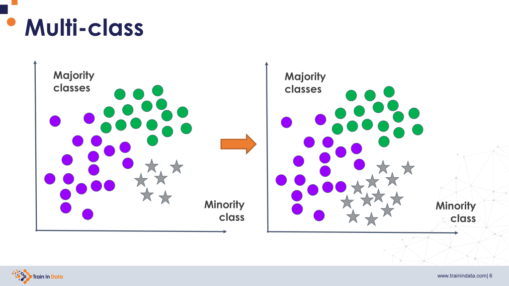

## Table of Contents

## What is the majority class in machine learning?

In machine learning, the majority class is the class that appears most often in a dataset. When you're working with classification problems, you might have different categories or classes that your data can fall into. The majority class is simply the category that has the most examples or instances compared to the others.

Understanding the majority class is important because it can affect how well a machine learning model performs. For example, if a model always predicts the majority class, it might seem to perform well just by guessing the most common outcome. This is known as the accuracy paradox, where a model can have high accuracy but not be very useful because it doesn't learn to distinguish between different classes effectively.

## How is the majority class identified in a dataset?

To identify the majority class in a dataset, you need to count how many times each class appears. The class that shows up the most is the majority class. For example, if you have a dataset of fruits where you have 10 apples, 5 bananas, and 3 oranges, apples would be the majority class because there are more apples than any other fruit.

You can do this counting manually if your dataset is small, but for larger datasets, you would typically use a computer program. In programming languages like Python, you could use libraries like Pandas to help you count the occurrences of each class. For instance, you might use the `value_counts()` function on a column of your dataset to see how many times each class appears, and then easily spot which class has the highest count.

Identifying the majority class is important because it can help you understand your data better and make better decisions about how to build your machine learning model. If one class dominates your dataset, you might need to use techniques like oversampling the minority class or undersampling the majority class to balance your data. This can help your model learn to recognize all classes more effectively, rather than just guessing the majority class all the time.

## Why is understanding the majority class important in machine learning?

Understanding the majority class is important in machine learning because it helps us see if our data is balanced or not. If one class has a lot more examples than the others, it can make our model too good at guessing that class and not good at recognizing the others. For example, if we are trying to predict if an email is spam or not, and most of our emails are not spam, our model might just guess "not spam" all the time and still seem to do well. But that wouldn't be very helpful because it wouldn't catch any spam emails.

To deal with this, we might need to balance our data. This means we could add more examples of the less common classes or remove some examples of the very common class. By doing this, we help our model learn to tell the difference between all the classes, not just guess the most common one. This makes our model more useful and fair, because it can work well for all types of data, not just the majority class.

## What are the potential problems of having a dataset dominated by the majority class?

When a dataset is dominated by the majority class, it can cause big problems for machine learning models. If most of the data belongs to one class, a model might learn to just guess that class all the time. This can make it seem like the model is doing well because it gets a lot of predictions right, but it's not really learning anything useful. For example, if you're trying to predict if a credit card transaction is fraudulent, and most transactions are not fraudulent, a model might just say "not fraudulent" for every transaction and still be right most of the time. But this isn't helpful because it won't catch any actual fraud.

This situation can also lead to unfair results. If the majority class represents a certain group of people, the model might work well for them but not for others. This can cause bias and make the model less useful for everyone. To fix these problems, we need to balance the dataset. This means we might add more examples of the less common classes or remove some examples of the very common class. By doing this, we help the model learn to tell the difference between all the classes, not just guess the most common one. This makes the model more useful and fair, because it can work well for all types of data, not just the majority class.

## How does the majority class affect the performance of a machine learning model?

When a dataset has a lot of examples from one class, called the majority class, it can make a machine learning model seem better than it really is. The model might just guess the majority class all the time and still get a lot of predictions right. For example, if you're trying to predict if a loan will be paid back, and most loans are paid back, the model might just say "paid back" for every loan and still be right most of the time. But this isn't helpful because it won't catch any loans that won't be paid back.

This can also lead to unfair results. If the majority class represents a certain group of people, the model might work well for them but not for others. This can cause bias and make the model less useful for everyone. To fix these problems, we need to balance the dataset. This means we might add more examples of the less common classes or remove some examples of the very common class. By doing this, we help the model learn to tell the difference between all the classes, not just guess the most common one. This makes the model more useful and fair, because it can work well for all types of data, not just the majority class.

## What is the concept of class imbalance and how does it relate to the majority class?

Class imbalance happens when one class in a dataset has a lot more examples than the others. This class is called the majority class. For example, if you have a dataset of emails and most of them are not spam, the "not spam" class is the majority class. When there's a big difference in the number of examples between classes, it can make it hard for a machine learning model to learn well. The model might just guess the majority class all the time and still seem to do well, but it won't be very helpful because it won't learn to tell the difference between the classes.

The majority class is a big part of class imbalance because it's the class that has the most examples. If a dataset is imbalanced, the model might focus too much on the majority class and not learn about the other classes. This can lead to problems like the model being unfair or not useful for everyone. To fix class imbalance, you might need to balance the dataset by adding more examples of the less common classes or removing some examples of the majority class. This helps the model learn better and be more fair to all classes.

## What techniques can be used to handle a majority class in a dataset?

When a dataset has a lot of examples from one class, called the majority class, it can make a machine learning model not work well. One way to fix this is by balancing the dataset. This means you can add more examples of the classes that don't have many examples, which is called oversampling. For example, if you have a dataset of fruits and there are a lot of apples but not many bananas or oranges, you could add more bananas and oranges to the dataset. Another way is to remove some examples of the class that has too many examples, which is called undersampling. In the fruit example, you could remove some apples so that the numbers of apples, bananas, and oranges are more even.

Another technique is to use different weights for the classes when training the model. This means you can tell the model to pay more attention to the classes that don't have many examples. This can help the model learn better about all the classes, not just the majority class. For example, if you're using a Python library like scikit-learn, you can use the `class_weight` parameter to give more weight to the less common classes. This helps the model be more fair and useful for everyone.

There are also more advanced methods like using special algorithms that are designed to handle imbalanced data. One example is the Synthetic Minority Over-sampling Technique (SMOTE), which creates new examples of the less common classes by making small changes to the existing examples. This can help the model learn better without having to collect more real data. By using these techniques, you can make sure your machine learning model works well for all classes, not just the majority class.

## How does oversampling the minority class help in dealing with the majority class issue?

Oversampling the minority class means adding more examples of the less common classes to the dataset. When a dataset has a lot of examples from one class, called the majority class, it can make the machine learning model not work well. By adding more examples of the minority class, you make the dataset more balanced. This helps the model learn about all the classes, not just the majority class. For example, if you have a dataset of fruits with a lot of apples but not many bananas or oranges, you could add more bananas and oranges to the dataset. This way, the model sees more examples of all the fruits and can learn to tell them apart better.

Using oversampling can make the model more fair and useful for everyone. When the model sees more examples of the minority class, it can learn to recognize those examples better. This is important because if the model only sees a lot of the majority class, it might just guess that class all the time and not learn about the others. For example, if you're trying to predict if a credit card transaction is fraudulent, and most transactions are not fraudulent, the model might just say "not fraudulent" for every transaction. But by oversampling the "fraudulent" class, you give the model more chances to learn what fraud looks like, making it better at catching actual fraud.

## What is undersampling and how can it be applied to manage the majority class?

Undersampling means removing some examples of the class that has too many examples, which is the majority class. This helps to make the dataset more balanced. For example, if you have a dataset of fruits with a lot of apples but not many bananas or oranges, you could remove some apples so that the numbers of apples, bananas, and oranges are more even. By doing this, you make it easier for the machine learning model to learn about all the fruits, not just the apples.

When a dataset has a lot of examples from one class, the model might just guess that class all the time and still seem to do well. But this isn't helpful because it won't learn about the other classes. By using undersampling, you can help the model see more examples of the less common classes and learn to tell the difference between all the classes better. This makes the model more fair and useful for everyone.

## Can you explain the use of SMOTE in addressing the majority class problem?

SMOTE, or Synthetic Minority Over-sampling Technique, is a way to fix the problem of having too many examples of the majority class in a dataset. It does this by creating new examples of the less common classes, called the minority class. For example, if you have a dataset of fruits with a lot of apples but not many bananas or oranges, SMOTE can make new examples of bananas and oranges by making small changes to the existing ones. This helps the machine learning model see more examples of all the fruits and learn to tell them apart better.

Using SMOTE can make the model more fair and useful for everyone. When the model sees more examples of the minority class, it can learn to recognize those examples better. This is important because if the model only sees a lot of the majority class, it might just guess that class all the time and not learn about the others. For example, if you're trying to predict if a credit card transaction is fraudulent, and most transactions are not fraudulent, the model might just say "not fraudulent" for every transaction. But by using SMOTE to create more "fraudulent" examples, you give the model more chances to learn what fraud looks like, making it better at catching actual fraud.

## How do ensemble methods like Random Forest handle the majority class?

Ensemble methods like Random Forest can handle the majority class well by using many small decision trees that work together. Each tree in a Random Forest is trained on a different part of the data, which helps to make sure that the model doesn't just learn to guess the majority class all the time. By combining the predictions from all these trees, Random Forest can learn about all the classes better, not just the one with the most examples. This makes the model more fair and useful for everyone because it can recognize the less common classes too.

Random Forest also has a special way to handle imbalanced data by giving more weight to the less common classes. This means that when the model is learning, it pays more attention to the examples from the minority class. This helps the model learn to tell the difference between all the classes better, even when there are a lot more examples of the majority class. By doing this, Random Forest can make better predictions and be more helpful for all types of data, not just the majority class.

## What advanced metrics should be used to evaluate model performance when dealing with a majority class?

When dealing with a majority class in a dataset, using advanced metrics can help you see how well your model is really doing. Accuracy can be misleading because if a model always guesses the majority class, it might seem to do well but won't be useful for the other classes. Instead, you should use metrics like precision, recall, and the F1-score. Precision tells you how many of the positive predictions were actually correct. Recall tells you how many of the actual positive cases were caught by the model. The F1-score is a balance between precision and recall, and it's good for imbalanced datasets because it considers both false positives and false negatives.

Another important metric is the Area Under the Receiver Operating Characteristic Curve (AUC-ROC). This metric shows how well the model can tell the difference between the classes across all possible thresholds. A higher AUC-ROC means the model is better at distinguishing between the classes. For imbalanced datasets, you might also want to use the Area Under the Precision-Recall Curve (AUC-PR). This metric focuses more on the minority class and can be more useful when the classes are very uneven. By using these metrics, you can get a better idea of how well your model is doing, even when there's a majority class.