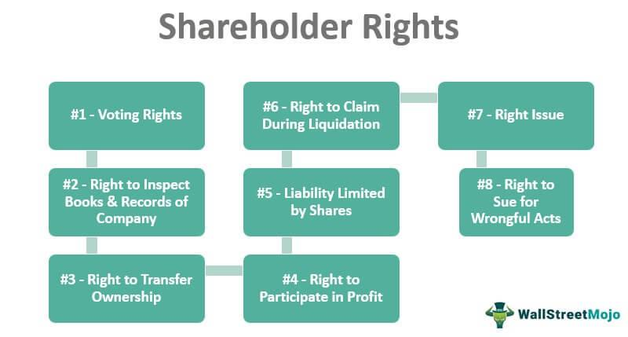

## Table of Contents

## What is a majority shareholder?

A majority shareholder is someone who owns more than half of a company's shares. This means they have the most control over the company because they have the biggest say in how it is run. When decisions need to be made, like choosing the board of directors or making big changes, the majority shareholder's vote counts the most.

Having a majority of the shares gives the shareholder a lot of power. They can influence the company's direction and policies. For example, if they want the company to start a new project or change its strategy, they can make it happen because they have the most votes. This position can be very important in deciding the future of the company.

## How is a majority shareholder different from a minority shareholder?

A majority shareholder owns more than half of a company's shares, which gives them the most control over the company. They can make big decisions and have a lot of say in how the company is run. For example, they can choose the board of directors or decide on major changes in the company's strategy. Because they own the most shares, their vote is the most important when decisions need to be made.

On the other hand, a minority shareholder owns less than half of the company's shares. This means they have less control and influence over the company's decisions. They can still vote on things, but their vote doesn't [carry](/wiki/carry-trading) as much weight as the majority shareholder's. Minority shareholders might have some say in smaller decisions, but the big choices are usually made by the majority shareholder.

In summary, the main difference between a majority and a minority shareholder is the amount of control they have. A majority shareholder can steer the company in the direction they want, while a minority shareholder has to go along with the decisions made by the majority shareholder.

## What percentage of shares constitutes a majority shareholder?

A majority shareholder is someone who owns more than half of a company's shares. This means they have over 50% of the total shares. When you own more than half, you have the most control over the company because you can make the big decisions.

For example, if a company has 100 shares, a majority shareholder would need to own at least 51 shares. This gives them the power to choose the board of directors and decide on important changes in the company's strategy. Owning more than half the shares means their vote counts the most when decisions are made.

## What are the basic rights of a majority shareholder?

A majority shareholder has several important rights because they own more than half of a company's shares. One of the main rights is the ability to vote on big decisions. This means they can choose who sits on the board of directors and can influence major changes in the company's strategy. Because they have more than half the votes, their decisions usually win, giving them a lot of control over the company's direction.

Another right of a majority shareholder is the ability to access important company information. They can look at financial reports and other documents to make sure the company is doing well. This helps them make smart decisions about the company's future. They also have the right to receive dividends, which are payments made to shareholders from the company's profits. These rights help the majority shareholder keep the company running smoothly and successfully.

## Can a majority shareholder influence company decisions?

Yes, a majority shareholder can influence company decisions a lot. They own more than half of the company's shares, so they have the most votes. When big decisions need to be made, like choosing who sits on the board of directors or changing the company's strategy, the majority shareholder's vote counts the most. This means they can decide what the company does next and steer it in the direction they want.

For example, if a majority shareholder wants the company to start a new project or stop an old one, they can make it happen. They have the power to choose the people who will run the company and make the big choices. This control helps them make sure the company follows their vision and goals.

## What are the voting rights associated with being a majority shareholder?

A majority shareholder has a lot of voting power because they own more than half of the company's shares. This means they can make big decisions for the company. When it's time to vote on things like choosing the board of directors or changing the company's strategy, the majority shareholder's vote counts the most. They can decide who will run the company and what direction it will go.

Because they have more than half the votes, the majority shareholder can make sure their choices win. This gives them a lot of control over the company's future. They can start new projects, stop old ones, or make other big changes. Their voting power helps them steer the company the way they want it to go.

## How can a majority shareholder affect the board of directors?

A majority shareholder can have a big impact on the board of directors because they own more than half of the company's shares. This means they have the most votes when it's time to choose who will be on the board. They can pick people who agree with their ideas and goals for the company. This way, the board will likely make decisions that the majority shareholder likes.

By choosing the board members, the majority shareholder can make sure the company follows their vision. If they want the company to start new projects or change its strategy, they can pick board members who will support these changes. This gives the majority shareholder a lot of control over what the company does and how it grows.

## What are the potential conflicts of interest for a majority shareholder?

A majority shareholder might face conflicts of interest because they have a lot of control over the company. They might make decisions that are good for them but not so good for other shareholders or the company as a whole. For example, they might want the company to buy another business they own, even if it's not the best choice for the company. This can cause problems because other shareholders might feel like the majority shareholder is not thinking about what's best for everyone.

Another conflict can happen when the majority shareholder is also a manager or on the board of directors. They might make choices that help them personally, like giving themselves a big salary or bonus, instead of focusing on what's best for the company. This can make other shareholders upset because they might think the majority shareholder is using their power for their own benefit, not for the good of the company.

## What legal responsibilities does a majority shareholder have?

A majority shareholder has some legal responsibilities to the company and other shareholders. They need to act in the best interest of the company, not just for themselves. This means they should make decisions that help the company grow and succeed, even if it's not the best choice for them personally. They also need to be honest and fair when they deal with the company's business. For example, if they know something important about the company, they should share it with everyone, not just keep it to themselves.

Another responsibility is to follow the company's rules and the laws that apply to businesses. This includes things like not using company money for their own personal needs and making sure they don't do anything that could hurt the company. If they don't follow these rules, they could get in trouble and might even have to pay money or face other penalties. It's important for a majority shareholder to remember that their actions can affect the whole company, so they need to be careful and do what's right.

## How does a majority shareholder's role change in a public versus a private company?

In a private company, a majority shareholder often has more direct control over the business. They can make decisions quickly and easily because there are fewer rules to follow. The majority shareholder might also be involved in the day-to-day running of the company, working closely with other shareholders and employees. Since private companies don't have to report to the public, the majority shareholder can keep things more private and focus on what they think is best for the company without as much outside pressure.

In a public company, the role of a majority shareholder is different because there are more rules and regulations to follow. They still have a lot of control, but they need to think about the interests of all the shareholders, not just themselves. Public companies have to share a lot of information with the public, so the majority shareholder's decisions can be watched closely by investors and regulators. This means they need to be very careful and make sure their choices are good for the company and fair to everyone involved.

## What are the tax implications for a majority shareholder?

A majority shareholder has to think about taxes when they get money from the company. If the company makes a profit and pays out dividends, the majority shareholder has to pay taxes on that money. The tax rate depends on how much they earn and where they live. Sometimes, the company can give the majority shareholder other benefits, like a company car or a nice office, which can also be taxed. It's important for the majority shareholder to know about these taxes so they can plan how to use their money wisely.

When a majority shareholder sells their shares, they might have to pay capital gains tax. This tax is on the profit they make from selling the shares. If they bought the shares for a low price and sold them for a high price, they'll have to pay tax on the difference. The tax rate for capital gains can be different from the tax on dividends. It's a good idea for the majority shareholder to talk to a tax expert to understand all the taxes they might have to pay and how to manage them.

## How can a majority shareholder protect their investment and rights?

A majority shareholder can protect their investment and rights by making sure they are involved in the company's big decisions. Since they own more than half of the shares, they can vote to choose the board of directors and influence the company's strategy. This means they should stay informed about what's happening in the company and attend meetings where important choices are made. By being active, they can make sure the company is doing well and following their goals.

Another way a majority shareholder can protect their investment is by keeping a close eye on the company's financial health. They should look at the financial reports regularly to see if the company is making money and using it wisely. If they see something they don't like, they can use their voting power to make changes. It's also a good idea for them to talk to a lawyer to understand their legal rights and make sure the company's rules are fair to them. This helps them keep their investment safe and their rights protected.

## References & Further Reading

[1]: Shleifer, A., & Vishny, R. W. (1997). ["A Survey of Corporate Governance."](https://onlinelibrary.wiley.com/doi/abs/10.1111/j.1540-6261.1997.tb04820.x) The Journal of Finance, 52(2), 737-783.

[2]: Jensen, M. C., & Meckling, W. H. (1976). ["Theory of the Firm: Managerial Behavior, Agency Costs and Ownership Structure."](https://www.sciencedirect.com/science/article/pii/0304405X7690026X) Journal of Financial Economics, 3(4), 305-360.

[3]: Lopez de Prado, M. (2018). ["Advances in Financial Machine Learning."](https://www.amazon.com/Advances-Financial-Machine-Learning-Marcos/dp/1119482089) Wiley.

[4]: Bebchuk, L. A., & Weisbach, M. S. (2010). ["The State of Corporate Governance Research."](https://www.nber.org/papers/w15537) The Review of Financial Studies, 23(3), 939-961.

[5]: Chan, E. P. (2009). ["Quantitative Trading: How to Build Your Own Algorithmic Trading Business."](https://github.com/ftvision/quant_trading_echan_book) Wiley.

[6]: Shapiro, S. D. (2001). ["The Role of Shareholder Democracy in Corporate Governance."](https://www.sciencedirect.com/science/article/pii/S0305750X02001109) South Carolina Law Review, 52(3), 303-318.

[7]: Jansen, S. (2020). ["Machine Learning for Algorithmic Trading."](https://github.com/stefan-jansen/machine-learning-for-trading) Packt Publishing.

[8]: Aronson, D. (2007). ["Evidence-Based Technical Analysis: Applying the Scientific Method and Statistical Inference to Trading Signals."](https://www.amazon.com/Evidence-Based-Technical-Analysis-Scientific-Statistical/dp/0470008741) Wiley.