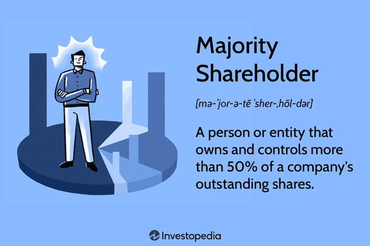

This article explores the intricate intersection between corporate governance, shareholder rights, majority shareholders, and algorithmic trading. These elements are pivotal in determining the strategic direction and operational accountability of corporations. As financial markets evolve, the roles and influences within this framework have become increasingly complex and interconnected.

Corporate governance provides the structure through which companies are directed and controlled. It encompasses the mechanisms and processes that ensure accountability among a corporation's stakeholders, primarily focusing on the relationships between the board, management, shareholders, and other participants. Effective corporate governance not only safeguards company assets but also ensures equitable treatment of all stakeholders, making it indispensable for maintaining investor confidence and market integrity.

Shareholders, as owners of the company, play a critical role in corporate governance. Shareholder rights, such as voting on critical corporate policies or electing board members, are essential for maintaining a balance between strategic priorities and shareholder interests. Effective governance relies upon these rights to promote transparency and accountability within the organization. However, the presence of majority shareholders—those owning more than half of a company's shares—introduces unique dynamics. They often possess the power to significantly influence corporate decisions, thereby affecting governance outcomes, stakeholder relationships, and strategic directions.

In the digital age, the advent of algorithmic trading has introduced a new dimension to shareholder dynamics. Algorithmic trading, which involves the use of computer algorithms to automate stock trading, impacts market liquidity and price volatility. These effects can alter the balance of power among shareholders, potentially affecting decision-making processes within companies. Algorithmic trading tends to favor short-term gains, which may conflict with the long-term interests of a majority of shareholders. This dichotomy presents challenges for corporate governance, especially in aligning strategic objectives with shareholder expectations.

Understanding these interactions is crucial in today's fast-moving financial landscapes, where decisions must be made rapidly and with precision. The interplay of majority shareholders and algorithmic trading with traditional corporate governance structures necessitates a careful analysis to ensure companies remain resilient and equitable. This discussion sets the stage for a deeper examination of how these influences manifest in shareholder decisions and corporate governance outcomes.

## Table of Contents

## Corporate Governance and Shareholder Rights

Corporate governance is the cornerstone of effective decision-making and accountability within corporate entities. It comprises a set of relationships between a company’s management, its board, shareholders, and other stakeholders, designed to provide a framework to attain the company’s objectives. This governance framework ensures that company objectives align with the interests of stakeholders by promoting transparency, fairness, and accountability in a firm's operations.

Shareholder rights are essential components of corporate governance, as they provide mechanisms for ensuring equitable treatment for both majority and minority shareholders. Key rights typically include the ability to vote on critical corporate matters such as mergers and acquisitions, election of board members, and other significant policy changes. Shareholders also benefit from access to important information, enabling them to make informed decisions about their investments. Additionally, adequate legal recourse exists for shareholders to challenge fiduciary breaches, thus safeguarding their investments against managerial misconduct.

Corporate governance often encounters challenges, especially when it comes to balancing the interests of controlling and minority shareholders. Majority shareholders, by virtue of their significant shareholding, wield considerable influence over corporate decisions. This power can potentially lead to decisions that favor the majority's interests over those of minority shareholders. Consequently, establishing a fair governance structure that protects minority interests while acknowledging the controlling interests of major shareholders is critical.

To address these challenges, many jurisdictions have instituted legal frameworks and regulations designed to protect minority shareholders and ensure fair corporate governance practices. These frameworks often include mechanisms such as cumulative voting, where minority shareholders are afforded a greater chance of electing representatives to the board, or the introduction of independent directors who can provide impartial oversight and balance within the boardroom.

Therefore, corporate governance and shareholder rights are interdependent elements that collectively ensure the smooth functioning of a corporation. By upholding these rights, corporations can create an equitable environment that fosters sustained growth and aligns with the strategic objectives set forth by its shareholders.

## The Role of Majority Shareholders

Majority shareholders, characterized by their ownership of over 50% of a company's shares, wield substantial influence in shaping corporate governance. Their significant shareholding grants them the power to set strategic directions, elect board members, and make pivotal corporate decisions. This commanding influence makes them critical players in the corporate governance landscape.

The governance role of majority shareholders enables them to align company strategies with their vision. They can direct company policy, initiate major corporate actions, and oversee management to ensure alignment with the defined objectives. This ability to shape high-level strategy is especially pronounced in companies where shares are closely held and major shareholders have a direct involvement in management activities.

Despite their influential position, majority shareholders bear the responsibility of safeguarding the interests of minority shareholders. They are expected to uphold ethical standards and promote the long-term health of the company. This includes ensuring that minority shareholders are treated equitably, with respect to their rights, and that corporate actions taken are not detrimental to their interests. Majority shareholders are tasked with the duty to avoid decisions that could lead to minority shareholder oppression, such as transactions that could disproportionately benefit themselves at the expense of others.

Conflicts between majority and minority shareholders may manifest when there is a misalignment of interests. In closely held firms, where a small number of shareholders have controlling interests, these conflicts can become more pronounced. Such disputes often revolve around issues of shareholder voting, dividend distribution, and strategic business changes. Minority shareholders may seek legal redress if they feel that the actions of majority shareholders reflect a breach of fiduciary duty or an abuse of power.

Balancing control and accountability is a persistent challenge for majority shareholders. While they have the capacity to guide corporate destiny, they must do so in a manner that is transparent and equitable. Effective corporate governance thus necessitates mechanisms that protect minority interests while allowing majority shareholders to contribute meaningfully to corporate growth.

## Algorithmic Trading in Corporate Governance

Algorithmic trading, often referred to as algo trading, is a significant force in modern financial markets, leveraging computer programs and algorithms to execute complex trading strategies at high speeds. This method of trading profoundly influences market dynamics by enabling rapid trades, which can substantially affect stock prices and, subsequently, shareholder decisions. The speed and efficiency of [algorithmic trading](/wiki/algorithmic-trading) pose both opportunities and challenges for corporate governance.

One of the primary implications of algorithmic trading is its alignment with short-term investor strategies. The focus on rapid trading and immediate profit generation can conflict with the long-term goals of companies. Algorithmic traders often look to capitalize on minor price fluctuations and achieve their returns through increased transaction volumes, potentially leading to heightened market [volatility](/wiki/volatility-trading-strategies). This volatility can undermine stable strategic decision-making within companies, posing a challenge to corporate boards aiming to implement long-range corporate policies.

Moreover, algorithmic trading can impact shareholder voting outcomes, a crucial aspect of corporate governance. High-frequency traders (HFTs), a subset of algo traders, may buy substantial volumes of shares close to voting cut-off dates to influence corporate decisions without a sustained interest in the company's long-term performance. This practice can skew voting results, undermining the principle of shareholder democracy, which assumes that voting power corresponds to long-term investment in the company. The short-term holding patterns of algo traders may result in governance decisions that reflect the transient interests of these traders rather than the enduring interests of the traditional shareholder base.

The implications of algorithmic trading extend to more profound governance practices. Companies now face the challenge of managing the influence of shareholders whose investment strategies might not align with the company’s long-term vision or sustainability goals. As a result, corporate governance frameworks must evolve to consider these dynamics, ensuring that decision-making processes remain balanced and equitable, respecting the interests of both transient and long-term investors.

Incorporating measures such as staggered voting rights or loyalty rewards for long-term shareholders may offer potential solutions to counterbalance the distortions caused by the short-term focus of algorithmic trading. Understanding and navigating the implications of algorithmic trading is essential for maintaining effective corporate governance in a rapidly evolving financial market landscape.

## Implications for Shareholder Democracy

The empowerment of shareholders through voting rights serves as a fundamental pillar of shareholder democracy, aiming to align corporate decisions with shareholder interests. Traditionally, significant business decisions were the domain of executives and board members; however, shareholder democracy seeks to engage shareholders more directly in governance. This includes the ability to vote on critical matters such as mergers, acquisitions, and board elections.

Trading dynamics have become increasingly intricate, particularly with the rise of algorithmic trading. These high-frequency strategies, which utilize complex algorithms to make decisions at speeds and frequencies that human traders cannot match, have the potential to significantly alter shareholder compositions. For example, algo trading can lead to rapid changes in stock ownership due to its short-term and high-[volume](/wiki/volume-trading-strategy) transaction nature. This swift turnover can influence voting outcomes, as the composition of shareholders at the time of voting may not reflect the ownership landscape over the long term.

Moreover, these changes introduce questions around the efficiency of shareholder democracy. While the rapid flow of capital is beneficial for [liquidity](/wiki/liquidity-risk-premium), it may also lead to misalignments between those who hold shares during key voting periods and those who hold shares over the long term. This discrepancy may result in decision-making that favors short-term gains over sustainable long-term growth.

Current market practices challenge the efficacy of shareholder democracy by potentially undermining the alignment between shareholder interests and corporate strategies. The influence of transient shareholders, driven by algorithmic trading's emphasis on speed over strategic engagement, raises concerns about whether these practices can truly enhance democratic governance. Critics argue that this focus on short-term returns might sacrifice the broader vision necessary for enduring organizational success.

In conclusion, while shareholder democracy theoretically aligns company decisions with the interests of its owners, the realities of modern trading dynamics introduce complexities that can both empower and undermine this alignment. Addressing these challenges requires careful consideration of how market practices and technologies like algorithmic trading interact with governance frameworks to preserve democratic principles in corporate contexts.

## Conclusion

Understanding corporate governance requires recognizing the complex interplay between shareholder rights, the role of majority shareholders, and the influence of algorithmic trading. Each of these elements plays a vital role in shaping governance frameworks within modern corporations.

Majority shareholders, wielding control with over 50% of a company's shares, have the power to direct corporate strategies, select board members, and make important decisions. However, this power comes with the ethical obligation to safeguard minority shareholder interests and ensure the corporation's long-term success. Ethical governance demands that majority shareholders exercise their influence judiciously, fostering a balance that protects both economic and ethical considerations.

Simultaneously, the rise of algorithmic trading has transformed shareholder participation by introducing speed and efficiency to trading activities. Despite its benefits, algorithmic trading can lead to conflicts between short-term market fluctuations and long-term strategic goals. These automated trading systems can sway shareholder voting outcomes and impact corporate governance decisions by altering the stockholder composition or price dynamics.

Effective corporate governance necessitates an integrative approach that accounts for these variables. It should aim to balance the ambitions of majority shareholders with the collective interests of the minority while managing the repercussions of high-frequency trading. Such an approach promotes a stable corporate environment where equitable and sustainable business practices are grounded in the support of diversified shareholder interests. Ultimately, embracing both shareholder rights and cutting-edge trading technologies can lead to more robust governance frameworks that adapt to the rapidly evolving landscape of financial markets.

## References & Further Reading

[1]: Shleifer, A., & Vishny, R. W. (1997). ["A Survey of Corporate Governance."](https://onlinelibrary.wiley.com/doi/abs/10.1111/j.1540-6261.1997.tb04820.x) The Journal of Finance, 52(2), 737-783.

[2]: Jensen, M. C., & Meckling, W. H. (1976). ["Theory of the Firm: Managerial Behavior, Agency Costs and Ownership Structure."](https://www.sciencedirect.com/science/article/pii/0304405X7690026X) Journal of Financial Economics, 3(4), 305-360.

[3]: Lopez de Prado, M. (2018). ["Advances in Financial Machine Learning."](https://www.amazon.com/Advances-Financial-Machine-Learning-Marcos/dp/1119482089) Wiley.

[4]: Bebchuk, L. A., & Weisbach, M. S. (2010). ["The State of Corporate Governance Research."](https://www.nber.org/papers/w15537) The Review of Financial Studies, 23(3), 939-961.

[5]: Chan, E. P. (2009). ["Quantitative Trading: How to Build Your Own Algorithmic Trading Business."](https://github.com/ftvision/quant_trading_echan_book) Wiley.

[6]: Shapiro, S. D. (2001). ["The Role of Shareholder Democracy in Corporate Governance."](https://www.sciencedirect.com/science/article/pii/S0305750X02001109) South Carolina Law Review, 52(3), 303-318.

[7]: Jansen, S. (2020). ["Machine Learning for Algorithmic Trading."](https://github.com/stefan-jansen/machine-learning-for-trading) Packt Publishing.

[8]: Aronson, D. (2007). ["Evidence-Based Technical Analysis: Applying the Scientific Method and Statistical Inference to Trading Signals."](https://www.amazon.com/Evidence-Based-Technical-Analysis-Scientific-Statistical/dp/0470008741) Wiley.