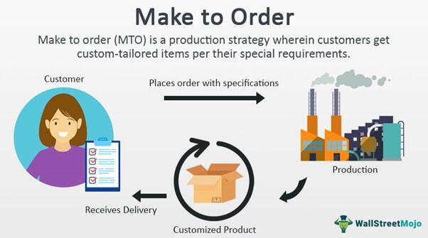

Understanding the synergy between Make-to-Order (MTO) manufacturing and algorithmic trading can yield fascinating insights for businesses navigating modern markets. MTO manufacturing represents a custom production model that is crucial in industries where unique specifications determine value, providing tailored solutions to precisely meet customer demands. Such a model reduces waste and enhances flexibility by producing goods only after receiving confirmed orders, thereby aligning production schedules with actual market needs.

Algorithmic trading, on the other hand, leverages advanced algorithms to automate and optimize trading decisions. This approach allows for rapid and accurate decision-making, processing large volumes of data to predict and respond to market conditions dynamically. Its precision and speed are set to revolutionize the operational facets of industries reliant on customization, such as MTO manufacturing.



The integration of these two methodologies promises a novel approach to improving efficiency and predictability in manufacturing processes. By incorporating the precision and strategic insights of algorithmic trading, MTO manufacturing can enhance production scheduling, resource allocation, and demand forecasting. This article will explore the core aspects of each methodology, their strategic applications, and the advantages of leveraging algorithmic insights for custom production.

The merging of algorithmic trading strategies with MTO manufacturing processes not only optimizes inventory levels and reduces operational costs but also propels industries toward higher customer satisfaction through personalized production and faster delivery times. As businesses continue to adapt to technological advances, the potential for integrating these seemingly distinct fields offers a promising frontier for innovation and competitiveness in modern markets.

## Table of Contents

## Understanding Make-to-Order Manufacturing

Make-to-Order (MTO) manufacturing is a production strategy where goods are manufactured only after a confirmed order is received. This approach is distinct from Make-to-Stock (MTS) systems, where products are made in advance and stored in inventory. MTO is fundamentally significant in industries that demand precision and customization due to its ability to cater to specific customer requirements.

### Advantages of MTO Manufacturing

MTO manufacturing offers several advantages:

1. **Reduced Inventory Costs**: Since products are only produced upon order, businesses can significantly reduce inventory holding costs. This strategy eliminates the need for warehousing finished goods, thereby minimizing storage expenses and inventory risks such as obsolescence.

2. **Increased Customer Satisfaction**: MTO allows for personalized production, ensuring that customer specifications are precisely met. This customization enhances customer satisfaction and loyalty, as clients receive products tailored to their needs.

3. **Enhanced Flexibility**: MTO systems provide manufacturers the flexibility to adjust their operations based on market demand. This adaptability ensures that companies can efficiently manage resources and respond swiftly to changes, avoiding overproduction and underproduction.

### Challenges in MTO Manufacturing

While MTO provides numerous benefits, it also presents several challenges:

1. **Variable Lead Times**: MTO systems often struggle with unpredictable lead times due to the bespoke nature of each order. The production process cannot commence until an order is secured, which can lead to longer wait times for customers.

2. **Efficient Production Scheduling**: Effective scheduling is crucial in MTO systems to meet delivery deadlines despite the inherent variability. Manufacturers must adeptly manage resources and production capacities to optimize workflow and reduce delays.

### Industries Utilizing MTO Manufacturing

MTO manufacturing is predominantly used in industries where customization is crucial:

- **Aerospace**: The aerospace industry relies on MTO for the production of aircraft parts that meet stringent regulatory and safety standards. Components are often custom-made to specifications unique to each client or aircraft design.

- **Automotive**: Customization in automotive manufacturing, such as specialized parts or unique vehicle models, commonly employs MTO systems to meet specific consumer preferences and regulatory requirements.

- **High-Tech Sectors**: In high-tech industries, where technological specifications and rapid innovation are frequent, MTO manufacturing ensures that products are up-to-date and meet exact client demands, such as in the production of custom electronics and machinery.

### Recent Trends and Innovations

Recent advancements in MTO processes focus on enhancing efficiency and customer experience:

- **Digital Transformation**: The adoption of digital twin technologies and advanced simulation tools has improved MTO manufacturers' ability to predict potential bottlenecks and optimize production processes in real-time.

- **Integration of Advanced Analytics**: The use of predictive analytics allows manufacturers to better forecast demand and allocate resources efficiently, improving throughput and delivery timelines.

- **Adoption of Lean Manufacturing Principles**: Lean methodologies have been increasingly integrated into MTO processes, focusing on waste reduction, efficiency improvements, and value creation throughout the production cycle.

These innovations continue to evolve, making MTO manufacturing more competitive and agile, subsequently driving increased interest in its strategic application across various sectors.

## Algorithmic Trading: A Brief Overview

Algorithmic trading, commonly referred to as algo trading, represents a significant evolution from traditional trading practices. It employs complex algorithms and [artificial intelligence](/wiki/ai-artificial-intelligence) to automate trading processes. This methodology allows trades to be executed at speeds and frequencies far beyond human capabilities, leveraging advanced computing power and extensive market data.

At its core, [algorithmic trading](/wiki/algorithmic-trading) functions by following preset rules and instructions, which can include parameters like timing, price, and [volume](/wiki/volume-trading-strategy). High-frequency trading ([HFT](/wiki/high-frequency-trading-strategies)), a subset of algorithmic trading, epitomizes this automation, executing thousands of trades in fractions of a second. Such automated strategies rely heavily on data analytics to identify profitable opportunities by analyzing diverse market signals.

The advantages of algorithmic trading are manifold. Primarily, it enhances market efficiency by increasing the speed of trade execution, thereby reducing the likelihood of price discrepancies. The precision offered by algorithms also minimizes human errors, while the capability to process large datasets allows for more informed decision-making. Furthermore, algorithmic trading can operate 24/7, beyond the constraints of human traders.

Several algorithms commonly utilized in trading include statistical [arbitrage](/wiki/arbitrage), [momentum](/wiki/momentum)-based strategies, and market-making algorithms. Statistical arbitrage exploits price discrepancies between securities, using statistical models to predict how prices are expected to converge. Momentum strategies, on the other hand, capitalize on the continuation of existing market trends. Market-making involves simultaneously providing buy and sell quotes, profiting from the spread between bid and ask prices.

Despite its benefits, algorithmic trading is not without drawbacks and controversies. Market [volatility](/wiki/volatility-trading-strategies) is a prominent concern, as the rapid execution of trades can amplify price swings. Furthermore, ethical considerations arise regarding the fairness and transparency of markets, as well-resourced firms might have an advantage over smaller investors. The 2010 "Flash Crash" is a notorious example where algorithmic trading aggregated a dramatic and rapid market drop, raising questions about market stability and regulatory oversight.

In conclusion, while algorithmic trading offers notable enhancements over traditional trading practices, including speed and efficiency, it also requires careful consideration of its inherent risks and ethical implications. As the financial markets continue to evolve, the role and regulation of algorithmic trading will remain pivotal in shaping equitable market dynamics.

## Integrating Algo Trading Principles in MTO Manufacturing

Integrating algorithmic trading principles into Make-to-Order (MTO) manufacturing presents a significant opportunity for improving decision-making and process optimization. Both domains depend heavily on the precise coordination of numerous variables to achieve efficiency and optimal outcomes. Algorithmic trading, with its reliance on data-driven decision-making and speed, can offer transformative insights for MTO manufacturing processes.

### Data-Driven Insights for Enhanced Scheduling and Forecasting

Algorithmic trading employs complex algorithms to analyze large datasets, enabling rapid decision-making based on market conditions. Applying similar data-driven insights to MTO manufacturing can enhance production scheduling, demand forecasting, and resource allocation. For instance, advanced predictive analytics can be used to anticipate customer demand and align production schedules accordingly. This can lead to more accurate inventory management, reduced lead times, and minimized waste.

In Algorthmic Trading, a basic Predictive analytics model might look as follows:

```python
import numpy as np
from sklearn.linear_model import LinearRegression

# Sample data: production inputs and demand levels
X = np.array([[1], [2], [3], [4], [5]])  # Production inputs
y = np.array([200, 250, 300, 350, 400])  # Demand levels

# Create a linear regression model
model = LinearRegression().fit(X, y)

# Predict future demand
future_input = np.array([[6]])
predicted_demand = model.predict(future_input)
print(predicted_demand)
```

### Predictive Analytics and Market Trend Anticipation

Predictive analytics modeled on algorithmic strategies allows manufacturers to anticipate market trends and customer preferences with greater accuracy. By using techniques such as [machine learning](/wiki/machine-learning) and data mining, manufacturers can identify patterns and trends that inform production strategies. This can be particularly useful in customizing production runs to meet specific customer requirements, thus enhancing customer satisfaction and reducing excess production.

### Real-World Examples of Integration

Several companies have successfully integrated algorithmic trading methodologies into their manufacturing processes. For example, certain automotive manufacturers have adopted automated analytics systems that track consumer preferences and adjust production schedules in real-time. Similarly, aerospace firms utilize predictive maintenance algorithms to enhance operational reliability and reduce downtime.

### Technological Tools and Platforms

The integration of algorithmic principles into MTO manufacturing is facilitated by various technological tools and platforms. Supply chain management systems, equipped with advanced analytics and real-time monitoring capabilities, are instrumental in this transformation. These systems allow for seamless communication and data exchange across different manufacturing stages, significantly improving operational efficiency.

Platforms such as SAP Integrated Business Planning and Oracle Advanced Supply Chain Planning offer comprehensive solutions that incorporate elements of algorithmic trading, enabling manufacturers to optimize their supply chains and adjust dynamically to changing market conditions. The impact of these tools is evident in improved production agility, reduced costs, and enhanced competitiveness.

In conclusion, the fusion of algorithmic trading techniques with MTO manufacturing holds the potential to revolutionize the way manufacturers operate, offering not only increased efficiency but also a strategic edge in responding to market demands and customer needs.

## Benefits of Combining MTO Manufacturing and Algo Trading

Combining Make-to-Order (MTO) manufacturing with insights from algorithmic trading presents a strategic advantage that can significantly optimize operations and reduce costs. MTO manufacturing, inherently designed for customization, benefits from the precision and predictive capabilities of algorithmic trading, allowing for more efficient inventory management. By analyzing historical data and market trends, algorithms can forecast demand with high accuracy, reducing the risk of overproduction and excess stock. This proactive approach minimizes waste and lowers storage costs, directly impacting the bottom line of businesses.

Furthermore, the integration of algorithmic insights can enhance customer satisfaction through personalized production capabilities. With the aid of algorithms, manufacturers can fine-tune their production schedules to swiftly respond to specific customer preferences and market shifts. This agility enables faster order fulfillment, aligning with consumer expectations for quick delivery of customized products. Such responsiveness not only satisfies customers but also strengthens brand loyalty.

In terms of supply chain resilience and adaptability, algorithmic trading methodologies provide robust solutions. Algorithms can identify potential disruptions in the supply chain, allowing companies to proactively mitigate risks and adapt to unforeseen challenges. The ability to adjust supply chain operations in real-time ensures continuity and reliability, crucial factors in maintaining competitive advantage.

On a broader scale, the synergy between MTO manufacturing and algo trading positions companies to compete more effectively in global markets. By leveraging advanced data analytics and artificial intelligence, companies can continuously innovate and refine their strategies, fostering technological advancement. This innovation is crucial for maintaining a leading edge over competitors in a rapidly evolving market landscape.

The scalability of these benefits is substantial. Across various sectors, including automotive, aerospace, and consumer electronics, businesses can implement these combined methodologies to enhance operational efficiency and customer engagement. Smaller enterprises and startups, in particular, stand to gain from this integration by harnessing technology to scale their operations effectively and introduce innovative business models tailored to their unique market dynamics.

Overall, the intersection of MTO manufacturing and algorithmic trading offers a transformative approach to modern manufacturing, driving both operational excellence and strategic market positioning.

## Challenges and Considerations

Integrating algorithmic trading principles into Make-to-Order (MTO) manufacturing presents several challenges and considerations that businesses must navigate carefully.

One of the foremost challenges is the technological barriers associated with merging two complex systems that traditionally operate independently. Algorithmic trading relies heavily on advanced computers and software to conduct rapid decision-making based on data analysis. Similarly, MTO manufacturing demands precision and customization in production processes. The integration of these systems may require substantial updates and modifications to existing technologies, posing a financial and technical burden.

Data privacy is also a significant concern. The integration involves vast amounts of data, ranging from production details to customer information. Ensuring the confidentiality and security of this data while using it to inform algorithmic models is paramount. Companies must implement robust data protection mechanisms to guard against leaks and unauthorized access, complying with regional and global data privacy regulations such as the General Data Protection Regulation (GDPR).

The successful application of data analytics and algorithms necessitates skilled professionals who can interpret and apply complex data insights effectively. This need highlights a potential skills gap, as there is a demand for trained individuals who bridge the knowledge of both manufacturing processes and algorithmic trading strategies. Investments in training and development, or hiring skilled personnel, become essential to harness the full potential of this integration.

Regulatory considerations may also impact the implementation of algorithmic trading into MTO manufacturing. Compliance with industry-specific standards and regulations is crucial. As technology evolves, regulatory bodies may introduce new laws governing the use of algorithms, especially concerning transparency and ethical use. Companies must stay informed about these regulations to ensure compliance and mitigate potential legal risks.

Organizational resistance to change is a common hurdle when new technologies are introduced. Employees accustomed to traditional manufacturing methods may exhibit reluctance towards adopting algorithmic processes. Effective change management strategies are vital to overcoming this resistance. These strategies include clear communication about the benefits of integration, ongoing training sessions, and involving employees in the transition process to foster acceptance and adaptability.

Lastly, a robust IT infrastructure is fundamental to support the seamless operation of these integrated systems. This infrastructure must accommodate high-frequency data exchanges, rapid computational tasks, and secure data storage. Investing in scalable and flexible IT solutions ensures long-term sustainability and efficiency of operations, providing a stable foundation for leveraging algorithmic insights in MTO manufacturing.

In conclusion, while the integration of algorithmic trading concepts into MTO manufacturing promises significant advancements, addressing these challenges is essential for organizations aspiring to achieve a harmonious and effective synthesis of these methodologies.

## Future Trends and Opportunities

The convergence of Make-to-Order (MTO) manufacturing and algorithmic trading is expected to be influenced by several notable future trends, primarily driven by technological advancements such as artificial intelligence (AI) and machine learning. These technologies are anticipated to enhance data processing capabilities, allowing for more precise demand forecasting and resource optimization in MTO systems. Machine learning algorithms, for instance, can analyze historical data to predict future demand patterns, enabling manufacturers to tailor production schedules to real-time market conditions.

Emerging business models and opportunities could include the development of smart factories and digital twins. Smart factories, leveraging advanced sensors and IoT devices, would facilitate seamless communication between machinery and production systems, automating and optimizing manufacturing processes. Digital twins—virtual replicas of physical systems—could enable more accurate simulations of manufacturing processes, allowing businesses to experiment with different scenarios and optimize their operations without the need to implement costly physical changes.

Industry 4.0, characterized by increased automation and data exchange, is set to transform both MTO manufacturing and algorithmic trading. The integration of IoT and cyber-physical systems will allow for the creation of interconnected networks where machines can autonomously adjust operations based on algorithmic insights. These advancements could lead to an era of hyper-personalization in manufacturing, allowing companies to efficiently produce custom products at scale.

For smaller enterprises and startups, these trends present both challenges and opportunities. While the initial investment in technology and skills development may be significant, the potential for innovation and competitive advantage is substantial. Smaller firms can leverage cloud-based solutions and AI-powered analytics to enhance their operational efficiency without the need for extensive infrastructure.

In the long term, the blending of MTO manufacturing and algorithmic trading practices could significantly impact global trade. The ability to produce customized products at scale with reduced lead times could disrupt traditional supply chains, facilitating more localized production and reducing dependence on international logistics. This shift could lead to a more resilient and responsive global manufacturing network, stimulating further innovation in both production and trading practices.

Conclusively, as these technologies continue to evolve, the convergence of MTO manufacturing and algorithmic trading holds promise for a future where production is smarter, faster, and more attuned to the individual needs of consumers worldwide.

## Conclusion

The integration of Make-to-Order (MTO) manufacturing and algorithmic trading strategies represents a significant advancement in manufacturing and trading sectors. By merging the customizable and flexible nature of MTO manufacturing with the precise and data-driven methodologies of algorithmic trading, companies can unlock new efficiencies and capabilities. This integration can lead to optimized inventory levels, reduced operational costs, and an improved capacity for demand forecasting, ultimately enhancing customer satisfaction through personalized and timely product delivery.

The potential benefits of incorporating algorithmic trading insights within MTO operations lie in improved competitiveness and innovation. Businesses that embrace this blend of strategies can potentially gain a strategic edge by adapting quickly to market fluctuations and consumer demands. Algorithmic approaches offer the ability to process vast data sets at high speeds, providing manufacturers with actionable insights that could streamline production processes and decision-making.

The evolving nature of global markets necessitates continuous learning and adaptation. As technologies progress and market demands change, maintaining relevance will require businesses to invest in ongoing education and the development of skills related to data analytics and systems integration. Algorithmics within MTO operations presents an opportunity for pioneering enterprises to lead through innovation and adaptability.

Looking ahead, the future of manufacturing and trading could be characterized by increased collaboration, sustainability, and technological integration. The convergence of these fields may drive advancements such as smart factories, where digital and physical systems collaborate seamlessly. This vision points towards a more interconnected and resilient global trade environment, where sustainable practices are prioritized alongside technological innovation. The journey toward realizing this future will demand a commitment to embracing change and fostering partnerships across industries to build a robust and sustainable economic ecosystem.

## References & Further Reading

[1]: Bergstra, J., Bardenet, R., Bengio, Y., & Kégl, B. (2011). ["Algorithms for Hyper-Parameter Optimization."](https://papers.nips.cc/paper/4443-algorithms-for-hyper-parameter-optimization) Advances in Neural Information Processing Systems 24.

[2]: ["Advances in Financial Machine Learning"](https://www.amazon.com/Advances-Financial-Machine-Learning-Marcos/dp/1119482089) by Marcos Lopez de Prado

[3]: ["Evidence-Based Technical Analysis: Applying the Scientific Method and Statistical Inference to Trading Signals"](https://www.amazon.com/Evidence-Based-Technical-Analysis-Scientific-Statistical/dp/0470008741) by David Aronson

[4]: ["Machine Learning for Algorithmic Trading"](https://github.com/PacktPublishing/Machine-Learning-for-Algorithmic-Trading-Second-Edition) by Stefan Jansen

[5]: ["Quantitative Trading: How to Build Your Own Algorithmic Trading Business"](https://www.amazon.com/Quantitative-Trading-Build-Algorithmic-Business/dp/0470284889) by Ernest P. Chan