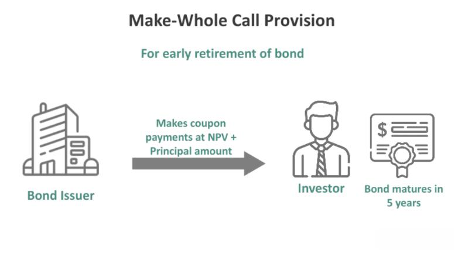

In the ever-evolving world of finance, investors are constantly seeking innovative strategies to enhance their returns while managing associated risks. The global financial landscape presents numerous opportunities and challenges, prompting the need for sophisticated tools and methodologies to achieve an optimal investment portfolio. This article addresses three distinct yet interlinked financial instruments: make-whole call provisions, bond call options, and algorithmic trading, each offering unique advantages for contemporary investment strategies.

Make-whole call provisions represent a specialized feature often embedded in bond agreements, allowing issuers the flexibility to call their bonds prior to maturity by compensating bondholders with the net present value of all future payments. This provision is particularly beneficial during periods of declining interest rates, as it assures investors they will be 'made whole' financially, mitigating the risk of loss due to early redemption.



Complementing the role of make-whole provisions, bond call options provide issuers with strategic flexibility by permitting them to repurchase bonds before maturity at predefined price points. These options serve as a valuable hedging tool for investors, offering protection against uncertainties such as fluctuating interest rates.

Algorithmic trading, often referred to as algo trading, utilizes complex algorithms to automate trading processes, facilitating high-frequency and efficient transactions. By minimizing human errors and exploiting market inefficiencies, algo trading enhances portfolio performance. Strategies such as trend following, arbitrage, and mean reversion can be employed within the framework of algorithmic trading to capitalize on varied market conditions.

Together, these financial tools form a robust framework for constructing resilient investment portfolios. By integrating make-whole call provisions, bond call options, and algorithmic trading into their investment strategies, investors can not only optimize returns but also effectively manage risks associated with rapidly changing financial markets.

## Table of Contents

## Understanding Make-Whole Call Provisions

A make-whole call provision is a specific feature embedded in bond contracts, providing issuers with the flexibility to redeem, or "call," their bonds prior to maturity. This option is not exercised arbitrarily; instead, it comes with a compensation mechanism designed to safeguard the interests of bondholders. The issuer who opts to call the bond must pay the present value of the remaining payments—both principal and interest—to the bondholders. This calculation typically incorporates a premium over the bond's current price, ensuring that investors are 'made whole.'

Mathematically, the compensation paid under a make-whole call provision is calculated as follows:

$$
PV = \sum_{t=1}^{T} \frac{C}{(1 + r)^t} + \frac{M}{(1 + r)^T}
$$

where:
- $PV$ is the present value (the amount compensated to the investor).
- $C$ is the annual coupon payment.
- $M$ is the maturity value of the bond (face value).
- $r$ is the discount rate, which includes a spread over a benchmark yield, usually a Treasury rate.
- $T$ is the time to maturity in years.

This structure of compensation makes make-whole call provisions particularly attractive during periods of declining interest rates. When rates fall, the issuer can call the bond, refinance its debt at lower rates, and yet ensure investors are adequately compensated for the early redemption.

Compared to traditional call options, make-whole call provisions offer distinct advantages. Traditional call options allow issuers to redeem bonds typically at a specified price that may not reflect the time value and reinvestment risks faced by the bondholder. As such, traditional call options can be less favorable for bondholders during instances of premature calls, often leading to potential reinvestment at lower prevailing interest rates without adequate compensation.

The primary limitation of make-whole call provisions lies in the higher cost to the issuer compared to standard call options. By ensuring compensation is reflective of the net present value of future cash flows, the make-whole provision can impose a significant premium, potentially making early redemption economically less attractive during modest rate fluctuations.

Nevertheless, for investors, make-whole call provisions add a layer of protection against [interest rate](/wiki/interest-rate-trading-strategies) risk and premature redemption, enhancing the stability and predictability of returns. This nuanced control mechanism within bonds remains a vital aspect for both risk-conscious investors and issuers striving for tactical refinancing strategies.

## Bond Call Options: A Key Player in Portfolio Strategy

Bond call options give issuers the flexibility to redeem bonds earlier than their maturity dates, at predetermined price points. This feature allows issuers to manage their debt more effectively, especially when interest rates are variable. By exercising bond call options, issuers can refinance debt at lower interest rates, ensuring cost savings on interest expenses. This capability is particularly valuable in declining interest rate environments, where refinancing at lower rates can lead to significant financial benefits.

For investors, bond call options act as a hedging mechanism against rising interest rates and other market uncertainties. Rising interest rates usually result in declining bond prices. However, if an investor holds a call option, they can mitigate some of this risk by being prepared for bonds to be called away when rates increase, thereby limiting potential losses from the falling bond valuations. This hedging capability adds a layer of protection to an investment portfolio.

When compared to make-whole call provisions, bond call options present different financial implications and strategic uses. Make-whole call provisions ensure that bondholders are compensated with the net present value of future payments if a bond is called before its maturity. This compensation protects investors from the potential loss of income due to early redemption, offering them financial security in interest rate fluctuations. However, the issuer has to weigh this against the potential savings from refinancing at a lower rate.

By contrast, standard bond call options typically do not offer a detailed compensation structure like make-whole call provisions. Instead, they rely on the call price, which might be above the bond's current market value but can be below the total interest income that would have been received. Thus, choosing between bond call options and make-whole call provisions often depends on the issuer's refinancing strategy and the investor's risk tolerance.

Both instruments have unique benefits and drawbacks. While make-whole call provisions provide more certainty to investors, bond call options offer greater flexibility to issuers. In practice, the choice between them is influenced by the prevailing market conditions, anticipated interest rate movements, and the strategic goals of both issuers and investors.

## Leveraging Algo Trading in Financial Markets

Algorithmic trading, often referred to as algo trading, utilizes sophisticated algorithms to automate the trading process. This automation facilitates swift and efficient transactions, essential in financial markets characterized by high volumes and rapid price movements.

### Application in Options and Bonds Trading

Algo trading in options and bonds is increasingly popular due to its ability to enhance portfolio performance. By reducing human error and exploiting market inefficiencies, this approach can yield significant advantages. In options trading, algorithms can quickly evaluate vast amounts of data to identify opportunities, such as discrepancies between option and underlying asset prices. In bond markets, algo trading can help manage large transactions efficiently, ensuring better execution prices and [liquidity](/wiki/liquidity-risk-premium) management.

### Key Algo Trading Strategies

Several algorithmic strategies are particularly pertinent in modern financial markets:

1. **Trend Following**: This strategy relies on algorithms to detect and exploit market trends. By analyzing historical data, algorithms can predict and follow emerging trends, allowing traders to capitalize on market movements. Trend-following algorithms might use indicators like moving averages to generate buy or sell signals based on the direction of the market.

   Example of a simple moving average crossover strategy in Python:

   ```python
   import pandas as pd

   def moving_average_crossover(data, short_window=40, long_window=100):
       signals = pd.DataFrame(index=data.index)
       signals['price'] = data['price']
       signals['short_mavg'] = data['price'].rolling(window=short_window, min_periods=1).mean()
       signals['long_mavg'] = data['price'].rolling(window=long_window, min_periods=1).mean()
       signals['signal'] = 0.0
       signals['signal'][short_window:] = np.where(signals['short_mavg'][short_window:] > signals['long_mavg'][short_window:], 1.0, 0.0)
       signals['positions'] = signals['signal'].diff()
       return signals
   ```

2. **Arbitrage**: This strategy exploits price differences between markets or instruments. Algorithms can rapidly identify arbitrage opportunities across different exchanges or related instruments, executing trades to exploit price discrepancies. Arbitrage requires high-speed execution and precision, areas where algorithms excel.

3. **Mean Reversion**: This strategy is based on the assumption that prices will revert to their historical averages over time. Algorithms watch for price extremes and execute trades anticipating a return to a mean level. This approach can be particularly effective in markets with a strong tendency to oscillate around a mean, such as commodities or particular currency pairs.

### Challenges and Opportunities

While algo trading offers substantial benefits, it also comes with challenges. Developing and maintaining effective algorithms requires significant expertise and resources. Additionally, regulatory concerns, such as ensuring fair market practices and preventing market manipulation, are critical to consider. 

Nonetheless, the integration of algorithmic strategies is crucial as financial markets become more complex and advanced. Taking advantage of these technologies can lead to improved execution, risk management, and ultimately, enhanced portfolio returns. As algo trading continues to evolve, staying informed and adapting strategies accordingly is vital for investors seeking to capitalize on this powerful tool.

## Integrating Make-Whole Call Provisions, Bond Call Options, and Algo Trading

The integration of make-whole call provisions, bond call options, and [algorithmic trading](/wiki/algorithmic-trading) can significantly enhance both investment returns and risk management strategies. Make-whole call provisions, which compensate bondholders for early redemption, offer a safety net for issuers aiming to exploit favorable interest rate environments. Simultaneously, bond call options provide issuers the flexibility to refinance at lower rates, thereby optimizing debt structures. When these provisions are strategically coupled with algorithmic trading methods, the potential for optimizing investment outcomes is further amplified.

Algorithmic trading (algo trading) leverages sophisticated algorithms to automate the execution of trading orders based on pre-defined criteria. This automation facilitates rapid decision-making and transaction execution, thus capturing short-term market inefficiencies that human investors might miss. Various algo trading strategies, such as [trend following](/wiki/trend-following), [arbitrage](/wiki/arbitrage), and mean reversion, can be integrated with bond-related strategies to improve portfolio performance.

### Case Study and Simulation Analysis

Consider a theoretical portfolio manager aiming to maximize returns while mitigating risks associated with interest rate fluctuations. By simulating a portfolio containing a mixture of callable bonds with make-whole provisions, the manager can use algorithmic trading to adjust positions in real time, based on interest rate predictions and other market signals.

Python, widely used for financial simulations, can model the combined effect of these instruments within a portfolio. Here's a basic example of a simulation to demonstrate this integration:

```python
import numpy as np

# Parameters for simulation
np.random.seed(42)  # For reproducibility
total_days = 252  # Trading days in a year
initial_interest_rate = 0.03  # Initial interest rate
interest_rate_volatility = 0.02  # Interest rate volatility

# Simulate interest rate changes
interest_rate_changes = np.random.normal(0, interest_rate_volatility, total_days)
interest_rates = initial_interest_rate + np.cumsum(interest_rate_changes)

# Algorithmic strategy: adjust bond holdings based on interest rate changes
bond_portfolio_value = 1000000  # Initial portfolio value in USD
bond_sensitivity = -0.1  # Portfolio sensitivity to interest rate changes

# Simulate daily portfolio value changes
portfolio_values = bond_portfolio_value * (1 + bond_sensitivity * interest_rate_changes)

print(f"Final Portfolio Value: ${portfolio_values[-1]:,.2f}")
```

This hypothetical simulation illustrates how an automated system might adjust bond holdings in response to fluctuations in interest rates, with make-whole provisions offering additional stability. By running such simulations, investors can visualize potential scenarios and outcomes, allowing them to craft well-informed strategies.

### Strategic Integration

The strategic integration of these financial tools involves balancing their unique features to create a cohesive strategy. For example, while make-whole call provisions protect against investor loss due to early bond calls, algorithmic trading can be employed to quickly reallocate capital to more profitable investments when interest rates shift. Additionally, bond call options can be utilized in scenarios when expected interest rate movements make refinancing advantageous, thus reducing overall interest expenses.

This holistic approach not only maximizes returns through optimal timing and decision-making but also enhances risk management. Effective integration can mitigate risks related to interest rate [volatility](/wiki/volatility-trading-strategies) and enhance the overall robustness of the investment portfolio. By continuously monitoring and adjusting to market conditions using these integrated strategies, investors can maintain a competitive edge in dynamic financial markets.

## Advantages and Potential Challenges

Utilizing financial strategies such as make-whole call provisions, bond call options, and algorithmic trading offers significant benefits like diversification, risk management, and the potential for enhanced returns. These strategies enable investors to create a well-rounded portfolio that can withstand market fluctuations. The diversification achieved through these financial instruments helps mitigate risks by spreading them across different assets, reducing the impact of adverse movements in any single security. Risk management is further enhanced with tools such as bond call options, which allow investors to hedge against rising interest rates and market volatilities.

However, implementing these sophisticated financial strategies comes with its own set of challenges. New investors might find the complexity and cost associated with these strategies to be significant barriers. The financial landscape can be intricate, and each strategy requires a deep understanding of market dynamics, asset pricing models, and investment analysis. For instance, the calculations involved in make-whole call provisions can be daunting, as they are based on the net present value of future payments which necessitates understanding of present value calculations:

$$
\text{NPV} = \sum \frac{C_t}{(1 + r)^t}
$$

where $C_t$ is the cash flow at time $t$ and $r$ is the discount rate.

Moreover, algorithmic trading requires technical skills, possibly including programming and data analysis, and involves costs related to software and technology infrastructure.

Regulatory requirements and market conditions also play pivotal roles in the execution of these financial strategies. Investors must be aware of the legal frameworks governing securities markets in their jurisdictions. This includes understanding securities laws, compliance requirements, and tax implications which can vary significantly across different regions. Staying informed about market conditions is crucial as these conditions dictate the optimal timing and selection of financial instruments.

In summary, while financial tools such as make-whole call provisions, bond call options, and algo trading present remarkable opportunities, they demand a nuanced understanding and careful implementation, potentially posing challenges to unseasoned investors. Being equipped with the right knowledge and skills, along with a sound understanding of regulatory environments, is essential for leveraging these strategies effectively.

## Conclusion

Investment strategies that incorporate make-whole call provisions, bond call options, and algorithmic trading represent significant tools for sophisticated investors aiming to enhance their portfolio performance. A thorough understanding of these financial instruments enables investors to harness their unique advantages, mitigate potential risks, and construct portfolios that are both adaptable and resilient to market volatility.

Make-whole call provisions offer a safety net for investors, ensuring compensation equivalent to the net present value of future bond payments if the bond is called before maturity. This feature becomes particularly appealing during periods of falling interest rates, where traditional call options might impose financial losses on investors. On the other hand, bond call options provide issuers with redemption flexibility while offering investors opportunities for effective hedging, especially in scenarios of rising interest rates and market unpredictability.

Algorithmic trading, with its capability to perform rapid and precise transactions based on complex mathematical models, minimizes human error, and exploits market inefficiencies. Strategies such as trend following, arbitrage, and mean reversion within algo trading can significantly bolster portfolio performance, responding to market shifts with agility.

Strategically integrating these components can provide investors with a competitive edge as financial markets continue to evolve. An adept investment approach that combines the calculated use of make-whole call provisions and bond call options, supplemented by the precision and speed of algorithmic trading, can yield enhanced returns and robust risk management.

Sophisticated investors benefit from continually augmenting their knowledge of these strategies, thus allowing them to adapt to market changes effectively. As the financial landscape advances, staying informed and strategically applying these powerful tools will prove indispensable in maintaining a competitive advantage and achieving investment objectives.

## References & Further Reading

[1]: ["Fixed Income Analysis"](https://en.wikipedia.org/wiki/Fixed_income_analysis) by Frank J. Fabozzi

[2]: ["Options, Futures, and Other Derivatives"](https://www.amazon.com/Options-Futures-Other-Derivatives-9th/dp/0133456315) by John C. Hull

[3]: Chen, S., & Silvapulle, P. (2008). ["An empirical investigation of stock market behavior in different interest rate environments."](https://psycnet.apa.org/record/2008-00192-022) Journal of International Financial Markets, Institutions, and Money.

[4]: ["Algorithmic Trading and DMA: An Introduction to Direct Access Trading Strategies"](https://www.amazon.com/Algorithmic-Trading-DMA-introduction-strategies/dp/0956399207) by Barry Johnson

[5]: ["Fixed-Income Securities: Tools for Today's Markets"](https://www.wiley.com/en-us/Fixed+Income+Securities%3A+Tools+for+Today%27s+Markets%2C+4th+Edition-p-9781119835554) by Bruce Tuckman and Angel Serrat

[6]: Chlistalla, M. (2011). ["High-Frequency Trading: Better Than Its Reputation?"](https://www.finextra.com/finextra-downloads/featuredocs/prod0000000000269468.pdf) Deutsche Bank Research.