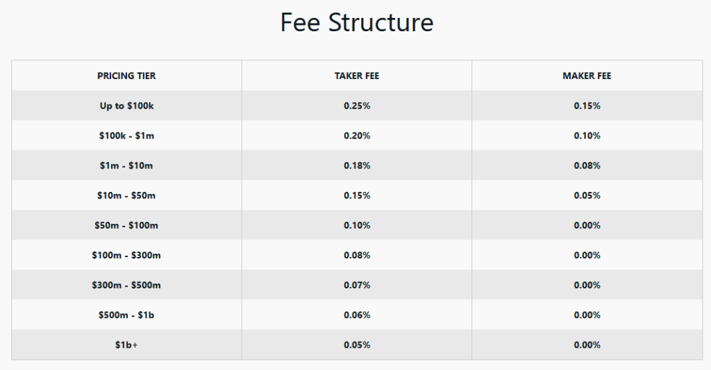

## Table of Contents

## What is the Maker-Taker Fee Model?

The Maker-Taker Fee Model is a system used by stock exchanges to encourage trading activity. In this model, there are two types of traders: makers and takers. Makers are traders who place orders that add liquidity to the market, meaning they offer to buy or sell a stock at a specific price but do not immediately complete the trade. Takers, on the other hand, are traders who take the liquidity by accepting the offers made by makers, thus completing the trade immediately.

Exchanges charge different fees to makers and takers to influence their behavior. Makers usually receive a small rebate or pay a lower fee because they help build up the order book, making the market more liquid and attractive to other traders. Takers, who remove liquidity from the market by completing trades, typically pay a higher fee. This model aims to balance the market by encouraging more people to place orders and keep the market active and liquid.

## How does the Maker-Taker Fee Model work in trading?

In trading, the Maker-Taker Fee Model is used by stock exchanges to make the market more active. This model separates traders into two groups: makers and takers. Makers are people who put orders into the market that don't get filled right away. They offer to buy or sell a stock at a certain price, but they wait for someone else to accept their offer. Because makers help to make the market more liquid, which means there are more orders to choose from, they usually get a small reward or pay less in fees.

Takers are the opposite of makers. They are the ones who see an order from a maker and decide to take it, which means they complete the trade right away. Takers take away the [liquidity](/wiki/liquidity-risk-premium) that makers added to the market. Because of this, takers usually have to pay a higher fee. The goal of the Maker-Taker Fee Model is to encourage more people to be makers, which helps keep the market active and full of orders for others to trade with.

## What are the benefits of being a 'maker' in this model?

Being a 'maker' in the Maker-Taker Fee Model has several advantages. Makers are traders who place orders that do not get filled right away. They add to the market's liquidity, which means they help make the market more active and full of orders. Because of this, makers often get a small reward or pay less in fees. This can save them money over time, especially if they trade a lot.

The other benefit for makers is that they help make the market better for everyone. When more people are makers, there are more orders to choose from, which can make trading easier and faster for other traders. This can lead to a healthier and more active market, where everyone has a better chance to find good deals. By being a maker, traders play an important role in keeping the market lively and efficient.

## What are the advantages of being a 'taker' in this model?

Being a 'taker' in the Maker-Taker Fee Model means you get to complete your trades quickly. Takers are the ones who see an order from a maker and decide to take it right away. This can be really helpful if you need to buy or sell something fast. For example, if you see a good price for a stock and want to buy it before the price changes, being a taker lets you do that without waiting.

Even though takers have to pay a higher fee, the advantage of getting your trade done right away can be worth it. Sometimes, the speed and certainty of getting the trade done can be more important than the cost. So, if you value speed and want to make sure you can buy or sell at the price you see, being a taker can be a good choice for you.

## How do exchanges implement the Maker-Taker Fee Model?

Exchanges use the Maker-Taker Fee Model to make trading easier and more active. They do this by charging different fees to two types of traders: makers and takers. Makers are people who put orders into the market that don't get filled right away. They offer to buy or sell something at a certain price but wait for someone else to accept their offer. Because makers help make the market more active by adding more orders, exchanges usually give them a small reward or charge them less in fees. This encourages more people to be makers and keep the market full of orders.

Takers, on the other hand, are the ones who see an order from a maker and decide to take it right away. They complete the trade immediately, which means they take away the liquidity that makers added to the market. Because of this, takers have to pay a higher fee. The idea is to balance the market by making it more attractive for people to be makers, while still allowing takers to quickly complete their trades if they are willing to pay a bit more. This way, the exchange can keep the market active and full of orders, making it easier for everyone to trade.

## What impact does the Maker-Taker Fee Model have on market liquidity?

The Maker-Taker Fee Model helps make the market more liquid. Liquidity means there are a lot of orders to buy and sell things. Makers put orders into the market that don't get filled right away. They add more orders for others to see, which makes it easier for everyone to trade. Because makers get a small reward or pay less in fees, more people want to be makers. This means there are more orders in the market, and that's good for liquidity.

Takers, on the other hand, take away some of the liquidity by completing trades right away. They see an order from a maker and decide to take it. Even though takers pay a higher fee, they help keep the market moving. The balance between makers and takers makes sure there are always enough orders in the market. This balance helps keep the market active and full of orders, which is important for good liquidity.

## Can you explain the differences between Maker-Taker and Taker-Maker models?

The Maker-Taker and Taker-Maker models are two ways exchanges can set fees for traders. In the Maker-Taker model, makers are traders who place orders that don't get filled right away. They help make the market more active by adding more orders for others to see. Makers usually get a small reward or pay less in fees to encourage them to keep adding orders. Takers, on the other hand, are traders who see an order from a maker and decide to take it right away. They complete the trade immediately and pay a higher fee because they take away the orders that makers added to the market.

The Taker-Maker model is the opposite. In this model, takers are the ones who get a small reward or pay less in fees. Takers help move the market by completing trades quickly. Makers, in the Taker-Maker model, pay a higher fee because they add orders that don't get filled right away. This model aims to encourage more trading by rewarding takers, which can help the market stay active in a different way than the Maker-Taker model. Both models try to balance the market, but they do it by focusing on different types of traders.

## How do the fees in the Maker-Taker model affect trading strategies?

The fees in the Maker-Taker model can change how traders decide to buy and sell things. If you are a maker, you get a small reward or pay less in fees. This means you might want to put more orders into the market that don't get filled right away. You can wait for a good price and save money on fees. Traders who like to take their time and look for the best deals might choose to be makers because they can save money and help make the market more active.

On the other hand, if you are a taker, you have to pay a higher fee. But you get to complete your trades right away. This can be good if you need to buy or sell something quickly. Traders who need to act fast might be okay with paying more because they can get the price they want without waiting. The higher fees for takers can make them think twice before taking an order, but the speed can be worth it if they need to make a quick decision.

## What are some criticisms of the Maker-Taker Fee Model?

Some people don't like the Maker-Taker Fee Model because they think it can make the market less fair. They say that the model can make some traders act in ways that are good for them but not good for the market. For example, traders might try to be makers a lot to get the small rewards or lower fees. This can lead to a lot of orders that don't really help the market, but just help the traders save money. Also, the higher fees for takers can make them think twice before taking an order, which might slow down trading and make it harder for people to buy and sell things quickly.

Another criticism is that the Maker-Taker Fee Model can be hard to understand for people who are new to trading. The different fees for makers and takers can make the market seem confusing and complicated. This might stop some people from wanting to trade because they don't understand how the fees work. Also, some people think that the model can make it easier for big traders to make more money, while smaller traders might not get the same benefits. This can make the market seem unfair and might make some people not want to trade as much.

## How has the Maker-Taker Fee Model evolved over time?

The Maker-Taker Fee Model started being used by exchanges to make trading more active. At first, it was a simple idea: give a small reward or lower fees to traders who add orders to the market (makers), and charge more to those who take those orders (takers). This was meant to encourage more people to put orders into the market, making it easier for everyone to trade. Over time, exchanges saw that this model could help them make more money, so they started to change and fine-tune it to fit their needs.

As time went on, the Maker-Taker Fee Model got more complex. Exchanges began to offer different fee structures for different types of traders or for different types of orders. They also started to use the model to attract more traders to their platform by offering competitive fee rates. This evolution has made the model more effective at keeping the market active, but it has also made it harder for new traders to understand. Despite these changes, the basic idea of rewarding makers and charging more to takers has stayed the same, showing that the model still works well for keeping the market liquid and active.

## What are the regulatory concerns surrounding the Maker-Taker Fee Model?

Some regulators worry that the Maker-Taker Fee Model might not be fair for everyone. They think it could make some traders act in ways that are good for them but not good for the market. For example, traders might try to be makers a lot just to get the small rewards or lower fees. This can lead to a lot of orders that don't really help the market, but just help the traders save money. Also, the higher fees for takers can make them think twice before taking an order, which might slow down trading and make it harder for people to buy and sell things quickly.

Another concern is that the Maker-Taker Fee Model can be hard to understand for people who are new to trading. The different fees for makers and takers can make the market seem confusing and complicated. This might stop some people from wanting to trade because they don't understand how the fees work. Regulators want to make sure that the market is fair and easy to understand for everyone, so they keep a close eye on how exchanges use the Maker-Taker Fee Model to make sure it's not hurting the market or making it harder for people to trade.

## How do different financial markets around the world adapt the Maker-Taker Fee Model?

Different financial markets around the world have their own ways of using the Maker-Taker Fee Model. In the United States, stock exchanges like the New York Stock Exchange and NASDAQ use the model to make trading more active. They give small rewards or lower fees to makers who add orders to the market, and charge higher fees to takers who take those orders. This helps keep the market full of orders and makes it easier for everyone to trade. Some U.S. exchanges also offer different fee structures for different types of traders or orders, making the model more complex but also more effective at keeping the market active.

In Europe, the Maker-Taker Fee Model is also used, but it can be different from one exchange to another. For example, the London Stock Exchange uses the model to encourage more trading, but they might adjust the fees based on the type of security being traded or the size of the order. In Asia, exchanges like the Hong Kong Stock Exchange and the Tokyo Stock Exchange have their own versions of the model. They might focus more on attracting big traders or on making the market easier for new traders to understand. Overall, while the basic idea of rewarding makers and charging more to takers stays the same, each market adapts the model to fit their own needs and goals.

## References & Further Reading

[1]: Angel, J. J., Harris, L. E., & Spatt, C. S. (2010). ["Equity Trading in the 21st Century."](https://papers.ssrn.com/sol3/papers.cfm?abstract_id=1584026) The Journal of Finance, 55(2), 577-616.

[2]: Hendershott, T., Jones, C. M., & Menkveld, A. J. (2011). ["Does Algorithmic Trading Improve Liquidity?"](https://onlinelibrary.wiley.com/doi/full/10.1111/j.1540-6261.2010.01624.x) The Review of Financial Studies, 24(5), 1594-1624.

[3]: Battalio, R., Hatch, B., & Jennings, R. (2004). ["All Else Equal? A Multidimensional Analysis of Retail, Market Order Execution Quality"](https://www.sciencedirect.com/science/article/abs/pii/S1386418102000435) The Financial Review, 39(2), 141-171.

[4]: [Options, Futures, and Other Derivatives](https://www.amazon.com/Options-Futures-Other-Derivatives-Global/dp/1292410655) by John C. Hull

[5]: Hasbrouck, J. & Saar, G. (2013). ["Low-latency trading."](https://www.sciencedirect.com/science/article/abs/pii/S1386418113000165) The Review of Financial Studies, 26(9), 2955-2995.

[6]: Securities and Exchange Commission (SEC). (2018). ["Transaction Fee Pilot for NMS Stocks"](https://www.sec.gov/rules-regulations/2018/12/transaction-fee-pilot-nms-stocks). U.S. Securities and Exchange Commission.