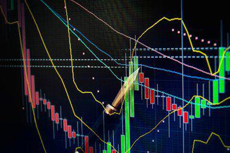

The Malawian Kwacha (MWK) serves as the official currency of Malawi, having been introduced in 1971 to replace the Malawian pound. This transition marked a significant move toward economic autonomy following the nation's independence. As the cornerstone of Malawi's monetary identity, the Kwacha is crucial to understanding the country's broader economic architecture, including its exchange rate behaviors, trade relations, and monetary policies.

In its initial years, the Malawian Kwacha was pegged to the US dollar, which provided a degree of stability in international trade. However, numerous economic challenges, including recurrent devaluations, led to a shift from a fixed exchange rate system to a floating regime in 2012. This change was part of comprehensive economic reforms aimed at enhancing the country's financial resilience and aligning its currency value closer to market realities.

The article will explore various dimensions of the Malawian Kwacha, including its historical significance and economic impacts over the decades. Central to this exploration will be the currency's behavior within the foreign exchange (forex) markets and the broader implications for Malawi's economic health. With agriculture being the backbone of Malawi's economy, fluctuations in the Kwacha are often reflected through climatic conditions and international commodity prices. Consequently, the currency's stability is frequently challenged by inflation, poverty, and external debt burdens.

In recent years, algorithmic trading has emerged as a transformative force in global financial markets. Its potential introduction to Malawi could reshape the local forex landscape, offering potential benefits in terms of liquidity and market efficiency. However, the practical implementation of algorithmic trading in Malawi poses challenges, predominantly around the need for technological infrastructure and appropriate regulatory frameworks.

Through this analysis, the article aims to provide a comprehensive overview of the Malawian Kwacha, highlighting the factors influencing its performance and exploring future prospects. It will consider the impacts of regional and global economic dynamics and discuss how policy reforms and innovative financial technologies can contribute to the currency's stability and the broader economic success of Malawi.

## Table of Contents

## Historical Overview of the Malawian Kwacha

The Malawian Kwacha (MWK) was introduced in 1971, symbolizing Malawi's stride towards national autonomy following independence. This move aligned with the broader post-colonial trend among African nations to establish distinct currencies, strengthening economic independence and identity. The transition from the Malawian pound was not merely symbolic but critically tied to the nation's fiscal policies and developmental aspirations.

Initially, the Kwacha was pegged to the US dollar, a strategy designed to instill confidence among investors and stabilize the nascent currency. This linkage, however, exposed the Kwacha to fluctuations in the US economy and was unsustainable in the face of changing economic dynamics. Over time, several devaluations ensued as the country's economic conditions and external pressures necessitated adjustments to maintain fiscal stability. For example, significant devaluations occurred in the 1980s and 1990s in response to severe economic challenges, including droughts and unfavorable terms of trade.

In 2012, Malawi made a pivotal shift from a pegging system to a floating exchange rate regime. This transformation was part of comprehensive economic reforms intended to enhance the country's fiscal robustness. Floating the currency allowed market forces to determine the exchange rate, reflecting the genuine economic realities of Malawi. The reform aligned with recommendations by international financial institutions and was seen as crucial for accessing international financial assistance and boosting investor confidence.

Historical events such as political changes, economic reforms, and external economic shocks have continually influenced the Kwacha's value and stability. For instance, periods of political instability often resulted in reduced investor confidence, adversely affecting the currency. Conversely, successful implementation of economic policies and stabilization initiatives have occasionally bolstered the Kwacha's standing.

## Economic Landscape and Impacts on the Malawian Kwacha

Malawi's economy is predominantly reliant on agriculture, a sector that employs over 80% of the population and contributes significantly to the country's GDP. This reliance on agriculture introduces vulnerabilities, as the economy is susceptible to climatic changes and [volatility](/wiki/volatility-trading-strategies) in commodity prices. The agricultural sector's performance significantly impacts the Malawian Kwacha (MWK), given its substantial role in the export market. Fluctuations in the prices of key commodities like tobacco, tea, and sugar can directly influence foreign exchange earnings, thereby affecting the currency's value.

Inflation poses a persistent challenge to the stability of the Malawian Kwacha. Historical data indicates that inflation rates in Malawi have been erratic, often influenced by factors such as food prices, fuel costs, and exchange rate movements. For example, periods of drought or flood can severely affect food production, leading to food shortages and increased prices. The Consumer Price Index (CPI) often reflects these changes, and in turn, affects the purchasing power of the MWK.

Poverty remains an endemic challenge, with a significant portion of the population living below the poverty line. The interplay between poverty and currency stability is complex; a weakened currency can exacerbate poverty by inflating the cost of imports, thereby affecting the affordability of essential goods and services. Moreover, external debts further strain the economy. Malawi's debt obligations require careful management, as repayments in foreign currencies put pressure on the nation's foreign reserves, influencing the stability of the MWK.

The involvement of international institutions, particularly the International Monetary Fund (IMF), plays a crucial role in Malawi's economic restructuring efforts. The IMF has been involved in multiple programs aimed at stabilizing the economy, including structural adjustment programs and other interventions designed to address fiscal imbalances. These programs often include recommendations or requirements for monetary and fiscal policy reforms. Such measures, when effectively implemented, can enhance the credibility of the Malawian government and contribute to a more stable economic environment, which is vital for maintaining currency stability.

Assistance from international bodies often comes with policy directives that attempt to stabilize the economy by promoting fiscal discipline, improving governance, and ensuring transparent and accountable resource management. These interventions, while sometimes controversial, aim to create a resilient economic landscape that can better withstand external shocks and internal pressures.

In summary, the Malawian Kwacha's stability is intricately linked to the nation's agricultural dependency, vulnerability to inflation, socio-economic conditions like poverty, and the management of external debts. The support and guidance of international organizations such as the IMF are essential in navigating these challenges, providing frameworks for economic reforms and stability.

## Algorithmic Trading and the Malawian Economy

Algorithmic trading involves the use of automated software to execute financial market trades at high speed and [volume](/wiki/volume-trading-strategy) based on complex algorithms. The automation of trading can bring about numerous advantages, particularly for emerging economies like Malawi. One significant benefit is the potential for increased market efficiency. Algorithmic trading systems can analyze large data sets quickly, enabling the execution of trades at optimal prices and contributing to more accurate price discovery. This can lead to narrowing bid-ask spreads, thereby improving overall market [liquidity](/wiki/liquidity-risk-premium).

Enhanced liquidity can attract more participants to the financial market, encouraging both foreign and local investments. This is particularly important for Malawi, as increased investment can lead to economic growth and stability. Automated systems can also help in mitigating the impact of human errors and emotional decision-making, which are common in traditional trading environments.

Despite these benefits, the introduction of [algorithmic trading](/wiki/algorithmic-trading) in Malawi faces a range of challenges. One primary obstacle is the need for robust technological infrastructure. High-frequency trading requires advanced computational power and high-speed internet connectivity, which may not be readily available across all regions in Malawi. Implementing such infrastructure would necessitate substantial investment, possibly from both the public and private sectors.

Another challenge lies in regulation. The introduction of algorithmic trading demands a comprehensive regulatory framework to monitor and manage its activities, ensuring fair and transparent trading practices. This includes setting guidelines for the development and use of trading algorithms, preventing market manipulation, and protecting investors. It would also require training and recruiting skilled professionals to oversee and enforce these regulations.

Moreover, algorithmic trading could expose the Malawian market to new risks, including potential market manipulation and systemic risks from trading algorithms malfunctioning. Developing a regulatory framework that balances innovation with investor protection and market integrity will be crucial.

In summary, while the adoption of algorithmic trading in Malawi holds promise for enhancing market efficiency and liquidity, it necessitates significant advancements in technological infrastructure and regulatory provisions. Addressing these challenges will be key to leveraging algorithmic trading's full potential for the Malawian economy.

## Factors Affecting the Malawian Kwacha's Forex Performance

Political stability and government policies are significant factors influencing the Malawian Kwacha (MWK)'s performance in the foreign exchange ([forex](/wiki/forex-system)) market. Political unrest or uncertainty can lead to a lack of investor confidence, causing depreciation of the currency. Government policies, including fiscal and monetary policies, directly affect inflation rates and interest rates which in turn impact the currency's value. For instance, expansionary monetary policies might lead to inflation, diminishing the currency's purchasing power.

Global market dynamics, notably oil prices, play a crucial role in the performance of the Malawian Kwacha. Malawi, being a landlocked country, relies heavily on fuel imports, making it susceptible to global oil price fluctuations. An increase in oil prices can exacerbate the trade deficit, increasing pressure on the MWK. Oil price shocks can lead to increased import costs, subsequently affecting the country's balance of payments by increasing expenditures relative to income. This often triggers depreciation of the MWK as the demand for foreign currency increases to settle these accounts.

The evolution of exchange rate policies has also significantly impacted how the MWK trades on the international stage. Originally pegged to the US dollar, Malawi shifted to a floating exchange rate system in 2012. This change allowed the currency to respond more dynamically to market conditions, enhancing its ability to absorb external shocks. However, the flexibility of the floating regime can lead to increased volatility, as the currency is more directly exposed to changes in supply and demand dynamics.

In summary, the forex performance of the Malawian Kwacha is the result of a complex interplay between domestic political actions and international economic conditions. Prudent management of these aspects can aid in maintaining currency stability and fostering economic resilience.

## Comparative Analysis with Other African Currencies

The Malawian Kwacha (MWK) stands in stark contrast to more stable and diversified African currencies like the South African Rand (ZAR). The economic positions and currency values of these countries have long been influenced by their structural economic characteristics. The South African Rand, serving the most industrialized economy on the continent, exhibits relative stability attributable to its diversified sectors, which include mining, manufacturing, and services. Such diversification buffers the currency against external shocks and promotes resilience, enabling South Africa to maintain a stable exchange rate environment.

In contrast, the Malawian Kwacha has experienced significant volatility over the years. Malawi's economy is predominantly agricultural, with tobacco being the principal export. This reliance on a single commodity sector exposes the country to global price fluctuations and adverse climatic conditions, leading to instability in the currency's value. The result is periodic devaluations and inflationary pressures that challenge economic planning and growth.

The dynamics of regional currencies suggest valuable lessons for managing monetary stability. Neighboring countries with successful currency management offer case studies in diversification and policy discipline. For example, Botswana's Pula has been managed through prudent fiscal policies and strategic foreign reserve management, contributing to its stability. Botswana's approach underscores the importance of building foreign reserves and investing in non-commodity sectors to mitigate currency risk.

Malawi could benefit from adopting similar strategies, emphasizing the need for economic diversification by investing in industries beyond agriculture. The country's policy directions could be reoriented to enhance export diversification, build internal markets, and foster technological innovation, all of which could contribute to a more resilient currency.

Moreover, ensuring political stability and instituting robust regulatory frameworks could enhance investor confidence and attract foreign direct investment (FDI), further stabilizing the MWK. The experiences of more stable economies highlight the critical interplay between sound governance, diversified economic activities, and currency stability, offering a roadmap for Malawi to achieve greater financial resilience.

## Recent Trends and Future Prospects

The COVID-19 pandemic significantly influenced the volatility of the Malawian Kwacha (MWK) and tested the economic resilience of Malawi. The pandemic's onset led to disruptions in global supply chains and a downturn in local economic activities, causing fluctuations in the currency's value. Travel and transport restrictions impacted trade, a vital component of Malawi's economy, thus affecting the MWK's forex performance. The closure of businesses and decline in agricultural production further stressed the economy, given its reliance on agriculture. 

Amid these challenges, avenues for economic recovery and improving forex standings are emerging. The adoption of financial technology (fintech) innovations presents a viable path forward. Fintech solutions can streamline transactions, enhance financial inclusion, and provide new channels for trade. By leveraging digital financial services, Malawi can improve the efficiency of its financial system, reduce transaction costs, and potentially stabilize the MWK. Mobile banking and digital payment platforms are particularly promising in increasing the accessibility of financial services to underserved populations, further stimulating economic activity.

Policy reforms and international trade partnerships are instrumental in shaping the future economic health of Malawi. To enhance currency stability and economic growth, the government may implement structural reforms aimed at diversifying the economy beyond agriculture. Such diversification could reduce the vulnerability of the MWK to commodity price shocks and climatic fluctuations. Strengthening regulatory frameworks and investing in technological infrastructure will support these initiatives by building a more resilient financial sector.

Furthermore, Malawi could benefit from establishing and nurturing trade partnerships, particularly within the African Continental Free Trade Area (AfCFTA). Increased regional trade could mitigate the effects of global economic shifts and contribute to a more stable foreign exchange market for the MWK. Participation in international markets will not only expose Malawi to broader economic opportunities but also provide a buffer against external economic shocks.

In conclusion, while the pandemic posed significant challenges, it also served as a catalyst for change, highlighting the need for innovation and reform. By embracing technological advancements in fintech, enacting supportive policy measures, and fostering international trade relations, Malawi can enhance its economic resilience and secure a more stable future for the Malawian Kwacha.

## Conclusion

The Malawian Kwacha remains a fundamental aspect of Malawi's economic framework, reflecting the nation's financial identity and economic trajectory. The currency's responsiveness to both domestic policy and international economic trends underscores its dynamic nature. Continued economic reforms can significantly fortify the currency's stability, offering a buffer against global economic uncertainties and domestic challenges such as inflation and external debt pressures. 

Strategic decision-making in economic policy is crucial for maintaining the Kwacha's strength. This includes prudent fiscal policies, effective monetary measures, and robust regulatory frameworks that can adapt to evolving economic conditions. Additionally, implementing structural reforms that address core economic vulnerabilities, like enhancing agricultural productivity and managing external debts, is vital for sustaining long-term economic stability.

Investment in technology represents another critical avenue for bolstering the economic prospects of the Malawian Kwacha. Advances in financial technology, particularly in the realms of digital banking and payment systems, can enhance financial inclusion and stimulate economic activities. By modernizing financial infrastructure, Malawi can facilitate more efficient transactions, attract foreign investment, and improve its forex market operations.

Economic diversification, meanwhile, provides a pathway to mitigate risks associated with over-reliance on agriculture. By fostering growth in other sectors such as manufacturing, tourism, and services, Malawi can achieve a more balanced and resilient economic profile. This diversification will not only stabilize the Kwacha by broadening revenue sources but also create employment opportunities and stimulate overall economic growth.

In conclusion, strategic reforms, technological investments, and economic diversification are integral to the future success of the Malawian Kwacha and the broader Malawian economy. Through these efforts, Malawi can strengthen its financial infrastructure, improve the resilience of its currency, and ensure sustainable economic development in the years ahead.

## References & Further Reading

[1]: International Monetary Fund (2012). ["Malawi: Third and Fourth Reviews Under the Extended Credit Facility Arrangement."](https://www.imf.org/-/media/Files/DSA/external/pubs/ft/dsa/pdf/2014/dsacr1437.ashx) IMF Country Report No. 12/221.

[2]: ["Advances in Financial Machine Learning"](https://www.amazon.com/Advances-Financial-Machine-Learning-Marcos/dp/1119482089) by Marcos Lopez de Prado

[3]: De Grauwe, P. and Grimaldi, M. (2006). ["The Exchange Rate in a Behavioral Finance Framework."](https://www.degruyter.com/document/doi/10.1515/9780691186993/html) MIT Press.

[4]: Cheeseman, N. and Ford, R. (2007). ["The Impact of Economic Sanctions on Targeted States: A Theory and Empirical Evidence."](https://onlinelibrary.wiley.com/doi/full/10.1111/roie.12724) International Organization.

[5]: ["Quantitative Trading: How to Build Your Own Algorithmic Trading Business"](https://www.amazon.com/Quantitative-Trading-Build-Algorithmic-Business/dp/1119800064) by Ernest P. Chan