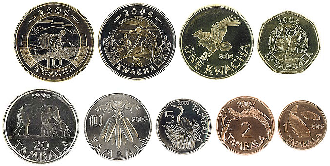

## Table of Contents

## What is the Malawian Kwacha?

The Malawian Kwacha is the official currency of Malawi, a country in southeastern Africa. It is used every day by people in Malawi to buy things like food, clothes, and other goods. The Kwacha is divided into smaller units called tambala. One Kwacha is equal to 100 tambala. The symbol for the Kwacha is "MK" and it is also sometimes written as "K".

The Kwacha was first introduced in 1971, replacing the Malawian pound. Over the years, the value of the Kwacha has changed because of things like the economy and politics. The Reserve Bank of Malawi is in charge of the Kwacha and makes sure it works well for the country. People can exchange Kwacha for other currencies if they need to travel or do business with other countries.

## When was the Malawian Kwacha first introduced?

The Malawian Kwacha was first introduced in 1971. Before that, people in Malawi used the Malawian pound. The Kwacha was a new start for the country's money, and it was meant to help the economy grow.

The Kwacha is divided into 100 tambala. When it was introduced, it replaced the old Malawian pound at a rate of 2 Kwacha to 1 pound. This change helped make money easier to use and understand for everyone in Malawi.

## What is the symbol and currency code for the Malawian Kwacha?

The symbol for the Malawian Kwacha is "MK". Sometimes, people also use just "K" to show the Kwacha. This symbol helps people know they are talking about Malawian money.

The currency code for the Malawian Kwacha is "MWK". This code is used when people need to write about the Kwacha in a short way, like in banks or on computers. It helps to keep things clear and easy to understand when talking about money from different countries.

## How has the value of the Malawian Kwacha changed over time?

Since it was first introduced in 1971, the value of the Malawian Kwacha has gone up and down a lot. At the start, the Kwacha was quite strong and helped Malawi's economy grow. But over the years, things like bad weather, changes in the world's economy, and problems inside Malawi made the Kwacha weaker. This means that the Kwacha could buy less stuff from other countries. For example, in the 1990s, the Kwacha lost a lot of its value because of economic troubles and changes in the government.

In more recent years, the Kwacha has had ups and downs. Sometimes, the government made changes to help the Kwacha, like making it easier to trade with other countries or getting help from big groups like the World Bank. But other times, the Kwacha got weaker because of problems like not having enough food to sell or prices going up a lot. Today, the value of the Kwacha can change a lot from one day to the next, and people in Malawi have to keep an eye on it to know how much their money is worth.

## What are the denominations of the Malawian Kwacha in circulation?

The Malawian Kwacha comes in different amounts of money, called denominations. For coins, you can find 1 tambala, 5 tambala, 10 tambala, 20 tambala, 50 tambala, and 1 Kwacha. These coins help people buy small things, like a piece of candy or a bus ticket.

For banknotes, the Kwacha has bigger amounts. You can get 20 Kwacha, 50 Kwacha, 100 Kwacha, 200 Kwacha, 500 Kwacha, 1,000 Kwacha, 2,000 Kwacha, and 5,000 Kwacha. These banknotes are used for bigger purchases, like buying groceries or paying for services. All these different amounts make it easier for people in Malawi to use their money every day.

## What major economic events have influenced the Malawian Kwacha?

The value of the Malawian Kwacha has been affected by many big events. One important event was in the early 1990s when Malawi changed from a one-party government to a multi-party system. This change caused a lot of uncertainty and made the Kwacha lose a lot of its value. At the same time, Malawi was hit by droughts and other natural problems that hurt the country's ability to grow and sell food. This made it even harder for the Kwacha to stay strong.

Another big event was in 2012 when Malawi got a big loan from the International Monetary Fund (IMF). This loan was meant to help the country's economy, but it came with rules that made life harder for many people in Malawi. The Kwacha got weaker again because of these changes and other problems, like corruption and not having enough foreign money. In recent years, things like the world's economy changing and Malawi's own struggles with food and jobs have kept the Kwacha's value going up and down.

## How does the Malawian Kwacha compare to other currencies in the region?

The Malawian Kwacha is the money used in Malawi, a country in southeastern Africa. When we compare it to other currencies in the region, like the South African Rand, the Zambian Kwacha, and the Tanzanian Shilling, the Malawian Kwacha is usually weaker. This means that if you have one US dollar, you can get more Malawian Kwacha than you would get South African Rand or Zambian Kwacha. For example, in 2023, one US dollar could buy around 1,000 Malawian Kwacha, while it could buy about 18 South African Rand or 20 Zambian Kwacha.

This difference in value affects how people in Malawi can buy things from other countries. Because the Malawian Kwacha is weaker, it can be harder for Malawi to import goods like machinery or medicine, which can cost a lot of Kwacha. On the other hand, Malawi's exports, like tobacco and tea, can be cheaper for other countries to buy. This can help Malawi earn more foreign money, but it also means that the prices of things inside Malawi can go up if the Kwacha keeps getting weaker compared to its neighbors' currencies.

## What role does the Reserve Bank of Malawi play in managing the Kwacha?

The Reserve Bank of Malawi is like the boss of the Malawian Kwacha. It makes sure the Kwacha works well for everyone in Malawi. One big job the Reserve Bank has is to control how much money is in the country. If there's too much money, prices can go up a lot, which is not good. So, the Reserve Bank tries to keep the right amount of money around. It also decides how much interest people have to pay when they borrow money from banks. If the interest is high, people might borrow less, and if it's low, they might borrow more. This helps the Reserve Bank keep the economy steady.

Another important thing the Reserve Bank does is to help the Kwacha stay strong against other countries' money. It does this by buying and selling foreign money, like US dollars or South African Rand. If the Kwacha is getting too weak, the Reserve Bank might use its foreign money to help it get stronger. The Reserve Bank also watches the economy to see if there are any big problems coming. If it sees something bad, it can try to fix it before it gets worse. This way, the Reserve Bank helps make sure the Kwacha is useful and trusted by everyone in Malawi.

## How have inflation rates affected the Malawian Kwacha?

Inflation is when prices of things go up over time. In Malawi, high inflation has made the Kwacha weaker. When inflation is high, the same amount of Kwacha can buy less stuff. For example, if a loaf of bread costs 100 Kwacha one year, but the next year it costs 120 Kwacha because of inflation, people need more Kwacha to buy the same bread. This makes the Kwacha less valuable.

The Reserve Bank of Malawi tries to keep inflation low to help the Kwacha stay strong. But sometimes, things like bad weather or problems with selling crops make prices go up a lot. When this happens, the Kwacha loses value quickly. People in Malawi feel this because their money doesn't go as far as it used to. So, the Kwacha's value is always changing because of inflation, and it's a big challenge for the country.

## What are the key economic policies that have impacted the Malawian Kwacha?

The Malawian Kwacha has been affected by many economic policies over the years. One big policy was when Malawi changed from a one-party government to a multi-party system in the early 1990s. This change brought a lot of uncertainty and made the Kwacha lose value. At the same time, the government tried to control the economy by setting prices and limiting what people could buy. These rules made it hard for businesses to grow and for the Kwacha to stay strong. Another policy that had a big impact was when Malawi got a loan from the International Monetary Fund (IMF) in 2012. The loan came with rules that made life harder for many people, like cutting back on spending and raising prices. These changes made the Kwacha weaker because people had less money to spend.

In more recent years, the government has tried different policies to help the Kwacha. One policy was to make it easier for Malawi to trade with other countries. This was meant to bring in more foreign money and make the Kwacha stronger. But problems like corruption and not having enough foreign money kept making the Kwacha weaker. The Reserve Bank of Malawi also tried to control inflation by changing interest rates and managing how much money was in the country. When inflation was high, the Kwacha lost value quickly because prices went up a lot. So, the government's policies have had a big impact on the Kwacha, sometimes making it stronger and sometimes making it weaker.

## How does the Malawian Kwacha's performance reflect Malawi's economic health?

The Malawian Kwacha's performance is like a report card for Malawi's economy. When the Kwacha is strong, it means Malawi is doing well. People can buy more things from other countries, and it's easier for businesses to grow. But when the Kwacha is weak, it's a sign that Malawi is facing problems. A weak Kwacha means that prices go up and it's harder for people to buy things they need. This can happen because of things like bad weather, not having enough food to sell, or problems with the government.

Over the years, the Kwacha has gone up and down a lot. When Malawi had good years with lots of crops to sell, the Kwacha got stronger. But when there were droughts or other troubles, the Kwacha got weaker. The government and the Reserve Bank of Malawi try to help by making rules and changing interest rates, but it's not always easy. The Kwacha's value tells us how well these efforts are working and how the people in Malawi are doing. If the Kwacha is strong, it means Malawi's economy is healthy, but if it's weak, it means there are challenges that need to be fixed.

## What are the future prospects and challenges for the Malawian Kwacha?

The future of the Malawian Kwacha depends a lot on how Malawi's economy does. If Malawi can grow more food and sell it to other countries, the Kwacha might get stronger. Also, if the government can make good rules that help businesses grow and bring in more foreign money, the Kwacha could do better. The Reserve Bank of Malawi will keep trying to control inflation and make sure there's the right amount of money in the country. If all these things work well together, the Kwacha could become more stable and trusted.

But there are also big challenges that could make the Kwacha weaker. Bad weather like droughts can hurt Malawi's ability to grow food, which makes it hard to earn foreign money. Also, if there's corruption or if the government doesn't manage the economy well, it can make the Kwacha lose value. Inflation is another big problem because when prices go up a lot, the Kwacha can't buy as much. So, the future of the Kwacha will depend on how well Malawi can deal with these challenges and keep its economy healthy.

## References & Further Reading

[1]: International Monetary Fund (2012). ["Malawi: Third and Fourth Reviews Under the Extended Credit Facility Arrangement."](https://www.imf.org/-/media/Files/DSA/external/pubs/ft/dsa/pdf/2014/dsacr1437.ashx) IMF Country Report No. 12/221.

[2]: ["Advances in Financial Machine Learning"](https://www.amazon.com/Advances-Financial-Machine-Learning-Marcos/dp/1119482089) by Marcos Lopez de Prado

[3]: De Grauwe, P. and Grimaldi, M. (2006). ["The Exchange Rate in a Behavioral Finance Framework."](https://www.degruyter.com/document/doi/10.1515/9780691186993/html) MIT Press.

[4]: Cheeseman, N. and Ford, R. (2007). ["The Impact of Economic Sanctions on Targeted States: A Theory and Empirical Evidence."](https://onlinelibrary.wiley.com/doi/full/10.1111/roie.12724) International Organization.

[5]: ["Quantitative Trading: How to Build Your Own Algorithmic Trading Business"](https://www.amazon.com/Quantitative-Trading-Build-Algorithmic-Business/dp/1119800064) by Ernest P. Chan