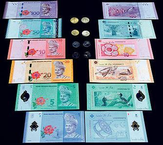

## Table of Contents

## What is the Malaysian Ringgit?

The Malaysian Ringgit is the official currency of Malaysia. It is used every day by people in Malaysia to buy things like food, clothes, and other goods. The symbol for the Ringgit is "RM" and it is sometimes called the "Malaysian dollar." One Ringgit is made up of 100 smaller units called sen.

The Ringgit has been used in Malaysia since 1967. Before that, different currencies were used in the area. The value of the Ringgit can change compared to other currencies, like the US dollar or the Euro. This can affect how much it costs for people in Malaysia to buy things from other countries, and how much tourists have to pay when they visit Malaysia.

## What is the currency symbol for the Malaysian Ringgit?

The currency symbol for the Malaysian Ringgit is "RM". This symbol is used in Malaysia to show prices and amounts of money.

When you see "RM" before a number, it means the amount is in Malaysian Ringgit. For example, if something costs RM10, it means it costs ten Ringgit.

## How is the Malaysian Ringgit abbreviated?

The Malaysian Ringgit is abbreviated as "RM". This abbreviation is used in Malaysia to show that the amount of money is in Ringgit. For example, if you see a price written as RM50, it means the price is fifty Ringgit.

People in Malaysia use "RM" every day when they talk about money, buy things, or see prices in shops. It's a quick and easy way to know that the currency is the Malaysian Ringgit.

## What is the history of the Malaysian Ringgit?

The Malaysian Ringgit started being used in 1967. Before that, Malaysia used different kinds of money. When Malaysia became its own country in 1957, it used the Malaya and British Borneo dollar. In 1967, Malaysia decided to make its own money, and that's when the Ringgit was born. The word "Ringgit" comes from the Malay word for "jagged," because old silver coins had jagged edges.

Over the years, the Ringgit has changed a lot. In the 1990s, there was a big financial crisis in Asia, and the value of the Ringgit went down a lot. To help fix this, the Malaysian government made rules about how the Ringgit could be used outside of Malaysia. These rules helped the Ringgit get stronger again. Today, the Ringgit is still used every day in Malaysia, and its value can change compared to other countries' money.

## How does the Malaysian Ringgit compare to other major currencies?

The Malaysian Ringgit, or RM, is the money used in Malaysia. When we compare it to other big currencies like the US dollar, the Euro, or the Japanese Yen, its value can change every day. For example, if 1 US dollar can buy 4 Ringgit, then the Ringgit is weaker than the US dollar. But if the next day, 1 US dollar can only buy 3.5 Ringgit, then the Ringgit has gotten stronger compared to the US dollar. These changes happen because of things like how well Malaysia's economy is doing, what's happening in the world's economy, and how much people want to buy and sell Ringgit.

The Ringgit is often seen as a smaller currency compared to big ones like the US dollar or the Euro. This means that the Ringgit can be affected more easily by big changes in the world's money markets. For example, if there's a big problem in the world's economy, the Ringgit might lose value faster than bigger currencies. But it can also gain value quickly if things get better. People who travel to Malaysia or do business there need to keep an eye on how the Ringgit is doing compared to their own country's money, because it can change how much things cost for them.

## What factors influence the exchange rate of the Malaysian Ringgit?

The exchange rate of the Malaysian Ringgit is affected by many things. One big thing is how well Malaysia's economy is doing. If Malaysia's economy is growing and people are making more money, the Ringgit can become stronger. Another thing is the price of things Malaysia sells to other countries, like oil and gas. If these prices go up, the Ringgit can get stronger because other countries want to buy more from Malaysia. Also, what the Malaysian government does with its money can change the Ringgit's value. If the government spends a lot and borrows money, it might make the Ringgit weaker.

The world's economy also plays a big part in the Ringgit's exchange rate. If there are big problems in the world, like a financial crisis, the Ringgit can lose value fast because people might not want to keep their money in Ringgit. The value of other big currencies, like the US dollar, also matters. If the US dollar gets stronger, the Ringgit might get weaker compared to it. Lastly, how much people and businesses want to buy and sell Ringgit can change its value. If everyone wants to buy Ringgit, it can become stronger, but if everyone wants to sell it, it can become weaker.

## How can one exchange foreign currency to Malaysian Ringgit?

To exchange foreign currency to Malaysian Ringgit, you can go to a bank or a currency exchange office. These places are found in many cities around the world, not just in Malaysia. When you go there, you'll need to show your passport and fill out some forms. They will then give you Ringgit in exchange for your foreign money. The amount of Ringgit you get will depend on the exchange rate at that time, which can change every day.

You can also use an ATM to get Ringgit if your bank card works in Malaysia. When you use an ATM, it will take money from your account in your home country and give you Ringgit. This is easy because you don't need to go to a special place, but you might have to pay a fee to use the ATM. Another way is to use a money transfer service like Western Union or MoneyGram. These services let you send money from your home country to Malaysia, and then you can pick up the Ringgit at a location in Malaysia.

## What are the best practices for exchanging currency to get the best rates?

To get the best rates when exchanging currency, it's a good idea to compare rates at different places. Banks, currency exchange offices, and online services can all offer different rates. You can look at their websites or call them to see what rates they are offering. Sometimes, one place might give you more Ringgit for your money than another. It's also good to avoid exchanging money at airports or hotels because they often have higher fees and worse rates.

Another tip is to use ATMs to get Ringgit if you can. Many ATMs in Malaysia will let you take out money using your bank card from your home country. This can be a good way to get Ringgit because the exchange rate might be better than at a currency exchange office. Just remember to check if your bank charges a fee for using ATMs in other countries. Also, try not to exchange all your money at once. Exchange a little bit at a time because the exchange rate can change, and you might get a better rate later.

## What are the current exchange rates for the Malaysian Ringgit against major currencies?

The Malaysian Ringgit's exchange rate changes every day. As of the most recent data, 1 US dollar can buy around 4.70 Ringgit. This means if you have 100 US dollars, you would get about 470 Ringgit. Compared to the Euro, 1 Euro can buy around 5.05 Ringgit. So, if you have 100 Euros, you would get about 505 Ringgit. Against the British Pound, 1 Pound can buy around 5.95 Ringgit, which means 100 Pounds would give you about 595 Ringgit.

The exchange rate with the Japanese Yen is different because the Yen is usually worth less than the Ringgit. 1 Ringgit can buy around 24.50 Yen. This means if you have 100 Ringgit, you would get about 2,450 Yen. These rates can change a lot because of things like how well Malaysia's economy is doing or what's happening in the world's economy. It's always a good idea to check the most up-to-date rates before you exchange your money.

## How does the Malaysian government regulate the Ringgit?

The Malaysian government has rules to help keep the Ringgit strong and stable. One big rule is that they control how much Ringgit can be used outside of Malaysia. This means that people and businesses have to follow certain rules when they want to send Ringgit to other countries. The government does this to make sure that there's enough Ringgit inside Malaysia and to stop big changes in its value.

Another way the government helps the Ringgit is by keeping an eye on the economy. They watch things like how much money people are spending, how much Malaysia is selling to other countries, and how much money is coming into Malaysia. If they see that the Ringgit is getting too weak or too strong, they might change their rules or do things to help balance it out. This helps make sure that the Ringgit stays useful for everyone in Malaysia.

## What economic indicators should one watch to predict movements in the Malaysian Ringgit?

To predict how the Malaysian Ringgit might change in value, it's helpful to look at certain signs from Malaysia's economy. One important sign is the country's Gross Domestic Product (GDP), which shows how much the whole economy is growing. If Malaysia's GDP is going up, it usually means the Ringgit might get stronger because the economy is doing well. Another sign to watch is the trade balance, which is the difference between what Malaysia sells to other countries and what it buys from them. If Malaysia is selling more than it's buying, this can make the Ringgit stronger too.

Also, keeping an eye on inflation rates is a good idea. Inflation is when prices of things go up over time. If inflation in Malaysia is high, it might make the Ringgit weaker because it means money isn't worth as much. Another thing to look at is the interest rates set by Malaysia's central bank. If these rates go up, it can attract more money from other countries into Malaysia, which can help make the Ringgit stronger. Watching these economic signs can give you a good idea of what might happen to the Ringgit in the future.

## What are the future prospects for the Malaysian Ringgit in the global market?

The future of the Malaysian Ringgit in the global market depends on many things. One big thing is how well Malaysia's economy keeps growing. If Malaysia can keep making more money and selling more things to other countries, the Ringgit might get stronger. Also, if the world's economy stays stable and people want to invest in Malaysia, this can help the Ringgit too. But if there are big problems in the world, like a financial crisis, the Ringgit might lose value because it's seen as a smaller currency.

Another thing to think about is what the Malaysian government does. If they make good rules and keep the economy strong, the Ringgit can do well. But if they borrow a lot of money or spend too much, it might make the Ringgit weaker. Also, the price of things Malaysia sells, like oil and gas, can affect the Ringgit. If these prices go up, the Ringgit might get stronger. Overall, the future of the Ringgit will depend on how Malaysia's economy does and what happens in the world's economy.

## How do exchange rates affect global standing?

The value of the Malaysian Ringgit (MYR) has experienced significant fluctuations when measured against major global currencies such as the United States Dollar (USD). These variations stem from a combination of domestic and international factors.

**Fluctuations in Exchange Rates**

Historically, the Ringgit's value against the USD has been affected by several critical factors. One major element is Malaysia's economic health, which includes its GDP growth rate, inflation levels, and trade balance. For example, strong economic performance generally leads to a stronger Ringgit, while economic downturns can weaken it.

The political climate within Malaysia also plays a crucial role. Political stability tends to boost investor confidence, leading to increased foreign investments, which in turn can strengthen the Ringgit. Conversely, political unrest or policy uncertainty can prompt capital flight, exerting downward pressure on the currency.

Global commodity prices, particularly oil and palm oil, significantly impact the Ringgit. As Malaysia is a substantial exporter of these commodities, higher global prices can improve the trade balance and thus strengthen the currency. Conversely, falling commodity prices can weaken the Ringgit by negatively affecting export revenues.

**Predictive Models for Exchange Rates**

Analysts and traders often employ various models to predict currency movement, integrating factors such as [interest rate](/wiki/interest-rate-trading-strategies) differentials, inflation rates, and macroeconomic indicators. A simple linear regression model can be expressed as follows:

$$

\text{Exchange Rate}_{\text{Predicted}} = \beta_0 + \beta_1 \cdot \text{Interest Rate Differential} + \beta_2 \cdot \text{Inflation Rate} + \ldots + \epsilon 
$$

where $\beta_0, \beta_1, \beta_2$ are coefficients obtained through statistical techniques, and $\epsilon$ is the error term.

**Tips for Travelers Exchanging Ringgit**

For travelers looking to exchange Ringgit, understanding these fluctuations is crucial. It's advisable to monitor currency trends and consult financial news sources for updates on factors that might influence the exchange rates. 

When exchanging currency, travelers should be mindful of exchange fees, which can vary between online platforms and physical exchange outlets. Typically, online services might offer better rates but could charge additional service fees. It's essential to compare rates across multiple sources to ensure the best value. Additionally, travelers should consider using multi-currency credit cards to minimize conversion fees and take advantage of favorable exchange rates.

In conclusion, the Malaysian Ringgit's exchange rate against the USD and other currencies is influenced by multiple factors including the domestic economic landscape, global commodity prices, and political climate. By staying informed and employing strategic currency exchange practices, individuals can optimize their financial transactions involving the Ringgit.

## What are the practical aspects of exchanging Malaysian Ringgits?

When planning a trip to Malaysia, understanding how to obtain Malaysian Ringgits efficiently is crucial for tourists. There are two primary methods for acquiring Ringgits: online services and currency exchange outlets. 

Online services, such as currency exchange platforms and travel money websites, offer a convenient way to convert your home currency to Ringgits before you travel. These platforms often provide competitive rates and allow you to lock in a rate in advance. However, it is essential to account for delivery fees and processing times, as these can vary significantly between providers.

Currency exchange outlets, located at airports, shopping malls, and city centers, provide a quick and accessible option for exchanging money upon arrival. While convenient, these outlets might charge higher fees or offer less favorable rates than online services due to their overhead costs and location premiums.

### Example Transaction

Let's illustrate the conversion from USD to MYR with an example. Suppose the current exchange rate is 1 USD = 4.2 MYR, and a tourist wishes to exchange 100 USD. 

Online platforms may offer a slightly better rate, say 1 USD = 4.25 MYR, but impose a small transaction fee of 2%. Therefore, the conversion would be:

1. Calculate the gross MYR amount:
$$
   \text{Gross MYR} = 100 \times 4.25 = 425 \, \text{MYR}

$$

2. Account for the transaction fee (2% of USD amount):
$$
   \text{Transaction Fee} = 100 \times 0.02 = 2 \, \text{USD}

$$

3. Adjust the MYR amount after deducting the USD transaction fee, assuming the fee is deducted before conversion:
   - Reduced USD for conversion: $100 - 2 = 98 \, \text{USD}$
   - Final MYR: $98 \times 4.25 = 416.5 \, \text{MYR}$

In contrast, an airport exchange outlet might offer the direct rate of 1 USD = 4.2 MYR without any additional fees, yielding 420 MYR for the same 100 USD.

### Best Practices

1. **Compare Rates and Fees**: Always compare the rates and fees from different providers before making a decision. Online platforms can offer better exchange rates, but ensure the benefits outweigh any associated fees.

2. **Avoid Airport Exchanges When Possible**: While convenient, airport exchanges typically have higher markups and less competitive rates. Plan your currency needs ahead of time to avoid last-minute exchanges at airports.

3. **Monitor Exchange Rates**: Exchange rates fluctuate due to market conditions. Monitoring these changes can help you decide the best time to convert your currency.

4. **Use ATM Withdrawals Carefully**: In Malaysia, ATMs dispense Ringgits directly and can be a convenient option. However, be mindful of foreign transaction fees and currency conversion charges imposed by your home bank.

5. **Check for Hidden Fees**: Read the terms and conditions to identify any hidden fees or charges, especially on online platforms or lesser-known exchange services.

These practices help tourists manage their travel expenses effectively by obtaining the best value for their currency conversions.

## References & Further Reading

[1]: ["A Non-Random Walk Down Wall Street"](https://www.jstor.org/stable/j.ctt7tccx) by Andrew W. Lo and A. Craig MacKinlay

[2]: ["The Asian Financial Crisis: Lessons for a Resilient Asia"](https://www.amazon.com/Asian-Financial-Crisis-Lessons-Resilient/dp/0262692457) edited by Wing Thye Woo, Jeffrey D. Sachs, and Klaus Schwab

[3]: ["The Impact of Algorithmic Trading in Market Dynamics"](https://yourrobotrader.com/en/the-impact-of-algorithmic-trading-on-market-dynamics/) by Elias Sehr and Jörg Osterrieder

[4]: ["The Economics of Foreign Exchange and Global Finance"](https://link.springer.com/book/10.1007/978-3-662-59271-7) by Peijie Wang

[5]: ["High-Frequency Trading: A Practical Guide to Algorithmic Strategies and Trading Systems"](https://www.ahmetbeyefendi.com/wp-content/uploads/2020/07/High-Frequency-Trading-Irene-Aldridge.pdf) by Irene Aldridge