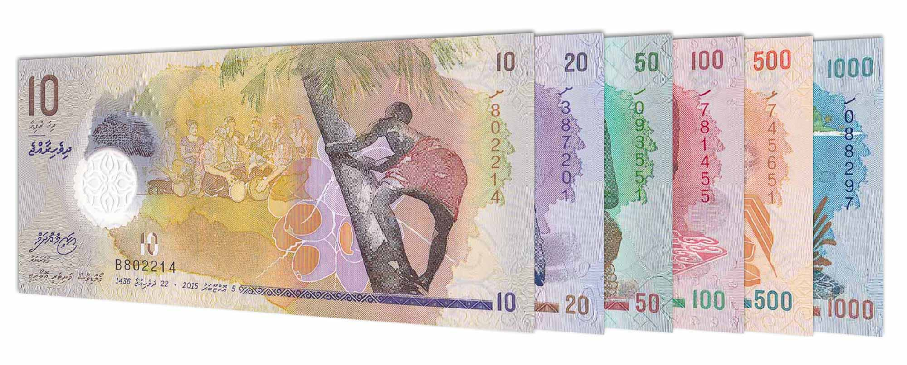

## Table of Contents

## What is the Maldivian Rufiyaa?

The Maldivian Rufiyaa is the official currency of the Maldives, a country made up of many islands in the Indian Ocean. It is used every day by people in the Maldives to buy things like food, clothes, and other goods. The symbol for the Rufiyaa is "Rf" and sometimes it is written as "MVR". One Rufiyaa is divided into 100 smaller units called Laari.

The Rufiyaa was first introduced in 1947, replacing the Ceylonese rupee which was used before. The Maldives Monetary Authority, which is like a central bank, is in charge of the Rufiyaa. They make sure there is enough money in the country and that it stays valuable. The Rufiyaa is not used much outside of the Maldives, so if you visit, you might need to change your money into Rufiyaa to buy things there.

## How is the Maldivian Rufiyaa abbreviated?

The Maldivian Rufiyaa is shortened to "Rf" or "MVR". These abbreviations are used to quickly show that you are talking about the currency of the Maldives.

When you see "Rf" or "MVR", it means the same thing - the money used in the Maldives. This makes it easier for people to understand and use the currency in everyday situations.

## What is the symbol used for the Maldivian Rufiyaa?

The symbol for the Maldivian Rufiyaa is "Rf". It is used to show that a price or amount is in the currency of the Maldives.

Sometimes, you might also see "MVR" used instead of "Rf". Both symbols mean the same thing and help people quickly recognize the Maldivian Rufiyaa.

## When was the Maldivian Rufiyaa first introduced?

The Maldivian Rufiyaa was first introduced in 1947. Before that, people in the Maldives used the Ceylonese rupee as their money. When the Rufiyaa was introduced, it replaced the Ceylonese rupee completely.

The Maldives Monetary Authority is the organization that takes care of the Rufiyaa. They make sure there is enough money in the country and that it keeps its value. The Rufiyaa is mainly used inside the Maldives, so if you visit, you will need to change your money into Rufiyaa to buy things there.

## What are the denominations of the Maldivian Rufiyaa?

The Maldivian Rufiyaa comes in different amounts, called denominations. For the coins, you can find 1, 2, 5, 10, 25, and 50 Laari coins, as well as 1 and 2 Rufiyaa coins. Laari is a smaller unit of the Rufiyaa, where 100 Laari make up 1 Rufiyaa. These coins help people buy small things or make exact change.

For the paper money, or banknotes, there are different amounts too. You can find banknotes of 5, 10, 20, 50, 100, 500, and 1000 Rufiyaa. These larger amounts are used for bigger purchases or when people need more money. All these different denominations make it easier for people in the Maldives to use their money every day.

## How does the Maldivian Rufiyaa compare to the US Dollar?

The Maldivian Rufiyaa (MVR) and the US Dollar (USD) are the currencies used in the Maldives and the United States, respectively. The value of the Rufiyaa compared to the Dollar changes over time because it depends on things like how well the economy is doing in both countries. You can find out how many Rufiyaa you get for one Dollar by looking at the exchange rate, which is updated every day.

For example, if the exchange rate is 1 USD = 15.42 MVR, that means you would get about 15 Rufiyaa and 42 Laari for every Dollar you change. This rate can go up or down, so it's a good idea to check it before you travel or do any money changing. The Rufiyaa is mostly used in the Maldives, so if you're visiting, you'll need to change your Dollars into Rufiyaa to buy things there.

## What are the key factors influencing the exchange rate of the Maldivian Rufiyaa?

The exchange rate of the Maldivian Rufiyaa compared to other currencies like the US Dollar is influenced by several key factors. One big [factor](/wiki/factor-investing) is the Maldives' economy. If the Maldives is doing well economically, with lots of tourism and good business, the Rufiyaa might become stronger. On the other hand, if the economy is not doing well, the Rufiyaa might become weaker. Another factor is inflation, which is when prices for things go up. If inflation is high in the Maldives, the Rufiyaa might lose value compared to other currencies.

Another important factor is the interest rates set by the Maldives Monetary Authority. If they set high interest rates, it might attract more money from other countries, making the Rufiyaa stronger. Political stability also plays a role. If the Maldives is stable and safe, more people might want to invest there, which can help the Rufiyaa. Lastly, the global demand for the US Dollar can affect the Rufiyaa. If the Dollar is in high demand, the Rufiyaa might weaken because people might want to change their Rufiyaa into Dollars.

## How is the Maldivian Rufiyaa managed by the Maldives Monetary Authority?

The Maldives Monetary Authority (MMA) is in charge of the Maldivian Rufiyaa. They make sure there is enough money in the country and that it stays valuable. The MMA does this by controlling how much money is printed and by setting interest rates. If they think there is too much money, they might raise interest rates to make people save more and spend less. If there isn't enough money, they might lower interest rates to encourage people to borrow and spend more.

The MMA also keeps an eye on the economy to make sure the Rufiyaa stays stable. They look at things like how much people are buying and selling, how much tourism there is, and how prices are changing. If the Rufiyaa starts to lose value compared to other currencies, the MMA might step in to buy or sell Rufiyaa to keep the exchange rate steady. They work hard to make sure the Rufiyaa remains a reliable currency for the people of the Maldives.

## What has been the historical performance of the Maldivian Rufiyaa against major currencies?

The Maldivian Rufiyaa has had ups and downs when compared to major currencies like the US Dollar and the Euro over the years. In the past, the Rufiyaa was tied to the US Dollar at a fixed rate, which means its value stayed the same compared to the Dollar for a long time. This fixed rate helped keep the Rufiyaa stable, especially during times when the Maldives' economy was growing because of more tourists coming to visit. But, when the global economy faced big problems, like during the 2008 financial crisis, the Rufiyaa still felt the effects because it was connected to the Dollar.

Over time, the Maldives Monetary Authority has worked to keep the Rufiyaa stable by watching the economy closely and making changes when needed. Even though the Rufiyaa is no longer officially tied to the US Dollar, its value still moves with the Dollar a lot. This means that when the US Dollar gets stronger or weaker, the Rufiyaa usually follows. The Rufiyaa has also been affected by how well the Maldives' economy is doing, especially with tourism being a big part of it. If more tourists come, the Rufiyaa might get stronger, but if fewer tourists come, it might weaken.

## What are the implications of the pegged exchange rate system for the Maldivian Rufiyaa?

A pegged exchange rate system means the Maldivian Rufiyaa is tied to another currency, like the US Dollar, so its value stays the same compared to that currency. This can help make the Rufiyaa more stable and predictable, which is good for the people and businesses in the Maldives. When the economy is doing well, like when more tourists come, this system can make people feel more confident about using the Rufiyaa because they know its value won't change suddenly.

However, being pegged to another currency also has some challenges. If the US Dollar gets stronger or weaker, the Rufiyaa has to follow, even if the Maldives' economy is doing something different. This can make it harder for the Maldives Monetary Authority to control the Rufiyaa's value on its own. Also, if there are big problems in the global economy, like a financial crisis, the Rufiyaa might be affected even if the Maldives is doing okay, because it's tied to the Dollar.

## How do international trade and tourism affect the Maldivian Rufiyaa?

International trade and tourism have a big impact on the Maldivian Rufiyaa. When the Maldives exports more goods or gets more tourists, it brings more foreign money into the country. This can make the Rufiyaa stronger because there is more demand for it. For example, if lots of tourists come to the Maldives and spend money, they need to change their dollars or euros into Rufiyaa. This increases the demand for the Rufiyaa, which can make its value go up compared to other currencies.

On the other hand, if there is less international trade or fewer tourists, it can weaken the Rufiyaa. If the Maldives is not exporting as much or if fewer people are visiting, there is less foreign money coming in. This can make the Rufiyaa lose value because there is less demand for it. The Maldives Monetary Authority has to keep an eye on these things to try and keep the Rufiyaa stable, but big changes in trade and tourism can still affect the currency's value.

## What future challenges and opportunities might the Maldivian Rufiyaa face in the global economy?

In the future, the Maldivian Rufiyaa might face challenges because of changes in the global economy. If there are big problems like financial crises or if the US Dollar, which the Rufiyaa is often tied to, goes through big changes, it could affect the Rufiyaa's value. Also, if the Maldives has less tourism or if there are fewer people wanting to buy things from the Maldives, the Rufiyaa might get weaker. Climate change is another big challenge because it can hurt the Maldives' economy, especially since the country is made up of islands that could be affected by rising sea levels.

On the other hand, there are also opportunities for the Rufiyaa. If the Maldives can attract more tourists or if it can sell more things to other countries, the Rufiyaa could get stronger. The Maldives Monetary Authority can also work on making the Rufiyaa more stable by using smart policies. If the global economy does well and more people want to visit the Maldives or buy its products, this could help the Rufiyaa stay strong and valuable.

## References & Further Reading

[1]: Bergstra, J., Bardenet, R., Bengio, Y., & Kégl, B. (2011). ["Algorithms for Hyper-Parameter Optimization."](https://papers.nips.cc/paper/4443-algorithms-for-hyper-parameter-optimization) Advances in Neural Information Processing Systems 24.

[2]: ["Advances in Financial Machine Learning"](https://www.amazon.com/Advances-Financial-Machine-Learning-Marcos/dp/1119482089) by Marcos Lopez de Prado

[3]: ["Evidence-Based Technical Analysis: Applying the Scientific Method and Statistical Inference to Trading Signals"](https://www.amazon.com/Evidence-Based-Technical-Analysis-Scientific-Statistical/dp/0470008741) by David Aronson

[4]: ["Machine Learning for Algorithmic Trading"](https://github.com/stefan-jansen/machine-learning-for-trading) by Stefan Jansen

[5]: ["Quantitative Trading: How to Build Your Own Algorithmic Trading Business"](https://www.amazon.com/Quantitative-Trading-Build-Algorithmic-Business/dp/1119800064) by Ernest P. Chan