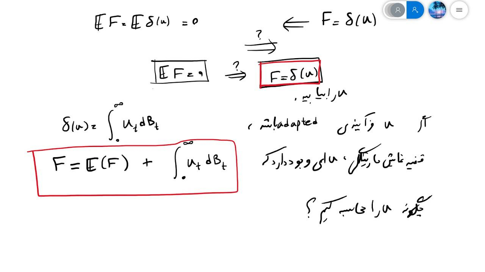

Malliavin calculus represents a pivotal advancement in the field of mathematical finance, with a particular impact on algorithmic trading. This sophisticated form of calculus, credited to the French mathematician Paul Malliavin, has carved a niche within stochastic calculus by offering a unique methodology to assess and navigate the complexities associated with financial markets. Paul Malliavin's contribution to mathematics through this calculus has been instrumental in paving the way for more sophisticated approaches to financial modeling.

The specialized role of Malliavin calculus within stochastic calculus is primarily rooted in its ability to evaluate the smoothness of functionals of stochastic processes. This property is especially significant in financial contexts where the precision of instruments’ pricing and risk management is critical. By improving the granularity with which random processes can be analyzed, Malliavin calculus enhances the capability to model market behaviors that are otherwise challenging to represent with traditional methods.

In algorithmic trading, the precision afforded by Malliavin calculus translates into more accurate pricing models and effective risk management strategies. Financial instruments often require nuanced approaches to evaluate their worth and potential risks, and Malliavin calculus provides the mathematical framework required for such detailed analysis. This impact is evident in the increased accuracy of derivative pricing and enhanced methodologies for hedging strategies, contributing to overall market efficiency and stability.

Given its importance, Malliavin calculus has become an invaluable tool in the arsenal of financial analysts and traders aiming to optimize their strategies in complex and fast-paced market environments. As the financial industry progresses, the continued integration and development of Malliavin calculus in algorithmic trading will likely yield further innovations, reinforcing its status as a cornerstone of modern financial analysis.

## Table of Contents

## Understanding Malliavin Calculus

Malliavin calculus is an advanced branch of stochastic calculus that extends traditional methods by allowing a more comprehensive analysis of the smoothness of functionals associated with stochastic processes. Its development signifies a significant augmentation in the mathematical toolkit available for analyzing random processes, especially in the context of mathematical finance and algorithmic trading.

At its core, Malliavin calculus provides a framework to assess differentiability properties of random variables, which are functionals of stochastic processes typically modeled via Itô calculus. This distinction enables practitioners to not only evaluate but also manipulate these variables with enhanced precision. The calculus is particularly useful in addressing problems where traditional techniques might falter due to the complexity or irregularity of the processes involved.

Two essential components of Malliavin calculus are the Malliavin derivative and the Skorokhod integral. The Malliavin derivative is a generalization of the concept of a derivative to stochastic processes. It measures the sensitivity of a functional with respect to the underlying random process, enabling the differentiation of random variables that are often not differentiable in the classical sense. Mathematically, if $F$ is a random variable defined on a probability space, its Malliavin derivative $D_t F$ at time $t$ extends the notion of differentiability into the infinite-dimensional Wiener space.

The Skorokhod integral, on the other hand, acts as an extension of the Itô integral. It accommodates tasks where the integrand is not adapted to the underlying filtration, allowing for the integration of non-anticipative paths. This characteristic is particularly useful in financial applications where such non-adaptedness often occurs. 

These tools collectively facilitate enhanced modeling and analysis of stochastic processes, fostering better computational methods and more accurate financial predictions. By providing a nuanced approach to differentiation within stochastic environments, Malliavin calculus enriches the study and application of mathematical finance.

## Key Features of Malliavin Calculus

Malliavin calculus introduces important concepts in stochastic calculus, particularly the notion of differentiability in Wiener space. This concept is pivotal for financial modeling as it allows for the treatment of random variables that are driven by Brownian motion, thereby providing a robust framework for analyzing the dynamics of financial instruments.

The core component of Malliavin calculus, the Malliavin derivative, extends the traditional understanding of differentiation to stochastic processes. The derivative is designed to measure the sensitivity of a function of a stochastic process, offering a way to differentiate functions that depend on paths of Brownian motion. This is significant in financial modeling as it enables the calculation of Greeks, which quantify the sensitivity of an option's price to various parameters, such as the underlying asset's price or [volatility](/wiki/volatility-trading-strategies).

Mathematically, suppose $F$ is a random variable of the form
$$
F = f(W(t_1), W(t_2), \ldots, W(t_n))
$$
where $f$ is a smooth function and $W(t_i)$ are values of a Wiener process. The Malliavin derivative of $F$, denoted as $D_t F$, plays a critical role in establishing the smoothness and differentiability of such random variables.

The Skorokhod integral is another fundamental aspect of Malliavin calculus. It generalizes the Itô integral, which is essential for stochastic calculus but limited to non-anticipative integrands. The Skorokhod integral extends integration to include anticipative processes, thereby broadening the applicability of mathematical tools in finance. This extension is crucial for scenarios where future information needs to be incorporated into current decision-making processes, enhancing the modeling of financial systems with complex dependency structures. 

Together, these features of Malliavin calculus have revolutionized financial modeling, enabling more precise and adaptable methods for pricing derivatives and managing risk. They provide a mathematical foundation for tackling challenges that are inherent in financial markets, such as path dependency and complex volatility structures.

## Application of Malliavin Calculus in Algorithmic Trading

Malliavin calculus has proven instrumental in advancing the computational methods used for pricing and hedging derivatives in [algorithmic trading](/wiki/algorithmic-trading). By enhancing the precision of sensitivity analysis, it aids traders and risk managers in determining the prices of financial instruments more accurately. One of the primary ways it does this is by providing a framework for evaluating the sensitivities, commonly known in finance as the "Greeks." 

These Greeks—delta, gamma, theta, vega, and rho—measure the sensitivity of the price of derivatives to various factors such as changes in the underlying asset's price or volatility. Malliavin calculus facilitates more efficient computation of these sensitivities, especially in cases involving high-dimensional problems or where the underlying price processes exhibit stochastic volatility or jumps, which are challenging for traditional methods.

In practical terms, Malliavin calculus allows for the calculation of Greeks using Monte Carlo simulation by providing a probabilistic representation of derivatives. This approach is particularly beneficial for complex derivatives, where traditional deterministic methods are limited. The integration of Malliavin calculus into such stochastic frameworks reduces the variance of the estimators used to compute Greeks, leading to faster convergence and more robust hedging strategies.

Furthermore, Malliavin calculus is employed in model calibration, enhancing the ability to fit models to market data accurately. This is crucial in ensuring that the models used for pricing and hedging reflect the current market conditions as closely as possible. The calculus extends the toolset available for solving stochastic control problems, such as the Merton problem, where the goal is to determine the optimal consumption and portfolio choices over time to maximize utility.

In algorithmic trading, where speed and precision are critical, the application of Malliavin calculus offers a competitive advantage. It allows traders to respond to market conditions more swiftly and adjust their strategies based on more precise sensitivity analyses. The ongoing progression in this area continues to refine these computational methods, contributing to the development of more sophisticated trading algorithms and models.

## Advantages of Malliavin Calculus Over Traditional Methods

Malliavin calculus offers enhanced capabilities over traditional stochastic calculus, particularly in its ability to manage complexities experienced in financial markets. Unlike standard stochastic processes, Malliavin calculus provides a sophisticated framework that extends notions of differentiation to random variables, which is crucial for the detailed analysis required in financial contexts. This level of differentiation enables researchers to analyze market behaviors with greater depth and precision, facilitating improved risk assessment and pricing of financial instruments such as derivatives.

One significant advantage of Malliavin calculus is its capacity to address the intricacies of market behavior analysis. Traditional methods often fall short when dealing with irregular data paths and complex market dynamics. In contrast, Malliavin calculus, with its powerful differentiation tools, allows for smoother estimations of the sensitivity of financial products to fluctuations in the market. This is particularly important in algorithmic trading, where the rapid assessment of these sensitivities, known as the Greeks, is vital for devising effective hedging strategies and executing trades with minimal risk.

The precision gained from using Malliavin calculus is evident in scenarios involving the pricing of complex financial instruments. The calculus enables a more accurate depiction of the probability distributions of such instruments by accounting for their sensitivity to various risk factors beyond the capabilities of traditional stochastic calculus. Enhancements in precision lead to more reliable pricing models and reduce the uncertainty associated with volatile market conditions.

Moreover, in situations characterized by irregular paths or non-linear market dynamics, Malliavin calculus proves to be particularly advantageous. Its mathematical machinery can handle the inherent complexities and subtleties present in these situations, offering a robust method for understanding and modeling unpredictable market responses.

Overall, the advanced analytic capabilities of Malliavin calculus make it an invaluable tool in financial modeling, offering a level of precision and adaptability that traditional methods struggle to match. Its ability to manage complex scenarios ensures that practitioners can develop more reliable and accurate models, enhancing their strategic decision-making processes within volatile financial environments.

## Challenges and Learning Curve

Malliavin calculus, while a powerful tool in the domain of financial mathematics, presents a significant level of complexity that may intimidate many practitioners. This complexity largely stems from its unique approach and the sophisticated mathematical foundation it requires. To effectively engage with Malliavin calculus, one must have a firm grasp of advanced mathematical concepts, including measure theory and functional analysis. These areas provide a necessary foundational understanding of probability spaces and functional spaces, enabling practitioners to comprehend the intricacies of stochastic processes and the differentiability of functionals.

Measure theory is critical as it forms the backbone of probability theory, which underpins all stochastic calculus. A comprehensive understanding of σ-algebras, measurable functions, and integration with respect to a measure is crucial. Similarly, functional analysis, with its focus on vector spaces and the linear operators acting upon them, equips professionals with the tools to explore infinite-dimensional spaces where stochastic processes are often analyzed.

Despite its power, the use of Malliavin calculus remains niche within the finance industry, largely adopted by sell-side institutions, such as investment banks and other financial entities involved in creating and selling financial products. Sell-side institutions benefit from Malliavin calculus through its application in complex derivative pricing and risk assessment, demanding precise and sophisticated mathematical models. The steep learning curve associated with Malliavin calculus can mean it is often reserved for specialized roles, requiring extensive training and expertise beyond that of standard stochastic calculus.

This complexity and specialization contribute to a limited adoption across the industry. While beneficial, the intensive prerequisites and the significant investment in time to master these techniques can be prohibitive. However, for those who do pursue this path, Malliavin calculus offers unparalleled tools for precise modeling and risk management in environments characterized by intricate market dynamics and irregular financial instruments.

## Conclusion

Malliavin calculus has established itself as a transformative tool in modern financial markets, particularly within algorithmic trading strategies. Its application enhances the accuracy of pricing complex financial instruments, offering refined methods for calculating sensitivities and managing risk. By extending the capabilities of traditional stochastic calculus, Malliavin calculus facilitates more precise valuation of derivatives, allowing traders and financial professionals to manage portfolio risks with greater confidence.

The precision afforded by Malliavin calculus is invaluable in dynamic environments, where it helps mitigate potential inaccuracies arising from market fluctuations and irregular asset price paths. The incorporation of this calculus has proven instrumental in improving the computational efficiency of pricing models, aiding in faster and more reliable decision-making processes in trading systems.

Ongoing research and development continue to expand the potential applications of Malliavin calculus. Scholars and practitioners are actively exploring ways to integrate its methodologies within more extensive financial models, promising further advancements in market analysis and trading strategy optimization. The increasing interest and research efforts in this field underscore the importance of Malliavin calculus in the evolution of financial theory and the practical demands of algorithmic trading. As such, it invites continued study and innovation, offering a fertile ground for advancing quantitative finance.

## References & Further Reading

[1]: Malliavin, P., & Thalmaier, A. (2005). ["Stochastic Calculus of Variations in Financial Mathematics"](https://link.springer.com/book/10.1007/3-540-30799-0). Springer.

[2]: Nualart, D. (2006). ["The Malliavin Calculus and Related Topics"](https://link.springer.com/book/10.1007/3-540-28329-3). Springer.

[3]: Bouchard, B., & Touzi, N. (2004). ["Discrete-Time Approximations and Monte Carlo Simulations of Backward Stochastic Differential Equations."](https://www.researchgate.net/publication/388954607_An_introduction_to_Malliavin_calculus) Methodology and Computing in Applied Probability, 6(4), 401–446.

[4]: Alos, E., & Leonard, C. (2007). ["A Stability Approach to `Greeks’ Calculations in Stochastic Volatility Models."](https://www.researchgate.net/publication/24055554_On_the_short-time_behavior_of_the_implied_volatility_for_jump-diffusion_models_with_stochastic_volatility) Finance and Stochastics, 11(1), 1–37.

[5]: Cont, R., & Fourni\'e, D.-A. (2010). ["A Functional Ito Calculus Approach to Path-Dependence of Stochastic Integrals."](https://hal.science/file/index/docid/455700/filename/ito.pdf) Finance and Stochastics, 15(3), 661-703.

[6]: Evstigneev, I., & Runggaldier, W. J. (2009). ["Stochastic Finance: An Introduction in Discrete Time"](https://link.springer.com/article/10.1007/BF02985423). Cambridge University Press.