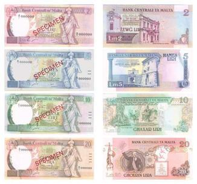

The transition from the Maltese Lira to the Euro represents a pivotal moment in Malta's economic evolution. This currency change, officially implemented in January 2008, underscored Malta's commitment to further integrating with the European Union and aligning its financial systems with broader Eurozone mechanisms. Prior to this, the Maltese Lira (MTL) had been the island nation’s currency since 1972, following its independence from Britain in 1964. As part of its accession treaty obligations, Malta was required to adopt the Euro, thus replacing the longstanding Maltese Lira with a stable and universally recognized currency.

Understanding the historical context of this transition is crucial as it highlights Malta's strategic economic decisions aimed at ensuring long-term growth and stability. By shifting to the Euro, Malta sought not only to foster closer economic ties with other European nations but also to enhance its own domestic economic environment. The change was anticipated to bring about tangible benefits such as greater price stability and reduced transaction costs, especially within the Eurozone. This was significant for Malta, given its heavy reliance on services and financial sectors, which require a stable and reliable currency to attract and retain investment.



The implications of this currency transition extend beyond mere adoption; they involve comprehensive integration into the European monetary system, with significant effects on trade, investment, and algorithmic trading, which thrives on stable and liquid markets. Malta's transformation in this era exemplifies the dynamic interplay between national economic strategies and global financial systems, setting the stage for its continued participation in a highly interconnected economic landscape. This article will therefore examine the transition process, its economic implications for Malta, and the significance of algorithmic trading within today's sophisticated currency markets.

## Table of Contents

## The Maltese Lira: A Brief History

The Maltese Lira (MTL) was established as the national currency of Malta in 1972, following the country’s independence from British colonial rule in 1964. This development was a significant step towards asserting Malta's sovereignty and economic self-reliance. The change to the Maltese Lira represented a departure from the previous currency, the British Pound Sterling, and symbolized a new era in Malta's financial history.

The decision to introduce the Maltese Lira was influenced by the necessity to create a distinct monetary identity that would support the newly independent nation's economic aspirations. This change came in response to the evolving political landscape and the need for economic structures that aligned with Malta's national interests and international posture. As part of this transition, the Central Bank of Malta was established to oversee and implement monetary policy, ensuring a stable financial environment conducive to economic growth.

The Maltese Lira was initially divided into 100 cents, and its introduction marked the beginning of Malta's journey towards economic modernization and integration into the global market. The currency was largely pegged to a basket of foreign currencies, which provided a measure of stability and helped mitigate exchange rate volatility. This strategic monetary policy enabled Malta to maintain an equilibrium between fostering economic growth and curtailing inflation, thus ensuring economic resilience in the face of external shocks.

During its tenure, the Maltese Lira served as a central component of Malta's economic framework. It supported the country's efforts to develop sectors such as tourism, manufacturing, and financial services, which became vital to its economic progress. However, as Malta moved towards greater European integration, the limitations of the Maltese Lira became apparent. Its small scale meant higher transaction costs in international trade and limited access to larger financial markets. These constraints, coupled with Malta's aspiration to become more closely integrated with the European Union (EU), underscored the need for a transition to the Euro.

Understanding the historical significance of the Maltese Lira provides context for its eventual replacement by the Euro in 2007. The shift was motivated by the advantages of adopting a more widely recognized and stable currency, which facilitated trade, attracted foreign investment, and improved economic predictability. This transition marked a pivotal moment in Malta’s economic history, signalling its commitment to integration within the European economic sphere and positioning itself for further economic development.

## Transition to the Euro

In December 2007, Malta adopted the Euro, effectively replacing the Maltese Lira as the national currency. This significant economic transition was facilitated by establishing a fixed exchange rate of €1 equaling MTL 0.429300. Such a decisive action was essential for aligning Malta’s monetary policy with that of the European Central Bank, thereby integrating the nation's economy more closely with the broader European Union economic framework.

The adoption of the Euro served multiple critical purposes. Foremost, it was intended to diminish transactional frictions within the European Union, thus making cross-border trade more seamless and efficient. By eliminating the need for currency exchange within the Eurozone, Malta positioned itself to benefit from reduced transaction costs and enhanced economic interactions with other EU member states.

Furthermore, adopting the Euro was a strategic move to foster economic stability and investor confidence. It provided Malta with a more stable currency environment that aligned with the larger, and generally more stable, Eurozone economy. Amid the globalization of trade and finance, having a currency that was widely recognized and traded offered Malta numerous advantages, particularly in enhancing the attractiveness of its financial services sector.

The process of transitioning to the Euro also involved meticulous planning and robust public educational campaigns to ensure smooth adaptation by businesses and consumers. This ensured that the logistical obstacles typically associated with such a currency switch were effectively managed, encouraging a smooth transition period and laying the groundwork for economic growth and development.

## Economic Implications of the Currency Change

Adopting the Euro in Malta in 2008 significantly impacted its economy, carrying both notable advantages and some challenges. One of the most immediate benefits was greater price stability. The Euro's introduction shielded the Maltese economy from the [volatility](/wiki/volatility-trading-strategies) often experienced by smaller, less liquid currencies like the Maltese Lira. This increased stability bolstered investor confidence, essential for an economy heavily dependent on the services and financial sectors. 

The seamless trade transactions within the Eurozone became more accessible, enhancing economic integration and reducing currency conversion costs. Previously, currency fluctuations could affect pricing, leading to increased costs for businesses engaged in cross-border trade. By utilizing the Euro, Malta aligned its economic operations with Europe’s larger markets, which fostered economic activities by standardizing financial operations and increasing competitiveness.

However, the transition was not without challenges. One significant issue was the temporary surge in inflation immediately following the Euro's adoption. This surge was partly caused by the rounding effects during the conversion from the Lira to the Euro and discrepancies in pricing. Such changes often led to public disaffection as consumers perceived a loss in purchasing power due to initial price hikes in goods and services.

Moreover, the public had to adapt to the new currency, necessitating extensive educational campaigns. There was a learning curve for both consumers and businesses to become familiar with the Euro notes and coins, which replaced the Maltese Lira. Persistent efforts were made to ease this transition, including dual pricing systems where prices were displayed in both the Lira and the Euro for a period.

In summary, while the Euro brought numerous advantages by enhancing economic stability and fostering integration into the European market, Malta faced transitional challenges that required strategic management to address inflationary effects and public adaptation to the new monetary environment.

## Algorithmic Trading in the Eurozone

Algorithmic trading has become a cornerstone of modern financial markets, offering unparalleled speed and efficiency in executing trades. One of the primary reasons for its rise is its capability to process and analyze large volumes of data, enabling traders to make informed decisions in real-time. This form of trading employs complex algorithms and mathematical models to determine the optimal timing, price, and quantity for order executions, reducing human intervention and emotional bias.

The Euro, due to its stability and [liquidity](/wiki/liquidity-risk-premium), offers a favorable environment for [algorithmic trading](/wiki/algorithmic-trading). The currency is one of the most heavily traded in the world, providing a deep and liquid market which is essential for algorithmic strategies. The sheer [volume](/wiki/volume-trading-strategy) of transactions in the Euro ensures tight bid-ask spreads and reduced market impact, allowing algorithms to function optimally.

Key strategies in algorithmic trading include statistical [arbitrage](/wiki/arbitrage), [market making](/wiki/market-making), and [trend following](/wiki/trend-following). Statistical arbitrage relies on quantitative models to identify mispricing between related instruments, allowing traders to capitalize on these discrepancies. Market making involves providing liquidity to the market by continuously quoting buy and sell prices, [earning](/wiki/earning-announcement) profits from the bid-ask spread. Trend following uses algorithmic models to identify and exploit market trends, adjusting positions accordingly.

The use of [machine learning](/wiki/machine-learning) and [artificial intelligence](/wiki/ai-artificial-intelligence) has further enhanced algorithmic trading's capabilities. AI models can adapt to changing market conditions by learning from past data, providing robust predictive analysis and risk management. For instance, algorithms can be designed in Python to perform tasks such as predicting currency pair movements or optimizing trading strategies. Here is a simple Python snippet illustrating the basic structure of an algorithmic trading strategy using the Pandas library for data handling:

```python
import pandas as pd

def moving_average_strategy(prices, short_window=40, long_window=100):
    signals = pd.DataFrame(index=prices.index)
    signals['signal'] = 0.0

    signals['short_mavg'] = prices.rolling(window=short_window, min_periods=1, center=False).mean()
    signals['long_mavg'] = prices.rolling(window=long_window, min_periods=1, center=False).mean()

    signals['signal'][short_window:] = \
        np.where(signals['short_mavg'][short_window:] > signals['long_mavg'][short_window:], 1.0, 0.0)

    signals['positions'] = signals['signal'].diff()

    return signals
```

This code snippet represents a simple moving average strategy, where signals are generated based on the relationship between a short-term and a long-term moving average. When the short-term average crosses above the long-term average, a buy signal is triggered, while a cross below indicates a sell signal.

Algorithmic trading's growing influence is evident in the Eurozone, where the efficient market conditions, coupled with technological advancements, offer significant opportunities. As financial technology progresses, algorithmic trading will likely continue to evolve, playing an increasingly important role in global financial markets.

## The Role of Financial Technology in Currency Trading

Financial technology advancements have significantly transformed currency trading, making processes more accurate and efficient. These technologies support the dynamic and fast-paced nature of current financial markets, where large volumes of data require rapid analysis and decision-making.

Artificial Intelligence (AI) and machine learning are at the forefront of this transformation. By integrating these technologies into trading systems, traders can leverage vast datasets to perform predictive analysis. AI algorithms can identify patterns within historical market data, enhancing the capability to forecast future market movements. Machine learning models, specifically, are adept at adapting to new data, which allows them to improve their predictions over time. This ability to learn and adapt makes them valuable tools for risk management and optimizing trading strategies.

An example of a simple predictive model using machine learning could involve predicting future currency prices based on historical price data. A basic Python implementation using the `scikit-learn` library for a machine learning model might look like this:

```python
from sklearn.model_selection import train_test_split
from sklearn.linear_model import LinearRegression
import numpy as np

# Sample data: historical price ($) and future price ($)
prices = np.array([[1.2, 1.3], [1.3, 1.4], [1.4, 1.5], [1.5, 1.6], [1.6, 1.7]])

# Separating features (current prices) and target (future prices)
X = prices[:, 0].reshape(-1, 1)  # Current prices
y = prices[:, 1]  # Future prices

# Splitting data into training and test sets
X_train, X_test, y_train, y_test = train_test_split(X, y, test_size=0.2, random_state=42)

# Creating and training the model
model = LinearRegression()
model.fit(X_train, y_train)

# Model Prediction
predictions = model.predict(X_test)
print(f"Predicted future prices: {predictions}")
```

This example demonstrates a simple linear regression model, where the goal is to predict future currency prices based on past data. In practice, trading models might use more complex algorithms, consider multiple features, and involve substantial data preprocessing.

For Malta, positioning itself as a prominent financial hub involves embracing these technologies. Financial technology solutions not only enhance trading precision but also streamline operations, offering scalable solutions that can handle increasingly larger datasets with greater efficiency. The adaptation of AI-driven technologies can provide financial institutions in Malta with a competitive edge by enabling them to process information at speeds and accuracies unattainable by human analysis alone.

This strategic integration of advanced technologies is crucial for maintaining competitiveness and relevance in the ever-evolving financial landscape. As technologies grow more sophisticated, their role in currency trading—through aspects like automated trading systems and smart data analytics—will likely continue to expand, pushing boundaries of tradability and market intelligence.

## Conclusion

The transition from the Maltese Lira to the Euro stands as a significant milestone in Malta's economic evolution, signifying a strategic alignment with the broader European economic framework. This shift facilitated increased trade and investment, providing Malta with enhanced economic stability and credibility. The Euro's introduction minimized currency conversion barriers, thus fostering a smoother integration with EU markets and enabling Maltese businesses to operate more efficiently within the Eurozone. 

As global financial markets continuously evolve, algorithmic trading has emerged as a powerful tool, leveraging technology for faster and more efficient trading operations. The stability and liquidity of the Euro make it an appealing option for these advanced trading strategies. Given this dynamic, understanding the implications and mechanics of algorithmic trading becomes essential for shaping future economic policies and strategies. 

For Malta, embracing advancements in financial technology, including algorithmic trading, positions the nation to take full advantage of its favorable status within the Eurozone. By staying at the forefront of technological developments, Malta can strengthen its position as a competitive player in international finance, ensuring sustainable economic growth and prosperity.

## References & Further Reading

[1]: Avgouleas, E. (2005). "The mechanics and regulation of market abuse: A legal and economic analysis." Oxford University Press.

[2]: "Algorithmic and High-Frequency Trading" by Álvaro Cartea, Sebastian Jaimungal, and José Penalva, Cambridge University Press (2015).

[3]: European Central Bank (2008). "The Economic Policy Framework in the Euro Area." Available at: [https://www.ecb.europa.eu/](https://www.ecb.europa.eu/home/html/index.en.html/.en.html)

[4]: Lane, P. R. (2006). "The real effects of European monetary union." Journal of Economic Perspectives, 20(4), 47-66.

[5]: "The Euro and the Battle of Ideas" by Markus K. Brunnermeier, Harold James, and Jean-Pierre Landau, Princeton University Press (2016).

[6]: Tsang, A., & Chong, E. (2020). "Algorithmic Trading: A Literature Review." The Journal of Financial Data Science, 2(1), 1-16.