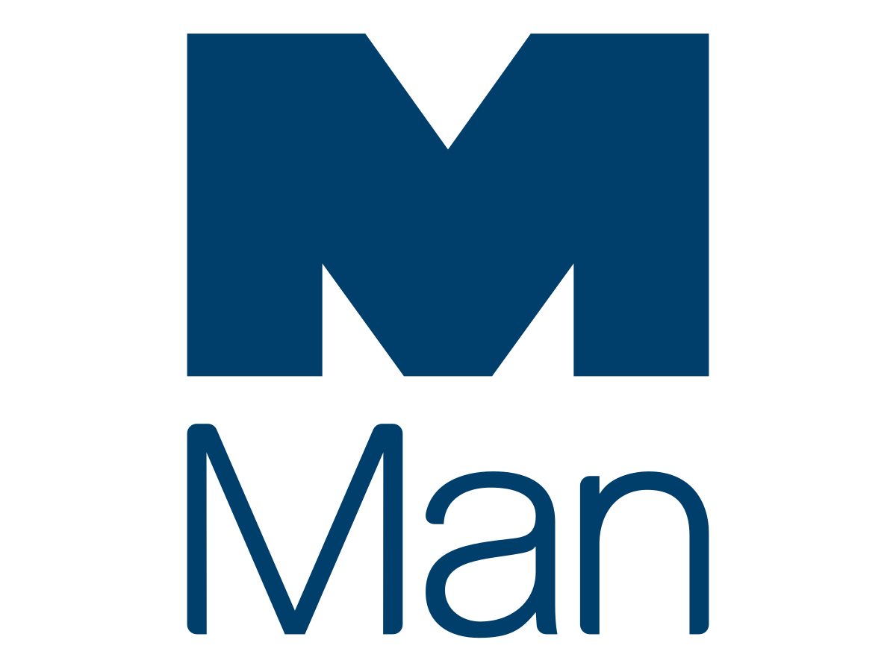

## Table of Contents

## What is Man Group PLC?

Man Group PLC is a British investment management company. It is one of the largest in the world and manages money for people and organizations who want to invest. The company was started a long time ago in 1783, which makes it very old. It is based in London, but it also has offices in many other places around the world.

Man Group PLC helps its clients by using different strategies to invest their money. They use computers and data to make smart choices about where to put the money. They focus a lot on something called 'quantitative investing,' which means they use math and numbers to make decisions. This helps them try to make more money for their clients while also trying to keep their investments safe.

## When was Man Group PLC founded?

Man Group PLC was founded a long time ago, in the year 1783. That makes it one of the oldest investment companies in the world. It started in London, which is in England.

Today, Man Group PLC is a big company that helps people and organizations invest their money. They use computers and numbers to make smart choices about where to put the money. This way, they try to help their clients make more money while keeping their investments safe.

## What are the main services offered by Man Group PLC?

Man Group PLC helps people and organizations invest their money. They offer services that use computers and numbers to make smart choices about where to put the money. This is called quantitative investing. They try to help their clients make more money while keeping their investments safe.

They also offer different ways to invest, like using strategies that focus on different parts of the market. This means they can help clients who want to invest in different things, like stocks, bonds, or other types of investments. By doing this, they try to meet the different needs of their clients and help them reach their financial goals.

Overall, Man Group PLC works hard to use their knowledge and technology to make good investment choices for their clients. They aim to grow their clients' money over time while managing risks carefully.

## Where is Man Group PLC headquartered?

Man Group PLC is headquartered in London, England. This is where the main office of the company is located. London is a big city known for its finance and business, so it's a good place for a company like Man Group PLC to be based.

From their headquarters in London, Man Group PLC manages money for people and organizations who want to invest. They use computers and numbers to make smart choices about where to put the money. This helps them try to make more money for their clients while also trying to keep their investments safe.

## Who are the key executives at Man Group PLC?

The key executives at Man Group PLC are the people who help run the company and make important decisions. The CEO, or Chief Executive Officer, is Luke Ellis. He is in charge of the whole company and makes sure it is doing well. The CFO, or Chief Financial Officer, is Antoine Forterre. He takes care of the money and makes sure the company is spending and saving wisely.

Another important executive is Robyn Grew, who is the President. She helps the CEO run the company and works on making sure the company is doing what it needs to do to succeed. These executives work together to use their knowledge and skills to help Man Group PLC manage money for its clients and make smart investment choices.

## What is the market capitalization of Man Group PLC?

The market capitalization of Man Group PLC is how much the whole company is worth based on the price of its shares. It changes every day because the price of the shares goes up and down. As of the latest information available, Man Group PLC's market capitalization is around 3.5 billion pounds. This number can be different when you check it because it depends on the stock market.

Market capitalization is important because it shows how big a company is compared to others. For Man Group PLC, being worth around 3.5 billion pounds means it is a big company in the investment world. This value helps investors decide if they want to buy shares in the company or not. It also shows how much money the company could raise if it wanted to sell more shares.

## How has Man Group PLC performed financially in the last five years?

Over the last five years, Man Group PLC has had ups and downs in its financial performance. The company's revenue, which is the money it makes from its services, has grown overall. In 2019, Man Group PLC made about 950 million pounds in revenue. By 2023, this number had increased to around 1.2 billion pounds. This growth shows that more people and organizations are using Man Group PLC's services to invest their money. However, the company also faced some challenges, like changes in the market and economic conditions that affected how much money they could make.

Man Group PLC's profits, which is the money left after paying all the costs, have also varied over the last five years. In 2019, the company reported a profit of about 250 million pounds. This number went up and down in the following years, reaching around 300 million pounds in 2023. The changes in profit were influenced by many things, like how well their investment strategies worked and the costs of running the company. Overall, Man Group PLC has managed to stay profitable and grow its business, even with the challenges they faced.

## What are the major subsidiaries of Man Group PLC?

Man Group PLC has several important companies that it owns, called subsidiaries. One of the main subsidiaries is Man AHL, which focuses on using computers and numbers to make investment choices. This is called quantitative investing. Another important subsidiary is Man GLG, which offers a wide range of investment strategies and manages money for clients who want to invest in different ways.

Another key subsidiary is Man Numeric, which also uses quantitative investing to help clients make money. Man FRM is another subsidiary that specializes in managing funds that invest in other funds, which is called fund of funds. These subsidiaries help Man Group PLC offer different services to meet the needs of many different clients and help them reach their financial goals.

## What investment strategies does Man Group PLC employ?

Man Group PLC uses different ways to help people and organizations invest their money. One of the main ways they do this is through something called quantitative investing. This means they use computers and numbers to make smart choices about where to put the money. They look at a lot of data and use math to decide which investments might do well. This helps them try to make more money for their clients while also trying to keep their investments safe.

Another way Man Group PLC invests is by using different strategies that focus on different parts of the market. For example, they might invest in stocks, bonds, or other types of investments. This means they can help clients who want to invest in different things. By doing this, they try to meet the different needs of their clients and help them reach their financial goals. They also manage funds that invest in other funds, which is called fund of funds, to give clients even more options for investing their money.

## How does Man Group PLC integrate technology in its operations?

Man Group PLC uses technology a lot in its work to help people and organizations invest their money. They use computers and numbers to make smart choices about where to put the money. This is called quantitative investing. By using technology, they can look at a lot of data and use math to decide which investments might do well. This helps them try to make more money for their clients while also trying to keep their investments safe.

Technology also helps Man Group PLC work better and faster. They use computers to manage and analyze data quickly, which means they can make decisions faster than if they were doing everything by hand. This is important because the investment world can change quickly, and being able to react fast can help them do a better job for their clients. By using technology in their operations, Man Group PLC can offer more services and help more people reach their financial goals.

## What are the recent strategic initiatives undertaken by Man Group PLC?

Man Group PLC has been working on a few important plans to grow and improve their business. One of the big things they are doing is focusing more on using technology and data to make better investment choices. They are investing in new computer systems and hiring people who are good with numbers and technology. This helps them use something called quantitative investing, where they use math and data to decide where to put money. By doing this, they hope to make more money for their clients and stay ahead of other companies in the investment world.

Another thing Man Group PLC is doing is trying to offer more types of investment options to their clients. They are looking at different parts of the market and creating new ways for people to invest their money. This includes things like investing in stocks, bonds, and even funds that invest in other funds. By offering more choices, they can help more people and organizations reach their financial goals. These new strategies show that Man Group PLC is always trying to find new ways to help their clients and grow their business.

## What are the challenges and opportunities facing Man Group PLC in the global market?

Man Group PLC faces several challenges in the global market. One big challenge is the competition from other investment companies. There are many other firms trying to do the same thing, and they all want to help clients make more money. Another challenge is the changing rules and laws in different countries. Man Group PLC has to make sure they follow all the rules, which can be hard when they are working in many places around the world. Economic changes, like when the market goes up and down, also make it hard for them to predict how well their investments will do.

Despite these challenges, there are also many opportunities for Man Group PLC. One big opportunity is the growing interest in using technology and data to make investment choices. More and more people and organizations want to use quantitative investing, which is something Man Group PLC is good at. Another opportunity is the chance to help clients in new parts of the world. As more countries develop their financial markets, Man Group PLC can offer their services to new clients. By focusing on these opportunities, Man Group PLC can keep growing and helping more people reach their financial goals.

## References & Further Reading

[1]: ["Advances in Financial Machine Learning"](https://www.amazon.com/Advances-Financial-Machine-Learning-Marcos/dp/1119482089) by Marcos Lopez de Prado

[2]: ["Machine Learning for Asset Managers"](https://ia802907.us.archive.org/31/items/machine_learning_for_asset_managers/machine_learning_for_asset_managers.pdf) by Marcos Lopez de Prado

[3]: ["Artificial Intelligence and Life in 2030: One Hundred Year Study on Artificial Intelligence"] (https://ai100.stanford.edu/2016-report) – Stanford University

[4]: Loviscek, A. L., & Lublin, S. J. (2001). ["Diversification and the Fund of Funds: Investigations of Individual Versus Portfolio Performance."](https://www.risk.net/journal-of-investment-strategies/journal/2162771/diversification-and-the-fund-of-funds-investigations-of-individual-versus-portfolio-performance) Journal of Portfolio Management

[5]: ["Machine Learning for Algorithmic Trading"](https://www.amazon.com/Machine-Learning-Algorithmic-Trading-alternative/dp/1839217715) by Stefan Jansen