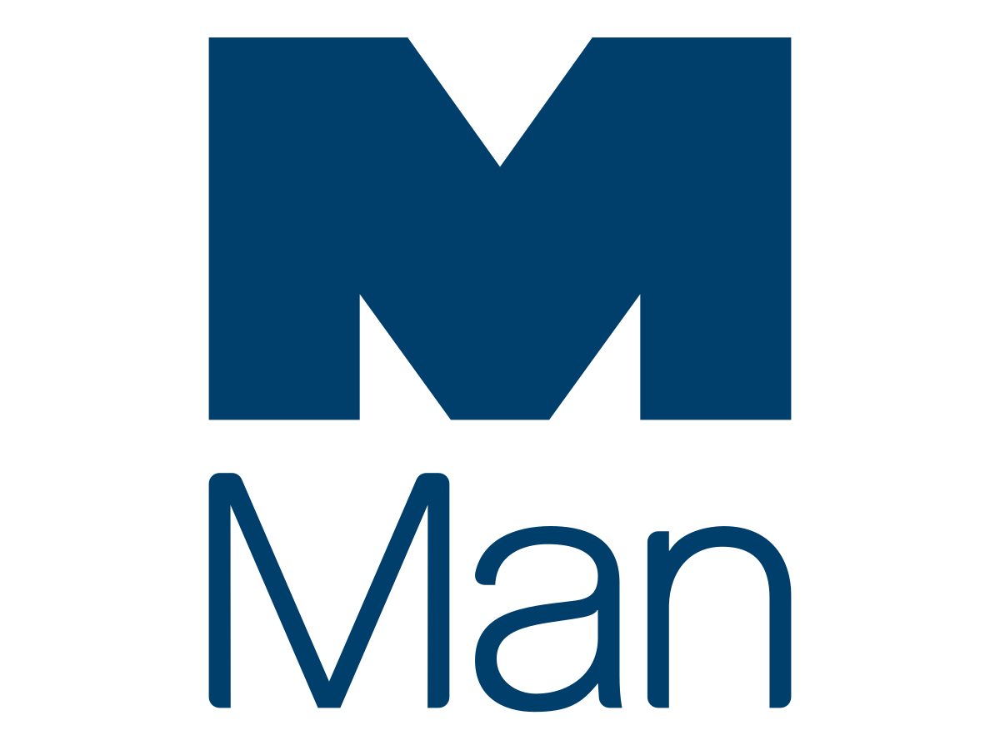

## Table of Contents

## What is Man Group?

Man Group is a company that manages money for other people and organizations. They help their clients invest their money in different ways to try to make it grow. The company started a long time ago in 1783 and is one of the oldest financial companies in the world. They have offices in many countries and work with clients from all over the globe.

They offer different types of investment options, like stocks, bonds, and other financial products. Man Group uses computers and math to help make decisions about where to invest money. This method is called quantitative investing. They believe that using data and technology can help them make better choices and get good results for their clients.

## When was Man Group founded?

Man Group was founded in 1783. This makes it one of the oldest financial companies in the world. The company started a long time ago and has been helping people and organizations with their money ever since.

Over the years, Man Group has grown and now has offices in many different countries. They work with clients from all around the world. The company helps people invest their money in different ways, like stocks and bonds, to try to make it grow.

## What types of investment services does Man Group offer?

Man Group offers different types of investment services to help their clients grow their money. They manage money for people and organizations, and they use computers and math to make decisions about where to invest. This way of investing is called quantitative investing. They look at a lot of data and use technology to try to make the best choices for their clients.

They offer investments in things like stocks, bonds, and other financial products. This means they help their clients put their money into companies, loans to governments or companies, and other ways to make money. Man Group tries to pick the best options to help their clients' money grow over time.

Man Group works with clients from all over the world. They have offices in many countries and help a lot of different people and organizations. By using data and technology, they aim to make smart investment choices and get good results for their clients.

## How has Man Group evolved over the years?

Man Group started a long time ago in 1783, making it one of the oldest financial companies around. Back then, it was all about helping people invest their money in simple ways. Over the years, the company grew bigger and started to work with more people and organizations from different parts of the world. They opened offices in many countries to be closer to their clients and to understand different markets better.

As time went on, Man Group changed the way they did things. They started using computers and math to help make decisions about where to invest money. This way of investing is called quantitative investing. They believed that by looking at a lot of data and using technology, they could make better choices and help their clients' money grow more. Today, Man Group offers many different types of investments like stocks, bonds, and other financial products, always trying to find the best ways to help their clients.

## Who are the key figures in Man Group's leadership?

Man Group is led by a team of key figures who help run the company and make important decisions. The CEO of Man Group is Luke Ellis. He is in charge of the whole company and makes sure it is going in the right direction. He works with other leaders to plan for the future and make sure the company is doing well.

Another important leader is Robyn Grew, who is the President and COO. She helps manage the day-to-day operations of the company and makes sure everything runs smoothly. She works closely with Luke Ellis and other team members to make sure Man Group is successful and helps clients with their investments. Together, these leaders and their team guide Man Group to keep helping people and organizations grow their money.

## What is the market capitalization of Man Group?

Man Group's market capitalization is the total value of all its shares. As of the latest data, Man Group's market cap is around 3.5 billion dollars. This number can change every day because it depends on the price of the company's stock in the market.

Market capitalization is an important measure because it shows how big a company is in terms of money. For Man Group, a market cap of 3.5 billion dollars means it is a large company in the financial industry. Investors look at market cap to understand the size and value of a company like Man Group.

## How does Man Group's performance compare to its competitors?

Man Group does well compared to other companies in the financial industry. It is one of the biggest and oldest companies, started way back in 1783. Man Group manages a lot of money for people and organizations all over the world. Its market cap is around 3.5 billion dollars, which shows it is a big player. Compared to other companies that manage money, Man Group's use of computers and math to make investment choices helps it stand out. This way of investing, called quantitative investing, often gives Man Group good results.

However, Man Group also faces tough competition. Other big companies like BlackRock and Vanguard also manage a lot of money and have their own ways of investing. BlackRock, for example, has a much bigger market cap of around 100 billion dollars. But Man Group's focus on using technology and data can sometimes give it an edge in certain markets. Even though it might not be the biggest, Man Group's long history and smart investment strategies help it stay competitive and keep growing.

## What are the major funds managed by Man Group?

Man Group manages a lot of different funds for people and organizations. One of their biggest funds is the Man AHL fund. This fund uses computers and math to pick investments. It looks at a lot of data to try to make smart choices and help the money in the fund grow. Another important fund is the Man GLG fund. This fund is more focused on [picking](/wiki/asset-class-picking) individual stocks and bonds. It tries to find the best companies and loans to invest in, hoping to make good returns for its investors.

Man Group also has other funds like the Man Numeric fund. This one also uses data and technology to make investment decisions, but it might focus on different types of investments. The Man FRM fund is another big one. It looks at other funds and picks the ones it thinks will do well. By managing these different kinds of funds, Man Group tries to meet the needs of all its clients and help their money grow in different ways.

## What strategies does Man Group employ in its investment approach?

Man Group uses a special way of investing called quantitative investing. This means they use computers and math to help pick where to put their clients' money. They look at a lot of data, like numbers about companies and the economy, to make smart choices. This helps them find good investments in things like stocks and bonds. By using technology and data, Man Group tries to make their clients' money grow over time.

They also have different funds that use different strategies. For example, the Man AHL fund and the Man Numeric fund both use computers to pick investments, but they might focus on different types of investments. The Man GLG fund, on the other hand, picks individual stocks and bonds that they think will do well. Another fund, Man FRM, looks at other funds and picks the ones they think will be successful. By using these different strategies, Man Group can help a lot of different people and organizations with their money.

## How does Man Group integrate technology and data analytics into its operations?

Man Group uses computers and math a lot to help make choices about where to invest money. This way of investing is called quantitative investing. They look at a lot of numbers and information about companies and the economy. By using this data, they try to pick the best investments for their clients. This helps them find good stocks, bonds, and other ways to make money grow. Man Group believes that using technology and data can help them make smarter choices and get better results for the people and organizations they work with.

They also have different funds that use technology in different ways. For example, the Man AHL fund and the Man Numeric fund both use computers to pick investments, but they might focus on different types of investments. The Man GLG fund, on the other hand, picks individual stocks and bonds that they think will do well. Another fund, Man FRM, looks at other funds and picks the ones they think will be successful. By using these different strategies and technology, Man Group can help a lot of different people and organizations with their money.

## What are the recent acquisitions or mergers involving Man Group?

Man Group has grown over the years by buying other companies. One of their recent big moves was buying Numeric Holdings LLC in 2014. Numeric is a company that uses computers and math to help pick investments. By buying Numeric, Man Group got better at using technology to make smart choices about where to put money. This helped them offer more ways for their clients to invest and grow their money.

Another important acquisition was the purchase of Varagon Capital Partners in 2018. Varagon is a company that helps businesses borrow money. By adding Varagon to their group, Man Group could help more companies with their money needs. This made Man Group's services even stronger and helped them work with more types of clients. These acquisitions show how Man Group keeps growing and finding new ways to help people and organizations with their money.

## What are the future growth plans and strategic focuses of Man Group?

Man Group wants to keep growing and helping more people with their money. They plan to do this by using more technology and data to make smart choices about where to invest. They believe that by looking at a lot of information and using computers, they can find the best ways to make their clients' money grow. Man Group also wants to work with more types of clients, like businesses and organizations from all over the world. They will keep opening new offices in different countries to be closer to their clients and understand different markets better.

Another big focus for Man Group is to keep making their funds better. They will keep using different strategies in their funds, like the Man AHL fund and the Man GLG fund, to meet the needs of all their clients. They might also buy other companies that can help them offer more services. By doing this, Man Group hopes to stay a leader in the financial world and keep finding new ways to help people and organizations grow their money.

## References & Further Reading

[1]: Bergstra, J., Bardenet, R., Bengio, Y., & Kégl, B. (2011). ["Algorithms for Hyper-Parameter Optimization."](https://papers.nips.cc/paper/4443-algorithms-for-hyper-parameter-optimization) Advances in Neural Information Processing Systems 24.

[2]: ["Advances in Financial Machine Learning"](https://www.amazon.com/Advances-Financial-Machine-Learning-Marcos/dp/1119482089) by Marcos Lopez de Prado

[3]: ["Evidence-Based Technical Analysis: Applying the Scientific Method and Statistical Inference to Trading Signals"](https://www.amazon.com/Evidence-Based-Technical-Analysis-Scientific-Statistical/dp/0470008741) by David Aronson

[4]: ["Machine Learning for Algorithmic Trading"](https://github.com/stefan-jansen/machine-learning-for-trading) by Stefan Jansen

[5]: ["Quantitative Trading: How to Build Your Own Algorithmic Trading Business"](https://books.google.com/books/about/Quantitative_Trading.html?id=j70yEAAAQBAJ) by Ernest P. Chan