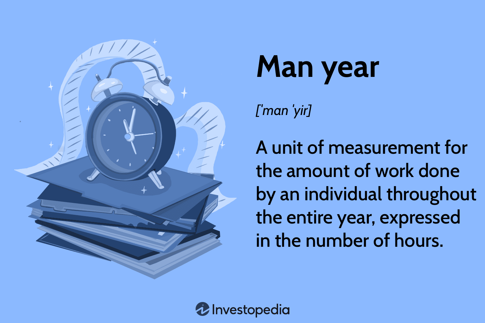

## Table of Contents

## What is the basic definition of a man-year?

A man-year is a unit of work that measures how much one person can do in a year. It is often used in business and project planning to estimate how many people are needed for a job or how long a project will take.

For example, if a project needs 10 man-years to finish, it could mean one person working for 10 years, or 10 people working for one year each. This helps companies plan their resources and timelines better.

## How is a man-year different from a man-hour or man-day?

A man-year, man-hour, and man-day are all units of work, but they measure different amounts of time. A man-hour is the amount of work one person can do in one hour. It's a small unit, often used for short tasks or to break down larger projects into smaller parts. For example, if a job takes 8 man-hours, it could mean one person working for 8 hours or two people working for 4 hours each.

A man-day is bigger than a man-hour but smaller than a man-year. It represents the amount of work one person can do in one day, usually around 8 hours. Man-days are useful for planning daily work schedules or short-term projects. For instance, a project needing 5 man-days might be done by one person working for 5 days or by 5 people working for one day each.

A man-year is the largest of these units and measures the amount of work one person can do in a whole year. It's used for long-term planning and big projects. If a project requires 3 man-years, it could be completed by one person working for 3 years, or by 3 people working for one year each. Man-years help companies understand the overall scope and resource needs of large projects.

## Why is the concept of a man-year important in project management?

The concept of a man-year is important in project management because it helps managers plan big projects. It tells them how much work one person can do in a year. This helps them figure out how many people they need and how long the project will take. For example, if a project needs 10 man-years, they can decide to hire 10 people for one year or 5 people for two years.

Using man-years also helps managers keep track of their resources. They can see if they have enough people to finish the project on time. If they don't, they can hire more people or change the project plan. This way, they can make sure the project stays on track and gets done when it's supposed to.

## Can you provide a simple example of how to calculate man-years for a project?

Let's say a company wants to build a new office building. They think the project will take 12,000 hours of work in total. To figure out how many man-years that is, they need to know how many hours one person works in a year. If one person works 2,000 hours a year (that's about 40 hours a week for 50 weeks), they can calculate the man-years like this: 12,000 hours divided by 2,000 hours per year equals 6 man-years.

This means the company needs the equivalent of 6 people working full-time for one year to finish the building. They could choose to hire 6 people to work for one year, or maybe 3 people to work for two years, or any other combination that adds up to 6 man-years. This helps the company plan how many workers they need and how long the project will take.

## What are the common industries that use the man-year metric?

Many industries use the man-year metric to help plan big projects and manage resources. The construction industry often uses man-years to figure out how many workers they need to build things like houses, office buildings, or bridges. They need to know how much work one person can do in a year to plan how many people to hire and how long the project will take.

The software development industry also uses man-years a lot. When making new apps or software, they need to know how much work it will take to code, test, and finish the project. By using man-years, they can plan how many programmers to hire and how long the project will last. This helps them keep the project on track and within budget.

Other industries like manufacturing and engineering also use man-years. In manufacturing, man-years help plan how many workers are needed to make products on a production line. In engineering, man-years are used to estimate the time and resources needed for designing and building new machines or systems. Using man-years helps these industries plan better and make sure projects are completed on time.

## How does the man-year concept help in budgeting and resource allocation?

The man-year concept helps in budgeting by giving a clear idea of how many people are needed for a project and for how long. If a project needs 5 man-years, the company can figure out how much it will cost to pay those workers for that time. This helps them make a budget that includes the right amount of money for salaries. By knowing the man-years needed, the company can also plan how much money to set aside for other costs like materials or equipment.

Man-years also help with resource allocation by showing how to spread out the work. If a project needs 10 man-years, the company can decide to have 10 people work for one year or 5 people work for two years. This way, they can make sure they have enough workers at the right time to keep the project moving. Using man-years helps the company use their people and money in the best way to finish the project on time and within budget.

## What are the potential pitfalls or limitations of using man-years as a metric?

One problem with using man-years is that it assumes everyone works at the same speed and has the same skills. But in real life, people work differently. Some might be faster or better at certain tasks than others. This can make it hard to guess how long a project will really take. If the company thinks one person can do a year's worth of work but they can't, the project might take longer than planned.

Another issue is that man-years don't account for things like holidays, sick days, or other times when people can't work. If a project is planned using man-years, it might not leave enough time for these breaks. This can lead to delays and extra costs. Also, man-years can make it seem like adding more people will always make the project go faster, but sometimes more people can actually slow things down because they need time to learn and work together.

## How can man-year calculations be adjusted for part-time workers or varying productivity levels?

To adjust man-year calculations for part-time workers, you need to figure out how many hours they work in a year. If a part-time worker works 20 hours a week and there are 50 working weeks in a year, they work 1,000 hours a year. This is half of a full-time worker's 2,000 hours. So, if a project needs 10 man-years and you use part-time workers, you would need 20 part-time workers to equal the same amount of work as 10 full-time workers.

For varying productivity levels, you can use a productivity [factor](/wiki/factor-investing). If one worker is 20% more productive than average, you can count them as 1.2 man-years instead of just one. This means if a project needs 5 man-years and you have a worker who is 20% more productive, you could count them as doing the work of 1.2 people. This helps to make the man-year calculations more accurate by taking into account that not everyone works at the same speed or with the same skill level.

## What are some advanced methods or tools used to forecast man-year requirements?

One advanced method to forecast man-year requirements is using project management software. These tools, like Microsoft Project or Primavera P6, help break down a big project into smaller tasks. They can show how long each task will take and how many people are needed for each one. By adding up all the tasks, the software can calculate the total man-years needed for the whole project. This makes it easier to plan and see if more people are needed or if the timeline needs to change.

Another method is using historical data and benchmarks. Companies can look at past projects that were similar to the new one. They can see how many man-years those projects took and use that information to guess how many man-years the new project will need. This is called benchmarking. It helps make more accurate predictions because it's based on real data from before. By comparing new projects to old ones, companies can better plan how many people they need and how long the project will take.

## How do global standards or regulations impact the use of man-year calculations?

Global standards or regulations can affect how companies use man-year calculations by setting rules about how much people can work. For example, some countries have laws about the maximum number of hours people can work in a week. These laws can change how many man-years a project needs because companies have to follow them. If a country says workers can only work 35 hours a week instead of 40, the man-year calculation would need to be adjusted to account for fewer working hours.

Also, international standards like those from the International Organization for Standardization (ISO) can influence how companies plan projects. ISO standards might require certain levels of quality or safety, which can mean more work or more people are needed. This can change the man-year calculations because the project might take longer or need more resources to meet these standards. Companies have to think about these rules when they plan their projects and calculate man-years to make sure they follow the law and meet the standards.

## Can you discuss a case study where man-year calculations significantly influenced project outcomes?

In a case study from the construction industry, a company was planning to build a large shopping mall. They used man-year calculations to figure out how many workers they needed and how long the project would take. They estimated the project would need 50 man-years to finish. They decided to hire 50 workers for one year to get the job done on time. But they didn't account for holidays and sick days, so the project ended up taking longer than planned. They had to hire more workers halfway through to catch up, which cost more money and delayed the opening of the mall.

In another case from the software development industry, a tech company was developing a new app. They calculated that the project would need 10 man-years to complete. They planned to have 10 programmers work for one year. But they also used historical data from similar projects to adjust their calculations. They found that their programmers were usually 15% more productive than average, so they adjusted the man-year calculation to 8.7 man-years. This allowed them to hire fewer programmers and finish the project earlier than expected, saving money and time. This case shows how using man-year calculations with adjustments for productivity can lead to better project outcomes.

## What future trends might affect the relevance or application of the man-year concept in project management?

In the future, automation and [artificial intelligence](/wiki/ai-artificial-intelligence) might change how we use the man-year concept. As more tasks get done by machines, the amount of work people need to do might go down. This could mean projects need fewer man-years because machines can work faster and don't need breaks. Companies will have to think about how much work is done by people and how much is done by machines when they plan their projects. This could make man-year calculations more complicated but also more accurate if they include both human and machine work.

Another trend that might affect man-year calculations is remote work and flexible schedules. More people are working from home or at different times, which can change how many hours they work in a year. Companies might need to adjust their man-year calculations to account for these changes. They might have to use new tools or methods to figure out how much work part-time or remote workers can do in a year. This could make man-year calculations more flexible and better at showing the real amount of work people can do.

## What is the understanding of Man-Year in Work Measurement?

A man-year is a standardized unit of work measurement that quantifies the labor contribution of a single individual over the [course](/wiki/best-algorithmic-trading-courses) of a year. This concept is fundamental in gauging productivity and is particularly useful across various industries for comparing workloads and performance metrics. Typically expressed in terms of hours, a man-year encapsulates all the working hours an employee contributes in a year. The standard full-time work schedule can be used to reflect this, often defined as 2,080 hours per year in countries like the United States, accounting for a 40-hour work week.

The calculation of a man-year is often adjusted according to specific industry standards or geographic labor laws, factoring in public holidays, annual leave, and any other non-working days. This variability necessitates a customized approach when setting the parameters for what constitutes a complete man-year. Sometimes, organizations might use formulas to determine this figure based on scheduled workdays and expected productivity levels. 

For instance, if a company operates with a 5-day work week and allows for 10 public holidays and 20 days of annual leave, the man-year calculation would account for these non-working days as follows:

$$
\text{Man-Year (hours)} = (\text{Total weeks per year} \times \text{working days per week} \times \text{hours per day}) - (\text{Total public holidays} \times \text{hours per day}) - (\text{Annual leave days} \times \text{hours per day})
$$

In Python, this can be calculated as:
```python
def calculate_man_year(hours_per_day=8, working_days_per_week=5, public_holidays=10, annual_leave_days=20):
    total_days_per_year = 365
    total_weeks_per_year = total_days_per_year / 7
    working_days_per_year = total_weeks_per_year * working_days_per_week
    man_year_hours = (working_days_per_year * hours_per_day) - (public_holidays * hours_per_day) - (annual_leave_days * hours_per_day)
    return man_year_hours

man_year = calculate_man_year()
```

Understanding and applying the concept of a man-year is crucial in organizational contexts to facilitate both performance assessment and fiscal planning. It allows managers to effectively estimate labor costs and allocate resources by providing a consistent measure of work output. Furthermore, it assists in long-term planning by offering a template against which labor efficiency and output can be measured, thereby supporting strategic decision-making and optimizing workforce management.

## What are the key performance metrics in algorithmic trading?

Algorithmic trading utilizes a systematic method of executing orders using predefined instructions and quantitative data, enabling transactions at exceptional speed and precision. To evaluate the effectiveness of these algorithms, several key performance metrics provide insights into their financial and risk management capabilities.

One principal metric employed is financial viability, which measures the profitability of an algorithm over time. This involves analyzing the profit and loss (P&L) generated by the trading strategies. A positive and consistent P&L trend indicates robust financial health.

The Sharpe Ratio is another crucial metric, quantifying risk-adjusted returns. It is calculated by subtracting the risk-free rate of return from the portfolio's return and dividing the result by the standard deviation of the portfolio's excess return:

$$
\text{Sharpe Ratio} = \frac{\text{Return} - \text{Risk-Free Rate}}{\text{Standard Deviation of Return}}
$$

A higher Sharpe Ratio suggests more favorable risk-adjusted returns, a desirable quality in trading algorithms as it balances potential gains against the risks taken.

Winning percentage is a simple yet effective metric, indicating the proportion of profitable trades. A higher winning percentage conveys a strong likelihood of success in transactions. However, this must be considered alongside other metrics, as a high winning rate does not necessarily translate into high profitability without substantial returns per trade.

Maximum drawdown is vital in assessing the risk of loss. It quantifies the largest peak-to-trough decline in an investment portfolio, offering insights into the worst-case scenario pertaining to capital risk during a specific period. Lower maximum drawdowns are preferable, indicating better risk management and capital preservation.

Volatility represents the degree of variation of returns over time. In the context of [algorithmic trading](/wiki/algorithmic-trading), lower [volatility](/wiki/volatility-trading-strategies) implies stability in returns, while higher volatility might signal increased risk and unpredictability. Managing volatility is crucial, as it directly impacts the algorithm's risk profile and overall performance.

These metrics help traders optimize strategies by providing a clear picture of return efficiency and risk management. By comprehensively understanding these indicators, traders can refine algorithms to achieve higher profitability while mitigating risks, ultimately enhancing the strategic execution of transactions.

## References & Further Reading

[1]: Bergstra, J., Bardenet, R., Bengio, Y., & Kégl, B. (2011). ["Algorithms for Hyper-Parameter Optimization."](https://dl.acm.org/doi/10.5555/2986459.2986743) Advances in Neural Information Processing Systems 24.

[2]: ["Advances in Financial Machine Learning"](https://www.amazon.com/Advances-Financial-Machine-Learning-Marcos/dp/1119482089) by Marcos Lopez de Prado

[3]: ["Evidence-Based Technical Analysis: Applying the Scientific Method and Statistical Inference to Trading Signals"](https://www.amazon.com/Evidence-Based-Technical-Analysis-Scientific-Statistical/dp/0470008741) by David Aronson

[4]: ["Machine Learning for Algorithmic Trading"](https://github.com/stefan-jansen/machine-learning-for-trading) by Stefan Jansen

[5]: ["Quantitative Trading: How to Build Your Own Algorithmic Trading Business"](https://www.amazon.com/Quantitative-Trading-Build-Algorithmic-Business/dp/1119800064) by Ernest P. Chan