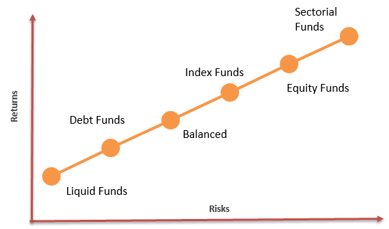

In the intricate world of investments, selecting the right type of investment account can be pivotal for maximizing returns while managing risks. Investors today have an array of options, each with distinct attributes that cater to varying needs and objectives. Through this article, we aim to compare managed accounts, mutual funds, and algorithmic trading, three popular investment vehicles, thereby aiding investors in making informed decisions.

Managed accounts offer a personalized approach to investment, allowing individual investors to have a tailored portfolio managed by professional money managers. This method appeals to those seeking bespoke strategies aligned with specific financial goals and risk tolerances. On the other hand, mutual funds provide a collective investment strategy, pooling money from various investors to invest in a diversified portfolio. This structure offers benefits such as professional management and diversification at a relatively low cost, though it often lacks the personalization found in managed accounts.



Algorithmic trading represents a more technologically driven approach, utilizing advanced mathematical models and computer algorithms to execute trades. This vehicle emphasizes efficiency and speed, minimizing human intervention and potentially leading to more objective decision-making.

Understanding the unique characteristics, benefits, and limitations of these investment types is crucial. Managed accounts, mutual funds, and algorithmic trading each present distinct opportunities and challenges, which investors must weigh according to their individual preferences, financial goals, and risk tolerances. By exploring these options, investors can better align their investment strategies with their personal objectives, ultimately leading to more effective management of their portfolios.

## Table of Contents

## Understanding Managed Accounts

Managed accounts represent a personalized investment solution where individual investors own portfolios managed by professional money managers. This structure contrasts with investment vehicles like mutual funds, where assets from multiple investors are pooled together. The hallmark of managed accounts is the tailored investment strategy crafted to align with the individual investor's financial goals and risk tolerance.

The key advantage of a managed account lies in its bespoke approach. A professional money manager designs a strategy that caters to the investor's unique financial situation and objectives. This means considering variables such as the investor's age, income, assets, liabilities, and investment time horizon. The manager actively adjusts the portfolio to optimize returns while mitigating risks, offering a level of personalization that pooled investment funds such as mutual funds typically do not provide.

Managed accounts also afford the investor full ownership of the underlying securities, granting greater transparency and control over the investments compared to collective investment vehicles. For example, an investor in a managed account can directly see all the securities held, their cost basis, and performance metrics, providing clear insight into how the investment strategy is being implemented.

This tailored approach is particularly attractive to high net-worth individuals. They often require sophisticated and customized investment strategies that accommodate complex financial needs, which managed accounts can provide. The ability to influence and have oversight over the investment decisions within their portfolios allows these investors to ensure that their specific financial circumstances and objectives are precisely addressed.

Professional management within managed accounts also includes tax-efficient investment practices. Money managers can strategically manage the portfolio to minimize taxable events, such as capital gains. This includes techniques like tax-loss harvesting, where securities that have experienced a loss are sold to offset capital gains elsewhere in the portfolio.

In summary, managed accounts offer a personalized and hands-on investment strategy that can be finely tuned to an investor's individual needs, making them a preferred option for those seeking tailored financial management and full control over their investment portfolio. These accounts combine professional oversight with a bespoke approach to risk management and investment strategy execution, appealing particularly to those with substantial financial resources.

## Exploring Mutual Funds

Mutual funds are investment vehicles that aggregate capital from various investors into a single pool, which is then used to construct a diversified portfolio of stocks, bonds, or other securities. This collective investment structure offers individuals the benefits of diversification, professional management, and economies of scale. One of the key advantages of investing in mutual funds is the ease of access to professional management. Fund managers are responsible for making decisions about asset allocation, buying and selling securities, and monitoring the fund's overall performance. This level of management is particularly appealing to investors who prefer a hands-off approach and lack the time or expertise to manage their investments actively.

Furthermore, mutual funds provide opportunities for diversification, which can mitigate risk. By investing in a variety of assets, mutual funds can spread risk across different securities and markets, reducing the impact of any single underperforming investment on the overall portfolio. This diversification is achieved at a relatively low cost compared to constructing a similar diversified portfolio independently.

Despite their advantages, mutual funds exhibit certain limitations. Investors in mutual funds may encounter constraints regarding personalization and control over investment decisions. The fund's strategy is typically predefined by the management team, which means individual investors have limited influence over the selection of specific securities or sectors within the portfolio. Additionally, mutual funds operate on a pooled investment approach, leading to a standardized experience for all investors in the fund, regardless of their specific financial goals or risk tolerance levels.

In summary, mutual funds serve as an accessible entry point for investors seeking diversification and professional management. However, their standardized approach may not fulfill the needs of those requiring personalized investment strategies or greater control over their investment decisions.

## The Role of Algorithmic Trading

Algorithmic trading involves leveraging sophisticated mathematical models and computer algorithms to facilitate the buying and selling of financial securities at high speeds and volumes. This method of trading capitalizes on the computational power and precision of algorithms, which can process vast datasets and execute trades within milliseconds, thereby often surpassing human capabilities.

One of the primary advantages of [algorithmic trading](/wiki/algorithmic-trading) is the minimization of human intervention and emotion. Human traders are susceptible to biases and emotional influences that can disrupt rational decision-making. Algorithms, on the other hand, operate based on logic and predefined criteria, allowing for more consistent and objective trading practices. By adhering strictly to data-driven strategies, algorithmic trading can help eliminate impulsive decisions that are often fueled by fear or greed.

Algorithmic trading is prominently utilized by institutional investors due to its capability to quickly adapt to market conditions and exploit short-lived trading opportunities. However, the accessibility of algorithmic trading tools and platforms has been on the rise for individual investors. This increase in accessibility is driven by technological advancements and the availability of user-friendly platforms that offer algorithmic solutions even to those with minimal coding experience.

In the context of algorithmic trading, numerous strategies can be employed, such as statistical [arbitrage](/wiki/arbitrage), [market making](/wiki/market-making), and [trend following](/wiki/trend-following). Each strategy is designed to maximize returns by leveraging specific market conditions and patterns. For instance, [statistical arbitrage](/wiki/statistical-arbitrage) involves identifying pricing inefficiencies across related securities and executing trades to capitalize on the temporary divergence.

The core component of algorithmic trading is the trading algorithm itself, which comprises a series of rules based on factors like timing, price, quantity, or any model's mathematical criteria. Here is a basic example of a simple moving average crossover strategy implemented in Python:

```python
import pandas as pd

# Sample data
data = {'close': [100, 102, 105, 107, 110, 108, 110, 112]}
df = pd.DataFrame(data)

# Calculate moving averages
df['SMA_3'] = df['close'].rolling(window=3).mean()
df['SMA_5'] = df['close'].rolling(window=5).mean()

# Define buy/sell signals
df['signal'] = 0
df['signal'][df['SMA_3'] > df['SMA_5']] = 1  # Generate buy signal when SMA_3 > SMA_5
df['signal'][df['SMA_3'] < df['SMA_5']] = -1  # Generate sell signal when SMA_3 < SMA_5

print(df[['close', 'SMA_3', 'SMA_5', 'signal']])
```

This code illustrates a basic strategy using a short-term moving average (SMA_3) and a longer-term moving average (SMA_5). A buy signal is generated when the shorter moving average crosses above the longer moving average, and a sell signal is generated when the opposite occurs. This exemplifies how algorithmic trading can systematically implement trading strategies using historical price data.

As algorithmic trading continues to evolve, its role in the investment landscape will likely expand, offering both potential benefits and challenges. While it provides opportunities for strategic automation and efficiency, practitioners need to be aware of the inherent risks, such as the possibility of algorithmic glitches or flash crashes that can occur due to the extremely high pace of trading activities.

## Managed Accounts vs. Mutual Funds: Key Differences

Managed accounts and mutual funds represent two distinct approaches to investment management, each with its own set of characteristics, advantages, and limitations that cater to different investor needs. A key distinction between these two lies in the level of personalization and control, tax considerations, and minimum investment requirements.

**Personalization and Control**

Managed accounts provide individualized investment strategies tailored to the specific financial goals, risk tolerance, and preferences of individual investors. With a managed account, the investor retains ownership of the securities, allowing for adjustments to the portfolio as needed. This level of personalization often makes managed accounts attractive to investors seeking bespoke investment solutions.

In contrast, mutual funds operate on a collective investment model where funds from multiple investors are pooled together to form a diversified portfolio managed according to a predefined strategy. Individual investors have little control over the specific securities within the fund and cannot tailor the investment strategy to their individual needs. The manager of the mutual fund makes decisions based on the fund's objectives, rather than the individual preferences of each investor.

**Tax Considerations**

Another differentiation between managed accounts and mutual funds is their approach to tax implications. Managed accounts can be structured to implement tax-efficient strategies, such as tax-loss harvesting and strategic withdrawals, which can optimize an investor's after-tax returns. Since investors in a managed account own the underlying securities directly, they can manage capital gains and losses according to their personal tax situations.

Mutual funds, on the other hand, are obligated to distribute any income earned from dividends or interest and any capital gains realized from sales of securities within the fund to shareholders annually. These distributions are taxable events for the investors, regardless of whether they reinvest them. As a result, investors in mutual funds may face unexpected tax liabilities, especially in funds with high turnover rates.

**Minimum Investment**

The minimum investment threshold represents another notable difference between the two. Managed accounts typically demand a higher initial investment, as they are designed for high net-worth individuals who seek a degree of customization and personal service that justifies the higher entry cost. This higher barrier to entry can exclude smaller investors from accessing managed accounts.

Conversely, mutual funds generally require lower minimum investments, making them accessible to a broader range of investors. This lower entry point allows individuals to benefit from professional management and diversification without the need for significant capital, aligning with the investing needs of many retail investors.

In summary, the choice between managed accounts and mutual funds should be aligned with an investor's specific financial objectives, desired level of control and customization, tax strategy, and available investment capital. Each option offers distinct advantages and drawbacks, making it crucial for investors to evaluate their personal circumstances before committing to a specific investment vehicle.

## Managed Accounts vs. Algo Trading

Managed accounts and algorithmic trading represent two fundamentally different approaches to investment management, each appealing to distinct investor preferences and strategic objectives. 

### Customization vs. Automation

Managed accounts prioritize customization, offering personalized investment strategies tailored to the individual investor's financial goals, risk tolerance, and unique circumstances. In this setup, human portfolio managers craft bespoke portfolios, taking into account market conditions and personal preferences. This level of customization allows investors to have a significant degree of control over the assets included in their portfolios, aligning closely with their specific requirements. For instance, a managed account can exclude industries or companies based on ethical considerations or can focus on specific asset classes that the investor wishes to prioritize.

Algorithmic trading, on the other hand, relies heavily on automation and speed. This approach employs sophisticated computer programs and mathematical models to execute trades at rapid speeds, often across multiple markets simultaneously. Algorithms can analyze vast quantities of data to identify trading opportunities that might be imperceptible to human analysts. This speed and efficiency can lead to advantageous positions in the market, capturing fleeting opportunities that arise from short-term fluctuations in asset prices. For example, a basic algorithm for trading might be configured in Python as follows:

```python
# Example of a simple moving average trading strategy
import numpy as np

def simple_moving_average(prices, window_size):
    return np.convolve(prices, np.ones(window_size), 'valid') / window_size

# Assume prices is a list of stock prices and window_size is set by the trader
prices = [150, 152, 151, 153, 155, 157, 156, 158]
window_size = 3

sma = simple_moving_average(prices, window_size)
print(sma)
```

This code calculates the simple moving average (SMA) of stock prices, which can be used to determine buy or sell signals based on price trends.

### Human Oversight vs. Machine-Driven Decisions

Human oversight in managed accounts can be invaluable, especially when market conditions are volatile or uncertain. Experienced portfolio managers can apply subjective judgment and qualitative analysis that algorithms may not account for. They can make decisions based on a blend of quantitative data and intuitive insights gained from years of experience in financial markets.

In contrast, algorithmic trading minimizes human intervention, which can be beneficial in reducing emotional biases that often affect trading decisions. Algorithms are designed to operate without the influence of psychological factors such as fear and greed, potentially leading to more objective and consistent decision-making processes. Machine-driven decisions are based solely on pre-defined rules and statistical models, which might miss out on qualitative assessments but excel in disciplined, rule-based trading strategies.

In conclusion, understanding whether to opt for managed accounts or algorithmic trading depends largely on individual investor goals. Those seeking personalized strategies and a human touch may lean toward managed accounts. Individuals who prioritize efficiency, speed, and data-driven decisions might find algorithmic trading more aligned with their investment philosophy. Making a choice between these two requires a careful assessment of the investor’s preferences for customization, speed, and the level of human oversight desired in their investment strategy.

## Mutual Funds vs. Algo Trading

Mutual funds and algorithmic trading represent two distinct investment strategies, each with its own methodology and benefits. Mutual funds typically operate on the principle of diverse asset allocation, which involves spreading investments across various asset classes, such as stocks, bonds, and other securities. This diversification aims to mitigate risk by balancing potential losses in some investments with gains in others, making mutual funds a popular choice for investors seeking steady returns with lower risk exposure.

Algorithmic trading, on the other hand, prioritizes technical analysis and rapid execution of trades. This strategy uses complex algorithms and computer software to identify trading opportunities in financial markets, often executing trades at speeds and frequencies beyond human capability. By capitalizing on minor price fluctuations, algorithmic trading seeks to maximize profits through short-term strategies, such as high-frequency trading or arbitrage.

The choice between mutual funds and algorithmic trading often depends on the investor's preference for active versus passive management. Mutual funds, with their long-term, diversified investment approach, are typically categorized as a form of active management, as fund managers actively select and adjust the portfolio's holdings to achieve the fund's objectives. In contrast, algorithmic trading can be seen as a form of passive management in the sense that it relies heavily on automated systems to manage trades without ongoing human intervention.

Investors evaluating these options must consider their investment goals, risk tolerance, and time commitment. Mutual funds offer a more hands-off approach, appealing to those who prefer to rely on the expertise of fund managers for portfolio management. Conversely, algorithmic trading might appeal to individuals or institutions that are comfortable with the intricacies of automated trading systems and are willing to accept higher levels of risk for potentially greater short-term returns.

Ultimately, both investment strategies serve distinct purposes and can be aligned with different investor preferences, highlighting the importance of understanding one's investment objectives and risk profile when selecting between mutual funds and algorithmic trading.

## Conclusion

When choosing between managed accounts, mutual funds, and algorithmic trading, investors must carefully evaluate their financial goals, risk tolerance, and investment preferences. Each investment vehicle presents distinct advantages that can be strategically aligned with an investor's objectives. 

Managed accounts provide personalization and direct control, appealing to investors who seek tailored strategies and tax-efficient management. These accounts can be an optimal choice for high-net-worth individuals who prioritize bespoke solutions and are willing to meet higher minimum investment requirements.

Mutual funds offer diversification and professional management at a relatively low cost, making them suitable for investors who prefer a straightforward approach with pooled resources. The ease of access and lower barriers to entry also make mutual funds attractive to a broader range of investors.

Algorithmic trading introduces automation and speed, minimizing emotional biases and allowing for high-frequency trading. This method can be appealing to those who favor quantitative analysis and rapid decision-making, driven by advanced mathematical models and technological integration.

To achieve better investment outcomes, it is essential to understand the strengths and limitations of each option. By aligning the choice of investment vehicle with personal financial objectives, investors can navigate the intricate landscape of investments more effectively.

## References & Further Reading

[1]: Rutledge, M. D., & Dimitriou, D. (2009). ["Exchange-Traded Funds."](https://www.annualreviews.org/content/journals/10.1146/annurev-financial-110716-032538) CFA Institute Research Foundation Publications.

[2]: Keller, R. (2006). ["Mutual Funds: Risk and Performance Analysis for Decision Making."](https://papers.ssrn.com/sol3/papers.cfm?abstract_id=2637632) Routledge.

[3]: Grinold, R. C., & Kahn, R. N. (2000). ["Active Portfolio Management: A Quantitative Approach for Producing Superior Returns and Controlling Risk."](https://www.amazon.com/Active-Portfolio-Management-Quantitative-Controlling/dp/0070248826) McGraw-Hill.

[4]: Treynor, J. L. (1965). ["How to Rate Management of Investment Funds."](https://onlinelibrary.wiley.com/doi/10.1002/9781119196679.ch10) Harvard Business Review.

[5]: Narang, R. K. (2013). ["Inside the Black Box: A Simple Guide to Quantitative and High-Frequency Trading."](https://onlinelibrary.wiley.com/doi/book/10.1002/9781118662717) Wiley.

[6]: Pardo, R. (2008). ["The Evaluation and Optimization of Trading Strategies."](https://onlinelibrary.wiley.com/doi/book/10.1002/9781119196969) Wiley Trading.