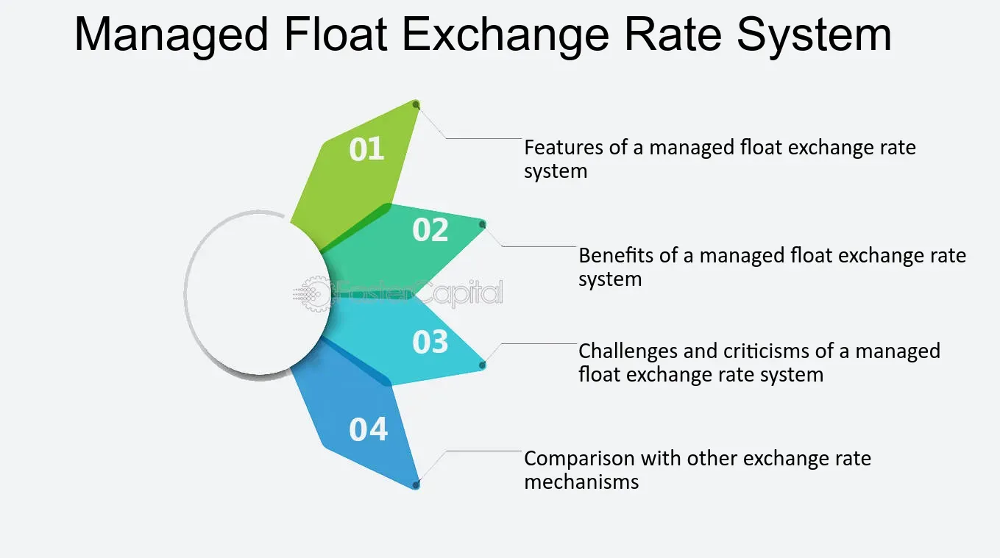

## Table of Contents

## What is a managed currency?

A managed currency is a type of money where the government or a central bank controls its value. Instead of letting the market decide how much the currency is worth, the government steps in to keep the value stable or to make it change in a certain way. This can be done by setting rules on how much the currency can change in value or by buying and selling the currency to influence its price.

Countries might choose to manage their currency for different reasons. For example, they might want to keep their money stable to help their economy grow, make it easier to trade with other countries, or to control inflation. However, managing a currency can be tricky and sometimes lead to problems if not done carefully. It requires a lot of planning and can be expensive for the government to keep up.

## How does a managed currency differ from a free-floating currency?

A managed currency and a free-floating currency are different in how their values are decided. A managed currency's value is controlled by the government or a central bank. They might set rules or buy and sell the currency to keep its value stable or change it in a specific way. This means the government has a big say in what the currency is worth. On the other hand, a free-floating currency's value is decided by the market. It goes up or down based on what people think it's worth and how much they want to buy or sell it. There's no government control over its value.

The main reason countries choose to manage their currency is to keep it stable, which can help their economy and make trading with other countries easier. However, managing a currency can be hard and costly. It needs a lot of planning and resources to keep the value where the government wants it. With a free-floating currency, the value can change a lot, which can be good or bad. It can help the economy adjust quickly to changes, but it can also make things unpredictable. People and businesses have to be ready for the currency's value to go up or down without warning.

## What are the primary mechanisms used to manage a currency?

Governments and central banks use different ways to manage a currency. One way is by setting a fixed exchange rate. This means they decide that their currency should be worth a certain amount compared to another currency, like the US dollar. To keep this rate, they might buy or sell their own currency in the market. If their currency is getting too weak, they buy it to make it stronger. If it's getting too strong, they sell it to make it weaker. Another way is by using a currency band. This means they let the currency's value move up and down but only within certain limits. If it goes outside those limits, the government steps in to bring it back.

Another important way to manage a currency is through interest rates. If a country raises its interest rates, it can make its currency more attractive to investors because they can get a better return on their money. This can make the currency stronger. On the other hand, lowering interest rates can make the currency weaker because it's less attractive to investors. Governments and central banks also use their foreign exchange reserves to manage the currency. These are stocks of foreign currencies that they can buy or sell to influence the value of their own currency. By using these reserves, they can help keep their currency stable or push it in the direction they want.

## Who typically manages a currency and what are their roles?

The job of managing a currency usually falls to the central bank of a country or to the government itself. The central bank is like a big boss that looks after the country's money. It decides things like how much money should be in the economy and what the interest rates should be. The government also has a say, especially when it comes to setting rules about the currency's value or making big decisions about economic policy. Both the central bank and the government work together to keep the currency stable and help the economy grow.

Their main roles include setting and maintaining the value of the currency. This can mean deciding on a fixed exchange rate or allowing the currency to move within a certain range. They do this by buying and selling the currency in the market or by changing interest rates. Another important role is managing the country's foreign exchange reserves. These are like a savings account in different currencies that the central bank can use to influence the value of their own currency. By carefully using these tools, the central bank and government try to keep the currency stable, control inflation, and make it easier for the country to trade with others.

## What are the economic goals that a managed currency aims to achieve?

A managed currency aims to help the economy in a few big ways. One main goal is to keep the value of the currency stable. When the currency stays steady, it can make trading with other countries easier. Businesses know what to expect, and they can plan better. This stability can also make people feel more confident about the economy, which can lead to more spending and investment. Another goal is to control inflation. If the currency is managed well, it can help keep prices from going up too fast. This is good for everyone because it means the money they earn keeps its value.

Another important goal of a managed currency is to help the country's economy grow. When the government or central bank manages the currency, they can make it easier for the country to sell its products to other countries. A stable currency can make the country's goods cheaper and more attractive to buyers from other places. This can lead to more jobs and a stronger economy. But managing a currency is not easy, and it can be costly. The government has to be careful and plan well to make sure their efforts to manage the currency actually help the economy grow and stay healthy.

## Can you explain the process of currency intervention in a managed currency system?

Currency intervention in a managed currency system is when the government or the central bank steps in to change the value of their money. They do this by buying or selling their own currency in the market. If they think their currency is too weak, they will use their foreign exchange reserves to buy their own currency. This makes the demand for their currency go up, which can make it stronger. If they think their currency is too strong, they will sell it. This increases the supply of their currency, which can make it weaker. It's like trying to balance a seesaw by adding or taking away weight on one side.

The goal of currency intervention is to keep the value of the currency stable or to make it move in a way that helps the economy. For example, if the country wants to make its goods cheaper for other countries to buy, they might let their currency get a little weaker. Or if they want to keep prices from going up too fast at home, they might try to make their currency stronger. The central bank and the government have to watch the market closely and decide when and how much to intervene. It's a careful balancing act because if they do it too much or not enough, it can cause problems for the economy.

## What are the potential advantages of a managed currency for a country's economy?

A managed currency can help a country's economy by keeping the value of the money stable. When the currency stays steady, it makes it easier for businesses to plan and trade with other countries. They know what to expect, and this can make them feel more confident about the future. This stability can also help keep prices from going up too fast, which is good for everyone because it means their money keeps its value. When people feel confident and prices are stable, they are more likely to spend and invest, which can help the economy grow.

Another advantage of a managed currency is that it can make a country's products cheaper and more attractive to buyers from other places. If the government or central bank makes the currency a little weaker, it can help the country sell more goods abroad. This can lead to more jobs and a stronger economy. By carefully managing the currency, the government can also control inflation and make sure the economy stays healthy. But it's important for them to do this carefully because managing a currency can be tricky and costly.

## How does a managed currency impact inflation and interest rates?

A managed currency can help control inflation by keeping the value of the money stable. When the government or central bank manages the currency, they can stop it from getting too weak or too strong. If the currency stays steady, it can keep prices from going up too fast. This is good because it means people's money keeps its value. If the currency gets too weak, prices can go up a lot, which is called inflation. By managing the currency, the government can help keep inflation under control and make sure the economy stays healthy.

Managing a currency can also affect interest rates. If the government wants to make the currency stronger, they might raise interest rates. When interest rates go up, it can make the currency more attractive to investors because they can get a better return on their money. This can help make the currency stronger. On the other hand, if the government wants to make the currency weaker, they might lower interest rates. Lower interest rates can make the currency less attractive to investors, which can help make it weaker. By changing interest rates, the government can influence the value of the currency and help the economy grow.

## What are the challenges and risks associated with managing a currency?

Managing a currency can be tricky and risky. One big challenge is that it takes a lot of planning and resources. The government or central bank has to keep a close eye on the market and decide when to buy or sell the currency to keep its value stable. This can be expensive because they need to use their foreign exchange reserves, which are like a big savings account in other currencies. If they run out of these reserves, they might not be able to keep managing the currency, and it could lead to big problems for the economy.

Another risk is that if the government doesn't manage the currency well, it can cause more harm than good. For example, if they try to keep the currency too strong, it might make the country's goods too expensive for other countries to buy. This can hurt businesses and lead to fewer jobs. On the other hand, if they let the currency get too weak, it can cause prices to go up a lot at home, which is called inflation. This can make life harder for people because their money doesn't go as far. So, the government has to be very careful and find the right balance to help the economy grow and stay healthy.

## How do international trade and foreign exchange markets react to a managed currency?

When a country manages its currency, it can affect how it trades with other countries. If the government makes the currency weaker, it can make the country's products cheaper for other countries to buy. This can help the country sell more goods abroad and make more money from trade. But if the currency is too weak, other countries might think it's not fair and put up barriers to stop buying those goods. On the other hand, if the government makes the currency stronger, it can make the country's products more expensive for other countries. This might make it harder to sell goods abroad, but it can also make it cheaper to buy things from other countries.

The foreign exchange markets also react to a managed currency. These markets are where people and businesses buy and sell different currencies. When a government steps in to manage its currency, it can cause big changes in these markets. If the government buys its own currency to make it stronger, it can make other currencies weaker in comparison. This can cause a lot of ups and downs in the market, and traders might try to guess what the government will do next. If the government sells its currency to make it weaker, it can make other currencies stronger. This can also lead to a lot of changes and uncertainty in the market.

## What historical examples illustrate the success or failure of managed currency systems?

One example of a successful managed currency system is the Bretton Woods system, which was set up after World War II. Many countries agreed to fix their currencies to the US dollar, and the US dollar was fixed to gold. This helped keep the value of currencies stable and made it easier for countries to trade with each other. The system worked well for a while and helped the world economy grow. But it fell apart in the early 1970s when the US could not keep up with the demand for gold, showing that even good systems can fail if they are not managed carefully.

Another example is China's managed currency system. For many years, China kept the value of its currency, the yuan, low compared to the US dollar. This made Chinese products cheaper and helped the country sell a lot of goods to other countries. It played a big part in China's fast economic growth. But this also caused some problems. Other countries thought it was not fair and complained that China was keeping its currency too weak on purpose. This shows that while managing a currency can help a country's economy, it can also lead to tension with other countries.

A less successful example is Argentina's experience in the late 1990s and early 2000s. Argentina fixed its currency, the peso, to the US dollar to try and stop high inflation. At first, this helped keep prices stable, but it also made it hard for Argentina to compete with other countries because the peso was too strong. When the economy got into trouble, the government could not keep the peso fixed to the dollar anymore. This led to a big crisis, with the currency losing a lot of value and causing a lot of problems for people and businesses. This shows how managing a currency can be risky and can lead to big problems if it is not done right.

## How do advanced economic models and theories support or critique the use of managed currencies?

Advanced economic models and theories offer different views on managed currencies. Some models, like the Mundell-Fleming model, support the idea of managing a currency. This model shows that in a world with free capital movement, a country can't control its interest rates, exchange rates, and capital flows all at the same time. By managing the currency, a country can choose to focus on keeping interest rates stable or controlling capital flows, which can help the economy grow and stay healthy. Other theories, like the theory of optimum currency areas, also suggest that managing a currency can help countries that are not ready to join a bigger currency area like the Eurozone. By keeping their own currency stable, these countries can make it easier to trade with other countries and control inflation.

On the other hand, some economic theories critique the use of managed currencies. The efficient market hypothesis argues that markets are good at setting the right price for everything, including currencies. If a government tries to manage the currency, it might be going against what the market thinks is fair. This can lead to problems like too much money being printed or the government running out of foreign exchange reserves. Another critique comes from theories about the long-term effects of currency management. For example, if a country keeps its currency too weak for a long time, it might hurt the economy in the long run by causing inflation or making other countries angry. These theories suggest that while managing a currency can help in the short term, it might not be good for the economy over time.

## References & Further Reading

[1]: Flood, M. D., & Kose, M. A. (2008). ["Understanding Quantitative Easing and its Impact on Financial Markets."](https://www.imf.org/external/pubs/ft/staffp/2002/00-00/pdf/kose.pdf) Finance and Economics Discussion Series.

[2]: Obstfeld, M., Shambaugh, J. C., & Taylor, A. M. (2010). ["Financial Stability, the Trilemma, and International Reserves."](https://www.aeaweb.org/articles?id=10.1257/mac.2.2.57) American Economic Journal: Macroeconomics.

[3]: Minsky, H. P. (1986). ["Stabilizing an Unstable Economy."](https://archive.org/details/stabilizingunsta0000mins) McGraw Hill.

[4]: Rogoff, K. (1985). ["The Optimal Degree of Commitment to an Intermediate Monetary Target."](https://scholar.harvard.edu/rogoff/publications/optimal-degree-commitment-intermediate-monetary-target) The Quarterly Journal of Economics, 100(4), 1169-1189.

[5]: Hendershott, T., Jones, C. M., & Menkveld, A. J. (2011). ["Does Algorithmic Trading Improve Liquidity?"](https://onlinelibrary.wiley.com/doi/full/10.1111/j.1540-6261.2010.01624.x) The Review of Financial Studies.

[6]: Lopez de Prado, M. (2018). ["Advances in Financial Machine Learning."](https://www.amazon.com/Advances-Financial-Machine-Learning-Marcos/dp/1119482089) Wiley.

[7]: Aronson, D. R. (2006). ["Evidence-Based Technical Analysis: Applying the Scientific Method and Statistical Inference to Trading Signals."](https://www.amazon.com/Evidence-Based-Technical-Analysis-Scientific-Statistical/dp/0470008741) Wiley.

[8]: Chan, E. P. (2009). ["Quantitative Trading: How to Build Your Own Algorithmic Trading Business."](https://github.com/ftvision/quant_trading_echan_book) Wiley.

[9]: Frankel, J. A., & Wei, S. J. (2007). ["Assessing China's Exchange Rate Regime."](https://www.nber.org/papers/w13100) Economic Policy.