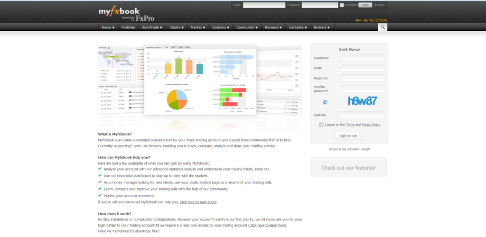

## Table of Contents

## What is a managed forex account?

A managed forex account is when someone else trades the foreign exchange market for you. You give your money to a professional trader or a company, and they use it to buy and sell different currencies. The goal is to make a profit from these trades, and if they do, you get to keep most of the profit.

It's like hiring someone to do a job for you because they know more about it than you do. You still own the money, but you let the expert handle the trading. This can be a good option if you don't have the time or knowledge to trade forex yourself, but you want to try to make money from it. Just make sure to choose a trustworthy manager because they will have control over your money.

## How does a managed forex account work?

When you open a managed forex account, you give your money to a professional trader or a company. They use your money to trade different currencies in the forex market. The goal is to make a profit from these trades. You and the manager agree on how much of the profit you get to keep, and how much they get as a fee for managing your account. You can usually choose how much risk you want to take, and the manager will trade according to your risk level.

The manager makes all the trading decisions for you. They decide when to buy and sell currencies, and how much to trade. You can usually see what they are doing through an online platform, so you can keep track of your money and the trades. If the manager makes a profit, you get your share. If they lose money, you lose money too. It's important to choose a good manager because they control your money, so do your research before you start.

## What are the benefits of using a managed forex account?

Using a managed [forex](/wiki/forex-system) account can be a good choice if you don't know much about trading forex. You can let a professional trader do the work for you. They have a lot of experience and knowledge, so they might be able to make better trading decisions than you could on your own. This can save you a lot of time and effort, because you don't have to learn how to trade or spend time watching the markets every day.

Another benefit is that you can still try to make money from the forex market without taking on all the risk yourself. The professional trader will manage the risk for you, based on how much risk you are comfortable with. If they make a profit, you get to keep most of it. This can be a good way to grow your money if you don't have the time or knowledge to trade forex yourself.

## What are the risks associated with managed forex accounts?

One big risk with managed forex accounts is that you are giving your money to someone else to trade for you. If the manager makes bad trades, you could lose a lot of money. Even if they are experienced, there is no guarantee they will make good decisions all the time. The forex market can be very unpredictable, and even the best traders can lose money.

Another risk is that you might not be able to trust the person or company managing your account. There have been cases where managers have stolen money from their clients. It's important to do a lot of research and make sure the manager is honest and has a good track record. Also, the fees you have to pay the manager can eat into your profits, so you need to think about whether it's worth it.

## How do I choose a reliable forex account manager?

Choosing a reliable forex account manager is really important. You need to do a lot of research first. Start by looking at their track record. See if they have a history of making good trades and making money for their clients. You can usually find this information on their website or by asking them directly. Also, check if they are regulated by a financial authority. This means they have to follow certain rules and it can give you more confidence that they are trustworthy.

Another thing to look at is what other people say about them. Read reviews and testimonials from other clients. If a lot of people are happy with their services, that's a good sign. You can also ask for references and talk to other people who have used their services. Make sure you understand their fees too. Some managers take a big cut of the profits, so you need to decide if it's worth it. Talking to the manager directly can help you get a feel for if they are honest and know what they are doing.

In the end, trust your gut feeling. If something feels off about the manager or the company, it might be best to look elsewhere. Remember, you are giving them control over your money, so you want to feel confident that they will do a good job and not do anything shady. Take your time to make the right choice, and don't rush into it.

## What fees can I expect when using a managed forex account?

When you use a managed forex account, you will have to pay fees. The most common fee is a management fee, which is a percentage of the money you have in your account. This fee is usually charged every month or every quarter. For example, if the management fee is 2% per year and you have $10,000 in your account, you will pay $200 in fees each year. Some managers also charge a performance fee, which is a percentage of any profits they make for you. This fee is only charged if the manager makes money, and it can be around 20% of the profits.

Another fee you might have to pay is a spread fee, which is the difference between the buying and selling price of a currency. This fee is charged every time the manager makes a trade. The spread can vary depending on the currency pair being traded and the broker you are using. It's important to understand all these fees because they can add up and affect how much money you make from your account. Always ask the manager about all the fees before you start, so you know what to expect.

## How is performance measured in managed forex accounts?

Performance in managed forex accounts is usually measured by looking at how much money the account has made or lost over a certain time. This is often shown as a percentage, like "the account made a 10% return last year." The manager might also show you a chart or graph that shows how the account's value has changed over time. This helps you see if the account is growing or shrinking and how steady the growth is.

Another way to measure performance is by comparing the account's results to a benchmark, like a major currency index. If the account does better than the benchmark, it means the manager is doing a good job. It's also important to look at how much risk the manager is taking. If they are making big profits but also taking big risks, it might not be as good as it seems. You want to see steady growth with a level of risk you are comfortable with.

## What regulatory bodies oversee managed forex accounts?

Managed forex accounts are overseen by different regulatory bodies depending on where the account is based. In the United States, the main regulator is the Commodity Futures Trading Commission (CFTC). They make sure that forex brokers and managers follow the rules and treat their clients fairly. Another important body in the U.S. is the National Futures Association (NFA), which also helps to keep the forex market honest and safe for traders.

In the United Kingdom, the Financial Conduct Authority (FCA) is the main regulator for forex accounts. They make sure that companies and managers are doing things the right way and that they are not cheating their clients. In Australia, the Australian Securities and Investments Commission (ASIC) plays a similar role. They watch over forex trading to make sure it is fair and that people's money is safe. It's a good idea to check if your forex account manager is regulated by one of these bodies to make sure they are trustworthy.

## Can I lose more money than I invest in a managed forex account?

In a managed forex account, you usually can't lose more money than you put in. This is because most managed accounts use something called a "limited risk" setup. This means that if the trades go bad, you won't lose more than the money you have in your account. The manager will usually set up the account so that it stops trading if it loses too much, to protect your money.

However, it's important to understand the terms of your account. Some managed accounts might use leverage, which can increase both your potential profits and your potential losses. If the account uses leverage and the trades go very badly, you could end up owing more money than you put in. Always make sure you know how your account is set up and what the risks are before you start.

## How can I monitor the performance of my managed forex account?

You can monitor the performance of your managed forex account by using an online platform that the manager provides. This platform usually shows you how much money is in your account and how it has changed over time. You can see a chart or graph that shows the ups and downs of your account's value. This helps you understand if the account is making money or losing money. The platform might also show you details about the trades that the manager has made, like which currencies they bought and sold, and how much they made or lost on each trade.

It's a good idea to check the performance of your account regularly, maybe once a week or once a month. This way, you can keep track of how the manager is doing and make sure they are following the level of risk you agreed on. If you see something that worries you, like big losses or risky trades, you can talk to the manager about it. Remember, the goal is to make sure your money is being handled well and that you are happy with the results.

## What is the difference between a discretionary and a non-discretionary managed forex account?

A discretionary managed forex account is when you give the manager full control to make trading decisions for you. The manager decides when to buy and sell currencies, how much to trade, and what strategies to use. They use their own judgment and experience to try to make the best trades possible. This can be good if you trust the manager and want them to use their skills to make money for you. But it also means you have less control over what happens with your money.

A non-discretionary managed forex account is different because you set the rules for the manager to follow. You might tell them exactly which currencies to trade, how much risk to take, and what strategies to use. The manager has to stick to your rules and can't make trades without your permission. This can give you more control over your money and help you feel more comfortable with the trading. But it might also limit the manager's ability to make the best trades because they have to follow your instructions.

## How do tax implications vary for profits from managed forex accounts across different countries?

Tax implications for profits from managed forex accounts can be different depending on where you live. In the United States, forex trading profits are usually treated as ordinary income and taxed at your regular income tax rate. This means if you make money from your forex account, you have to report it on your tax return and pay taxes on it like you would on your salary. Some countries, like the United Kingdom, treat forex profits as capital gains, which might be taxed at a lower rate than income. In the UK, you also get a tax-free allowance on capital gains, so you might not have to pay tax on small profits.

In Australia, forex profits are also considered ordinary income and taxed at your personal income tax rate. However, if you are trading as a business, you might be able to claim some expenses to reduce your taxable income. In Canada, forex profits are treated as business income and taxed at your regular income tax rate, but you can also claim losses to offset your gains. It's important to check the tax laws in your country because they can change, and you might need to talk to a tax professional to make sure you are doing everything right.

## References & Further Reading

[1]: ["Managed Forex Accounts Explained"](https://www.investopedia.com/terms/forex/m/managed-forex-accounts.asp), Investopedia.

[2]: Lopez de Prado, M. (2018). ["Advances in Financial Machine Learning"](https://www.amazon.com/Advances-Financial-Machine-Learning-Marcos/dp/1119482089). Wiley.

[3]: Aronson, D. R. (2006). ["Evidence-Based Technical Analysis: Applying the Scientific Method and Statistical Inference to Trading Signals"](https://www.amazon.com/Evidence-Based-Technical-Analysis-Scientific-Statistical/dp/0470008741). Wiley.

[4]: Jansen, S. (2020). ["Machine Learning for Algorithmic Trading"](https://github.com/stefan-jansen/machine-learning-for-trading). Packt Publishing.

[5]: Chan, E. P. (2009). ["Quantitative Trading: How to Build Your Own Algorithmic Trading Business"](https://github.com/ftvision/quant_trading_echan_book). Wiley.