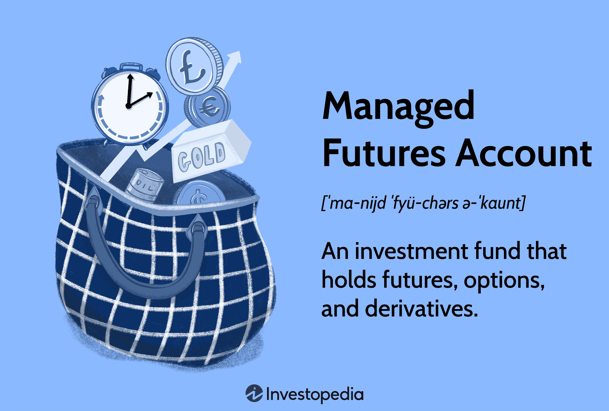

## Table of Contents

## What are Managed Futures Accounts?

Managed Futures Accounts are investment vehicles where professional money managers, known as Commodity Trading Advisors (CTAs), make decisions about buying and selling futures contracts on behalf of investors. Futures contracts are agreements to buy or sell an asset at a future date for a specific price. These accounts allow investors to gain exposure to various markets, including commodities, currencies, and financial instruments, without having to manage the trades themselves.

The main advantage of Managed Futures Accounts is that they provide diversification to an investment portfolio. Since futures markets often move independently of stock and bond markets, these accounts can help reduce overall risk. Additionally, CTAs use sophisticated trading strategies and have access to advanced tools and market data, which can potentially lead to higher returns. However, like any investment, Managed Futures Accounts come with risks, and it's important for investors to understand these before committing their money.

## How do Managed Futures Accounts work?

Managed Futures Accounts are a type of investment where a professional, called a Commodity Trading Advisor (CTA), manages your money. The CTA uses your money to buy and sell futures contracts. Futures contracts are agreements to buy or sell something, like gold or oil, at a set price in the future. The CTA decides which futures to buy and sell, and when to do it, based on their analysis of the market. This means you don't have to make these decisions yourself.

The goal of a Managed Futures Account is to make money by predicting how the prices of these futures will change. If the [CTA](/wiki/cta-strategy) thinks the price of oil will go up, they might buy an oil futures contract. If they think the price will go down, they might sell one. The account can help spread out your investment risk because futures markets often move differently than stock and bond markets. However, there's always a chance you could lose money, so it's important to understand the risks before you invest.

## Who typically invests in Managed Futures Accounts?

Managed Futures Accounts are often used by investors who want to spread out their money and reduce risk. These investors might already have money in stocks and bonds, but they want to try something different. They see Managed Futures as a way to add variety to their investments. People who invest in these accounts usually understand that there's a chance they could lose money, but they're okay with that risk because they believe in the potential rewards.

These accounts are also popular with people who don't have the time or knowledge to trade futures themselves. They trust professional money managers, called Commodity Trading Advisors (CTAs), to make the right choices for them. Investors in Managed Futures Accounts often have a good amount of money to invest and are looking for ways to grow their wealth over time. They're usually looking for long-term growth and are willing to take on some risk to achieve it.

## What are the potential advantages of investing in Managed Futures Accounts?

One big advantage of investing in Managed Futures Accounts is that they can help spread out your investment risk. This is because the futures markets often move differently than the stock and bond markets. By adding Managed Futures to your investment mix, you're not putting all your eggs in one basket. This can help protect your money if the stock market goes down. Plus, professional money managers, called Commodity Trading Advisors (CTAs), make the trading decisions for you. They use special tools and lots of data to try and make good choices, which can lead to better returns than if you tried to do it yourself.

Another benefit is that Managed Futures Accounts can make money in both good and bad markets. If the CTA thinks prices will go up, they can buy futures. If they think prices will go down, they can sell futures. This means they can make money no matter which way the market is moving. This flexibility can be a big plus for investors who want to keep growing their money even when times are tough. However, it's important to remember that all investments have risks, and Managed Futures are no exception.

## Can you explain the concept of diversification in the context of Managed Futures Accounts?

Diversification means spreading your money across different types of investments. In the context of Managed Futures Accounts, it means adding futures to your mix of stocks and bonds. Futures markets often move in different ways than stock and bond markets. So, if the stock market goes down, your futures might still be doing well. This can help protect your money and reduce the risk of losing a lot all at once.

By using a Managed Futures Account, you're letting a professional, called a Commodity Trading Advisor (CTA), handle your futures investments. The CTA uses special tools and lots of data to make choices about buying and selling futures. This can help your overall investment portfolio perform better because the CTA can find opportunities in the futures market that you might miss on your own. In simple terms, diversification through Managed Futures can make your investment strategy stronger and more balanced.

## What are the common disadvantages or risks associated with Managed Futures Accounts?

One of the main risks of investing in Managed Futures Accounts is that you could lose money. Futures markets can be very unpredictable, and even professional money managers, called Commodity Trading Advisors (CTAs), can make wrong guesses about how prices will move. If the CTA's predictions are off, you might end up losing some or all of your investment. This risk can be higher in Managed Futures Accounts than in more traditional investments like stocks and bonds.

Another disadvantage is the cost. Managed Futures Accounts often come with high fees. You'll have to pay the CTA for managing your money, and there may be other costs like trading fees and commissions. These fees can eat into your returns, making it harder to make a profit. It's important to understand all the costs before you decide to invest in a Managed Futures Account.

Lastly, Managed Futures Accounts can be complex. They involve trading futures contracts, which can be hard to understand if you're new to investing. You're relying on the CTA to make good choices, but if you don't fully understand what they're doing, it can be stressful. Plus, the returns from Managed Futures can be unpredictable, making it tough to plan your financial future. Always do your homework and consider talking to a financial advisor before jumping into a Managed Futures Account.

## How do fees and costs impact the returns from Managed Futures Accounts?

Fees and costs can make a big difference in how much money you make from Managed Futures Accounts. When you invest in these accounts, you have to pay the Commodity Trading Advisor (CTA) for managing your money. There are also other costs like trading fees and commissions every time the CTA buys or sells a futures contract. All these fees add up, and they come out of your investment returns. So, if the CTA makes a good profit, but the fees are high, you might end up with less money than you expected.

It's really important to understand all the fees before you decide to invest in a Managed Futures Account. High fees can eat into your profits and make it harder for you to make money. If the fees are too high, they might even turn a small profit into a loss. Always ask about all the costs and think about how they will affect your returns. This way, you can make a smarter choice about whether a Managed Futures Account is right for you.

## What types of fees are typically associated with Managed Futures Accounts?

When you invest in a Managed Futures Account, you'll usually have to pay a management fee. This fee is for the Commodity Trading Advisor (CTA) who manages your money. The management fee is often a percentage of the money you have in the account, and it's charged no matter how well the account does. So, even if you don't make any money, you still have to pay this fee.

On top of the management fee, there are also trading fees and commissions. Every time the CTA buys or sells a futures contract, you have to pay for that trade. These costs can add up quickly, especially if the CTA trades a lot. Sometimes, there might be other fees too, like performance fees. A performance fee is an extra charge you pay if the CTA makes a lot of money for you. It's a way to reward the CTA for doing a good job, but it also means you get to keep less of the profit.

## How can one evaluate the performance of a Managed Futures Account?

To evaluate the performance of a Managed Futures Account, you need to look at a few key things. First, check the account's returns over time. See how much money it has made or lost in the past. It's good to look at returns over different periods, like one year, three years, and five years. This gives you a better idea of how the account has done over the long run. Also, compare these returns to a benchmark, like a stock market index, to see if the account is doing better or worse than the market.

Another thing to consider is the risk the account has taken to get those returns. You can do this by looking at measures like the Sharpe Ratio, which tells you how much return you're getting for the risk you're taking. A higher Sharpe Ratio means the account is doing a good job of making money without taking too much risk. Also, think about how steady the returns have been. If the account goes up and down a lot, it might be riskier than one with more consistent returns. By looking at these things, you can get a good picture of how well the Managed Futures Account is performing.

## What regulatory considerations should be taken into account when investing in Managed Futures Accounts?

When you're thinking about investing in Managed Futures Accounts, it's important to know about the rules that keep things fair and safe. In the United States, the main group that watches over these accounts is the Commodity Futures Trading Commission (CFTC). They make sure that Commodity Trading Advisors (CTAs) and the companies they work for follow the rules. The National Futures Association (NFA) is another group that helps make sure everyone is playing by the rules. They both work to stop fraud and protect investors like you.

Before you put your money into a Managed Futures Account, check if the CTA and the company they work for are registered with the CFTC and the NFA. This is a good sign that they're following the rules. Also, read the account's disclosure document carefully. It will tell you about the risks, fees, and how the account has done in the past. Knowing these rules and making sure everyone is following them can help you feel more confident about your investment.

## How do Managed Futures Accounts compare to other alternative investments?

Managed Futures Accounts are different from other alternative investments like real estate, hedge funds, or private equity. One big difference is that Managed Futures focus on trading futures contracts, which are agreements to buy or sell something at a set price in the future. This means they can make money no matter if the market is going up or down. Other alternative investments might not have this flexibility. For example, real estate usually goes up in value over time, but it can be hard to sell quickly if the market goes down. Hedge funds and private equity might use different strategies, but they often need more time to see returns and can be harder to get your money out of.

Another way Managed Futures Accounts are different is in how they're managed and the fees you pay. With Managed Futures, a Commodity Trading Advisor (CTA) makes all the trading decisions for you. This can be good if you don't want to manage your investments yourself. But, you'll have to pay the CTA a fee, which can be pretty high. Other alternative investments might have different fee structures. For example, hedge funds often charge a management fee and a performance fee, which can also be high. Real estate might have costs like property taxes and maintenance, but you won't pay someone else to manage it unless you hire a property manager. Each type of investment has its own risks and rewards, so it's important to think about what fits best with your goals and how much risk you're okay with.

## What advanced strategies are used by expert managers of Managed Futures Accounts?

Expert managers of Managed Futures Accounts use a lot of different strategies to try and make money for their investors. One common strategy is [trend following](/wiki/trend-following). This means the manager looks for patterns in the market and tries to guess if prices will keep going up or down. They might buy futures if they think prices will go up and sell them if they think prices will go down. Another strategy is called mean reversion. This is when the manager thinks that if a price has gone too high or too low, it will eventually come back to a more normal level. They might buy futures when prices are low and sell them when prices are high, hoping to make money as the price moves back to the middle.

Another advanced strategy is called spread trading. This involves buying one futures contract and selling another one at the same time. The idea is to make money from the difference in price between the two contracts. For example, a manager might buy wheat futures for one month and sell wheat futures for another month, betting that the price difference will change in their favor. These managers also use something called quantitative analysis, which means they use math and computers to find patterns and make decisions. All these strategies need a lot of knowledge and experience, and the managers use special tools and a lot of data to try and make the best choices for their investors.

## References & Further Reading

[1]: Covel, M. (2017). ["Trend Following: How to Make a Fortune in Bull, Bear and Black Swan Markets."](https://www.amazon.com/Trend-Following-5th-Fortune-Markets/dp/1119371872) FT Press.

[2]: Kaufman, P. J. (2013). ["Trading Systems and Methods."](https://onlinelibrary.wiley.com/doi/book/10.1002/9781119202561) Wiley.

[3]: Schneeweis, T., Karavas, V., Georgiev, G., & Kazemi, H. (2010). ["The New Science of Asset Allocation: Risk Management in a Multi-Asset World."](https://www.sciepub.com/reference/201413) Wiley.

[4]: Kaminski, K. M. (2011). ["Diversification: A Look at Correlations, Volatility, and Tail Events in Trend Following."](https://www.cmegroup.com/education/files/PM146_Education_Kaminski_article.pdf) CME Group.

[5]: Fabozzi, F. J., Focardi, S. M., & Kolm, P. N. (2006). ["Financial Modeling of the Equity Market: From CAPM to Cointegration"](https://onlinelibrary.wiley.com/doi/book/10.1002/9781119201236) Wiley.