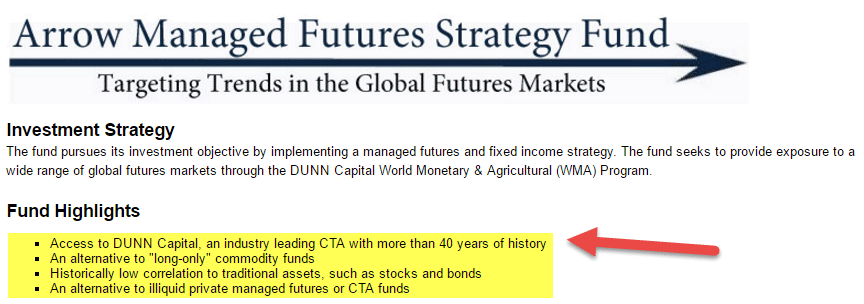

In today's complex financial markets, futures trading emerges as a versatile instrument for both hedging and speculation. Originating from commodities trading, futures have evolved to encompass a wide variety of assets, offering investors numerous opportunities for diversification. This transformative growth allows market participants to hedge against price volatility in various sectors, including agriculture, energy, metals, and financial indices, effectively mitigating risks associated with price fluctuations.

This article guides you through the comprehensive landscape of futures trading, highlighting the increasing importance of managed futures and algorithmic trading. These innovative tools and strategies are reshaping financial markets by providing enhanced methods for managing risk and optimizing returns. Managed futures, often employed by institutional investors, involve portfolios of futures contracts actively managed by professionals. Algorithmic trading, on the other hand, utilizes sophisticated algorithms to automate and refine trading decisions, greatly improving speed and accuracy in today's fast-paced trading environments.



The automation of trading decisions through algorithmic strategies offers significant enhancements in speed, accuracy, and precision, essential qualities in modern markets characterized by rapid changes and high-frequency trading demands. By leveraging computational power, these strategies analyze vast amounts of market data to make informed decisions, minimizing human error and emotional biases. 

This guide provides an essential resource for anyone seeking to understand the foundations of futures contracts and the intricacies of various algorithmic trading strategies. As we embark on this exploration, the potential of these advanced trading techniques for the future of investing comes into focus, emphasizing their strategic importance in maintaining competitive advantage in evolving financial landscapes.

## Table of Contents

## Understanding Futures Trading

Futures contracts represent a fundamental mechanism in financial markets, designed as standardized agreements facilitating the purchase or sale of an asset at a predetermined price at a future date. These contracts serve as vital tools for hedging against potential price changes or speculating on the future value of various underlying assets, including commodities, currencies, and stock indexes. The standardization of these contracts enhances liquidity and facilitates participation by a diverse array of market participants.

The inherent leverage associated with futures contracts is a key attribute that makes them appealing to several types of investors, ranging from hedge funds to individual traders. This leverage allows investors to control large positions with relatively smaller amounts of capital. However, it also amplifies potential gains and potential losses, accentuating the need for tactical decision-making and risk management.

One of the distinctive advantages of futures trading lies in the ability to capitalize on asset price fluctuations without the necessity of owning the actual asset. This feature enables futures traders to effectively manage portfolio risk and pursue diversification. For instance, an investor anticipating a rise in [crude oil](/wiki/crude-oil) prices might buy oil futures contracts to benefit from price increases without the need to purchase and store physical barrels of oil.

Despite the considerable potential of futures trading, it is accompanied by significant risks. Market [volatility](/wiki/volatility-trading-strategies) can lead to sudden and unexpected price movements, which, when coupled with leverage, can result in substantial losses. Consequently, a thorough comprehension of market dynamics and structured strategic planning are imperative for navigating the futures markets effectively.

Engagement in futures trading requires investors to possess a robust understanding of the underlying economic factors influencing asset prices, as well as the ability to analyze technical indicators and market sentiment. The complexity and speed of these markets demand both vigilance and expertise, ensuring that traders can optimize their strategies while minimizing exposure to potential downsides.

In summary, while futures trading offers a viable avenue for hedging and speculation with significant benefits, it requires diligent risk management practices and sophisticated strategic planning to mitigate the inherent risks associated with market volatility and leverage.

## The Rise of Managed Futures

Managed futures are investment strategies that involve a diversified portfolio of futures contracts, actively managed by professionals or investment managers. These strategies are primarily leveraged by institutional investors, such as hedge funds and pension funds, to achieve diversification beyond traditional asset classes like stocks and bonds. The primary attraction of managed futures lies in their potential to improve a portfolio's risk-return profile by offering exposure to a wide range of asset classes, including commodities, currencies, and interest rates, which often exhibit low or negative correlation with conventional investment vehicles.

Managed futures are subject to regulatory oversight, notably by the Commodity Futures Trading Commission (CFTC) in the United States, which ensures transparency and protects investors through stringent regulatory frameworks. This regulatory environment has contributed significantly to the appeal and trustworthiness of managed futures among large funds and institutional investors, providing a layer of security and standardization in trading practices.

Key strategies employed within managed futures include market-neutral strategies and trend-following strategies. Market-neutral strategies are designed to exploit price spreads between different futures contracts, allowing investors to potentially profit regardless of broader market movements. These strategies mitigate market risk by balancing long and short positions to achieve a net neutral market exposure.

Trend-following strategies, on the other hand, seek to capitalize on the [momentum](/wiki/momentum) of significant market trends. They involve identifying and riding price trends in various futures markets. For instance, if a particular commodity or currency experiences a sustained upward or downward trend, trend-following systems attempt to capture the gains from such movements. These strategies rely on technical analysis and statistical models to predict and follow market trends efficiently.

The use of leveraging in managed futures allows investors to control a large position with a relatively small amount of capital. This magnification of potential returns, however, comes with a corresponding increase in risk. As such, careful risk management and strategy assessment are crucial to mitigate potential losses associated with leveraged futures positions.

Overall, managed futures provide investors with a sophisticated tool for enhancing portfolio diversification, allowing exposure to varied asset classes, hence reducing portfolio volatility. This strategy is integral to contemporary investment portfolios seeking to navigate the complexities of global markets while maintaining a disciplined, risk-managed approach.

## Algorithmic Trading in Futures

Algorithmic trading in futures markets involves the use of computer algorithms to execute trades based on pre-defined criteria. This technology-driven approach removes the emotional and human errors associated with traditional trading, making it more efficient and systematic. Algorithms process extensive market data, swiftly identifying potential trading opportunities, thus providing traders with significant tactical advantages in environments where speed is crucial.

A key feature of [algorithmic trading](/wiki/algorithmic-trading) is its ability to deal with large datasets and rapidly execute trades, a necessity in speed-sensitive markets. This enables traders to capitalize on marginal price movements that are often imperceptible to human traders. Algorithms can continuously monitor market conditions, executing trades instantaneously based on the programmed parameters.

There are several common strategies in algorithmic futures trading:

1. **Arbitrage**: This involves simultaneously buying and selling an asset in different markets to profit from price discrepancies. Algorithms can swiftly calculate these discrepancies in complex markets, engaging in trades that lock in profit.

2. **Trend Following**: This strategy capitalizes on the momentum of market trends. Algorithms detect emerging market trends by analyzing historical data, enabling traders to profit from sustained movements in price directions.

3. **Market Making**: This involves placing both buy and sell orders for specified securities to capture the difference between the bid and ask prices, also known as the spread. Algorithmic systems are well-suited for this strategy as they can adjust prices in real-time, maintaining the necessary liquidity.

Within algorithmic trading, High-Frequency Trading ([HFT](/wiki/high-frequency-trading-strategies)) is a specialized subset characterized by the execution of a substantial [volume](/wiki/volume-trading-strategy) of orders at extremely high speeds. HFT maximizes the exploitation of minute pricing inefficiencies across various markets and asset classes. These high-speed transactions are typically managed by sophisticated algorithms capable of completing thousands of trades in milliseconds, necessitating a robust technological infrastructure for data handling and order execution.

The role of algorithms in futures trading is expected to grow, driven by advancements in [artificial intelligence](/wiki/ai-artificial-intelligence) and [machine learning](/wiki/machine-learning). These innovations are enhancing the sophistication and precision of trading algorithms, enabling even more effective strategies tailored to increasingly complex market dynamics. As such, understanding and leveraging algorithmic trading is becoming essential for traders seeking to maintain a competitive edge in financial markets.

## Benefits and Challenges of Algo Trading

Algorithmic trading, a pivotal component in modern financial markets, offers a suite of benefits that enhance trading efficiency and efficacy. At its core, the primary advantage of algorithmic trading lies in its speed, precision, and capacity to process and analyze large datasets—a feat unattainable by human traders. Automated systems enable traders to swiftly identify and execute trading opportunities, reducing latency and maximizing profit potential in fast-moving markets.

Automated trading solutions allow for robust [backtesting](/wiki/backtesting) of strategies over extensive historical data, enhancing the reliability and effectiveness of these strategies before live market application. By simulating various scenarios, traders can confirm the soundness of their strategies and mitigate unnecessary market exposure, optimizing their risk management. For example, by using Python's pandas and NumPy libraries, traders can perform backtests with historical data efficiently:

```python
import pandas as pd
import numpy as np

# Load historical data
data = pd.read_csv('historical_data.csv')

# Calculate moving averages
short_window = 40
long_window = 100
signals = pd.DataFrame(index=data.index)
signals['signal'] = 0.0
signals['short_mavg'] = data['close'].rolling(window=short_window, min_periods=1, center=False).mean()
signals['long_mavg'] = data['close'].rolling(window=long_window, min_periods=1, center=False).mean()

# Generate buy/sell signals
signals['signal'][short_window:] = np.where(signals['short_mavg'][short_window:] > signals['long_mavg'][short_window:], 1.0, 0.0)   
signals['positions'] = signals['signal'].diff()
```

Despite these advancements, algorithmic trading is not without challenges. Key concerns include system failures and market volatility, both of which can hinder algorithmic performance or lead to unintended trading decisions. Over-optimization—often referred to as "curve fitting"—can also lead to unreliable strategies that perform well in historical tests but fail in real-time markets due to changing dynamics.

Moreover, algorithmic trading operates under heightened regulatory scrutiny. Algorithms have, at times, contributed to market instability through unintended manipulation or erroneous trades, prompting concern among regulators about their potential to exacerbate market volatility and disrupt orderly trading. Organizations like the U.S. Securities and Exchange Commission (SEC) continue to evaluate and adapt regulatory frameworks to manage these risks effectively, ensuring market integrity.

Through understanding both the capabilities and limitations of algorithmic trading, traders can strategically leverage technology to manage risk and enhance returns while adhering to evolving regulatory standards.

## Conclusion

Futures trading is undergoing a significant transformation, propelled by the integration of managed futures and algorithmic trading, which provide innovative methods for risk management and the potential for enhanced returns. Managed futures utilize diversified portfolios, professionally managed to navigate various asset classes, while algorithmic trading introduces automation, leveraging data analysis to improve decision-making speed and accuracy. 

The implementation of these strategies, however, is not without its challenges. It requires meticulous monitoring and the ability to adapt to ever-changing market conditions. The dynamic nature of financial markets demands constant vigilance to ensure that strategies remain effective and adaptable to emerging trends. Traders must stay informed about regulatory changes and technological advancements to optimize the use of these sophisticated tools.

Advancements in artificial intelligence (AI) and machine learning (ML) promise to refine algorithmic models further, enhancing their ability to process vast datasets and identify patterns with greater precision. These technologies can significantly improve predictive analytics, allowing traders to better forecast market movements and make more informed decisions. For instance, machine learning algorithms can be trained to recognize complex patterns in historical price data, potentially predicting future price movements with greater accuracy.

For example, a basic Python implementation using machine learning might involve the following steps:

```python
from sklearn.model_selection import train_test_split
from sklearn.ensemble import RandomForestRegressor
import pandas as pd

# Assume data is a DataFrame containing historical market data
X = data.drop('price', axis=1)  # Features
y = data['price']  # Target variable

# Split into training and test sets
X_train, X_test, y_train, y_test = train_test_split(X, y, test_size=0.2, random_state=42)

# Initialize and train the model
model = RandomForestRegressor(n_estimators=100, random_state=42)
model.fit(X_train, y_train)

# Make predictions
predictions = model.predict(X_test)
```

In this example, a RandomForestRegressor is utilized to predict price movements based on historical data, showcasing how machine learning can be integrated into trading strategies.

As technology continues to define the trading arena, developing proficiency in these advanced trading tools and understanding their broader market implications becomes essential. Traders and investors who can skillfully navigate these technologies will be better positioned to remain competitive and capitalize on the opportunities presented in the modern financial markets. This ongoing evolution underscores the importance of continuing education and skills development as crucial components in the toolkit of any successful investor or trader.

## References & Further Reading

[1]: Jansen, S. (2020). ["Machine Learning for Algorithmic Trading."](https://github.com/stefan-jansen/machine-learning-for-trading) Packt Publishing.

[2]: Lopez de Prado, M. (2018). ["Advances in Financial Machine Learning."](https://www.amazon.com/Advances-Financial-Machine-Learning-Marcos/dp/1119482089) Wiley.

[3]: Chan, E. P. (2009). ["Quantitative Trading: How to Build Your Own Algorithmic Trading Business."](https://github.com/ftvision/quant_trading_echan_book) Wiley.

[4]: Frank, J., & Young, H. "Algorithmic Trading" in Fabozzi, F.J., Focardi, S., & Kolm, P.N. (2010). ["Quantitative Equity Investing: Techniques and Strategies."](https://www.semanticscholar.org/paper/Quantitative-Equity-Investing%3A-Techniques-and-Fabozzi-Focardi/1c49a2a53919f7e65cb96f16691b8ff726fd3cd7) Wiley.

[5]: Aronson, D. R. (2006). ["Evidence-Based Technical Analysis: Applying the Scientific Method and Statistical Inference to Trading Signals."](https://www.amazon.com/Evidence-Based-Technical-Analysis-Scientific-Statistical/dp/0470008741) Wiley.

[6]: Hull, J. C. (2017). ["Options, Futures, and Other Derivatives."](https://www.semanticscholar.org/paper/Options%2C-Futures%2C-and-Other-Derivatives-Hull/89bdee500c8623864fc9eb7a471546aa713acc44) Pearson.