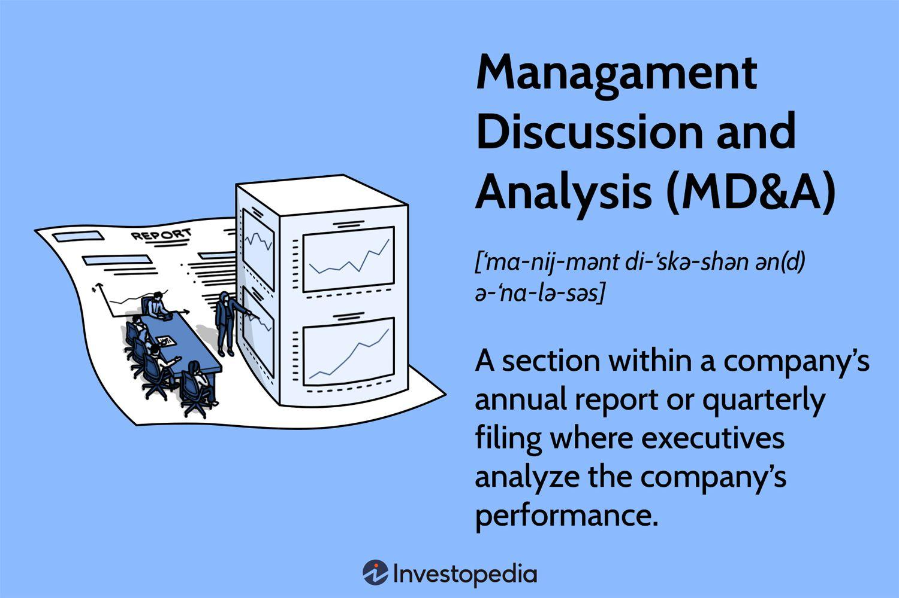

## Table of Contents

## What is Management Discussion and Analysis (MD&A)?

Management Discussion and Analysis (MD&A) is a section in a company's annual report where the management team talks about the company's performance and future plans. It helps investors understand how the company did in the past year and what they expect in the future. The MD&A section covers important topics like sales, profits, and any big changes or risks the company is facing.

In simple terms, the MD&A is like a report card and a roadmap combined. It tells you how the company did last year and where it plans to go next. This section is really useful for investors because it gives them a clear picture of the company's health and future goals. By reading the MD&A, investors can make better decisions about whether to buy, sell, or hold the company's stock.

## Why is MD&A important for investors and stakeholders?

The MD&A section is important for investors and stakeholders because it gives them a clear picture of how the company is doing and where it's headed. It's like a story that explains the numbers in the financial statements. By reading the MD&A, investors can understand what drove the company's performance, whether it was good or bad, and what the management thinks about the future. This helps them decide if the company is a good investment or if they should look elsewhere.

Additionally, the MD&A helps stakeholders see the bigger picture. It talks about things like new projects, risks the company might face, and how it plans to grow. This information is crucial for stakeholders because it shows them how the company plans to deal with challenges and take advantage of opportunities. By understanding these details, stakeholders can feel more confident about their involvement with the company and make informed decisions about their support or investment.

## What are the key components of an MD&A section in a company's annual report?

The MD&A section in a company's annual report includes several important parts that help explain the company's performance and future plans. One key part is a review of the company's financial results. This part talks about things like sales, profits, and expenses. It explains why the numbers are the way they are and what factors influenced them. For example, if sales went up, the MD&A might say it was because the company launched a new product that customers loved.

Another important part of the MD&A is the discussion of risks and challenges. This section tells readers about any big problems the company might face, like new competitors or changes in the law. It also talks about how the company plans to deal with these risks. This helps investors understand what could go wrong and how the company is preparing for it. The MD&A also includes information about the company's future plans, like new projects or expansion into new markets. This gives investors an idea of where the company is headed and what growth opportunities it sees.

Lastly, the MD&A often includes a section on [liquidity](/wiki/liquidity-risk-premium) and capital resources. This part explains how the company manages its money, including details on cash flow, debt, and any big investments or spending plans. It's important because it shows whether the company has enough money to keep running and growing. By putting all these pieces together, the MD&A gives a complete picture of the company's past performance and future direction, helping investors make smart decisions.

## How does MD&A differ from other sections of a financial report?

The Management Discussion and Analysis (MD&A) section in a financial report is different from other parts because it tells a story about the numbers. While sections like the income statement, balance sheet, and cash flow statement show the raw financial data, the MD&A explains what those numbers mean. It talks about why the company did well or poorly, what challenges it faced, and what plans it has for the future. Think of the MD&A as a guide that helps you understand the financial statements by putting them into context.

Other sections of the financial report, like the financial statements, are more about presenting the facts in a clear, standardized way. They show exactly how much money the company made, how much it spent, and what it owns or owes. These sections follow strict rules so that everyone can compare companies easily. On the other hand, the MD&A gives the management's perspective on those numbers. It's less about the hard data and more about the story behind the data, making it easier for investors to see the bigger picture and understand the company's strategy and future plans.

## What regulations govern the content and format of MD&A?

The content and format of the MD&A section are guided by rules set by organizations like the Securities and Exchange Commission (SEC) in the United States. The SEC has rules that say what kinds of information companies need to include in their MD&A. These rules make sure that the MD&A gives a clear and honest picture of the company's performance and future plans. Companies have to talk about things like their financial results, any big changes or risks they face, and what they plan to do next. This helps keep the information useful and fair for everyone who reads it.

Besides the SEC, other countries and stock exchanges might have their own rules for MD&A. For example, in Canada, the rules come from the Canadian Securities Administrators (CSA). These rules are similar to the SEC's but might have some differences to fit the local laws and needs. No matter where the company is, the main goal is the same: to make sure the MD&A is clear, complete, and helpful for investors and stakeholders. By following these rules, companies can give a good picture of their past, present, and future.

## How can MD&A help in understanding a company's financial health and future prospects?

The MD&A section in a company's annual report helps investors understand the company's financial health by explaining the numbers in the financial statements. It tells a story about why the company did well or poorly, what challenges it faced, and how it managed its money. For example, if a company's profits went down, the MD&A might explain that it was because of a big expense or a drop in sales. By reading this section, investors can see if the company is in good shape financially or if it needs to make changes to improve.

The MD&A also helps investors understand the company's future prospects. It talks about the company's plans for growth, like new products or entering new markets. It also discusses any risks the company might face, like new competitors or changes in the law. By explaining these things, the MD&A gives investors a clear picture of where the company is headed and what it needs to do to succeed. This helps investors decide if they want to keep their money in the company or if they should look for other opportunities.

## What are some common pitfalls or challenges in preparing an effective MD&A?

One common challenge in preparing an effective MD&A is making sure it's clear and easy to understand. Sometimes, companies use too much technical language or jargon, which can confuse readers. It's important for the MD&A to explain things in a way that everyone can understand, not just experts. Another pitfall is not giving enough detail. If the MD&A is too short or vague, it won't help investors understand the company's situation. Companies need to balance giving enough information without overwhelming readers.

Another challenge is keeping the MD&A focused on what's important. Sometimes, companies might include too much information that isn't relevant to the company's performance or future plans. This can make it hard for readers to find the key points. It's also tricky to be honest about risks and challenges. Companies might be tempted to downplay problems or avoid talking about them altogether. But being open and honest about risks helps build trust with investors and gives them a realistic view of the company's future.

Lastly, staying compliant with regulations can be tough. Companies have to follow rules set by organizations like the SEC, which can change over time. Keeping up with these rules and making sure the MD&A meets all the requirements takes a lot of work. If a company doesn't follow the rules, it could face penalties or lose the trust of investors. So, it's important for companies to stay on top of these regulations and make sure their MD&A is both informative and compliant.

## How should forward-looking statements be handled within MD&A?

Forward-looking statements in the MD&A section are important because they tell investors about the company's future plans and expectations. These statements are guesses about what might happen, like how much the company thinks it will grow or what new projects it might start. Because they are predictions, companies have to be careful when they write them. They need to explain what they think will happen and why, but they also have to say that these are just guesses and things might turn out differently. This helps investors understand the risks and not be surprised if things don't go as planned.

To handle forward-looking statements well, companies should be clear and honest. They should use simple language so everyone can understand what they're saying. It's also important to give reasons for their predictions, like new products or market trends. But they should also remind readers that these are just predictions and that many things can change. By doing this, companies can help investors make better decisions and build trust by being open about what might happen in the future.

## Can you explain how MD&A integrates with other financial analysis tools?

The MD&A section in a company's annual report works hand-in-hand with other financial analysis tools to give investors a full picture of the company's health and future plans. While financial statements like the income statement, balance sheet, and cash flow statement show the raw numbers, the MD&A explains what those numbers mean. It's like a guide that helps you understand the story behind the numbers. For example, if the income statement shows a drop in profits, the MD&A might explain that it was because of a big expense or a change in the market. By reading the MD&A, investors can connect the dots between the financial statements and the real-world events that affected them.

In addition to financial statements, the MD&A also integrates well with other analysis tools like ratio analysis and trend analysis. Ratio analysis helps investors see how well the company is doing in areas like profitability, liquidity, and debt management. The MD&A can provide context for these ratios, explaining why certain ratios might be high or low. Trend analysis looks at how the company's performance has changed over time, and the MD&A can help investors understand the reasons behind these trends. For instance, if sales have been growing steadily, the MD&A might talk about successful marketing campaigns or new product launches that drove this growth. By combining the MD&A with these other tools, investors get a richer, more complete understanding of the company's financial situation and future prospects.

## What are advanced analytical techniques that can enhance the MD&A?

Advanced analytical techniques can make the MD&A section even better by giving deeper insights into the company's performance and future plans. One technique is data visualization, which uses charts and graphs to show complex information in a simple way. This can help investors quickly see trends and patterns in the company's financial data. Another technique is predictive analytics, which uses past data to make guesses about what might happen in the future. By including these predictions in the MD&A, companies can give investors a clearer picture of where they're headed and what challenges they might face.

Another useful technique is sentiment analysis, which looks at what people are saying about the company online or in the news. This can help the company understand how people feel about them and what risks or opportunities might come from public opinion. Text mining is also helpful because it can find important information in large amounts of text, like customer reviews or industry reports. By using these advanced techniques, the MD&A can give a more complete and detailed view of the company's situation, helping investors make smarter decisions.

## How do international standards affect the preparation of MD&A for multinational corporations?

International standards play a big role in how multinational corporations prepare their MD&A sections. These companies have to follow rules from different countries where they do business. For example, a company in the U.S. has to follow the SEC's rules, but if it also operates in Europe, it might need to follow rules from the European Union too. These international standards make sure that the MD&A is clear and fair for everyone, no matter where they are. They help investors from different countries understand the company's performance and future plans in the same way.

Balancing these different rules can be tricky for multinational corporations. They need to make sure their MD&A meets all the requirements without being too confusing. Sometimes, this means explaining things in different ways for different audiences. But by following international standards, these companies can give a complete and honest picture of their financial health and future prospects. This helps build trust with investors all over the world and makes it easier for them to make smart decisions about their investments.

## What role does technology play in the evolution of MD&A reporting?

Technology has changed how companies write their MD&A reports a lot. Now, they can use computers to look at big amounts of data quickly. This helps them find important information and trends that they can talk about in their MD&A. For example, they can use special tools to make charts and graphs that show what's happening with their money in a way that's easy to understand. Also, technology lets companies use things like [artificial intelligence](/wiki/ai-artificial-intelligence) to guess what might happen in the future. This can help them write better forward-looking statements in their MD&A.

Technology also makes it easier for companies to share their MD&A reports with people all over the world. They can put their reports online so that anyone can read them anytime. This is good because it means more people can learn about the company's performance and plans. Plus, technology helps companies follow the rules from different countries. They can use software to make sure their MD&A meets all the right standards, which is important for big companies that do business in many places.

## References & Further Reading

[1]: ["Advances in Financial Machine Learning"](https://www.amazon.com/Advances-Financial-Machine-Learning-Marcos/dp/1119482089) by Marcos Lopez de Prado

[2]: Bergstra, J., Bardenet, R., Bengio, Y., & Kégl, B. (2011). ["Algorithms for Hyper-Parameter Optimization."](https://dl.acm.org/doi/10.5555/2986459.2986743) Advances in Neural Information Processing Systems 24.

[3]: ["Evidence-Based Technical Analysis: Applying the Scientific Method and Statistical Inference to Trading Signals"](https://www.amazon.com/Evidence-Based-Technical-Analysis-Scientific-Statistical/dp/0470008741) by David Aronson

[4]: ["Machine Learning for Algorithmic Trading"](https://github.com/PacktPublishing/Machine-Learning-for-Algorithmic-Trading-Second-Edition) by Stefan Jansen

[5]: ["Quantitative Trading: How to Build Your Own Algorithmic Trading Business"](https://books.google.com/books/about/Quantitative_Trading.html?id=j70yEAAAQBAJ) by Ernest P. Chan