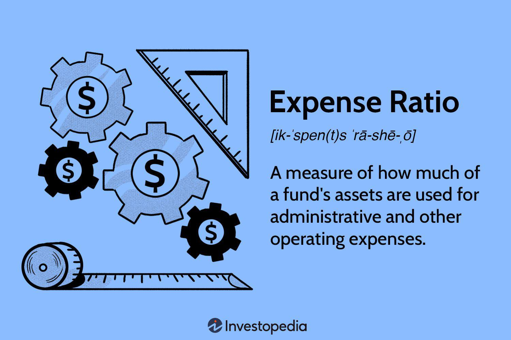

Investment funds serve as a potent avenue for asset growth by pooling resources to invest in a diversified portfolio. These funds are meticulously managed to potentially offer returns that exceed those available through individual investments. However, they inherently come with associated costs that investors must understand to make informed financial decisions.

Two primary cost components—expense ratios and management fees—are crucial considerations. Management fees are the charges levied by fund managers for their expertise and oversight of the portfolio. These fees are typically a percentage of the assets under management (AUM) and compensate the managers for their service. Expense ratios, on the other hand, encompass the total annual costs associated with managing an investment fund, expressed as a percentage of the fund’s assets. This metric includes management fees as well as other operational expenses, providing a broader view of the costs impacting net returns.



Algorithmic trading, a modern investment approach, introduces another dimension where these fees come into play. By using sophisticated algorithms, traders execute automated trading strategies designed for efficiency and optimized returns. However, such strategies are sensitive to transaction costs and fund fees, which can erode profits if not managed effectively. As algorithmic trading becomes more prevalent, understanding how these fees affect trading strategies becomes increasingly important.

This article will explore the various components of investment fund costs, highlighting their significance and impact on investment decisions. Additionally, it will address how these costs intersect with algorithmic trading, underscoring the need for funds that align with both cost-efficiency and strategic investment goals.

## Table of Contents

## Understanding Investment Fund Costs

Investment fund costs play a fundamental role in shaping the net returns investors receive. Understanding these expenses is crucial because they can significantly influence the overall profitability of an investment. Commonly, these costs are divided into two primary categories: the management fee and the management expense ratio (MER). Each serves a distinct purpose and impacts a fund's cost structure differently.

**Management fee** is the cost incurred by investors for the professional management of the fund’s portfolio. It is typically calculated as a percentage of the assets under management (AUM) and compensates the fund managers for their expertise and services. The fee generally covers activities such as portfolio management, research, and analysis necessary for making informed investment decisions.

On the other hand, the **Management Expense Ratio (MER)** offers a comprehensive view of the total cost associated with holding a fund. The MER is expressed as a percentage of the fund's average total assets over a specific period, usually annually. This ratio encompasses the management fee along with additional expenses such as administrative, operational, and marketing costs related to the fund’s operation.

The formula to calculate the MER is as follows:

$$
\text{MER} = \left(\frac{\text{Total Fund Operating Expenses}}{\text{Average Total Assets}}\right) \times 100
$$

Both the management fee and MER are vital metrics used by investors to compare the cost-effectiveness of various funds. A clear understanding of these components is essential for making informed investment decisions. By comparing the MERs of different funds, investors can gauge which funds may offer better net returns relative to their costs. Therefore, this knowledge helps investors select investment funds that align with their financial goals while minimizing unnecessary expenses.

## Management Fee

Management fees play a crucial role in the investment landscape, providing a mechanism for compensating fund managers tasked with the strategic oversight and decision-making associated with a fund’s portfolio. These fees are generally expressed as a percentage of the assets under management (AUM) and represent a primary cost for investors involved in managed funds.

The rationale behind management fees is largely attributed to the expertise and services provided by fund managers. Their responsibilities encompass a wide range of activities, including researching investment opportunities, executing trades, and monitoring the performance of the fund. Hence, these fees serve as remuneration for the knowledge and skills brought by the managers in guiding the fund towards achieving its financial objectives.

Mathematically, the management fee can be represented as:

$$
\text{Management Fee} = \left( \frac{\text{Management Fee Rate}}{100} \right) \times \text{AUM}
$$

where the management fee rate is a predetermined annual percentage. This percentage varies among funds and is crucial in determining the cost structure faced by the investor.

For investors, understanding the implications of management fees is essential, as these fees directly reduce the net return from the investment. An investor's net return can be calculated by subtracting the management fee from the gross return. Selecting funds with competitive management fees can, therefore, play a significant role in maximizing net returns over time.

Furthermore, transparent disclosure of management fees is mandatory in prospectuses, allowing investors to make informed comparisons among different funds. These comparisons can reveal how management fees align with the fund’s performance and risk profile, offering insights into whether the fees are justified relative to the value offered.

In summary, management fees are integral to the functioning and sustainability of managed funds. They provide the financial foundation supporting fund managers’ expertise while simultaneously posing a cost consideration that investors must account for in their investment strategies.

## Management Expense Ratio (MER)

The Management Expense Ratio (MER) is a critical metric for investors, providing a comprehensive overview of the total costs associated with owning an investment fund. Expressed as a percentage of the fund's total assets, the MER encompasses an array of expenses that a fund incurs during its operation. 

Firstly, the MER includes the management fee, which compensates fund managers for their expertise and decision-making in handling the fund's portfolio. Beyond this, the MER also covers various administrative costs. These can encompass legal fees, accounting services, and marketing expenses, all of which are necessary for the smooth running of the fund. Additionally, the ratio accounts for operational expenses like custodial and audit fees, which ensure the fund's financial statements and transactions are accurately maintained and verified.

The calculation of the MER can be represented mathematically as:

$$
\text{MER} = \frac{\text{Total Fund Expenses}}{\text{Total Fund Assets}} \times 100
$$

Where "Total Fund Expenses" include both the management fees and additional costs such as administrative and operational expenses. By expressing the total expenses as a percentage of the fund’s total assets, the MER allows investors to easily compare the cost-effectiveness of various funds. 

A lower MER indicates a more cost-efficient fund, potentially leading to higher net returns for investors. As such, when evaluating investment options, investors often use the MER as an essential tool to gauge the expense burden imposed by different funds. Comparisons using the MER thus help investors select funds that align with their financial goals while keeping costs at a minimum.

## Impact of Fees on Returns

Investment fund fees play a critical role in shaping the net returns an investor ultimately receives, as they directly deduct from the gross returns that a fund generates. The impact of these fees, particularly the management expense ratio (MER), is profound over the long term due to the compounding effect on investment growth.

The expense ratio is expressed as a percentage of a fund's total assets. For instance, if a fund has an expense ratio of 1.5%, it means $1.50 is deducted annually for every $100 invested in the fund. While this might appear negligible in the short term, the impact compounds over time, especially in large investments or over long investment horizons.

Consider a hypothetical scenario where an investor places $10,000 in a fund with an annual return rate of 7% before fees, having a management expense ratio of 1.5%. Over 20 years, the difference in accumulated value due to this fee can be substantial:

```python
initial_investment = 10000
annual_return_rate = 0.07
expense_ratio = 0.015
investment_duration = 20

# Future value without fees
future_value_without_fees = initial_investment * ((1 + annual_return_rate) ** investment_duration)

# Future value with fees
net_return_rate = annual_return_rate - expense_ratio
future_value_with_fees = initial_investment * ((1 + net_return_rate) ** investment_duration)

future_value_without_fees, future_value_with_fees
```

In this example, the future value of the investment without fees would be approximately $38,697, whereas with the 1.5% expense ratio, it would be approximately $30,634. This represents a difference of nearly $8,063 solely due to fees, illustrating how a higher expense ratio can significantly erode investment returns over time.

Investors, therefore, must pay close attention to the expense ratio and other fees when selecting funds. Low-cost funds provide improved compounding potential. Firms like Vanguard and Fidelity have demonstrated that it's possible to maintain low fees while delivering competitive returns, leading the way towards cost-effective fund options. Hence, selecting funds with lower expense ratios can be a strategic choice for investors aiming to maximize their long-term return potential.

## Algorithmic Trading and Investment Costs

Algorithmic trading, a modern approach to investing, utilizes computer algorithms to execute trading decisions at speeds and frequencies that surpass human capability. This method heavily relies on technology to streamline processes and enhance efficiency in executing trades. However, the efficiencies gained in execution can be undermined by transaction and fund costs, emphasizing the importance of cost considerations in algorithmic investment strategies. 

These trading systems are sensitive to the costs associated with each trade and the overall management of funds within which they operate. For instance, transaction costs, which include fees related to buying and selling assets, can add up and significantly impact the profitability of high-frequency trading strategies. Additionally, management fees and expense ratios of funds play a crucial role in defining the net returns from algorithmic trades. Algorithms that seek to optimize trading strategies typically incorporate fee analysis to address these cost implications. By doing so, they aim to select cost-efficient funds, thereby preserving the profits generated from trading activities.

Fee analysis in [algorithmic trading](/wiki/algorithmic-trading) often involves quantitative models that assess the trade-off between potential returns and costs incurred. This could be expressed in a simplified form as follows:

$$
\text{Net Returns} = \text{Gross Returns} - (\text{Transaction Costs} + \text{Management Fees} + \text{Expense Ratio})
$$

In this equation, each component represents a crucial aspect that algorithms must evaluate to ensure profitability. Gross returns are the initial profits expected from trading activities. From these, transaction costs, management fees, and the expense ratio are subtracted to determine net returns. 

Advanced algorithmic strategies use [machine learning](/wiki/machine-learning) and predictive analytics to forecast the impact of fees across different funds and trading environments. For example, an algorithm might utilize historical fee data and apply predictive models to estimate future transaction costs under different market conditions. In Python, a basic framework for such a predictive model might involve libraries like `pandas` for data manipulation and `scikit-learn` for machine learning as demonstrated below:

```python
import pandas as pd
from sklearn.model_selection import train_test_split
from sklearn.linear_model import LinearRegression

# Sample fee and return data
data = pd.DataFrame({
    'TransactionCosts': [0.002, 0.003, 0.0015, 0.0025],
    'ManagementFees': [0.01, 0.015, 0.007, 0.012],
    'ExpenseRatio': [0.005, 0.006, 0.004, 0.0055],
    'GrossReturns': [0.08, 0.06, 0.09, 0.075]
})

# Calculate net returns
data['NetReturns'] = data['GrossReturns'] - (data['TransactionCosts'] + data['ManagementFees'] + data['ExpenseRatio'])

# Prepare features and target
features = data[['TransactionCosts', 'ManagementFees', 'ExpenseRatio']]
target = data['NetReturns']

# Split data for training and testing
X_train, X_test, y_train, y_test = train_test_split(features, target, test_size=0.2, random_state=42)

# Train a linear regression model
model = LinearRegression()
model.fit(X_train, y_train)

# Predict net returns on test data
predictions = model.predict(X_test)
```

By systematically integrating fee analysis with trading algorithms, investors can better align their strategies with cost-efficient opportunities. This approach is especially critical in competitive markets where even marginal cost advantages can lead to significant benefit. As algorithmic trading continues to evolve, understanding and optimizing for investment costs remains a central focus for achieving sustainable returns.

## Case Studies: Examples and Implications

Vanguard and Fidelity are widely recognized within the investment world for their low-cost strategies, which help minimize expenses and maximize investor returns. Their methodologies provide significant insights into effective cost management for investment funds.

### Vanguard's Low-Cost Strategy

Vanguard is renowned for pioneering the indexing model, which involves creating funds that track market indexes with minimal management intervention. This passive management approach significantly reduces costs. The company also maintains a unique corporate structure as it is owned by the funds themselves, and, by extension, the investors. This ownership model aligns interests by ensuring that profits generated from fee reductions benefit investors directly.

Vanguard's expense ratios are among the lowest in the industry, with an average around 0.10% for their index funds, compared to the industry average which can range from 0.50% to over 1.00% for actively managed funds. For example, the Vanguard 500 Index Fund (VOO) charges an expense ratio of just 0.03% [^1].

### Fidelity's Approach

Fidelity, while extensive in offering actively managed funds, also embraces low-cost strategies through its introduction of no-fee index mutual funds, like the Fidelity ZERO Total Market Index Fund. These funds [carry](/wiki/carry-trading) a 0.00% expense ratio, eliminating the cost barrier entirely for investors [^2]. This strategy is part of a broader shift within Fidelity to offer a suite of products that cater to cost-conscious investors.

Fidelity leverages economies of scale, efficient fund management practices, and the use of state-of-the-art technology to maintain operations economically. Fidelity's competitive fee structure has helped retain and expand its customer base, emphasizing investor retention over short-term profit optimization.

### Implications for Investors

The cost minimization strategies employed by companies like Vanguard and Fidelity offer numerous benefits for investors:

1. **Higher Net Returns:** Low expense ratios mean a greater portion of investment returns remains with investors, significantly enhancing compounding benefits over time. For instance, an investor saving 0.50% annually over 30 years on a $10,000 investment compounding at 7% might see a difference of several thousand dollars due to cost savings alone.

2. **Pressure on Competitors:** The competitive pricing strategies of Vanguard and Fidelity pressure other fund managers to reduce their fees, contributing to an overall industry trend towards lower costs.

3. **Alignment with Investors' Interests:** By prioritizing low costs, these companies not only enhance returns but also strengthen trust and loyalty among investors, highlighting a client-first approach.

4. **Accessibility:** Lower costs make investing more accessible to a broader audience, democratizing financial growth potential.

In conclusion, Vanguard and Fidelity exemplify how strategic cost management can significantly benefit investors by maximizing returns, fostering investor-company alignment, and setting industry standards for cost efficiency.

---

[^1]: Vanguard. (n.d.). *Vanguard fund expense ratios*. Retrieved from https://investor.vanguard.com/mutual-funds/fees
[^2]: Fidelity. (n.d.). *Zero expense ratio index mutual funds*. Retrieved from https://www.fidelity.com/mutual-funds/investing-ideas/index-funds

## Conclusion

Understanding and managing fund costs are essential for maximizing investment returns, particularly in algorithmic trading strategies. The management fees and expense ratios associated with investment funds can significantly influence an investor's profitability. By comprehensively evaluating these costs, investors can ensure their selections align with their financial objectives and trading strategies. The decision-making process should incorporate a detailed analysis of the management fees, which are charged for the expertise provided by fund managers, and the management expense ratio (MER), which includes a broader spectrum of expenses. 

These cost components can erode investment returns, making it critical for investors to select funds that offer the most cost-effective returns. For algorithmic trading, in which efficiency and precision are paramount, minimizing fees is particularly critical as they can quickly accumulate and reduce the overall gains from automated trades. Investors and traders often optimize their algorithms to account for these fees, thereby maximizing net returns.

Furthermore, as technology and market dynamics evolve, staying informed about cost trends and regulatory changes is crucial for maintaining a competitive edge. Technological advancements can both reduce and introduce new types of costs, influencing expense ratios and management fees. Investors should remain vigilant and adaptable to manage these changes effectively, ensuring their investment strategies remain pertinent and profitable in a rapidly changing financial landscape. Keeping abreast of these developments allows investors to refine their strategies, optimizing fund selection and enhancing return potential over time.

## References & Further Reading

[1]: Bergstra, J., Bardenet, R., Bengio, Y., & Kégl, B. (2011). ["Algorithms for Hyper-Parameter Optimization."](https://papers.nips.cc/paper/4443-algorithms-for-hyper-parameter-optimization) Advances in Neural Information Processing Systems 24.

[2]: ["Advances in Financial Machine Learning"](https://www.amazon.com/Advances-Financial-Machine-Learning-Marcos/dp/1119482089) by Marcos Lopez de Prado

[3]: ["Evidence-Based Technical Analysis: Applying the Scientific Method and Statistical Inference to Trading Signals"](https://www.amazon.com/Evidence-Based-Technical-Analysis-Scientific-Statistical/dp/0470008741) by David Aronson

[4]: ["Machine Learning for Algorithmic Trading"](https://github.com/stefan-jansen/machine-learning-for-trading) by Stefan Jansen

[5]: ["Quantitative Trading: How to Build Your Own Algorithmic Trading Business"](https://www.amazon.com/Quantitative-Trading-Build-Algorithmic-Business/dp/1119800064) by Ernest P. Chan

[6]: Vanguard. (n.d.). ["Vanguard fund expense ratios."](https://investor.vanguard.com/investor-resources-education/education/expense-ratio)

[7]: Fidelity. (n.d.). ["Zero expense ratio index mutual funds."](https://robberger.com/fidelity-zero-funds-review/)