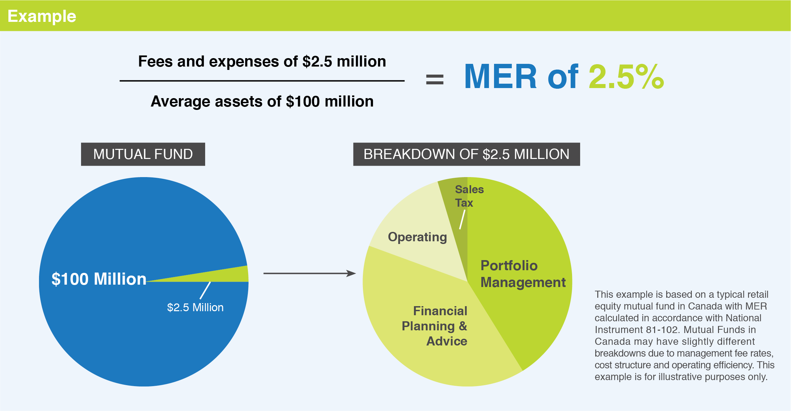

## Table of Contents

## What is a management fee?

A management fee is a charge that someone pays for the professional management of their investments or assets. It's like paying a fee to a person or a company that helps you take care of your money. This fee is usually a percentage of the total amount of money being managed. For example, if you have $100,000 invested and the management fee is 1%, you would pay $1,000 per year.

These fees are common in mutual funds, hedge funds, and other types of investment funds. The fee covers the costs of running the fund, like paying the fund manager and other staff, as well as other operational expenses. It's important for investors to understand these fees because they can affect how much money they make from their investments over time. A higher fee might mean less profit for the investor.

## What is an expense ratio?

An expense ratio is a way to measure how much it costs to run a mutual fund or an exchange-traded fund (ETF). It's shown as a percentage of the fund's total assets. For example, if a fund has an expense ratio of 0.5%, that means for every $100 you invest in the fund, you pay 50 cents each year to cover the costs of managing the fund.

These costs include things like paying the fund manager, administrative expenses, and other fees needed to keep the fund running smoothly. The expense ratio is important because it directly affects the returns you get from your investment. A lower expense ratio means more of your money stays invested and can grow over time, while a higher expense ratio can eat into your profits.

## How are management fees and expense ratios calculated?

Management fees are calculated as a percentage of the total assets that are being managed. For example, if you have $10,000 invested and the management fee is 1%, you would pay $100 per year. This fee is usually taken out of the investment account automatically, so you don't have to write a check or do anything extra. The percentage used for the management fee is set by the company or person managing your investments and can vary depending on the type of investment and the services provided.

An expense ratio is also calculated as a percentage, but it includes all the costs of running a mutual fund or ETF. If a fund has an expense ratio of 0.75%, that means for every $100 you have invested in the fund, you pay 75 cents each year to cover the fund's operating costs. These costs can include management fees, administrative fees, and other expenses needed to manage the fund. The expense ratio is important because it shows how much of your investment is being used to pay for the fund's operations, which can affect your overall returns.

## What is the typical range for management fees in mutual funds?

Management fees in mutual funds can vary a lot, but they usually fall between 0.5% and 1.5% of the total amount of money you have invested. This means if you have $10,000 in a mutual fund with a management fee of 1%, you would pay $100 each year for the management of your money.

The exact fee depends on the type of mutual fund. For example, actively managed funds, where a person makes decisions about what to buy and sell, often have higher fees than passively managed funds, like index funds, which just try to match the performance of a certain market index. So, it's a good idea to look at the fees before you invest, because they can affect how much money you make in the end.

## What is the typical range for expense ratios in mutual funds?

Expense ratios in mutual funds usually range from about 0.1% to 2% of the total amount you have invested. This means if you have $10,000 in a fund with an expense ratio of 1%, you would pay $100 each year to cover the costs of running the fund.

The exact expense ratio can depend on whether the fund is actively managed or passively managed. Actively managed funds, where a manager picks the investments, often have higher expense ratios, sometimes up to 2%. Passively managed funds, like index funds, which just try to match a market index, usually have lower expense ratios, often around 0.1% to 0.5%. Knowing the expense ratio is important because it can affect how much money you keep from your investments over time.

## How do management fees impact the overall return of an investment?

Management fees can really affect how much money you make from your investment. Think of it like this: if you have $10,000 invested and you pay a 1% management fee, that's $100 every year just to have someone manage your money. That $100 could have been earning more money for you if it stayed invested. Over time, these fees add up, and they can make a big difference in your total earnings, especially if you're investing for a long time, like for retirement.

It's also important to know that even small differences in fees can have a big impact over many years. For example, if one fund has a 0.5% fee and another has a 1% fee, the one with the lower fee will usually give you more money in the end because you're keeping more of your investment working for you. So, when you're choosing where to put your money, it's a good idea to look at the fees and think about how they might affect your returns over time.

## How do expense ratios affect the net performance of a fund?

Expense ratios can really change how much money you make from a fund. If a fund has a high expense ratio, it means more of your money is being used to pay for running the fund instead of being invested. For example, if you have $10,000 in a fund with a 1% expense ratio, you're paying $100 each year just to keep the fund going. That $100 could have been earning more money for you if it stayed invested. So, over time, a high expense ratio can eat into your profits.

It's important to compare expense ratios when you're choosing where to put your money. Even a small difference in expense ratios can make a big impact over many years. For instance, a fund with a 0.5% expense ratio will usually give you more money in the end than a fund with a 1% expense ratio because you're keeping more of your investment working for you. So, when you're looking at funds, think about how the expense ratio might affect your returns over time.

## Can management fees be negotiated, and if so, how?

Yes, management fees can sometimes be negotiated, but it depends on the type of investment and the company managing it. If you're investing a lot of money, like in a private wealth management account, you might be able to talk about the fees. Big investors can sometimes get a lower fee because they bring in more money for the company to manage. It's like buying in bulk; the more you invest, the more likely they are to give you a discount.

To negotiate, you can start by talking to your financial advisor or the company directly. Ask if there's any room to lower the fee, especially if you're planning to invest a large amount or if you've been a loyal customer for a long time. Remember, not all fees can be changed, especially with things like mutual funds where the fees are set for everyone. But it never hurts to ask, and the worst they can say is no.

## What are the differences between management fees and other types of fees in investment funds?

Management fees are what you pay to have someone manage your investments. They are usually a percentage of the total money you have invested. For example, if you have $10,000 in a fund with a 1% management fee, you pay $100 each year. These fees are for the work the manager does, like picking which stocks or bonds to buy and sell. Management fees are common in mutual funds, hedge funds, and other types of investment funds.

Other types of fees in investment funds include things like administrative fees, transaction fees, and load fees. Administrative fees cover the costs of running the fund, like paperwork and customer service. Transaction fees are charged when the fund buys or sells investments. Load fees are sales charges you might pay when you buy or sell shares in a fund. These fees can add up and affect how much money you keep from your investments. It's important to know about all these fees because they can make a big difference in your overall returns.

## How do regulatory bodies oversee the disclosure of management fees and expense ratios?

Regulatory bodies like the Securities and Exchange Commission (SEC) in the United States make sure that investment funds tell you clearly about their fees. They have rules that say funds must show their management fees and expense ratios in a way that's easy to understand. This is usually done in the fund's prospectus, which is a document that gives you all the important details about the fund. By making sure these fees are clear, regulatory bodies help you see how much you're paying and make better choices about where to put your money.

These rules help keep things fair and open. If a fund doesn't follow the rules about telling you about fees, they can get in trouble. The goal is to make sure everyone knows what they're paying for, so there are no surprises. This way, you can compare different funds and see which ones might be a better deal for you. It's all about making sure you have the information you need to make smart investment decisions.

## What strategies can investors use to minimize the impact of high management fees and expense ratios?

Investors can minimize the impact of high management fees and expense ratios by choosing low-cost investment options, like index funds or ETFs. These types of funds often have lower fees because they don't need a manager to pick investments; they just try to match the performance of a certain market index. By going with these low-cost options, you keep more of your money working for you, which can lead to bigger returns over time.

Another strategy is to look for funds with no-load fees, which are charges you might pay when buying or selling shares. Some funds also offer different share classes with different fee structures, so it's worth checking to see if you can switch to a class with lower fees. It's also a good idea to review your investments regularly and compare the fees you're paying with other similar funds. If you find a fund with lower fees that meets your investment goals, it might be worth making a switch to save money in the long run.

## How do management fees and expense ratios vary across different types of investment vehicles, such as ETFs, mutual funds, and hedge funds?

Management fees and expense ratios can be quite different depending on the type of investment vehicle you choose. For example, exchange-traded funds (ETFs) often have lower management fees and expense ratios than mutual funds. ETFs usually track an index, so they don't need an active manager picking investments, which keeps costs down. You might find ETFs with expense ratios as low as 0.03% to 0.5%. On the other hand, mutual funds, especially those that are actively managed, can have higher fees. Their expense ratios might range from 0.5% to 2%, and the management fee alone could be around 0.5% to 1.5%. This is because someone is actively choosing what to buy and sell, which costs more money.

Hedge funds are a different story altogether. They usually charge much higher fees than ETFs or mutual funds. A common fee structure for hedge funds is the "2 and 20" model, where you pay a 2% management fee on the total assets and a 20% performance fee on any profits. This means if you have $1 million invested and the fund makes a 10% profit, you'd pay $20,000 for the management fee and $20,000 for the performance fee. Because hedge funds are often aimed at wealthy investors and can involve more complex strategies, their fees reflect the higher level of service and expertise they provide.

## What are the costs associated with investment funds and how can they be understood?

Investment fund costs play a fundamental role in shaping the net returns investors receive. Understanding these expenses is crucial because they can significantly influence the overall profitability of an investment. Commonly, these costs are divided into two primary categories: the management fee and the management expense ratio (MER). Each serves a distinct purpose and impacts a fund's cost structure differently.

**Management fee** is the cost incurred by investors for the professional management of the fund’s portfolio. It is typically calculated as a percentage of the assets under management (AUM) and compensates the fund managers for their expertise and services. The fee generally covers activities such as portfolio management, research, and analysis necessary for making informed investment decisions.

On the other hand, the **Management Expense Ratio (MER)** offers a comprehensive view of the total cost associated with holding a fund. The MER is expressed as a percentage of the fund's average total assets over a specific period, usually annually. This ratio encompasses the management fee along with additional expenses such as administrative, operational, and marketing costs related to the fund’s operation.

The formula to calculate the MER is as follows:

$$
\text{MER} = \left(\frac{\text{Total Fund Operating Expenses}}{\text{Average Total Assets}}\right) \times 100
$$

Both the management fee and MER are vital metrics used by investors to compare the cost-effectiveness of various funds. A clear understanding of these components is essential for making informed investment decisions. By comparing the MERs of different funds, investors can gauge which funds may offer better net returns relative to their costs. Therefore, this knowledge helps investors select investment funds that align with their financial goals while minimizing unnecessary expenses.

## What is a Management Fee?

Management fees play a crucial role in the investment landscape, providing a mechanism for compensating fund managers tasked with the strategic oversight and decision-making associated with a fund’s portfolio. These fees are generally expressed as a percentage of the assets under management (AUM) and represent a primary cost for investors involved in managed funds.

The rationale behind management fees is largely attributed to the expertise and services provided by fund managers. Their responsibilities encompass a wide range of activities, including researching investment opportunities, executing trades, and monitoring the performance of the fund. Hence, these fees serve as remuneration for the knowledge and skills brought by the managers in guiding the fund towards achieving its financial objectives.

Mathematically, the management fee can be represented as:

$$
\text{Management Fee} = \left( \frac{\text{Management Fee Rate}}{100} \right) \times \text{AUM}
$$

where the management fee rate is a predetermined annual percentage. This percentage varies among funds and is crucial in determining the cost structure faced by the investor.

For investors, understanding the implications of management fees is essential, as these fees directly reduce the net return from the investment. An investor's net return can be calculated by subtracting the management fee from the gross return. Selecting funds with competitive management fees can, therefore, play a significant role in maximizing net returns over time.

Furthermore, transparent disclosure of management fees is mandatory in prospectuses, allowing investors to make informed comparisons among different funds. These comparisons can reveal how management fees align with the fund’s performance and risk profile, offering insights into whether the fees are justified relative to the value offered.

In summary, management fees are integral to the functioning and sustainability of managed funds. They provide the financial foundation supporting fund managers’ expertise while simultaneously posing a cost consideration that investors must account for in their investment strategies.

## What is the Management Expense Ratio (MER)?

The Management Expense Ratio (MER) is a critical metric for investors, providing a comprehensive overview of the total costs associated with owning an investment fund. Expressed as a percentage of the fund's total assets, the MER encompasses an array of expenses that a fund incurs during its operation. 

Firstly, the MER includes the management fee, which compensates fund managers for their expertise and decision-making in handling the fund's portfolio. Beyond this, the MER also covers various administrative costs. These can encompass legal fees, accounting services, and marketing expenses, all of which are necessary for the smooth running of the fund. Additionally, the ratio accounts for operational expenses like custodial and audit fees, which ensure the fund's financial statements and transactions are accurately maintained and verified.

The calculation of the MER can be represented mathematically as:

$$
\text{MER} = \frac{\text{Total Fund Expenses}}{\text{Total Fund Assets}} \times 100
$$

Where "Total Fund Expenses" include both the management fees and additional costs such as administrative and operational expenses. By expressing the total expenses as a percentage of the fund’s total assets, the MER allows investors to easily compare the cost-effectiveness of various funds. 

A lower MER indicates a more cost-efficient fund, potentially leading to higher net returns for investors. As such, when evaluating investment options, investors often use the MER as an essential tool to gauge the expense burden imposed by different funds. Comparisons using the MER thus help investors select funds that align with their financial goals while keeping costs at a minimum.

## What is the relationship between Algorithmic Trading and Investment Costs?

Algorithmic trading, a modern approach to investing, utilizes computer algorithms to execute trading decisions at speeds and frequencies that surpass human capability. This method heavily relies on technology to streamline processes and enhance efficiency in executing trades. However, the efficiencies gained in execution can be undermined by transaction and fund costs, emphasizing the importance of cost considerations in algorithmic investment strategies. 

These trading systems are sensitive to the costs associated with each trade and the overall management of funds within which they operate. For instance, transaction costs, which include fees related to buying and selling assets, can add up and significantly impact the profitability of high-frequency trading strategies. Additionally, management fees and expense ratios of funds play a crucial role in defining the net returns from algorithmic trades. Algorithms that seek to optimize trading strategies typically incorporate fee analysis to address these cost implications. By doing so, they aim to select cost-efficient funds, thereby preserving the profits generated from trading activities.

Fee analysis in [algorithmic trading](/wiki/algorithmic-trading) often involves quantitative models that assess the trade-off between potential returns and costs incurred. This could be expressed in a simplified form as follows:

$$
\text{Net Returns} = \text{Gross Returns} - (\text{Transaction Costs} + \text{Management Fees} + \text{Expense Ratio})
$$

In this equation, each component represents a crucial aspect that algorithms must evaluate to ensure profitability. Gross returns are the initial profits expected from trading activities. From these, transaction costs, management fees, and the expense ratio are subtracted to determine net returns. 

Advanced algorithmic strategies use [machine learning](/wiki/machine-learning) and predictive analytics to forecast the impact of fees across different funds and trading environments. For example, an algorithm might utilize historical fee data and apply predictive models to estimate future transaction costs under different market conditions. In Python, a basic framework for such a predictive model might involve libraries like `pandas` for data manipulation and `scikit-learn` for machine learning as demonstrated below:

```python
import pandas as pd
from sklearn.model_selection import train_test_split
from sklearn.linear_model import LinearRegression

# Sample fee and return data
data = pd.DataFrame({
    'TransactionCosts': [0.002, 0.003, 0.0015, 0.0025],
    'ManagementFees': [0.01, 0.015, 0.007, 0.012],
    'ExpenseRatio': [0.005, 0.006, 0.004, 0.0055],
    'GrossReturns': [0.08, 0.06, 0.09, 0.075]
})

# Calculate net returns
data['NetReturns'] = data['GrossReturns'] - (data['TransactionCosts'] + data['ManagementFees'] + data['ExpenseRatio'])

# Prepare features and target
features = data[['TransactionCosts', 'ManagementFees', 'ExpenseRatio']]
target = data['NetReturns']

# Split data for training and testing
X_train, X_test, y_train, y_test = train_test_split(features, target, test_size=0.2, random_state=42)

# Train a linear regression model
model = LinearRegression()
model.fit(X_train, y_train)

# Predict net returns on test data
predictions = model.predict(X_test)
```

By systematically integrating fee analysis with trading algorithms, investors can better align their strategies with cost-efficient opportunities. This approach is especially critical in competitive markets where even marginal cost advantages can lead to significant benefit. As algorithmic trading continues to evolve, understanding and optimizing for investment costs remains a central focus for achieving sustainable returns.

## References & Further Reading

[1]: Bergstra, J., Bardenet, R., Bengio, Y., & Kégl, B. (2011). ["Algorithms for Hyper-Parameter Optimization."](https://papers.nips.cc/paper/4443-algorithms-for-hyper-parameter-optimization) Advances in Neural Information Processing Systems 24.

[2]: ["Advances in Financial Machine Learning"](https://www.amazon.com/Advances-Financial-Machine-Learning-Marcos/dp/1119482089) by Marcos Lopez de Prado

[3]: ["Evidence-Based Technical Analysis: Applying the Scientific Method and Statistical Inference to Trading Signals"](https://www.amazon.com/Evidence-Based-Technical-Analysis-Scientific-Statistical/dp/0470008741) by David Aronson

[4]: ["Machine Learning for Algorithmic Trading"](https://github.com/stefan-jansen/machine-learning-for-trading) by Stefan Jansen

[5]: ["Quantitative Trading: How to Build Your Own Algorithmic Trading Business"](https://www.amazon.com/Quantitative-Trading-Build-Algorithmic-Business/dp/1119800064) by Ernest P. Chan

[6]: Vanguard. (n.d.). ["Vanguard fund expense ratios."](https://investor.vanguard.com/investor-resources-education/education/expense-ratio)

[7]: Fidelity. (n.d.). ["Zero expense ratio index mutual funds."](https://robberger.com/fidelity-zero-funds-review/)