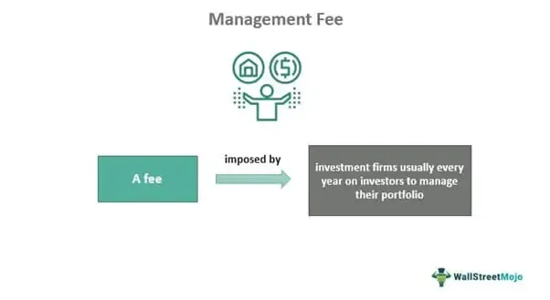

Algorithmic trading, often referred to as algo trading, is a process that leverages complex computer algorithms to automate financial trading strategies. These algorithms make decisions on various trading aspects, including timing, price, and quantity, without human intervention. The automation of trading strategies through algorithms is becoming increasingly popular due to its inherent speed, accuracy, and efficiency, which significantly contribute to optimizing trade executions and minimizing market impact. As the prominence of algorithmic trading grows, it becomes crucial for investors to understand the financial implications, particularly the management fees associated with these strategies.

Management fees are an essential consideration for investors engaging in algorithmic trading as they directly impact the profitability and net returns of their investments. These fees, which compensate investment managers for their expertise and operational efforts, can vary widely depending on factors such as the complexity of the trading strategy and the amount of assets under management (AUM). While some strategies may justify higher fees due to their potential for generating substantial returns, others may not offset the cost sufficiently, thus affecting overall investment performance.

This article provides an overview of average cost management fees and their role in financial management. It examines their implications on algorithmic trading strategies and how these costs can influence decision-making for investors. By exploring examples and practical insights, we aim to equip investors with the knowledge needed to navigate the complexities of managing and optimizing trading expenditures effectively. Understanding these aspects is vital for making informed decisions that align with financial objectives and maximizing the potential benefits of algorithmic trading approaches.

## Table of Contents

## Understanding Management Fees

Management fees are charges imposed by investment managers for managing a portfolio or investment fund. These fees serve as compensation for the expertise, time, and effort that managers dedicate to selecting securities and managing the portfolio's performance. They are crucial in covering not only the manager's salary but also a range of related expenses, such as investor relations, fund administration, research, and compliance activities necessary to run the fund effectively.

In practice, management fees are typically expressed as a percentage of the assets under management (AUM). This percentage can vary significantly based on the type of investment fund and management strategy employed. For example, management fees can range from as low as 0.10% for passive index funds to over 2% for actively managed funds. The variation in fee structures reflects the level of active oversight and strategic input by the fund manager.

The formula to calculate the management fee is generally given by:

$$
\text{Management Fee} = \frac{\text{Management Fee Percentage}}{100} \times \text{Assets Under Management (AUM)}
$$

For example, if a fund has an AUM of $1 million and charges a management fee of 1%, the annual management fee would be calculated as follows:

$$
\text{Management Fee} = \frac{1}{100} \times 1,000,000 = \$10,000
$$

Importantly, these fees are typically charged on an annual basis and are deducted from the fund's assets. This deduction impacts the net asset value (NAV) and the overall returns that investors realize. Thus, understanding management fees is critical for investors when comparing different funds and strategies to ensure they are not eroding the potential returns through excessive fees.

## Management Fee Structures

Management fee structures are a pivotal aspect for investors, varying significantly across different investment funds. These variations are largely dictated by the fund’s investment style and objectives. 

Actively managed funds generally [carry](/wiki/carry-trading) higher management fees compared to their passive counterparts. This is primarily due to the intensive resources required in actively managed funds, where fund managers engage in frequent buying and selling of securities and continuous monitoring of the financial markets. This active approach aims to outperform market benchmarks, thereby justifying the higher costs associated with employing skilled fund managers, comprehensive research teams, and advanced analytics tools.

In contrast, passively managed funds, such as index funds, incur lower management fees. These funds aim to replicate the performance of a specific index, such as the S&P 500, by holding the same or a representative sample of the index’s securities. As this approach requires less frequent trading and fewer resources, it naturally results in reduced costs to the investor. 

Understanding the nuances of these fee structures is essential for investors, enabling them to make informed decisions aligned with their financial objectives. Analyzing whether the fees are justified by the fund’s performance involves comparing the net returns of a fund, after management fees, against its benchmark or other peer funds. Investors should consider whether the potential performance of an active strategy justifies the higher expense, or if a more cost-effective passive strategy aligns better with their investment goals. 

Thus, scrutinizing management fees based on the fund type and its performance can significantly influence an investor's strategy, ensuring that their investment choices are prudent and potentially more profitable.

## Impact of Management Fees on Algorithmic Trading

Algorithmic trading frequently involves executing a large number of transactions within short periods, which can lead to substantial management fees if not effectively managed. Management fees, although necessary for compensating asset managers and covering administrative expenses, can significantly reduce net returns from [algorithmic trading](/wiki/algorithmic-trading) strategies. 

These fees are typically calculated as a percentage of the assets under management (AUM). In algorithmic trading, where portfolios are often rebalanced regularly to optimize performance, the cumulative effect of management fees can become significant. This makes it essential for traders and investors to analyze these costs rigorously.

One of the primary challenges is balancing transaction costs with the potential for higher returns derived from sophisticated trading algorithms. Although these algorithms are designed to exploit market inefficiencies for profit, excessive fees can erode these benefits. Therefore, evaluating whether the potential enhanced profitability from active management justifies the elevated costs is crucial.

To illustrate the impact quantitatively, consider an algorithmic trading strategy with a return potential of $R$ and a management fee rate of $m\%$ on the AUM. The net return can be represented by the formula:

$$
\text{Net Return} = R - \left( \frac{m}{100} \times \text{AUM} \right)
$$

Suppose the return potential $R$ is $150,000 on an AUM of $10 million, and the management fee is 2%. The management fee would be:

$$
\text{Fee} = \frac{2}{100} \times 10,000,000 = \$200,000
$$

In this case, the net return becomes negative:

$$
\text{Net Return} = 150,000 - 200,000 = -\$50,000
$$

This example underscores the importance of assessing fee structures and their implications on overall returns. Without diligent evaluation, high management fees can entirely negate the gains from algorithmic trading strategies.

In summary, investors and traders should regularly monitor fee structures and employ computational methods to evaluate whether their trading objectives are still being met despite the cost of management fees. This cautious approach enables investors to better manage their expectations and align their strategies with financial objectives in the landscape of algorithmic trading.

## Examples of Management Fee Calculations

Consider an actively managed mutual fund that imposes a management fee of 1.5% on the assets under management (AUM). If this fund manages assets totaling $2 million, the management fee is calculated as:

$$
\text{Management Fee} = \text{AUM} \times \text{Fee Percentage} = \$2,000,000 \times 0.015 = \$30,000
$$

This $30,000 annual fee illustrates how management fees can consume a portion of investment returns, stressing the importance of understanding fee structures.

In algorithmic trading, the fee structure can be more complex, involving several components. Typical fees include:

1. **Brokerage Costs:** These are incurred for executing trades. Each transaction may have a small cost, but in high-frequency trading, these can accumulate rapidly.

2. **Bid-Ask Spreads:** This is the difference between the buy and sell prices. Frequent trading increases exposure to this spread, impacting profitability.

3. **Additional Management Fees:** Like traditional investment funds, algorithmic trading strategies often carry fees based on the value of assets traded.

For example, consider an algorithmic trading strategy with the following hypothetical costs:

- Brokerage fee: $0.01 per share
- Average trade size: 1,000 shares
- Daily trades: 100

Calculating the annual brokerage cost:

$$
\text{Annual Brokerage Cost} = \text{Brokerage Fee} \times \text{Average Trade Size} \times \text{Daily Trades} \times \text{Trading Days Per Year}
$$

Assuming 252 trading days in a year:

$$
\text{Annual Brokerage Cost} = \$0.01 \times 1,000 \times 100 \times 252 = \$252,000
$$

Adding bid-ask spreads and additional management fees could further increase total trading costs significantly, underlining the need for strategic financial planning. Investors must carefully assess these factors to ensure that the trading strategy's potential returns justify these expenses. Fee management hence becomes crucial to enhance net returns from algorithmic trading activities.

## Strategies to Manage and Mitigate Fees in Algo Trading

In algorithmic trading, minimizing transaction frequency is a practical method to reduce overall costs. By decreasing the number of transactions, traders can lower expenses related to brokerage fees and bid-ask spreads, thus improving net profitability. Adopting strategies that minimize unnecessary trading activity helps in managing these costs effectively.

Investors might consider employing a hybrid approach, blending both algorithmic and manual trading strategies. This combination allows traders to leverage the speed and efficiency of algorithms while retaining the oversight and strategic adjustments that manual trading offers. For instance, an algorithm could handle the bulk of transactions based on predefined rules, while manual oversight ensures strategic trades during volatile market conditions. This approach maximizes returns and ensures that costs remain manageable.

Additionally, consistently reviewing and negotiating management fees with service providers is a crucial strategy for optimizing costs in algorithmic trading. Traders should regularly assess the fees charged by brokers or fund managers, seeking opportunities for negotiation to secure better terms. Fee transparency is crucial when selecting funds or service providers, as it allows investors to make informed decisions about where to allocate their resources. Selecting funds with clear and upfront fee structures can prevent unexpected expenses and ensure alignment with financial goals.

By implementing these strategies, traders can enhance their algorithmic trading efficiency and optimize their net returns without being disproportionately affected by fees.

## Conclusion

Management fees play a pivotal role in shaping both traditional and algorithmic trading outcomes by directly affecting net returns. These fees, often calculated as a percentage of assets under management (AUM), necessitate careful consideration in the development and execution of trading strategies. By comprehensively understanding management fees, investors can strategically mitigate their impact, optimizing overall returns.

Investors can deploy a variety of strategies to reduce the influence of management fees on their portfolios. This may include selecting investment funds with fee structures aligned with their financial goals and risk tolerance, negotiating more favorable terms with service providers, and incorporating technologies and methodologies that streamline transactions and reduce associated costs. For instance, limiting transaction frequency in algorithmic trading can curtail expenses, thus enhancing net profitability.

Consistent education and rigorous financial analysis remain critical for investors striving to align their trading strategies with their financial objectives. As the landscape of algorithmic trading continuously evolves, being informed of regulatory changes, market dynamics, and technological advancements is essential. This proactive approach allows investors to make judicious decisions, ensuring that management fees do not unduly detract from investment performance. By implementing these considerations and leveraging contemporary financial tools, investors can effectively enhance their trading results within the complex framework of algorithmic trading.

## References & Further Reading

[1]: ["Advances in Financial Machine Learning"](https://github.com/FIONA-Youkyung/Financial_Engineering/blob/master/Advances_in_Financial_Machine_Learning_Marcos_Lopez_de_Prado.pdf) by Marcos Lopez de Prado

[2]: ["Evidence-Based Technical Analysis: Applying the Scientific Method and Statistical Inference to Trading Signals"](https://www.amazon.com/Evidence-Based-Technical-Analysis-Scientific-Statistical/dp/0470008741) by David Aronson

[3]: ["Machine Learning for Algorithmic Trading"](https://github.com/stefan-jansen/machine-learning-for-trading) by Stefan Jansen

[4]: ["Quantitative Trading: How to Build Your Own Algorithmic Trading Business"](https://www.amazon.com/Quantitative-Trading-Build-Algorithmic-Business/dp/1119800064) by Ernest P. Chan

[5]: Bergstra, J., Bardenet, R., Bengio, Y., & Kégl, B. (2011). ["Algorithms for Hyper-Parameter Optimization."](https://dl.acm.org/doi/10.5555/2986459.2986743) Advances in Neural Information Processing Systems 24.