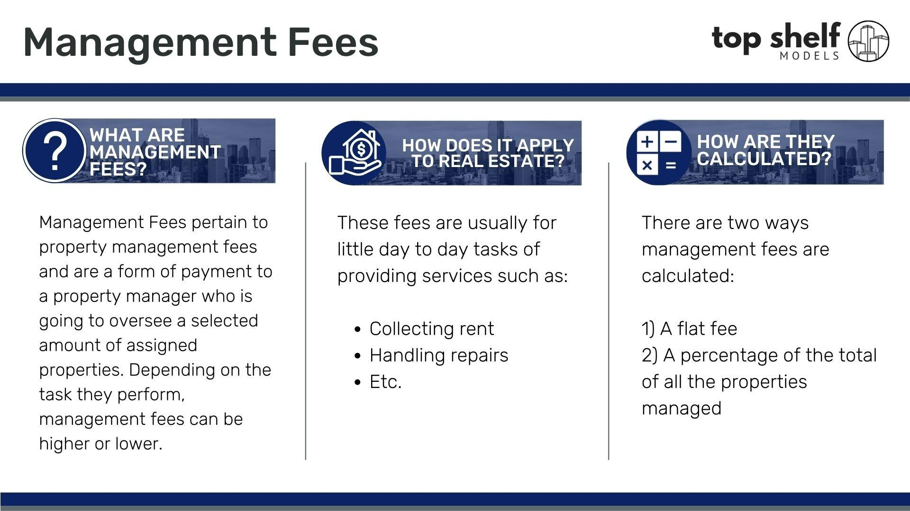

## Table of Contents

## What is a management fee?

A management fee is a charge that someone pays for managing their money or investments. It's like paying a fee to a person or a company that helps take care of your money. This fee is usually a percentage of the total amount of money being managed. For example, if you have $100,000 being managed and the fee is 1%, you would pay $1,000 per year.

These fees are common in mutual funds, hedge funds, and other investment vehicles. The fee covers the costs of the professional management and other services provided by the fund managers. It's important for people to know about these fees because they can affect how much money they make from their investments over time. If the fee is too high, it might eat into the profits and reduce the overall return on investment.

## How are management fees typically calculated?

Management fees are usually calculated as a percentage of the total assets being managed. For example, if you have $50,000 in a mutual fund and the management fee is 1%, you would pay $500 per year. This percentage is often called the expense ratio, and it's taken out of the fund's assets, so you don't have to pay it directly out of your pocket.

These fees can be charged in different ways. Sometimes, they are taken out of the fund every month or every quarter. Other times, they might be taken out all at once at the end of the year. It's important to know how and when the fee is charged because it can affect how much money you have left in your investment. Always check the fund's prospectus or talk to your financial advisor to understand exactly how the management fee works.

## Who pays the management fee in an investment fund?

The management fee in an investment fund is paid by the investors in the fund. When you put your money into a mutual fund or a similar investment, part of that money goes towards paying the management fee. This fee is usually taken directly from the fund's assets, so you don't have to write a check or make a separate payment.

The fee covers the costs of running the fund, like paying the people who manage the investments and other expenses. It's important for investors to know about the management fee because it can affect how much money they make from their investment. If the fee is too high, it might reduce the overall return on their investment.

## What is the average management fee for mutual funds?

The average management fee for mutual funds can vary a lot, but it's usually around 0.5% to 1.5% of the total money in the fund each year. This means if you have $10,000 in a mutual fund with a 1% fee, you'll pay $100 per year for the management of your money.

These fees can be different depending on the type of mutual fund. For example, actively managed funds, where people are making decisions about what to buy and sell, often have higher fees than index funds, which just try to match the performance of a market index. It's a good idea to look at the fees when you're choosing a mutual fund because they can affect how much money you keep in the end.

## How do management fees impact investment returns?

Management fees can have a big effect on how much money you make from your investments. When you pay a management fee, it comes out of the money you have in the fund. This means less money is left to grow and earn more money for you. For example, if you have $10,000 in a fund with a 1% fee, you'll pay $100 each year. That $100 could have been [earning](/wiki/earning-announcement) more money for you if it stayed in the fund.

Over time, these fees can add up and make a big difference. If you're paying a high fee, it can eat into your profits and lower your overall return on investment. For example, if your investment grows by 7% in a year but you pay a 1% fee, your real return is only 6%. It's important to think about these fees when you choose where to put your money because they can affect how much you end up with in the long run.

## Can management fees be negotiated?

Yes, sometimes management fees can be negotiated, but it depends on the type of investment and the company managing it. If you have a lot of money to invest, like a big amount in a private fund or a [hedge fund](/wiki/hedge-fund-trading-strategies), you might be able to talk to the manager and get a lower fee. This is because the company wants to keep your big investment, so they might be willing to give you a better deal.

For regular people with smaller investments, like in mutual funds or ETFs, it's usually harder to negotiate fees. These fees are set by the company and apply to everyone who invests in the fund. But you can still look for funds with lower fees or talk to a financial advisor to find the best options for your money.

## What is the difference between management fees and performance fees?

Management fees and performance fees are two different types of charges you might see when you invest your money. A management fee is what you pay for someone to take care of your money. It's usually a small percentage of the total money you have invested, and you pay it every year no matter how well your investment is doing. It's like paying rent for having your money managed.

A performance fee is different. You only pay this fee if your investment does really well. It's a way for the people managing your money to earn more if they make your investment grow a lot. The fee is often a percentage of the extra money your investment makes above a certain level. So, if your investment does great, you'll pay more, but if it doesn't, you won't have to pay this fee at all.

## How do management fees vary across different types of investment vehicles?

Management fees can be different depending on the type of investment you choose. For example, mutual funds often have management fees that range from 0.5% to 1.5% of the total money in the fund each year. These fees are used to pay the people who manage the fund and cover other costs. Actively managed mutual funds, where the manager is [picking](/wiki/asset-class-picking) specific investments, usually have higher fees than index funds, which just follow a market index like the S&P 500.

In other types of investments, like hedge funds, management fees might be higher. Hedge funds often charge around 2% of the total money being managed each year. On top of that, they might also charge performance fees if the fund does well. Exchange-traded funds (ETFs) usually have lower management fees, often less than 0.5%, because they are passively managed and track an index. Knowing the fees for different investment vehicles can help you pick the one that's best for your money.

## What are some strategies to minimize management fees?

One way to cut down on management fees is to choose index funds or ETFs instead of actively managed funds. Index funds and ETFs usually have lower fees because they just follow a market index, like the S&P 500, and don't need a lot of people to manage them. This means more of your money stays in your pocket instead of going to fees. Another good idea is to look for funds with low expense ratios, which is just a fancy way of saying the management fee. You can find this information in the fund's prospectus or on their website.

Another strategy is to invest in no-load funds, which don't charge you extra fees for buying or selling the fund. Some funds charge these extra fees, and they can add up over time. If you have a lot of money to invest, you might even be able to talk to the fund manager and get a lower fee. This is called negotiating, and it's more common with big investments in private funds or hedge funds. But for smaller investors, sticking to low-cost funds is usually the best way to keep your fees down and make your money grow faster.

## How do management fees affect the expense ratio of a fund?

Management fees are a big part of what makes up the expense ratio of a fund. The expense ratio is just a fancy way of saying all the costs of running the fund, like paying the people who manage it and other expenses, divided by the total amount of money in the fund. The management fee is the money you pay to have someone take care of your investment, and it's usually a percentage of your total investment. So, if the management fee is high, the expense ratio will be high too.

This matters because the expense ratio comes out of the fund's money, which means less money is left to grow and earn more for you. If a fund has a high expense ratio, it can eat into your profits and lower how much money you make from your investment over time. That's why it's a good idea to look for funds with low expense ratios, so more of your money can stay in the fund and work for you.

## What regulatory considerations should be noted regarding management fees?

When it comes to management fees, there are rules that companies have to follow to make sure they're being fair to investors. In the United States, the Securities and Exchange Commission (SEC) is the group that watches over these rules. They make sure that funds tell investors about their fees clearly and honestly. Funds have to put this information in a document called a prospectus, which anyone can read to see what fees they might have to pay. This helps investors make smart choices about where to put their money.

There are also rules about how much funds can charge in fees. For example, some types of funds, like mutual funds, have limits on certain kinds of fees to protect investors. It's important for investors to know about these rules because they can help them understand if the fees they're being charged are fair. If a fund isn't following the rules, investors can report it to the SEC, which can then take action to make things right.

## How do global management fee structures differ, and what are the implications for international investors?

Management fee structures can be different in different parts of the world, and this can affect how much money international investors make from their investments. In the United States, management fees for mutual funds are usually between 0.5% and 1.5% of the total money in the fund. In Europe, fees might be a bit lower, especially for passively managed funds like ETFs, which often have fees under 0.5%. In some countries in Asia, like Japan, fees can be higher, sometimes reaching up to 2% or more for actively managed funds. These differences can make a big impact on how much money investors keep after fees are taken out.

For international investors, understanding these differences is important because it can help them choose where to put their money to get the best return. If an investor from the U.S. wants to invest in a fund in Europe, they might find lower fees and keep more of their money. But if they invest in a fund in Asia with higher fees, it could eat into their profits. It's also important to think about other costs, like currency exchange fees, when investing in different countries. Knowing about these global differences can help investors make smarter choices and keep more of their money working for them.

## What is the understanding of management fees?

Management fees are charges imposed by investment managers for managing a portfolio or investment fund. These fees serve as compensation for the expertise, time, and effort that managers dedicate to selecting securities and managing the portfolio's performance. They are crucial in covering not only the manager's salary but also a range of related expenses, such as investor relations, fund administration, research, and compliance activities necessary to run the fund effectively.

In practice, management fees are typically expressed as a percentage of the assets under management (AUM). This percentage can vary significantly based on the type of investment fund and management strategy employed. For example, management fees can range from as low as 0.10% for passive index funds to over 2% for actively managed funds. The variation in fee structures reflects the level of active oversight and strategic input by the fund manager.

The formula to calculate the management fee is generally given by:

$$
\text{Management Fee} = \frac{\text{Management Fee Percentage}}{100} \times \text{Assets Under Management (AUM)}
$$

For example, if a fund has an AUM of $1 million and charges a management fee of 1%, the annual management fee would be calculated as follows:

$$
\text{Management Fee} = \frac{1}{100} \times 1,000,000 = \$10,000
$$

Importantly, these fees are typically charged on an annual basis and are deducted from the fund's assets. This deduction impacts the net asset value (NAV) and the overall returns that investors realize. Thus, understanding management fees is critical for investors when comparing different funds and strategies to ensure they are not eroding the potential returns through excessive fees.

## What is the impact of management fees on algorithmic trading?

Algorithmic trading frequently involves executing a large number of transactions within short periods, which can lead to substantial management fees if not effectively managed. Management fees, although necessary for compensating asset managers and covering administrative expenses, can significantly reduce net returns from [algorithmic trading](/wiki/algorithmic-trading) strategies. 

These fees are typically calculated as a percentage of the assets under management (AUM). In algorithmic trading, where portfolios are often rebalanced regularly to optimize performance, the cumulative effect of management fees can become significant. This makes it essential for traders and investors to analyze these costs rigorously.

One of the primary challenges is balancing transaction costs with the potential for higher returns derived from sophisticated trading algorithms. Although these algorithms are designed to exploit market inefficiencies for profit, excessive fees can erode these benefits. Therefore, evaluating whether the potential enhanced profitability from active management justifies the elevated costs is crucial.

To illustrate the impact quantitatively, consider an algorithmic trading strategy with a return potential of $R$ and a management fee rate of $m\%$ on the AUM. The net return can be represented by the formula:

$$
\text{Net Return} = R - \left( \frac{m}{100} \times \text{AUM} \right)
$$

Suppose the return potential $R$ is $150,000 on an AUM of $10 million, and the management fee is 2%. The management fee would be:

$$
\text{Fee} = \frac{2}{100} \times 10,000,000 = \$200,000
$$

In this case, the net return becomes negative:

$$
\text{Net Return} = 150,000 - 200,000 = -\$50,000
$$

This example underscores the importance of assessing fee structures and their implications on overall returns. Without diligent evaluation, high management fees can entirely negate the gains from algorithmic trading strategies.

In summary, investors and traders should regularly monitor fee structures and employ computational methods to evaluate whether their trading objectives are still being met despite the cost of management fees. This cautious approach enables investors to better manage their expectations and align their strategies with financial objectives in the landscape of algorithmic trading.

## What are examples of management fee calculations?

Consider an actively managed mutual fund that imposes a management fee of 1.5% on the assets under management (AUM). If this fund manages assets totaling $2 million, the management fee is calculated as:

$$
\text{Management Fee} = \text{AUM} \times \text{Fee Percentage} = \$2,000,000 \times 0.015 = \$30,000
$$

This $30,000 annual fee illustrates how management fees can consume a portion of investment returns, stressing the importance of understanding fee structures.

In algorithmic trading, the fee structure can be more complex, involving several components. Typical fees include:

1. **Brokerage Costs:** These are incurred for executing trades. Each transaction may have a small cost, but in high-frequency trading, these can accumulate rapidly.

2. **Bid-Ask Spreads:** This is the difference between the buy and sell prices. Frequent trading increases exposure to this spread, impacting profitability.

3. **Additional Management Fees:** Like traditional investment funds, algorithmic trading strategies often carry fees based on the value of assets traded.

For example, consider an algorithmic trading strategy with the following hypothetical costs:

- Brokerage fee: $0.01 per share
- Average trade size: 1,000 shares
- Daily trades: 100

Calculating the annual brokerage cost:

$$
\text{Annual Brokerage Cost} = \text{Brokerage Fee} \times \text{Average Trade Size} \times \text{Daily Trades} \times \text{Trading Days Per Year}
$$

Assuming 252 trading days in a year:

$$
\text{Annual Brokerage Cost} = \$0.01 \times 1,000 \times 100 \times 252 = \$252,000
$$

Adding bid-ask spreads and additional management fees could further increase total trading costs significantly, underlining the need for strategic financial planning. Investors must carefully assess these factors to ensure that the trading strategy's potential returns justify these expenses. Fee management hence becomes crucial to enhance net returns from algorithmic trading activities.

## References & Further Reading

[1]: ["Advances in Financial Machine Learning"](https://github.com/FIONA-Youkyung/Financial_Engineering/blob/master/Advances_in_Financial_Machine_Learning_Marcos_Lopez_de_Prado.pdf) by Marcos Lopez de Prado

[2]: ["Evidence-Based Technical Analysis: Applying the Scientific Method and Statistical Inference to Trading Signals"](https://www.amazon.com/Evidence-Based-Technical-Analysis-Scientific-Statistical/dp/0470008741) by David Aronson

[3]: ["Machine Learning for Algorithmic Trading"](https://github.com/stefan-jansen/machine-learning-for-trading) by Stefan Jansen

[4]: ["Quantitative Trading: How to Build Your Own Algorithmic Trading Business"](https://www.amazon.com/Quantitative-Trading-Build-Algorithmic-Business/dp/1119800064) by Ernest P. Chan

[5]: Bergstra, J., Bardenet, R., Bengio, Y., & Kégl, B. (2011). ["Algorithms for Hyper-Parameter Optimization."](https://dl.acm.org/doi/10.5555/2986459.2986743) Advances in Neural Information Processing Systems 24.