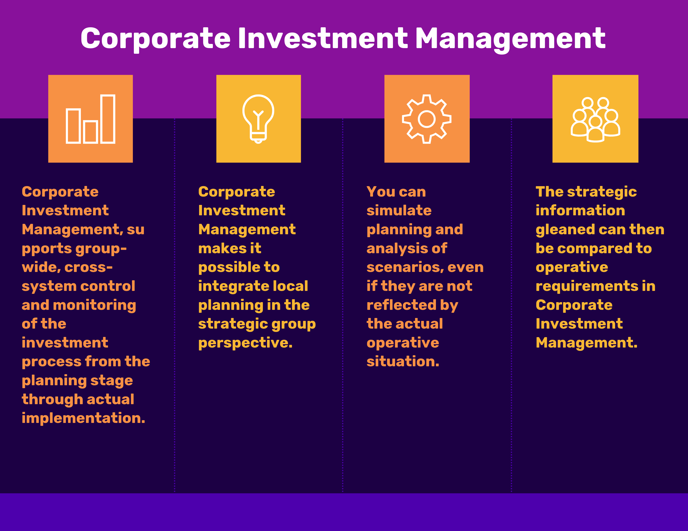

## Table of Contents

## What is a Management Investment Company?

A Management Investment Company is a type of financial company that pools money from many investors and uses it to buy a variety of securities like stocks, bonds, and other assets. The goal is to make money for the investors by managing these investments well. These companies are often called mutual funds or investment companies. They are managed by professional money managers who make decisions about which securities to buy and sell.

These companies offer an easy way for people to invest in a diverse range of assets without having to buy each one individually. By investing in a Management Investment Company, an individual can own a small part of many different investments. This can help spread out risk, as the performance of the fund depends on the overall portfolio rather than a single investment. People can buy and sell shares in these companies, making it a flexible option for many investors.

## What are the different types of Management Investment Companies?

There are three main types of Management Investment Companies: open-end funds, closed-end funds, and unit investment trusts. Open-end funds, also known as mutual funds, let investors buy and sell shares directly from the fund at the end of each trading day. The price of the shares is based on the net asset value of the fund's portfolio. These funds can issue new shares and buy back old ones, so the number of shares can change.

Closed-end funds work differently. They issue a fixed number of shares that trade on stock exchanges like regular stocks. The price of these shares can be higher or lower than the net asset value of the fund's portfolio. Investors buy and sell these shares from other investors, not directly from the fund. This means the fund itself doesn't have to issue new shares or buy back old ones.

Unit investment trusts (UITs) are a bit simpler. They have a fixed portfolio of securities and a set termination date. Once the trust is set up, it doesn't change its investments. Investors buy units in the trust, and when it reaches its end date, the trust is dissolved, and the securities are sold. UITs are good for people who want a straightforward, low-cost way to invest.

## How does a Management Investment Company operate?

A Management Investment Company works by taking money from many people and using it to buy different kinds of investments like stocks and bonds. They hire professional money managers who decide which investments to buy and sell. These managers aim to make the investments grow in value over time, so the investors can make money. The company pools everyone's money together, which allows them to buy a lot of different investments. This helps spread out the risk, because if one investment does badly, it might be balanced out by others doing well.

The way people can invest in these companies depends on the type of fund. In an open-end fund, or mutual fund, people can buy and sell shares directly from the fund at the end of each trading day. The price of the shares is based on what the fund's investments are worth at that time. Closed-end funds work differently. They issue a set number of shares that people can buy and sell on the stock market. The price of these shares can go up or down, and it might not match the value of the fund's investments. Unit investment trusts are simpler. They have a fixed set of investments and a set end date. When the trust ends, it sells the investments and gives the money back to the investors.

## What are the main functions of a Management Investment Company?

A Management Investment Company takes money from a lot of people and uses it to buy different investments like stocks and bonds. They hire experts called money managers who decide which investments to buy and sell. Their main job is to make sure these investments grow in value over time so that the people who invested their money can make a profit. By pooling everyone's money together, the company can buy a wide range of investments, which helps spread out the risk. This means if one investment doesn't do well, other investments might do better and balance it out.

The way people can invest in these companies depends on the type of fund. In an open-end fund, also known as a mutual fund, people can buy and sell shares directly from the fund at the end of each trading day. The price of these shares is based on the total value of the fund's investments at that time. Closed-end funds are different because they issue a fixed number of shares that people can buy and sell on the stock market. The price of these shares can go up or down and might not match the value of the fund's investments. Unit investment trusts are simpler; they have a fixed set of investments and a set end date. When the trust ends, it sells the investments and gives the money back to the investors.

## Who can invest in a Management Investment Company?

Anyone can invest in a Management Investment Company. You don't need to be rich or have a lot of money to start. These companies are open to all kinds of people, from those just starting to save to those who have been investing for a long time. All you need to do is buy shares in the company, which can be done through a financial advisor or directly through the company's website or a brokerage.

There are different types of Management Investment Companies, like mutual funds, closed-end funds, and unit investment trusts. Each type might have different rules about who can invest. For example, some funds might need a minimum amount of money to start, but many are set up so that almost anyone can join. It's important to look at the rules for each fund to make sure it fits with what you want to do with your money.

## What are the benefits of investing in a Management Investment Company?

Investing in a Management Investment Company can be a good choice because it lets you spread out your money across many different investments. Instead of putting all your money into one stock or bond, you can own a little bit of a lot of them. This helps lower the risk because if one investment does badly, the others might do well and balance it out. Plus, these companies are run by experts who know a lot about picking good investments. They do all the hard work of choosing what to buy and sell, so you don't have to.

Another benefit is that it's easy to get started. You don't need a lot of money to begin investing in these companies. Many of them let you start with a small amount, which makes it easier for more people to join in. Also, it's simple to buy and sell shares in these companies. For example, with mutual funds, you can buy or sell shares at the end of each day. This makes it flexible if you need to get your money back quickly. Overall, investing in a Management Investment Company can be a smart way to grow your savings without having to be an expert yourself.

## What are the risks associated with Management Investment Companies?

Investing in a Management Investment Company can have some risks. One big risk is that the value of your investment can go up and down. This is because the company invests in many different things like stocks and bonds, and the prices of these can change a lot. If the market goes down, the value of your investment might go down too. Also, even though the company is run by experts, they can make mistakes. They might pick investments that don't do well, which can hurt your returns.

Another risk is that some Management Investment Companies might charge fees. These fees can be for managing the fund or for buying and selling shares. Over time, these fees can add up and take away from the money you make from your investment. It's important to understand what fees you might have to pay before you invest. Also, if you need your money quickly, you might not be able to sell your shares right away, especially with certain types of funds like closed-end funds. This could be a problem if you need cash fast.

## How are Management Investment Companies regulated?

Management Investment Companies are watched over by the government to make sure they follow the rules. In the United States, the main rulebook for these companies is the Investment Company Act of 1940. This law says that these companies have to be honest about what they're doing with people's money. They have to tell investors what they're investing in, how much they're charging in fees, and how well the investments are doing. The Securities and Exchange Commission (SEC) is the group that makes sure these companies are following the rules. They check the companies' reports and can punish them if they break the law.

Besides the SEC, other groups can also keep an eye on these companies. For example, if a Management Investment Company is listed on a stock exchange, the exchange has its own rules that the company has to follow. Also, some states have their own rules for these companies. All these rules are there to protect people who invest their money in these companies. They make sure that the companies are run fairly and that investors get the information they need to make good choices.

## What role does the board of directors play in a Management Investment Company?

The board of directors in a Management Investment Company is a group of people who help make sure the company is run well. They watch over the company to make sure it's doing what it's supposed to do for the investors. The board makes big decisions, like who should be the company's managers and how much they should be paid. They also check to make sure the company is following all the rules and laws that it needs to follow.

The board of directors also looks out for the investors by keeping an eye on the company's investments. They make sure the money is being used in a smart way and that the company is trying to make good returns for the people who invested. If there are any problems, the board can step in and fix them. This helps keep the company honest and working in the best interest of everyone who has put their money into it.

## How do Management Investment Companies generate returns for investors?

Management Investment Companies make money for investors by buying and selling different investments like stocks and bonds. They use the money that investors give them to buy a mix of these investments. The goal is to pick investments that will grow in value over time. When the value of these investments goes up, the value of the fund goes up too. The company's expert managers are in charge of deciding which investments to buy and sell. They try to make smart choices to increase the fund's value, which means more money for the investors.

Sometimes, the company also gets money from the investments they hold. For example, if they own stocks, they might get dividends, which are payments that companies make to their shareholders. If they own bonds, they might get interest payments. These extra payments can be given back to the investors or used to buy more investments. This way, the fund can keep growing. By spreading the money across many different investments, the company tries to balance out the risks and make sure there's a good chance of making money for everyone who invested.

## What are the key performance indicators for evaluating a Management Investment Company?

When you want to see how well a Management Investment Company is doing, you look at some important numbers called key performance indicators. One big one is the return on investment, which shows how much money the fund has made for its investors over time. You can compare this to other funds or to the overall market to see if it's doing well. Another important number is the expense ratio, which tells you how much the fund charges in fees. Lower fees mean more money stays in your pocket, so a lower expense ratio is usually better.

Another thing to look at is the fund's volatility, which shows how much the value of the fund goes up and down. A fund with less volatility might be safer, but it might also grow more slowly. You also want to check the fund's alpha, which measures how well the fund's managers are doing compared to what you would expect from the market. A positive alpha means the managers are doing a good job picking investments. Finally, the fund's beta tells you how much the fund moves with the market. A beta of 1 means it moves the same as the market, while a higher beta means it moves more, and a lower beta means it moves less.

## How do global economic conditions affect Management Investment Companies?

Global economic conditions can have a big impact on Management Investment Companies. When the world economy is doing well, more people might have money to invest, which can help these companies grow. They might also see higher returns because the value of stocks and bonds often goes up during good economic times. On the other hand, if the world economy is struggling, it can be harder for these companies. People might pull their money out of investments, which can make the value of the funds go down. Also, if there's a lot of uncertainty, like during a financial crisis, the value of the investments the company holds might drop a lot.

These companies also have to deal with things like changes in interest rates and currency values. If interest rates go up, it can make borrowing more expensive, which can hurt the companies that the funds invest in. This can lead to lower returns for the fund. Changes in currency values can also affect the value of investments, especially if the fund holds investments in different countries. For example, if the dollar gets stronger, the value of foreign investments might go down when converted back to dollars. So, Management Investment Companies need to keep a close eye on global economic conditions to try to make the best choices for their investors.

## What is Understanding Investment Funds Management?

Investment funds are financial instruments that pool capital collected from multiple investors to purchase a diversified portfolio of assets. These funds provide investors the opportunity to invest in a professionally managed, diversified portfolio with the potential for higher returns and lower risks compared to individual investments. Investment funds come in various forms, including mutual funds, exchange-traded funds (ETFs), hedge funds, and private equity funds. Each of these vehicles offers unique benefits and is tailored to meet different investment objectives.

**Diversified Portfolios Through Mutual Funds and ETFs**

Mutual funds and ETFs are two of the most popular types of investment funds available to retail investors. Mutual funds pool money from investors to purchase a broad range of securities. These funds are managed by professional portfolio managers who adjust the portfolio according to market conditions and the fund's investment goals. Mutual funds typically charge management fees, which are calculated as a percentage of assets under management.

ETFs, on the other hand, are traded on stock exchanges like individual stocks. They offer the advantage of intraday [liquidity](/wiki/liquidity-risk-premium) and usually have lower expense ratios than mutual funds. ETFs aim to replicate the performance of a specific index or sector, providing investors with a straightforward way to achieve diversification across industries or geographies.

**Role of Fund Management Companies**

Fund management companies play a critical role in overseeing both open-end and closed-end funds. Open-end funds, such as mutual funds and some ETFs, continuously issue new shares or redeem existing ones based on investor demand, while closed-end funds have a fixed number of shares that are traded on the secondary market. Management companies are responsible for making investment decisions, conducting market research, and ensuring the fund's compliance with regulatory requirements. They employ teams of analysts, traders, and portfolio managers who work together to achieve the fund's stated objectives.

**Diversified vs. Non-Diversified Funds**

The distinction between diversified and non-diversified funds is crucial for understanding risk management within investment funds. Diversified funds spread their investments across a wide array of asset classes, sectors, and geographies to minimize risk. This approach can potentially reduce the impact of a poor-performing asset on the overall portfolio. Non-diversified funds, on the other hand, concentrate their investments in a smaller number of securities, sectors, or regions. While this can lead to higher returns if the selected investments perform well, it also introduces greater risk, as the portfolio's performance is heavily dependent on a limited number of holdings.

**Mathematical Representation and Risk Management**

The degree of diversification in a portfolio can often be evaluated using the concept of the risk-return tradeoff. This tradeoff can be mathematically modeled using the Modern Portfolio Theory (MPT), which suggests that a diversified portfolio can achieve higher returns for a given level of risk, or equivalently, lower risk for a given level of expected return. The key to achieving this balance lies in the correlation of assets within the portfolio. 

For any two assets $A$ and $B$, the covariance can be calculated as:

$$
\text{Cov}(A, B) = \frac{\sum (A_i - \overline{A})(B_i - \overline{B})}{n}
$$

Where:
- $A_i$ and $B_i$ are the returns of the assets
- $\overline{A}$ and $\overline{B}$ are the mean returns
- $n$ is the number of data points

A low covariance between assets suggests that they do not move in tandem, thus providing diversification benefits. Effective fund management involves constructing a portfolio with the optimal mix of assets to achieve the desired risk-return profile, aligning with the investors' goals and risk appetite.

## References & Further Reading

[1]: Bergstra, J., Bardenet, R., Bengio, Y., & Kégl, B. (2011). ["Algorithms for Hyper-Parameter Optimization."](https://dl.acm.org/doi/10.5555/2986459.2986743) Advances in Neural Information Processing Systems 24.

[2]: ["Advances in Financial Machine Learning"](https://www.amazon.com/Advances-Financial-Machine-Learning-Marcos/dp/1119482089) by Marcos Lopez de Prado

[3]: ["Evidence-Based Technical Analysis: Applying the Scientific Method and Statistical Inference to Trading Signals"](https://www.amazon.com/Evidence-Based-Technical-Analysis-Scientific-Statistical/dp/0470008741) by David Aronson

[4]: ["Machine Learning for Algorithmic Trading"](https://github.com/stefan-jansen/machine-learning-for-trading) by Stefan Jansen

[5]: ["Quantitative Trading: How to Build Your Own Algorithmic Trading Business"](https://www.amazon.com/Quantitative-Trading-Build-Algorithmic-Business/dp/1119800064) by Ernest P. Chan