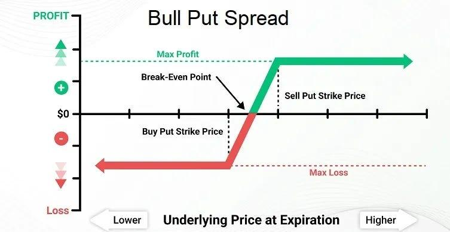

## Table of Contents

## What is a bull put option spread?

A bull put option spread is a type of options trading strategy that investors use when they think the price of a stock will go up a little bit or stay the same. It involves selling a put option with a higher strike price and buying another put option with a lower strike price on the same stock and with the same expiration date. The goal is to make money from the premium received from selling the put option, while the bought put option limits the potential loss if the stock price goes down.

This strategy is called a "bull" strategy because it benefits from a bullish, or rising, market. The maximum profit you can make from a bull put spread is the net premium received when you set up the trade. The risk is limited too, because the lower strike put option you buy acts like insurance. If the stock price drops below the lower strike price, the losses are capped at the difference between the strike prices minus the net premium received. So, it's a way to make some money in a slightly bullish market while keeping the risk under control.

## How does a bull put option spread work?

A bull put option spread is a strategy used by traders who think a stock's price will go up a bit or stay the same. To do this, you sell a put option with a higher strike price and buy another put option with a lower strike price. Both options are for the same stock and have the same expiration date. When you sell the put option, you get money called a premium. This is the most you can make from this strategy. The put option you buy costs you some money, but it's like insurance that limits how much you can lose if the stock price falls.

If the stock price stays above the higher strike price by the expiration date, both put options will expire worthless. You keep the net premium you received when you set up the trade. This is your profit. But if the stock price falls below the higher strike price, you might have to buy the stock at the higher strike price if someone exercises the option you sold. However, if the stock price falls below the lower strike price, the put option you bought starts to make money, which helps limit your losses. The most you can lose is the difference between the two strike prices minus the net premium you received.

## What are the key components of a bull put option spread?

A bull put option spread involves two main parts: selling a put option with a higher strike price and buying a put option with a lower strike price. Both options are for the same stock and have the same expiration date. When you sell the put option with the higher strike price, you get money called a premium. This premium is the maximum profit you can make from the trade. The put option you buy with the lower strike price costs you some money, but it acts like insurance that limits how much you can lose if the stock price goes down.

If the stock price stays above the higher strike price until the options expire, both put options will expire worthless, and you get to keep the net premium you received. This is your profit. However, if the stock price falls below the higher strike price, you might have to buy the stock at that price if someone exercises the option you sold. But if the stock price falls below the lower strike price, the put option you bought starts to make money, which helps reduce your losses. The most you can lose is the difference between the two strike prices minus the net premium you received.

## What are the potential risks associated with bull put option spreads?

When you use a bull put option spread, there are some risks you need to know about. The biggest risk is if the stock price falls a lot. If it goes below the lower strike price, you could lose money. The most you can lose is the difference between the two strike prices minus the net premium you got when you set up the trade. So, if the stock price drops a lot, you might lose more than you made from the premium.

Another risk is that the stock might not move the way you expect. If it stays between the two strike prices at expiration, you might not make as much money as you hoped. Also, if the stock price is very close to the higher strike price as the expiration date gets closer, the value of the put option you sold could go up a lot. This could mean you have to pay more to close the position if you want to avoid the risk of the stock price dropping below the higher strike price.

## How can one calculate the maximum profit and loss from a bull put option spread?

To calculate the maximum profit from a bull put option spread, you need to look at the premium you get from selling the put option with the higher strike price and subtract the cost of buying the put option with the lower strike price. The difference between these two amounts is the net premium you receive. This net premium is the most money you can make from the trade. If the stock price stays above the higher strike price until the options expire, both options will be worthless, and you get to keep the entire net premium as your profit.

To figure out the maximum loss, you need to think about what happens if the stock price falls below the lower strike price. The most you can lose is the difference between the higher strike price and the lower strike price, minus the net premium you received when you set up the trade. So, if the stock price drops a lot and goes below the lower strike price, your loss will be limited to this amount. This is because the put option you bought with the lower strike price acts like insurance, helping to limit how much money you can lose.

## What are the ideal market conditions for implementing a bull put option spread?

The best time to use a bull put option spread is when you think the stock price will stay the same or go up a little bit until the options expire. You want the stock to be above the higher strike price when the options expire. This way, both options will be worthless, and you can keep all the money you got from selling the put option with the higher strike price, minus what you paid for the put option with the lower strike price.

If the market is a bit bullish, or if you think the stock won't go down much, a bull put option spread can be a good choice. It's a way to make some money while also keeping your risk under control. But, if the stock price starts to drop a lot, it might not be the best strategy because you could lose more money than you made from the premium.

## How does one choose the strike prices for a bull put option spread?

Choosing the right strike prices for a bull put option spread is important. You need to pick a higher strike price for the put option you sell and a lower strike price for the put option you buy. The higher strike price should be a level where you think the stock price will stay above until the options expire. If the stock price stays above this higher strike price, you get to keep the money you made from selling the put option. The lower strike price acts like insurance. It limits how much you can lose if the stock price drops a lot. So, you want to choose a lower strike price that you think the stock won't fall below.

When [picking](/wiki/asset-class-picking) these strike prices, you also need to think about how much risk you want to take and how much money you want to make. The difference between the two strike prices, minus the money you get from selling the put option, is the most you can lose. So, if you want to take less risk, you might choose strike prices that are closer together. But this might also mean you make less money. If you're okay with more risk, you can choose strike prices that are farther apart, which could mean more potential profit but also more potential loss. It's all about finding a balance that works for you.

## What are the common strategies for managing a bull put option spread before expiration?

One common way to manage a bull put option spread before it expires is to keep an eye on the stock price and the value of the options. If the stock price stays above the higher strike price, you might not need to do anything because you could make the most profit if the options expire worthless. But if the stock price starts to get close to the higher strike price, you might want to close the trade early to lock in some profit. You do this by buying back the put option you sold and selling the put option you bought. This way, you keep some of the money you made from the trade without risking more if the stock price drops.

Another strategy is to adjust the spread if the stock price moves against you. If the stock price starts to go below the higher strike price, you can try to reduce your risk by rolling the spread. This means you close the current spread and open a new one with different strike prices or a later expiration date. For example, you might sell a new put option with a higher strike price and buy a new put option with a lower strike price. This can help you manage your risk better and maybe even make more money if the stock price goes back up. It's all about watching the market and making changes to your trade to protect your money and keep your potential profit.

## How can one adjust a bull put option spread if the market moves against the position?

If the market starts to move against your bull put option spread, you can adjust it to try to reduce your risk. One way to do this is by rolling the spread. This means you close your current spread and open a new one with different strike prices or a later expiration date. For example, if the stock price is getting close to the higher strike price, you might sell a new put option with an even higher strike price and buy a new put option with a lower strike price. This can help you manage your risk better because it gives the stock more room to move before you start losing money.

Another way to adjust your bull put option spread is to close part of the spread. If the stock price is moving against you but you still think it might go back up, you could buy back the put option you sold to reduce your risk. You might keep the put option you bought as a way to limit your losses if the stock price keeps going down. This way, you're not completely out of the trade, but you've cut down on how much you could lose. Adjusting your spread like this can help you stay in the game while protecting your money.

## What are the tax implications of trading bull put option spreads?

When you trade bull put option spreads, you need to think about taxes. The money you make from these trades is usually considered capital gains. If you hold the options for less than a year, the gains are short-term capital gains, which are taxed at your regular income tax rate. If you hold them for more than a year, they become long-term capital gains, which are taxed at a lower rate. But with options, it's hard to hold them for more than a year because they usually expire within a few months.

You also need to know that the IRS treats options as Section 1256 contracts. This means that at the end of the year, any open positions are treated as if they were sold at their fair market value on the last trading day of the year. This is called "mark-to-market" accounting. Any gains or losses from this are split into 60% long-term capital gains and 40% short-term capital gains, no matter how long you actually held the options. This can make your taxes a bit easier because you don't have to keep track of every single trade, but it's still a good idea to talk to a tax professional to make sure you're doing everything right.

## How does one use technical analysis to enhance the success of bull put option spreads?

Technical analysis can help you make better choices when you're setting up a bull put option spread. You can use tools like moving averages, support and resistance levels, and chart patterns to guess where the stock price might go. For example, if you see that the stock price is above its moving average and it's hitting a strong support level, you might feel more sure that the stock won't drop much. This could be a good time to set up a bull put option spread because you think the stock will stay above the higher strike price until the options expire.

Watching the stock's price movements with technical analysis can also help you adjust your bull put option spread if the market starts to move against you. If you see the stock price getting close to the higher strike price and it's about to break through a key support level, you might want to close your position early to avoid losing money. Or, if the stock price is moving down but you think it might bounce back because it's near a strong support level, you could roll your spread to new strike prices or a later expiration date. Using technical analysis like this can help you make smarter decisions and manage your trades better.

## What advanced techniques can be used to optimize the management of bull put option spreads?

One advanced technique for managing bull put option spreads is to use delta hedging. Delta is a measure of how much the price of an option changes when the stock price changes. By keeping an eye on the delta of your options, you can buy or sell shares of the stock to balance out the risk. If the delta of your bull put spread starts to move against you, you can buy or sell the right amount of stock to bring the delta back to zero. This helps protect your money if the stock price moves a lot.

Another technique is to use stop-loss orders to manage your risk. A stop-loss order is like a safety net that automatically closes your position if the stock price hits a certain level. If you set a stop-loss order at a price just below the higher strike price, it can help you avoid big losses if the stock price suddenly drops. You can also use a stop-loss to lock in profits if the stock price stays above the higher strike price. By using stop-loss orders, you can manage your bull put option spread more easily and keep your potential losses under control.

## References & Further Reading

[1]: Cuthbertson, K., & Nitzsche, D. (2001). ["Financial Engineering: Derivatives and Risk Management."](https://www.wiley.com/en-us/Financial+Engineering%3A+Derivatives+and+Risk+Management-p-9780471495840) John Wiley & Sons.

[2]: Hull, J. C. (2020). ["Options, Futures, and Other Derivatives."](https://www.pearson.com/en-us/subject-catalog/p/options-futures-and-other-derivatives/P200000005938/9780136939917) Pearson.

[3]: Kissell, R. (2013). ["The Science of Algorithmic Trading and Portfolio Management."](https://www.sciencedirect.com/book/9780124016897/the-science-of-algorithmic-trading-and-portfolio-management) Academic Press.

[4]: Lopez de Prado, M. (2018). ["Advances in Financial Machine Learning."](https://www.amazon.com/Advances-Financial-Machine-Learning-Marcos/dp/1119482089) Wiley.

[5]: Aronson, D. R. (2006). ["Evidence-Based Technical Analysis: Applying the Scientific Method and Statistical Inference to Trading Signals."](https://www.amazon.com/Evidence-Based-Technical-Analysis-Scientific-Statistical/dp/0470008741) Wiley.

[6]: Chan, E. P. (2009). ["Quantitative Trading: How to Build Your Own Algorithmic Trading Business."](https://github.com/ftvision/quant_trading_echan_book) Wiley.

[7]: Jansen, S. (2020). ["Machine Learning for Algorithmic Trading: Predictive Models to Extract Signals from Market and Alternative Data for Systematic Trading Strategies with Python."](https://www.amazon.com/Machine-Learning-Algorithmic-Trading-alternative/dp/1839217715) Packt Publishing.