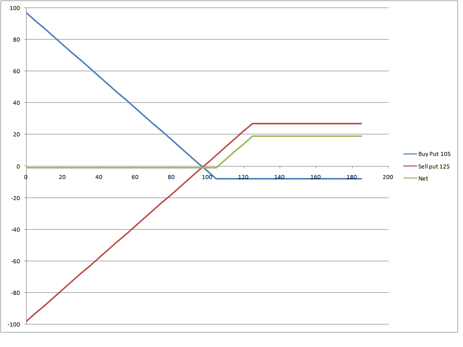

Investment strategies in modern financial markets have evolved significantly, influenced by technological advancements and the growing complexity of financial instruments. Investors now face an array of strategies tailored to various risk profiles and market conditions. Traditional approaches such as buy-and-hold, value investing, and growth investing have been complemented by more sophisticated techniques involving derivatives and automated systems. One such sophisticated approach involves options trading, which provides investors with the flexibility to hedge against potential downturns or capitalize on anticipated market movements.

Option management is an essential component of modern investment strategies, allowing investors to leverage derivatives to manage risk and enhance returns. Options are contracts that give the buyer the right, but not the obligation, to buy or sell an underlying asset at a predetermined price before the contract's expiration. They come in two basic forms: calls and puts. Effective option management involves the strategic deployment of these instruments to align with an investor’s market predictions and risk tolerance.



A specific strategy within options trading is the bull put spread, a technique designed to profit from rising or neutral market conditions while limiting potential losses. This strategy involves selling a put option at a higher strike price and buying a put option at a lower strike price on the same financial instrument, with the same expiration date. The bull put spread can be favorable for investors who anticipate moderate price increases in the underlying asset, as it allows for premium collection while offering a defined risk.

The advent of algorithmic trading, or algo trading, has transformed investment portfolios by utilizing computer algorithms to execute orders based on predefined criteria. This technology can process large datasets at high speeds, making it possible to react to market changes more swiftly and accurately than manual trading. Algo trading optimizes trading strategies by removing emotional bias and consistently applying strategies based on quantitative analysis.

Integrating algo trading with option management and strategies like bull put spreads presents new opportunities for investors. Algorithms can monitor option positions, execute trades, and adjust strategies based on market conditions automatically, creating synergy between technological efficiency and strategic ingenuity. This integration allows for the dynamic management of investment portfolios, aiming to increase profitability while mitigating risk.

This article will explore these topics further, examining the interconnectedness of option management, bull put spreads, and algorithmic trading. The aim is to provide a comprehensive understanding of how these modern strategies can be leveraged to optimize investment outcomes in the increasingly complex landscape of financial markets.

## Table of Contents

## Understanding Options and Option Management

Options are financial derivatives that grant the holder the right, but not the obligation, to buy or sell an underlying asset at a predetermined price, known as the strike price, on or before a specified expiration date. These instruments are vital in financial markets, providing investors with flexibility to hedge, speculate, or increase leverage.

Options are primarily classified into two types: calls and puts. A call option gives the holder the right to purchase the underlying asset, whereas a put option allows the holder to sell it. Investors use options in various strategies to achieve specific financial goals, such as income generation, risk management, and capital appreciation.

In investment strategies, different types of options include American and European options, which differ in their exercise capabilities. American options can be exercised at any point before expiration, whereas European options can only be exercised at maturity. Moreover, options can be customized as exotic options, which provide more complex features tailored to specific needs.

Effective option management is crucial in portfolio risk management. It involves selecting appropriate options, forming strategic combinations, and continuously monitoring and adjusting positions in response to market changes. Option management techniques can protect portfolios against adverse price movements while exploiting beneficial trends. 

Several techniques and tools are vital for effective option management. Delta hedging is one widely used technique. It involves adjusting the position to neutralize the option's sensitivity to changes in the price of the underlying asset, known as delta. Additionally, software tools like options analytics platforms assist investors by providing data on implied [volatility](/wiki/volatility-trading-strategies), option Greeks, and scenarios analyses, which support informed decision-making.

The benefits of managing options effectively include enhanced control over risk exposure, potential for high returns, and efficient capital use. However, managing options also presents challenges. Options can be complex, requiring deep understanding and constant vigilance. Market volatility can lead to swift changes in option pricing, demanding timely reactions from investors.

In conclusion, understanding and managing options are fundamental in contemporary investment strategies. They offer the potential to optimize financial outcomes, but also require careful consideration and expertise to navigate effectively.

## Bull Put Spreads: Strategy and Implementation

Bull put spreads are a popular options trading strategy that aim to capitalize on moderately bullish market conditions. This strategy involves the simultaneous selling of a put option at a higher strike price and the buying of another put option at a lower strike price, both with the same expiration date. The main objective is to generate income through the receipt of premiums, while limiting potential losses.

### How Bull Put Spreads Work

The bull put spread strategy profits when the price of the underlying asset remains above the higher strike price at expiration. It earns a net premium because the premium received from selling the higher strike put is greater than the premium paid for buying the lower strike put. This strategy is ideal when investors anticipate a steady or mildly bullish trend in the market.

For instance, suppose an investor believes that stock XYZ, currently trading at $50, will remain above $45. The investor could set up a bull put spread by selling a put option with a $50 strike price and buying a put option with a $45 strike price. If the stock stays above $50, both options expire worthless, and the investor retains the net premium as profit.

### Implementation Guide

1. **Market Analysis**: Identify a stock or asset with stable to bullish prospects.
2. **Option Selection**: Choose two put options with the same expiration date. Sell a put with a higher strike price and buy a put with a lower strike price.
3. **Calculate Premiums**: Ensure the premium received from the higher strike price put is greater than the premium paid for the lower strike.
4. **Execute the Trade**: Place orders for both options simultaneously to establish the spread.
5. **Monitor the Position**: Regularly check the underlying asset's price to adjust strategies if needed.

### Risk Management Considerations

The maximum potential loss in a bull put spread is the difference between the two strike prices, minus the net premium received. This occurs if the price of the underlying asset falls below the lower strike price at expiration.

1. **Loss Limitation**: By selecting an appropriate lower strike price, investors cap potential losses.
2. **Probability Assessment**: Evaluate the probability of the underlying asset closing above the higher strike price.
3. **Market Trends**: Stay informed about market trends and economic factors that might affect the underlying asset's performance.
4. **Adjustments**: Be prepared to make adjustments or close positions if the market moves against the expected direction.

### Examples and Case Studies

Consider a case where stock ABC is trading at $100, and an investor expects it to remain above $95. The investor sells a $100 strike put for a $3 premium and buys a $95 strike put for a $1 premium. The net premium is $2.

- **Successful Outcome**: If stock ABC remains above $100 at expiration, both options expire worthless, and the investor keeps the $200 premium per contract (since options are usually quoted for 100 shares).
- **Breakeven Point**: The breakeven price is $98 ($100 - $2), meaning profits occur if the stock price remains above this level.
- **Potential Loss**: If ABC falls below $95, the investor incurs the maximum loss, calculated as the difference between strike prices ($5) minus the net premium ($2), equating to $3 per share, or $300 per contract.

Through strategic implementation and careful monitoring, bull put spreads offer a balanced approach to options trading, enabling investors to manage risk and generate income in stable to mildly bullish markets.

## Algo Trading: Revolutionizing Investment Strategies

Algorithmic trading, commonly known as algo trading, has emerged as a pivotal innovation within the financial markets, reshaping traditional investment methodologies. This automated execution of trading orders relies on pre-programmed instructions to account for variables such as timing, price, and [volume](/wiki/volume-trading-strategy). Algo trading's popularity has surged due to its capacity to execute trades at speeds and frequencies that human traders cannot match, significantly enhancing market efficiency.

### Transformation of Traditional Investment Strategies

Algorithmic trading fundamentally alters conventional investment strategies by amplifying the speed, accuracy, and efficiency of trades. It minimizes manual intervention, allowing for rapid execution which is particularly beneficial in volatile markets. This innovation facilitates strategies such as [market making](/wiki/market-making), [trend following](/wiki/trend-following), and [arbitrage](/wiki/arbitrage), offering precise risk management and diversified portfolio construction. Algorithmic strategies utilize advanced statistical models and [machine learning](/wiki/machine-learning) to predict market movements and execute trades accordingly.

### Key Components of an Algorithmic Trading System

An [algorithmic trading](/wiki/algorithmic-trading) system is comprised of several integral components:

1. **Data Collection and Processing**: Real-time and historical data feeds are essential for informed decision-making. High-frequency data streams are processed to extract trends and potential opportunities.

2. **Trading Strategy Formulation**: Strategies are developed using quantitative models that define entry and exit points. These are coded into algorithms following rigorous backtesting.

3. **Execution System**: This is the engine that automatically executes the trades once the pre-defined criteria are met, ensuring optimal pricing and timing.

4. **Risk Management and Compliance**: Algorithms must adhere to regulatory standards and manage risk effectively, utilizing stop-losses and other hedging techniques to protect against significant losses.

5. **Performance Monitoring**: Continuous evaluation of the trading system's performance against benchmarks ensures that strategies remain effective over time.

### Advantages and Potential Drawbacks of Algo Trading

The primary advantage of algo trading lies in its capability to enhance transaction speed and accuracy, which reduces the cost and impact of trades in the market. It also minimizes the psychological influence on trading decisions, leading to more disciplined approaches. Moreover, algorithms can scrutinize multiple markets and securities simultaneously, identifying opportunities that might be unseen by human traders.

However, the reliance on technology introduces certain drawbacks. Issues such as over-optimization, also known as "curve-fitting," can arise during [backtesting](/wiki/backtesting), where algorithms are excessively tailored to historical data, potentially diminishing their effectiveness in live markets. Furthermore, system failures and programming errors can lead to significant financial losses.

### Real-World Applications and Examples

In contemporary financial markets, algorithmic trading is ubiquitous across various asset classes including equities, [forex](/wiki/forex-system), commodities, and cryptocurrencies. High-frequency trading ([HFT](/wiki/high-frequency-trading-strategies)) is a subset that exemplifies the use of cutting-edge technology to capitalize on minute price discrepancies within milliseconds. For instance, large financial institutions employ algorithms for executing block trades to limit market impact.

Robo-advisors, another application, automate portfolio management and asset allocation using algorithms tailored to individual investor profiles. Companies like Betterment and Wealthfront exemplify how personalized strategies are scaled to individual investors, offering efficient and low-cost investment solutions.

In conclusion, algorithmic trading represents a revolutionary leap in investment strategies, combining precision with computational power to optimize trading efficacy. While offering significant advantages, it requires meticulous development and constant monitoring to navigate its complexities effectively.

## Integrating Algo Trading with Option Management and Bull Put Spreads

The integration of algorithmic trading (algo trading) with option management and bull put spreads represents a significant advancement in investment strategies. This synergy leverages computational power and market analysis to optimize trading decisions, enhance risk management, and improve overall portfolio performance.

Algo trading involves using computer algorithms to execute trades at high speeds and frequencies. It incorporates mathematical models and complex formulas to analyze market conditions and make trading decisions. This technology is particularly effective in managing options, where timing and precision are crucial.

**Implementing Bull Put Spreads with Algorithmic Trading Systems**

Bull put spreads are a strategic option trading technique used when an investor anticipates a moderate rise in the price of the underlying asset. This strategy involves selling a put option at a higher strike price while simultaneously buying another put option at a lower strike price within the same expiration period. The goal is to capture the premium difference, resulting in a net credit, while limiting potential losses.

Automating this strategy through algo trading involves developing algorithms capable of identifying market conditions favorable for bull put spreads. The algorithms continuously monitor market data and indicators, such as implied volatility and historical price movements, to determine optimal entry points. This automation minimizes the emotional aspects of trading and allows for consistent strategy application.

**Building Algorithms for Optimal Management of Bull Put Spreads**

Developing algorithms for bull put spreads requires a comprehensive understanding of market dynamics and option pricing models. These algorithms must be capable of executing trades based on predetermined criteria, such as:

1. **Delta and Gamma Monitoring**: Delta measures the sensitivity of an option’s price to changes in the price of the underlying asset, while Gamma indicates the rate of change in Delta. Algorithms track these Greeks to manage the strategy dynamically, making adjustments as market conditions evolve.

2. **Risk-Reward Analysis**: Algorithms evaluate the risk-reward ratio of potential trades, selecting spreads that align with the investor’s risk tolerance and financial goals.

3. **Volatility Assessment**: Analyzing market volatility is crucial for timing bull put spread trades. Algorithms incorporate volatility models to predict fluctuations, selecting optimal times to initiate or close positions.

Here is a simplified Python example of how such an algorithm might be structured:

```python
def calculate_option_greeks(spot_price, strike_price, expiry, volatility, risk_free_rate):
    import math
    from scipy.stats import norm

    d1 = (math.log(spot_price / strike_price) + (risk_free_rate + 0.5 * volatility ** 2) * expiry) / (volatility * math.sqrt(expiry))
    d2 = d1 - volatility * math.sqrt(expiry)

    delta = norm.cdf(d1)
    gamma = norm.pdf(d1) / (spot_price * volatility * math.sqrt(expiry))

    return delta, gamma

def evaluate_bull_put_spread(spot_price, short_strike, long_strike, expiry, short_volatility, long_volatility, risk_free_rate):
    short_delta, short_gamma = calculate_option_greeks(spot_price, short_strike, expiry, short_volatility, risk_free_rate)
    long_delta, long_gamma = calculate_option_greeks(spot_price, long_strike, expiry, long_volatility, risk_free_rate)

    credit_received = max(0, short_delta - long_delta)
    risk_exposure = short_gamma - long_gamma

    if credit_received > risk_exposure:
        return "Enter Spread"
    else:
        return "Avoid Spread"

# Example call
strategy_decision = evaluate_bull_put_spread(100, 105, 95, 0.5, 0.2, 0.3, 0.01)
print(strategy_decision)
```

**Challenges and Considerations**

Integrating algo trading with option management and bull put spreads presents several challenges. Developing accurate and responsive algorithms necessitates rigorous testing and validation to avoid unexpected losses. Furthermore, algo trading platforms often require significant computational resources and technical expertise, potentially increasing operational costs and complexity.

Regulatory compliance is also a key consideration. As algo trading becomes more prevalent, regulatory bodies continue to implement rules to mitigate market manipulation and ensure fair practices. Investors must stay informed of these regulations to ensure their trading activities remain compliant.

**Case Studies**

Several investment firms have successfully integrated algo trading with option management and bull put strategies. For instance, quantitative hedge funds often use proprietary algorithms to manage option portfolios effectively. These algorithms analyze historical data to predict market movements and identify profitable trades, demonstrating the potential for significant returns when implemented correctly.

In conclusion, combining algo trading with options and bull put spreads presents innovative opportunities for investors, enhancing decision-making capabilities and optimizing strategy outcomes. As financial markets continue to evolve, such integrative approaches are likely to become increasingly important in maintaining competitive advantage.

## Advantages and Challenges of Combined Investment Strategies

Combining option management, bull put spreads, and algorithmic trading can potentially yield significant benefits for investors. These strategies, when integrated effectively, offer a dynamic framework for managing risk and optimizing returns in financial markets.

One of the primary benefits of this combined approach is enhanced risk management. By employing bull put spreads, investors can limit potential losses while still capitalizing on bullish market conditions. When integrated with algorithmic trading, these options strategies can be executed with precision, utilizing algorithms to forecast market trends and automate order execution. This automation reduces the likelihood of human error and allows for real-time adjustments to changing market conditions, thus enhancing the flexibility and responsiveness of the investment strategy.

However, investors may face potential risks and challenges when implementing these combined strategies. The complexity of creating and maintaining algorithmic trading systems requires substantial expertise and technological resources. There is also the risk of software glitches or errors in algorithm design that could lead to substantial financial losses. Moreover, market conditions can fluctuate, leading to situations where options strategies such as bull put spreads may not perform as expected, particularly in volatile or bearish markets.

The effectiveness of these combined strategies is often influenced by specific market conditions. Bull put spreads, for instance, are most beneficial in stable or moderately bullish markets where the underlying asset's price is not expected to fall significantly. Similarly, the success of algorithmic trading can depend on [liquidity](/wiki/liquidity-risk-premium), volatility, and the precision of the algorithms used. Thus, the ability to adapt to varying market environments is crucial for investors.

There are various tools and platforms available today that facilitate the integration of option management, bull put spreads, and algorithmic trading. Platforms like TradeStation, [Interactive Brokers](/wiki/interactive-brokers-api), and MetaTrader provide advanced trading features, including options analytics, backtesting capabilities, and algorithm development environments. Moreover, these platforms often offer APIs for custom algorithmic trading solutions, enhancing the flexibility of investment strategies.

Looking to the future, trends in multi-strategy trading are expected to embrace more sophisticated machine learning techniques and [artificial intelligence](/wiki/ai-artificial-intelligence) algorithms. These technologies could offer predictive analytics and automation at an unprecedented scale, allowing investors to refine strategies based on vast datasets and real-time market insights. Additionally, continuous advancements in computing power and data processing technologies will likely make these complex strategies more accessible to a broader range of investors.

In conclusion, while combining option management, bull put spreads, and algorithmic trading presents both opportunities and risks, careful implementation and ongoing adaptation to market conditions can potentially lead to successful investment outcomes.

## Conclusion

This article has explored a wide range of innovative investment strategies that are transforming the way investors manage their portfolios. The key takeaways emphasize the importance of staying informed and adaptable in the fast-paced financial markets. As market conditions continuously evolve, investors must be agile, leveraging new techniques and technologies to maintain a competitive edge. 

Strategies like option management and bull put spreads offer versatile tools for hedging and enhancing investment returns, particularly when used in conjunction with advanced technologies like algorithmic trading. The integration of algo trading with these strategies facilitates precision and efficiency, often yielding better performance and risk management. Innovative approaches such as these aren't just advantageous but necessary in today's dynamic investment landscape.

Investors are encouraged to consider these strategies, incorporating option management, bull put spreads, and algorithmic trading into their practice. This exploration can lead to more robust and resilient investment portfolios and offers a pathway to mastering complex market dynamics. The landscape of investment strategies is continually evolving, and a commitment to learning and adaptation is crucial for long-term success.

Finally, I invite readers to continue their exploration of these topics. Numerous resources are available for those interested in deepening their understanding of modern investment strategies. By investing time in further research and education, investors can better navigate the complexities of today's financial markets and seize opportunities for growth and innovation.

## References & Further Reading

[1]: Cuthbertson, K., & Nitzsche, D. (2001). ["Financial Engineering: Derivatives and Risk Management."](https://www.wiley.com/en-us/Financial+Engineering%3A+Derivatives+and+Risk+Management-p-9780471495840) John Wiley & Sons.

[2]: Hull, J. C. (2020). ["Options, Futures, and Other Derivatives."](https://www.pearson.com/en-us/subject-catalog/p/options-futures-and-other-derivatives/P200000005938/9780136939917) Pearson.

[3]: Kissell, R. (2013). ["The Science of Algorithmic Trading and Portfolio Management."](https://www.sciencedirect.com/book/9780124016897/the-science-of-algorithmic-trading-and-portfolio-management) Academic Press.

[4]: Lopez de Prado, M. (2018). ["Advances in Financial Machine Learning."](https://www.amazon.com/Advances-Financial-Machine-Learning-Marcos/dp/1119482089) Wiley.

[5]: Aronson, D. R. (2006). ["Evidence-Based Technical Analysis: Applying the Scientific Method and Statistical Inference to Trading Signals."](https://www.amazon.com/Evidence-Based-Technical-Analysis-Scientific-Statistical/dp/0470008741) Wiley.

[6]: Chan, E. P. (2009). ["Quantitative Trading: How to Build Your Own Algorithmic Trading Business."](https://github.com/ftvision/quant_trading_echan_book) Wiley.

[7]: Jansen, S. (2020). ["Machine Learning for Algorithmic Trading: Predictive Models to Extract Signals from Market and Alternative Data for Systematic Trading Strategies with Python."](https://www.amazon.com/Machine-Learning-Algorithmic-Trading-alternative/dp/1839217715) Packt Publishing.