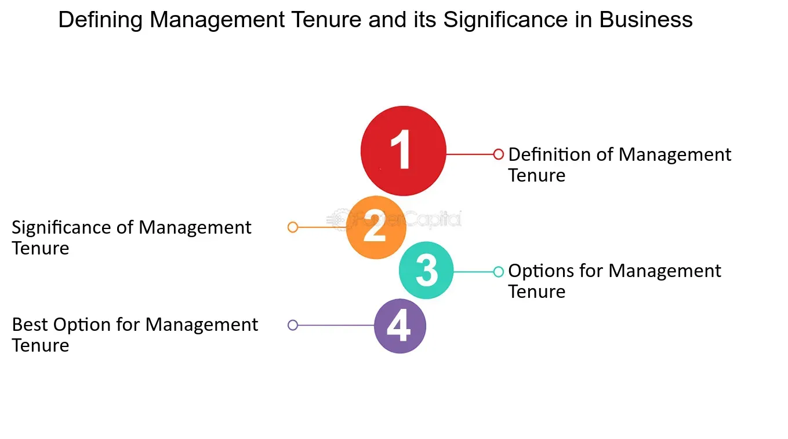

## Table of Contents

## What is management tenure?

Management tenure refers to the length of time that managers or executives have been working in their current positions within a company. It is an important measure because it can give insights into the stability and experience of the leadership team. When managers have been in their roles for a long time, it often suggests that the company has a stable environment and that the leaders have a deep understanding of the business.

On the other hand, if a company has a lot of new managers or frequent changes in leadership, it might indicate instability or challenges within the organization. Investors and employees often look at management tenure to gauge how well a company is being run and whether it is likely to perform well in the future. Understanding management tenure can help people make better decisions about investing in or working for a company.

## Why is management tenure important in organizations?

Management tenure is important in organizations because it shows how stable and experienced the leaders are. When managers stay in their jobs for a long time, it usually means the company is doing well and the leaders know a lot about the business. This can make employees and investors feel more confident about the company's future. They believe that experienced leaders will make good decisions and help the company grow.

On the other hand, if managers keep changing or leaving, it might mean the company is having problems. This can make people worried about the company's stability and future success. Employees might feel unsure about their jobs, and investors might think twice before putting money into the company. So, looking at how long managers have been in their roles can help people decide if they want to work for or invest in a company.

## How does management tenure affect organizational performance?

Management tenure can have a big impact on how well a company does. When managers stay in their jobs for a long time, they get to know the business really well. They understand what works and what doesn't, and they can make better decisions. This can lead to better performance because the company benefits from their experience and knowledge. Employees also feel more secure and confident when they see the same leaders staying for a long time, which can make them work better and stay with the company longer.

On the other hand, if managers keep changing, it can hurt the company's performance. New managers might not know the business as well, and it takes time for them to learn. During this time, the company might not do as well because the new managers are still figuring things out. Also, when managers leave often, it can make employees feel worried and unsure about their jobs. This can make them less motivated and more likely to leave, which can hurt the company's performance even more.

## What are the benefits of long management tenure?

Long management tenure means managers stay in their jobs for a long time. This is good for companies because it makes things stable. When managers know the business well, they can make smart decisions that help the company do better. They understand what the company needs and how to make it work smoothly. This makes employees feel safe and happy at work because they trust their leaders. When people feel good about their jobs, they work harder and stay with the company longer.

Also, long management tenure can make investors feel more confident. They see that the company has experienced leaders who are not leaving, which makes them think the company is doing well. This can make them want to invest more money in the company. Plus, when managers stay for a long time, they can build strong relationships with other people in the business world. These relationships can help the company find new opportunities and grow. So, having managers who stay for a long time can really help a company in many ways.

## What are the potential drawbacks of long management tenure?

Long management tenure can sometimes cause problems. When managers stay in their jobs for a very long time, they might not want to try new things. They get used to doing things the same way and might not be open to new ideas or changes. This can make the company slow to adapt to new trends or technologies, which can hurt its performance. Also, if the same people are in charge for a long time, they might not see their own mistakes or weaknesses. This can lead to bad decisions that could have been avoided with fresh perspectives.

Another issue is that long management tenure can make it hard for new people to move up in the company. If the same managers stay in their jobs for many years, there are fewer chances for others to get promoted. This can make employees feel stuck and unhappy, which can lead to them leaving the company. When good employees leave, it can hurt the company's overall performance and make it hard to keep a strong team. So, while long management tenure has its benefits, it can also create challenges that need to be managed carefully.

## How can short management tenure impact a company?

Short management tenure means managers don't stay in their jobs for very long. This can be bad for a company because new managers need time to learn about the business. When managers keep changing, they might make mistakes because they don't know everything yet. This can make the company's performance go down. Also, when managers leave often, it can make employees feel worried and unsure about their jobs. They might not trust the company as much and could start looking for new jobs, which can make the company lose good workers.

On the other hand, short management tenure can sometimes bring fresh ideas to a company. New managers might have different ways of doing things that can help the company grow and change. But this only works if the new managers stay long enough to make those changes happen. If they leave too soon, the company might not benefit from their new ideas. So, while short management tenure can bring some good things, it often causes more problems and can make it hard for a company to do well.

## What factors contribute to varying lengths of management tenure?

Many things can affect how long managers stay in their jobs. One big reason is the company's culture. If a company treats its managers well and gives them good support, they might want to stay longer. But if the company is always changing or has a lot of stress, managers might leave sooner. Another reason is how well the company is doing. If the company is doing great, managers might feel happy and want to stay. But if the company is struggling, managers might look for new jobs.

Another [factor](/wiki/factor-investing) is the manager's own career goals. Some managers might want to move up in their careers and will leave if they don't get promoted. Others might be happy in their current job and stay for a long time. Also, how the manager fits with the company's values and goals can make a difference. If they feel like they belong and believe in what the company is doing, they are more likely to stay. But if they don't feel connected, they might leave sooner.

## How can companies measure the effectiveness of management tenure?

Companies can measure the effectiveness of management tenure by looking at how well the company is doing when managers stay in their jobs for a long time. They can check things like how much money the company is making, how happy the employees are, and if the company is growing. If these things are good when managers stay longer, it means the long management tenure is helping the company. Companies can also compare times when managers stay longer to times when they don't, to see if there's a difference in performance.

Another way to measure effectiveness is by asking people in the company for their thoughts. This can be done through surveys or meetings where employees and other managers share their opinions on how well the long-tenured managers are doing. If people feel that the managers who have been there for a long time are doing a good job, it's a sign that the long management tenure is working well. Companies can also look at how often managers are promoted or if they are getting better at their jobs over time, which can show if long tenure is helping them improve.

## What strategies can organizations use to optimize management tenure?

Organizations can optimize management tenure by creating a good work environment. They should make sure managers feel supported and valued. This means giving them the tools and resources they need to do their jobs well. It also means listening to their ideas and giving them chances to grow in their careers. When managers feel happy and see a future in the company, they are more likely to stay longer. Also, companies can help managers by giving them clear goals and feedback on their performance. This way, managers know what they are doing well and what they can improve on, which can make them want to stay and do better.

Another strategy is to make sure the company is doing well. When the company is successful, managers feel proud of their work and are more likely to stay. This means having good plans for the future and making sure everyone knows what the company is trying to achieve. Companies can also help by making sure managers have a good balance between work and their personal lives. If managers feel stressed or overworked, they might leave sooner. By taking care of their managers' well-being, companies can keep them for a longer time and help the company do better overall.

## How does management tenure influence employee morale and retention?

Management tenure can really affect how employees feel about their jobs and whether they stay with the company. When managers stay in their jobs for a long time, it makes employees feel more secure. They know who their leaders are and trust them to make good decisions. This can make employees happier and more likely to stay with the company. When people feel good about their jobs, they work harder and help the company do better. But if managers keep leaving, it can make employees worried and unsure about their future at the company. They might start looking for new jobs, which can make the company lose good workers.

On the other hand, when managers don't stay long, it can make employees feel stressed and unsure. They might think the company is not doing well or that there are problems. This can make them less happy at work and more likely to leave. When good employees leave, it can hurt the company's performance. But if new managers bring fresh ideas and the company helps them learn quickly, it can sometimes be good. Still, most of the time, having managers who stay longer is better for keeping employees happy and making them want to stay with the company.

## What role does management tenure play in strategic planning and execution?

Management tenure plays a big role in how a company plans for the future and makes those plans happen. When managers stay in their jobs for a long time, they know a lot about the company. They understand what the company is good at and what it needs to work on. This helps them make better plans because they can think about what will really work. They can also see how things have changed over time and use that knowledge to make smart decisions. When managers stay longer, they can keep working on the same plans and make them better, which helps the company reach its goals.

On the other hand, if managers don't stay long, it can make strategic planning and execution harder. New managers need time to learn about the company and what it's trying to do. While they are learning, they might not make the best plans or might change plans that were already working. This can slow down the company and make it harder to reach its goals. When managers keep changing, it's hard to keep working on the same plans because each new manager might want to do things differently. So, having managers who stay longer can really help a company plan better and get things done.

## How do industry-specific factors affect management tenure and its functions?

Different industries have different things that can affect how long managers stay in their jobs and what they do. In some industries, like technology, things change very fast. New ideas and technology come out all the time, so managers need to keep learning and adapting. This can make it hard for managers to stay in their jobs for a long time because they need to be ready to change or leave if they can't keep up. Also, in industries where competition is very high, like finance, managers might leave if they get a better offer from another company. This means that industry-specific factors like fast changes and high competition can make management tenure shorter.

In other industries, like healthcare or education, things might be more stable. These industries often have clear rules and ways of doing things that don't change as much. This can make it easier for managers to stay in their jobs for a long time because they know what to expect. In these industries, managers can focus on improving the same things over time, which can help the company do better. But even in these stable industries, things like new laws or regulations can affect how long managers stay and what they do. So, the type of industry a company is in can really affect management tenure and the roles managers play.

## References & Further Reading

[1]: Finkelstein, S., & Hambrick, D.C. (1996). ["Strategic Leadership: Top Executives and Their Effects on Organizations"](https://www.jstor.org/stable/259414). West Publishing Company.

[2]: Bergstra, J., Bardenet, R., Bengio, Y., & Kégl, B. (2011). ["Algorithms for Hyper-Parameter Optimization."](https://dl.acm.org/doi/10.5555/2986459.2986743) Advances in Neural Information Processing Systems 24.

[3]: ["Advances in Financial Machine Learning"](https://www.amazon.com/Advances-Financial-Machine-Learning-Marcos/dp/1119482089) by Marcos Lopez de Prado

[4]: ["Evidence-Based Technical Analysis: Applying the Scientific Method and Statistical Inference to Trading Signals"](https://www.amazon.com/Evidence-Based-Technical-Analysis-Scientific-Statistical/dp/0470008741) by David Aronson

[5]: ["Machine Learning for Algorithmic Trading"](https://github.com/stefan-jansen/machine-learning-for-trading) by Stefan Jansen

[6]: ["Quantitative Trading: How to Build Your Own Algorithmic Trading Business"](https://www.amazon.com/Quantitative-Trading-Build-Algorithmic-Business/dp/1119800064) by Ernest P. Chan