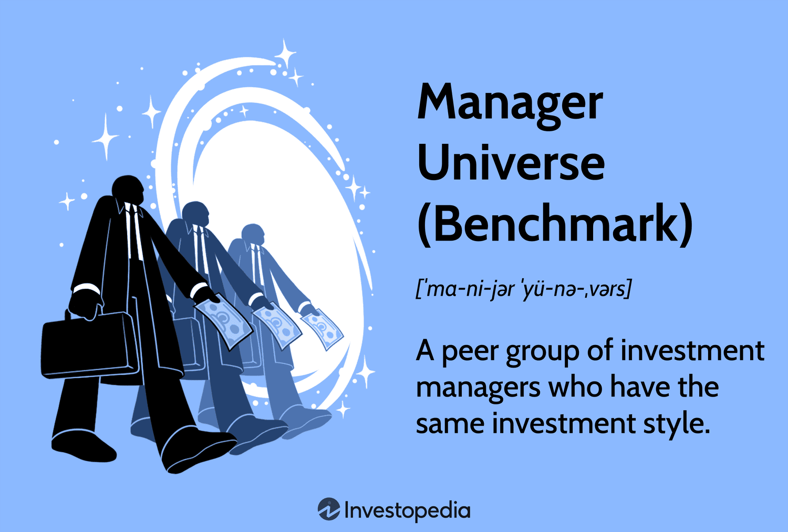

The financial landscape continues to evolve rapidly. At the heart of this transformation is the role of investment managers, whose performance is a key indicator of successful investment strategies. For investors aiming to enhance their portfolios, understanding how to benchmark investment performance is imperative. Benchmarking serves as a tool to evaluate the effectiveness of investment decisions by comparing them against established standards or peers. This process helps identify which investment strategies are yielding superior returns and informs decision-making processes.

One fundamental concept in this benchmarking process is the "manager universe." A manager universe consists of a peer group of investment managers with similar investment styles, which allows for more direct comparisons of performance. This concept streamlines the evaluation process by facilitating fair, apple-to-apple comparisons, thereby aiding investors in identifying top performers in the market.



Additionally, the role of algorithmic trading cannot be overlooked. Algorithmic trading, which utilizes complex algorithms to execute trades based on pre-defined criteria, has become a cornerstone of the finance industry, largely due to its speed and efficiency. Its influence on market dynamics significantly affects performance outcomes, thus impacting how investment performance is benchmarked against a manager universe. Understanding this relationship is crucial for accurate performance evaluation.

This article will explore both the potential advantages and inherent disadvantages of using manager universe benchmarks in performance evaluation. By shedding light on these elements, we aim to provide a comprehensive understanding of how investors can leverage these benchmarks while being mindful of their limitations.

## Table of Contents

## What is a Manager Universe?

A manager universe, commonly referred to as a benchmark, is essentially a structured grouping of investment managers who share similar investment styles or strategies. This arrangement allows for a systematic comparison of an individual manager's performance against a collective peer group. By evaluating managers within a universe where they operate under comparable conditions and strategies, investors can achieve apple-to-apple comparisons, pivotal in deciphering which managers are truly excelling relative to their peers.

The effectiveness of manager universes lies in their ability to standardize performance evaluation, offering a comprehensive view of where a particular investment manager stands. Investors leverage this data to pinpoint top performers, thus informing sound investment decisions. A well-constructed manager universe effectively filters the noise by emphasizing relevant metrics and facilitating direct peer comparisons, which is critical in understanding the driving factors behind superior performance.

Reputable financial analytics firms, such as Morningstar and Lipper, excel in providing these manager universe comparisons. They compile data from numerous investment managers, categorize them based on various investment styles, and evaluate their performance metrics. The information generated is utilized extensively by institutional and individual investors for making informed investment choices. 

As manager universes underpin the benchmarking process, they also enable investors to discern how managers navigate different market environments, assess risk-adjusted performance, and identify consistent performers over specified time frames. This structured evaluation process is central to optimizing investment portfolios.

## Understanding Algorithmic Trading

Algorithmic trading utilizes mathematical models and pre-set guidelines to automate the buying and selling of securities. By leveraging complex algorithms, traders aim to execute orders at speeds and efficiencies unattainable by human intervention alone. This form of trading capitalizes on fleeting market opportunities, using predefined criteria such as timing, price, and [volume](/wiki/volume-trading-strategy) to achieve optimal execution.

In the financial industry, [algorithmic trading](/wiki/algorithmic-trading) constitutes a significant portion of trading activity, particularly in major exchanges. Its integration into the trading process stems from its ability to process vast datasets and execute trades at sub-second intervals. This rapid execution minimizes transaction costs, reduces market impact, and enhances the accuracy of trades by implementing strategies like statistical [arbitrage](/wiki/arbitrage), [trend following](/wiki/trend-following), and market-making.

The fundamental principle behind algorithmic trading involves a series of well-defined steps. The process begins with the identification of a trading idea or strategy, which is then encoded into an algorithm. For instance, one might develop a simple moving average crossover system in Python to showcase the basics of algorithmic trading:

```python
import pandas as pd
import numpy as np

# Sample stock data
data = pd.DataFrame({
    'price': [100, 101, 102, 103, 104, 100, 95, 96, 97, 98]
})

# Calculate moving averages
data['short_mavg'] = data['price'].rolling(window=3).mean()
data['long_mavg'] = data['price'].rolling(window=5).mean()

# Generate trading signals
data['signal'] = 0
data.loc[data['short_mavg'] > data['long_mavg'], 'signal'] = 1
data.loc[data['short_mavg'] < data['long_mavg'], 'signal'] = -1

print(data)
```

In this example, the algorithm calculates short and long-term moving averages to generate buy ('1') or sell ('-1') signals based on their crossover.

Algorithmic trading significantly impacts manager universe benchmarks by altering market dynamics and outcomes. Its prevalence influences price discovery and [liquidity](/wiki/liquidity-risk-premium), as algorithms quickly react to price changes and new information. Their actions, driven by computational efficiency rather than behavioral biases, add complexity to performance measurement in a manager universe, as they can obscure the impact of traditional human-driven strategies. Consequently, while algorithmic trading offers undisputed advantages in speed and accuracy, it requires careful consideration within the broader context of performance evaluation to avoid misinterpretation of investment manager results.

## Role of Algorithmic Trading in Performance Benchmarking

Algorithmic trading has reshaped the landscape of financial markets by implementing complex and high-speed trading strategies that follow specific, pre-set criteria. Its influence extends beyond trading efficiency and into performance benchmarking, where it may present both challenges and opportunities.

One challenge associated with algorithmic trading in performance benchmarking arises from its ability to skew performance data within a manager universe. Manager universes generally comprise a group of investment managers with similar styles, intended to provide a comparative performance framework. However, algorithmic trading can disrupt this framework by introducing variability that isn't present in traditional, human-led trading strategies. For example, algorithmic trading might exploit market inefficiencies more rapidly than traditional methods, leading to returns that deviate from typical patterns observed in a manager universe. This variation can result in distorted performance metrics unless the algorithmic trades are specifically accounted for in the analysis.

The primary advantage that algorithmic trading presents to performance benchmarking is its potential to offer more precise comparisons and insights. By understanding how algorithmic trading strategies operate within manager universes, analysts can refine their benchmarks to better reflect the actual market dynamics. Automated trading systems often involve elements like high-frequency trading, [market making](/wiki/market-making), and [statistical arbitrage](/wiki/statistical-arbitrage)—all strategies that can significantly sway average returns and volatilities in a peer group.

For example, in Python, the evaluation of algorithmic trading’s impact on a manager universe could be achieved by simulating the presence of algorithmically-driven trades within historical data, then assessing deviations in performance metrics such as alpha and beta:

```python
import numpy as np
from sklearn.linear_model import LinearRegression

# Simulated market returns
market_returns = np.random.normal(0.001, 0.02, 1000)
# Simulated fund returns (normally distributed)
fund_returns = market_returns + np.random.normal(0, 0.01, 1000)

# Introducing algorithmic trading influence
algo_influence = np.random.normal(0.002, 0.01, 1000)
fund_with_algo = fund_returns + algo_influence

# Linear regression to find alpha and beta
X = market_returns.reshape(-1, 1)
model = LinearRegression().fit(X, fund_with_algo)
alpha = model.intercept_
beta = model.coef_[0]

print(f"Alpha: {alpha}, Beta: {beta}")
```

This understanding enables more precise tuning of the benchmarks used within a manager universe. Furthermore, integrating insights from algorithmic trading ensures that performance benchmarking accounts for emerging trends and technological advancements within the financial sector, allowing for a comprehensive assessment that can potentially enhance decision-making and strategic planning for investors.

## Advantages of Using Manager Universe Benchmarks

Manager universe benchmarks serve as a standardized tool to assess the performance of investment managers, allowing for informed comparisons. This standardization is pivotal as it ensures that comparisons are made between managers with similar investment styles, thus eliminating inconsistencies that could arise from comparing disparate management strategies. By comparing managers operating within the same investment style, these benchmarks facilitate a more accurate reflection of a manager's performance relative to their peers.

One significant advantage of using manager universe benchmarks is their ability to identify top performers within a given investment style. By providing a comparative analysis, investors can clearly discern which managers are outperforming their peers. This insight is crucial for investors looking to allocate their resources to managers with proven track records. Understanding why certain managers outperform allows investors to identify successful strategies, which could potentially be emulated or considered as part of a comprehensive investment strategy.

Furthermore, manager universe benchmarks help mitigate selection biases that can arise when comparing managers with different investment styles. By focusing on peer groups with similar styles, these benchmarks ensure that the evaluation is based on comparable criteria. This reduces the likelihood of distorted results that could occur if managers with fundamentally different approaches were compared. 

In summary, manager universe benchmarks provide a systematic approach to evaluating investment managers, offering clarity on performance standings and reducing selection biases by focusing on comparable investment styles. This enables investors to make more informed decisions regarding manager selection and strategy adoption.

## Disadvantages and Limitations

Broad manager universes present several challenges when comparing investment managers, particularly when their investment styles differ significantly. This diversity can lead to inappropriate benchmarks that fail to capture the nuances of each manager’s approach. For instance, a value-focused manager could be unfairly evaluated against a universe that includes growth-oriented peers, leading to skewed performance comparisons.

Survivorship bias is a critical limitation in manager universe benchmarks. This bias results from only including managers who have survived the evaluation period, typically excluding those with poor performance who may have been removed or closed. As a consequence, the overall performance of the manager universe can appear artificially inflated, as the dataset predominantly contains successful or surviving managers. This bias poses a significant challenge, especially for investors attempting to gain an accurate overview of the entire marketplace's performance. Accounting for survivorship bias requires adjusting datasets to include defunct managers, which can complicate analysis.

Another significant limitation is the reliance on data over short timeframes, which can produce misleading results due to changing market conditions and resulting shifts in performance rankings. For example, during a bull market, managers with high exposure to equities might outperform their peers, leading to misleading conclusions if these comparisons are over-emphasized. However, these conditions might not be sustainable, and the same managers could underperform in bearish conditions.

To mitigate these limitations, it is crucial to analyze manager universes over more extended periods and consider additional performance metrics, such as risk-adjusted returns. Python programming can aid in analyzing time-series data effectively, allowing for more comprehensive evaluations involving factors like [volatility](/wiki/volatility-trading-strategies) and other risk parameters. Here is a simple Python example to calculate risk-adjusted returns using the Sharpe Ratio:

```python
import numpy as np

# Example returns and risk-free rate
manager_returns = np.array([0.12, 0.10, 0.14, 0.08, 0.09])
risk_free_rate = 0.02

# Calculate average return and standard deviation of returns
average_return = np.mean(manager_returns)
std_dev_return = np.std(manager_returns)

# Calculate the Sharpe Ratio
sharpe_ratio = (average_return - risk_free_rate) / std_dev_return
print(f"Sharpe Ratio: {sharpe_ratio:.2f}")
```

This code snippet highlights the importance of considering both returns and volatility, providing a clearer perspective on a manager's performance beyond mere return comparisons.

## Conclusion

Benchmarking investment performance through manager universes provides valuable insights but must be approached with caution. This method enables investors to assess and compare various investment managers effectively. However, it necessitates a thorough understanding of its intricacies to prevent misinterpretation. 

The integration of algorithmic trading within performance benchmarks introduces both challenges and opportunities for enhanced analysis. Algorithmic trading can significantly influence market dynamics, potentially skewing the performance metrics of investment managers within a universe. By incorporating these trading strategies into the benchmarking process, investors can develop a more nuanced understanding of market behaviors and manager performances. Despite this, the complexity of algorithmic trading requires careful consideration to ensure it complements rather than confounds performance evaluations.

Investors should conscientiously weigh the limitations and advantages of manager universe data when making investment decisions. Although these benchmarks offer a structured approach for identifying top-performing managers by providing a standardized comparison framework, they are not without flaws. Notable drawbacks include the potential for survivorship bias, where underperforming managers are excluded from datasets, and the difficulty in comparing managers with distinct investment styles. Additionally, performance data over short periods can be misleading due to fluctuating market conditions and rankings.

By recognizing the complexities associated with manager universe benchmarks and the implications of algorithmic trading, investors can make more informed decisions. A comprehensive understanding of these factors will enable investors to leverage the benefits of benchmarking while mitigating its inherent risks, ultimately leading to optimized investment strategies and portfolio outcomes.

## References & Further Reading

[1]: Grinold, R. C., & Kahn, R. N. (1995). ["Active Portfolio Management: A Quantitative Approach for Producing Superior Returns and Controlling Risk."](https://www.amazon.com/Active-Portfolio-Management-Quantitative-Controlling/dp/0070248826) McGraw-Hill.

[2]: Carhart, M. M. (1997). ["On Persistence in Mutual Fund Performance."](https://onlinelibrary.wiley.com/doi/full/10.1111/j.1540-6261.1997.tb03808.x) The Journal of Finance, 52(1), 57-82.

[3]: Pástor, Ľ., Stambaugh, R. F., & Taylor, L. A. (2015). ["Scale and skill in active management."](https://www.nber.org/system/files/working_papers/w26549/w26549.pdf) Journal of Financial Economics, 116(1), 23-45.

[4]: Thomason, M. N., & Fontenay, R. C. (2007). ["Investment Manager Selection: Performance Measurement and Evaluation."](https://www.researchgate.net/profile/Stephanie-Thomason/publication/271590764_Rater_Rating-Level_Bias_and_Accuracy_in_Performance_Appraisals_The_Impact_OF_Rater_Personality_Performance_Management_Competence_and_Rater_Accountability/links/5c96b69792851cf0ae93eef3/Rater-Rating-Level-Bias-and-Accuracy-in-Performance-Appraisals-The-Impact-OF-Rater-Personality-Performance-Management-Competence-and-Rater-Accountability.pdf?origin=publication_detail) McGraw-Hill.

[5]: Aldridge, I. (2013). ["High-Frequency Trading: A Practical Guide to Algorithmic Strategies and Trading Systems."](https://www.amazon.com/High-Frequency-Trading-Practical-Algorithmic-Strategies/dp/1118343506) Wiley.

[6]: Hasbrouck, J., & Saar, G. (2013). ["Low-latency trading."](https://www.sciencedirect.com/science/article/abs/pii/S1386418113000165) The Review of Financial Studies, 26(9), 2377-2412.