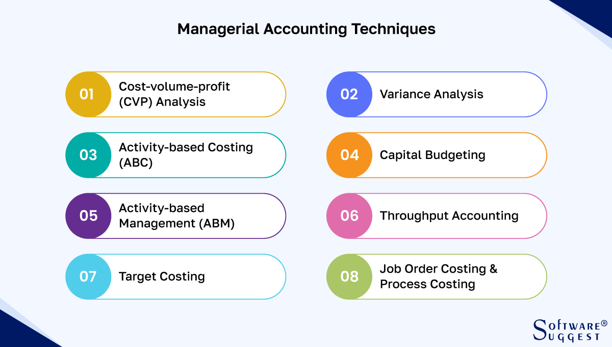

## Table of Contents

## What is managerial accounting and how does it differ from financial accounting?

Managerial accounting is a type of accounting that helps managers inside a company make decisions. It focuses on providing detailed information about the costs of products, budgets, and performance. This information is used to plan, control, and improve the operations of the business. Unlike financial accounting, managerial accounting does not have to follow strict rules and can be customized to meet the needs of the managers.

Financial accounting, on the other hand, is focused on providing information to people outside the company, like investors, creditors, and tax authorities. It follows strict rules and standards, like Generally Accepted Accounting Principles (GAAP), to make sure the information is consistent and reliable. Financial accounting reports, like income statements and balance sheets, show the overall financial health of the company but do not go into the detailed operational data that managerial accounting provides.

## What are the main objectives of managerial accounting?

The main goal of managerial accounting is to help managers make better decisions. It does this by giving them detailed information about how the business is doing. This information helps managers see where the company is making money and where it is losing money. They can then decide how to use resources like money, people, and materials in the best way possible.

Another important objective is to help managers plan for the future. Managerial accounting provides tools like budgets and forecasts that help managers set goals and plan how to reach them. This planning helps the company prepare for changes in the market and make sure it can keep growing and making profits.

Lastly, managerial accounting helps managers control the business. It does this by comparing actual results with the plans and budgets. If there are differences, managers can find out why and fix any problems. This control helps keep the business running smoothly and efficiently.

## Can you explain the concept of cost behavior in managerial accounting?

Cost behavior in managerial accounting is about how costs change when the amount of work or production changes. There are three main types of costs: fixed, variable, and mixed. Fixed costs stay the same no matter how much you produce. For example, rent for a factory is a fixed cost because it doesn't change if you make more or fewer products. Variable costs go up or down depending on how much you produce. If you make more products, you'll need more materials, so the cost of materials is a variable cost. Mixed costs have parts that are fixed and parts that are variable. For example, a utility bill might have a fixed charge plus a charge that depends on how much electricity you use.

Understanding cost behavior is important for managers because it helps them predict how costs will change as the business grows or shrinks. If a manager knows which costs are fixed and which are variable, they can make better decisions about pricing, budgeting, and planning. For example, if a company wants to increase production, the manager needs to know how much the variable costs will go up. This information helps them decide if the increase in production will be profitable. By understanding cost behavior, managers can control costs better and make smarter choices for the business.

## What are the key pillars of managerial accounting?

Managerial accounting is built on a few key ideas that help managers run their businesses better. One of these ideas is cost accounting, which is all about figuring out how much it costs to make a product or provide a service. This helps managers see where they can save money and make their operations more efficient. Another important part is budgeting, which is like making a plan for how to spend money in the future. Budgets help managers set goals and make sure they have enough money to reach them.

Performance measurement is another big pillar of managerial accounting. It's about keeping track of how well different parts of the business are doing. Managers use this information to see if they are meeting their goals and to find areas where they can improve. Decision making is also a key part of managerial accounting. It uses all the information from cost accounting, budgeting, and performance measurement to help managers make smart choices about things like pricing, investing, and growing the business.

These pillars work together to give managers the tools they need to run their businesses effectively. By understanding costs, planning with budgets, measuring performance, and making informed decisions, managers can keep their businesses on track and help them grow.

## How do budgeting and forecasting play a role in managerial accounting?

Budgeting and forecasting are important parts of managerial accounting because they help managers plan for the future. Budgeting is like making a plan for how to spend money. It helps managers set goals for different parts of the business and make sure they have enough money to reach those goals. For example, a manager might make a budget to decide how much to spend on new equipment or how much to save for future projects. By creating a budget, managers can see where the money is going and make sure they are using it in the best way possible.

Forecasting is about predicting what will happen in the future. It helps managers guess how much money they will make or spend, and how much they will sell. For example, a manager might use past sales data to predict how many products they will sell next month. This helps them plan how much to produce and how much to spend on materials. By combining budgeting and forecasting, managers can make better plans and be ready for changes in the market. This helps the business run smoothly and grow over time.

## What are the different types of managerial accounting?

Managerial accounting has different types that help managers in different ways. One type is cost accounting, which is all about figuring out how much it costs to make a product or provide a service. This helps managers see where they can save money and make their operations more efficient. Another type is performance management, which is about keeping track of how well different parts of the business are doing. Managers use this information to see if they are meeting their goals and to find areas where they can improve.

Another important type is budgeting, which helps managers plan for the future by setting goals and making sure they have enough money to reach them. Forecasting is also a key type of managerial accounting, as it helps managers predict future sales and costs so they can plan ahead. Decision making is another type that uses information from cost accounting, budgeting, and performance measurement to help managers make smart choices about things like pricing, investing, and growing the business.

These types of managerial accounting work together to give managers the tools they need to run their businesses effectively. By understanding costs, planning with budgets, measuring performance, and making informed decisions, managers can keep their businesses on track and help them grow.

## How is variance analysis used in managerial accounting?

Variance analysis is a tool in managerial accounting that helps managers understand why actual results are different from what they planned. It compares the budgeted or planned numbers with the actual numbers. For example, if a company planned to spend $1000 on materials but actually spent $1200, variance analysis would show a $200 difference. This difference is called a variance. By looking at these variances, managers can see where things are not going as planned and figure out why.

Once managers know the variances, they can take action to fix problems. If the variance is because materials cost more than expected, managers might look for cheaper suppliers or change the materials they use. If the variance is because they produced more than planned, they might need to adjust their production schedule. Variance analysis helps managers keep the business running smoothly by quickly spotting and fixing issues. It's like a health check for the company, making sure everything is working as it should.

## What is activity-based costing and how is it applied?

Activity-based costing (ABC) is a way of figuring out how much it costs to make a product or provide a service by looking at all the activities involved. Instead of just dividing the total costs by the number of products made, ABC looks at each step in the process. For example, if a company makes toys, ABC would look at the cost of designing the toy, the cost of the materials, the cost of making the toy, and the cost of packing it up to ship. Each of these activities has a cost, and ABC adds up all these costs to find the total cost of making the toy.

ABC is useful because it gives managers a better idea of where the money is going. If a company sees that designing toys is really expensive, they might decide to simplify their designs or hire cheaper designers. Or if packing is costly, they might find a cheaper way to pack the toys. By understanding the cost of each activity, managers can make smarter decisions about how to save money and make their business more efficient.

## Can you discuss the role of performance metrics in managerial accounting?

Performance metrics in managerial accounting are important because they help managers see how well their business is doing. These metrics give numbers that show if the company is reaching its goals. For example, a manager might look at how much profit the company is making, how quickly they are turning inventory into sales, or how happy their customers are. By keeping an eye on these numbers, managers can tell if they need to make changes to keep the business running smoothly.

These metrics also help managers compare different parts of the business. If one store is doing better than another, the manager can look at the performance metrics to figure out why. Maybe one store has lower costs or sells more products. By understanding these differences, managers can learn from the best parts of the business and help the other parts improve. This way, performance metrics guide managers in making smart decisions to grow the business and keep it healthy.

## How does managerial accounting support decision-making processes?

Managerial accounting helps managers make good choices by giving them detailed information about the business. It shows how much it costs to make things, how much money the company is making, and where the business can do better. For example, if a manager wants to decide if they should start making a new product, managerial accounting can tell them how much it will cost to make it and how much they might sell it for. This helps the manager see if the new product will make money or not.

This information also helps managers plan for the future. They can use budgets to set goals and forecasts to guess what might happen next. If a manager sees that costs are going up, they can decide to find cheaper materials or change how they make things. By understanding the numbers, managers can make smart choices that help the business grow and stay strong.

## What advanced techniques are used in managerial accounting for cost management?

Advanced techniques in managerial accounting for cost management include activity-based costing (ABC) and target costing. Activity-based costing looks at all the steps it takes to make a product or provide a service and figures out the cost of each step. This helps managers see which parts of the process are expensive and where they can save money. For example, if designing a product is really costly, managers might decide to simplify the design or find cheaper ways to do it. By understanding the cost of each activity, managers can make better decisions about how to use their resources.

Target costing is another technique that helps managers control costs. It starts with figuring out how much customers are willing to pay for a product and then works backward to see how much it can cost to make it while still making a profit. If the cost to make the product is too high, managers look for ways to cut costs, like using cheaper materials or changing the way the product is made. This method helps companies stay competitive by keeping prices low while still making money. Both ABC and target costing help managers keep a close eye on costs and make smart choices to keep the business running well.

## How can managerial accounting be integrated with strategic management?

Managerial accounting can be a big help in making big plans for a business. It gives managers important numbers about costs, how much money the company is making, and how well different parts of the business are doing. When managers are making big decisions, like whether to start a new product line or go into a new market, they use these numbers to see if their plans will work. For example, if they want to start making a new type of toy, managerial accounting can tell them how much it will cost to make it and how much they might sell it for. This helps them decide if the new toy will make money or not.

By using managerial accounting in their big plans, managers can make sure their goals are realistic and achievable. They can set targets for different parts of the business and use budgets and forecasts to keep an eye on how things are going. If something isn't working as planned, managerial accounting can help them find out why and fix it. This way, the business can keep moving in the right direction and reach its big goals.

## References & Further Reading

[1]: ["Managerial Accounting: Tools for Business Decision Making"](https://www.amazon.com/Managerial-Accounting-Business-Decision-Making/dp/111970958X) by Jerry J. Weygandt, Paul D. Kimmel, and Donald E. Kieso

[2]: Horngren, C. T., Datar, S. M., & Rajan, M. V. (2015). ["Cost Accounting: A Managerial Emphasis."](https://archive.org/details/20240317_20240317_0811) Pearson Education Limited.

[3]: ["The Essentials of Financial Analysis"](https://www.amazon.com/Essentials-Financial-Analysis-Samuel-Weaver/dp/007176836X) by Samuel Weaver and J. Fred Weston

[4]: ["Creative Accounting, Fraud and International Accounting Scandals"](https://onlinelibrary.wiley.com/doi/book/10.1002/9781119208907) by Michael Jones

[5]: Fabozzi, F. J., & Focardi, S. M. (2010). ["High-Frequency Trading: A Practical Guide to Algorithmic Strategies and Trading Systems."](http://informatorects.uw.edu.pl/en/courses/view?prz_kod=2400-QFU2FEC) Wiley.