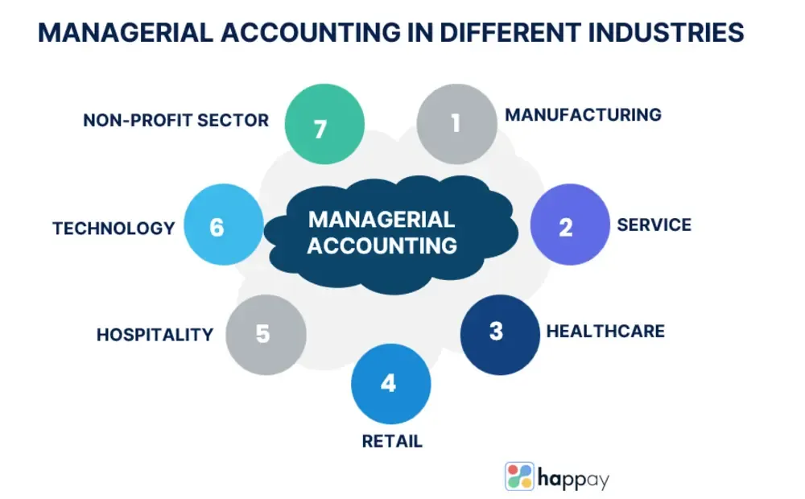

## Table of Contents

## What is managerial accounting and how does it differ from financial accounting?

Managerial accounting is a type of accounting that helps managers inside a company make decisions. It focuses on providing detailed information about the costs of running the business, how much it costs to make products, and how to budget and plan for the future. This information is usually not shared with people outside the company because it is meant to help managers do their jobs better.

Financial accounting, on the other hand, is about giving information to people outside the company, like investors, banks, and the government. It follows strict rules and focuses on creating financial statements like the income statement, balance sheet, and cash flow statement. These statements show the overall financial health of the company and are used by outsiders to make decisions about investing in or lending money to the company. The main difference is that managerial accounting is for internal use to help run the business, while financial accounting is for external use to show the company's financial performance.

## What are the primary objectives of managerial accounting?

The main goal of managerial accounting is to help people inside a company make better decisions. It does this by giving managers detailed information about the costs of making products or providing services. This helps them figure out how much it costs to do business and where they can save money or make more profit. For example, managers can use this information to decide if they should change their prices, stop making certain products, or find ways to make things more efficiently.

Another important objective is to help with planning and budgeting. Managerial accounting provides tools like budgets and forecasts that help managers plan for the future. They can set goals, predict how much money they will make and spend, and make sure they have enough resources to meet their targets. This planning helps the company run smoothly and be ready for changes in the market or the economy.

Lastly, managerial accounting helps with performance evaluation. It allows managers to compare what they planned to do with what actually happened. By looking at these comparisons, they can see which parts of the business are doing well and which need improvement. This helps them reward good performance and make changes where needed to keep the company on track.

## Can you explain the concept of cost behavior and its importance in managerial accounting?

Cost behavior is about understanding how costs change when a business does more or less work. There are three main types of costs: fixed, variable, and mixed. Fixed costs stay the same no matter how much work the business does, like rent or salaries. Variable costs go up or down depending on how much work is done, like the cost of materials to make products. Mixed costs have parts that are fixed and parts that change, like a phone bill with a base rate and extra charges for usage. Knowing how costs behave helps managers plan better and make smarter decisions.

Understanding cost behavior is really important in managerial accounting because it helps managers predict how costs will change when the business grows or shrinks. For example, if a manager knows that the cost of materials will go up as they make more products, they can plan for that and set prices that will cover those costs and still make a profit. It also helps with budgeting and figuring out how to control costs. By knowing which costs will stay the same and which will change, managers can make better plans and find ways to save money or spend it more wisely.

## What are the different types of costs (e.g., fixed, variable, direct, indirect) and how are they classified?

Costs can be divided into different types based on how they behave and how they are linked to products or services. Fixed costs are expenses that stay the same no matter how much a business produces, like rent or salaries for employees. Variable costs change with the level of production, like the cost of raw materials that go into making products. Mixed costs have both fixed and variable parts, such as a utility bill that has a base charge plus charges for usage. Direct costs are expenses that can be easily traced to a specific product or service, like the cost of leather used to make a handbag. Indirect costs, on the other hand, are harder to link to a specific product and include things like the cost of electricity used to run the factory where the handbags are made.

Understanding these different types of costs is important for managers because it helps them plan and make decisions. For example, knowing that the cost of materials will go up as production increases helps managers set prices that will cover those costs and still make a profit. Fixed costs, like rent, need to be paid no matter how much is produced, so managers need to make sure their business can cover these costs even when production is low. By classifying costs as direct or indirect, managers can better understand the true cost of making each product and find ways to control costs and improve efficiency.

## How do managers use cost-volume-profit (CVP) analysis to make business decisions?

Managers use cost-volume-profit (CVP) analysis to understand how changes in costs, sales volume, and prices affect their profits. CVP analysis helps them figure out how many products they need to sell to break even, which means making enough money to cover all their costs. This is called the break-even point. By knowing the break-even point, managers can set realistic sales targets and decide if they should change their prices or try to lower their costs to make more profit.

CVP analysis also helps managers make decisions about what products to make or sell. For example, if a manager is thinking about adding a new product, they can use CVP analysis to see if it will make money. They look at how much it will cost to make the product, how much they can sell it for, and how many they need to sell to make a profit. This helps them decide if the new product is a good idea or if they should focus on something else. By using CVP analysis, managers can plan better and make choices that will help their business grow and be more successful.

## What is activity-based costing (ABC) and how does it improve cost allocation?

Activity-based costing (ABC) is a way of figuring out how much it costs to make products or provide services by looking at all the activities that go into making them. Instead of just dividing the total costs by the number of products, ABC looks at each activity, like setting up machines or inspecting products, and assigns costs to those activities. Then, it figures out how much of each activity is used to make each product and assigns the costs accordingly. This gives a more accurate picture of how much it really costs to make each product.

Using ABC helps managers make better decisions because it shows them which products or services are really profitable and which ones might be losing money. With traditional costing methods, costs are often spread out evenly, which can make it seem like some products are more profitable than they really are. ABC helps managers see the true costs by linking them to specific activities, so they can find ways to make things more efficient, cut costs, and focus on the products or services that make the most money.

## How can budgeting be used as a tool in managerial accounting?

Budgeting is a big part of managerial accounting because it helps managers plan how to use the company's money. A budget is like a plan that shows how much money the company expects to make and spend over a certain time, like a year. It helps managers set goals and figure out if they have enough money to do what they want. For example, a manager might make a budget to see if they can afford to buy new equipment or hire more workers. By looking at the budget, they can decide if they need to find ways to make more money or cut costs to reach their goals.

Budgets also help managers keep track of how the company is doing. They can compare what they planned in the budget with what actually happens. If the company is making more money than expected, that's great. But if they are spending too much or not making enough, the budget can show them where the problems are. This helps managers make changes quickly, like finding ways to save money or selling more products. By using budgets, managers can make sure the company stays on track and reaches its goals.

## What are the key performance indicators (KPIs) that managers should monitor?

Managers should keep an eye on several key performance indicators (KPIs) to make sure their business is doing well. Some important KPIs include sales growth, which shows if the company is making more money over time, and profit margins, which tell managers how much money they are making after paying for all their costs. Another key KPI is customer satisfaction, which can be measured through surveys or feedback to see if customers are happy with the products or services. Also, managers should look at employee productivity to see if their team is working efficiently and getting things done.

Other important KPIs include inventory turnover, which shows how quickly the company is selling its products, and return on investment (ROI), which measures how much profit the company is making from its investments. Cash flow is also a critical KPI because it shows if the company has enough money coming in to pay its bills and keep running smoothly. By monitoring these KPIs, managers can see where the business is doing well and where it needs to improve, helping them make better decisions and keep the company on track.

## How does variance analysis help in controlling business operations?

Variance analysis helps managers control business operations by comparing what they planned to what actually happened. It shows the differences, or variances, between the budgeted numbers and the real numbers. This helps managers see if they are spending too much or not making enough money. By understanding these differences, managers can figure out why they are happening and take steps to fix any problems. For example, if the cost of materials is higher than planned, managers can look for cheaper suppliers or find ways to use less material.

Using variance analysis, managers can also spot trends and make better decisions for the future. If they see that sales are always lower than expected in certain months, they can plan special promotions or adjust their inventory to match the demand. This helps keep the business running smoothly and prevents big surprises. By regularly checking variances, managers can keep a close eye on the business and make quick changes to stay on track and reach their goals.

## What role does the balanced scorecard play in strategic management?

The balanced scorecard is a tool that helps managers see how well their company is doing from different angles. It looks at four main areas: financial performance, customer satisfaction, internal processes, and learning and growth. By using the balanced scorecard, managers can make sure they are not just focusing on making money but also on keeping customers happy, running the business smoothly, and helping employees learn and grow. This helps them make better decisions that will help the company succeed in the long run.

Using the balanced scorecard also helps managers connect their day-to-day work with the company's big goals. It shows them how their actions in each area affect the overall success of the business. For example, if a manager sees that customer satisfaction is low, they can work on improving the internal processes that affect customers, like speeding up delivery times. By keeping an eye on all four areas, managers can make sure they are moving in the right direction and making progress toward their strategic goals.

## How can managerial accounting techniques be applied to enhance decision-making in a global business environment?

Managerial accounting techniques are really helpful for making decisions in a global business environment. When a company works in different countries, it has to deal with different costs, laws, and markets. Managerial accounting helps managers understand these differences by giving them detailed information about costs and profits in each place. For example, cost-volume-profit (CVP) analysis can show managers how many products they need to sell in each country to make a profit. This helps them decide where to focus their efforts and how to set prices that will work well in different markets.

Activity-based costing (ABC) is another technique that can help in a global setting. It looks at the specific activities that go into making products or providing services, which can vary a lot from one country to another. By using ABC, managers can see the true costs of doing business in each place and find ways to save money or improve efficiency. This helps them make better decisions about where to invest and how to manage their operations around the world. By using these and other managerial accounting techniques, managers can make smarter choices that will help their global business succeed.

## What advanced techniques like throughput accounting and lean accounting are used in modern managerial accounting?

Throughput accounting is a way of looking at costs that focuses on making the most money possible. It's different from traditional accounting because it cares more about how fast a company can make and sell its products than about how much it costs to make them. In throughput accounting, the main goal is to increase the rate at which the company makes money, called "throughput." This means managers try to find and fix anything that slows down production, like machines breaking down or waiting for materials. By doing this, they can make more products and sell them faster, which helps the company make more money.

Lean accounting is another modern technique that goes along with lean manufacturing, which is all about getting rid of waste and making things more efficient. Lean accounting changes how a company keeps track of its costs and performance to match the lean way of working. Instead of using complicated reports and budgets, lean accounting uses simple, clear ways to show how the company is doing. This helps managers see where they can save money and make things better. By using lean accounting, companies can focus on what's really important, like making good products quickly and keeping customers happy, instead of getting lost in a lot of numbers and reports.

## What are the key managerial accounting techniques and their applications?

Managerial accounting encompasses several key techniques, each serving a pivotal role in business operations and strategic planning. These techniques are vital for efficiently managing resources, setting informed financial goals, and evaluating operational performance.

**Cost Accounting** plays a fundamental role in the accurate tracking and management of production costs. By meticulously recording direct costs, such as labor and materials, alongside indirect costs or overheads, businesses can make informed decisions regarding resource allocation and pricing strategies. This component of accounting assists managers in identifying cost-saving opportunities, optimizing product pricing, and enhancing profitability. Through cost accounting, a company can also determine its break-even point, aiding in the analysis of financial viability and sustainability of its operations. The break-even point (BEP) is calculated using the formula:

$$
BEP = \frac{\text{Fixed Costs}}{\text{Sales Price per Unit} - \text{Variable Cost per Unit}}
$$

**Budgeting and Forecasting** are essential tools for setting and aligning financial objectives with an organization's strategic goals. Budgets are detailed financial plans that estimate income and expenses over a specific period, serving as a roadmap for financial performance. Forecasting, on the other hand, anticipates future financial conditions and performance based on historical data, helping organizations make necessary adjustments to stay on course. These practices enable businesses to prepare for potential financial challenges and capitalize on opportunities, ensuring sustainable growth and stability.

**Variance Analysis** is a critical technique for evaluating performance by comparing actual outcomes against budgeted or expected figures. It identifies discrepancies between planned financial activities and actual results, allowing managers to investigate the causes of variances and implement corrective actions. This ongoing process is crucial for adaptive management, ensuring that any deviations from the financial plan are promptly addressed, thereby improving operational efficiency. Variance analysis typically involves calculating:

$$
\text{Variance} = \text{Actual Value} - \text{Budgeted Value}
$$

A positive variance indicates a favorable outcome, while a negative variance points to areas that require attention.

Collectively, these managerial accounting techniques provide a robust framework for internal decision-making, enabling businesses to fine-tune operations, make strategic adjustments, and ultimately achieve financial success. By employing these methods, organizations can maintain control over their financial trajectories and enhance their competitive edge in a dynamic market environment.

## References & Further Reading

[1]: ["Managerial Accounting: Creating Value in a Dynamic Business Environment"](https://www.amazon.com/Managerial-Accounting-Creating-Business-Environment/dp/1265046794) by Ronald W. Hilton and David E. Platt

[2]: Montagna, C. (2016). ["High-Frequency Trading: An Overview."](https://digital.library.unt.edu/ark:/67531/metadc847719/) In: F. Fabozzi, D. Grant, & H. Thorp (eds), Handbook of Quantitative Finance and Risk Management.

[3]: ["Algorithmic Trading: Winning Strategies and Their Rationale"](https://books.google.com/books/about/Algorithmic_Trading.html?id=WAlFDwAAQBAJ) by Ernest P. Chan

[4]: Heaton, J.B., Polson, N.G., & Witte, J.H. (2017). ["Deep Learning for Finance: Deep Portfolios."](https://arxiv.org/abs/1602.06561) The Review of Financial Studies, 21(4), 2011-2052.

[5]: ["Cost Accounting: A Managerial Emphasis"](https://www.amazon.com/Cost-Accounting-Managerial-Emphasis-15th/dp/0133803813) by Charles T. Horngren, Srikant M. Datar, and Madhav V. Rajan