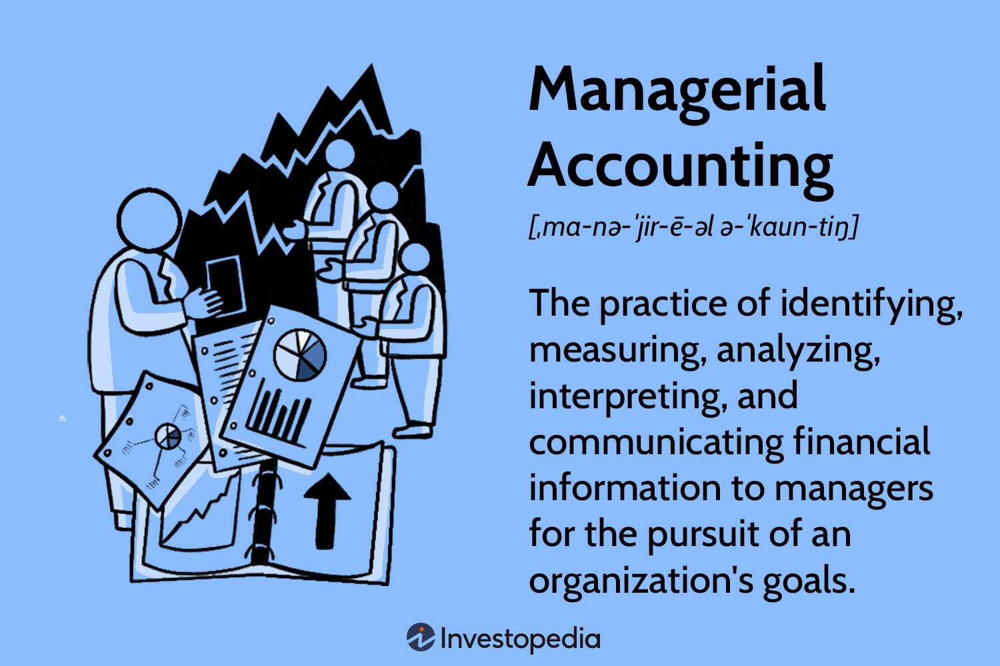

The finance industry is undergoing a significant transformation, spurred by rapid advancements in technology and the globalization of markets. This evolution necessitates the adoption of sophisticated accounting techniques and management concepts to meet the demands of modern financial environments. Two pivotal developments in this landscape are managerial accounting and algorithmic trading. Managerial accounting focuses on equipping organizations with detailed financial analyses to aid in strategic planning and decision-making. This discipline emphasizes the use of internal financial data over historical financial statements, allowing businesses to make informed forecasts and align resources efficiently.

In parallel, algorithmic trading has emerged as a formidable tool in the finance sector, revolutionizing the way trades are executed by leveraging automated systems and algorithms. These technologies enhance trading speed and precision, providing a competitive edge in financial markets. However, algorithmic trading also introduces complexities in accounting, requiring refined approaches to manage tax liabilities, portfolio management, and compliance with financial regulations.

Understanding these concepts is not merely an academic exercise but a practical necessity for effective financial management and strategic decision-making in contemporary business contexts. The integration of these areas provides companies with opportunities to optimize their operations, allocate resources more effectively, and ultimately achieve a more robust financial standing. As businesses strive to keep pace with market dynamics, mastering the interplay between managerial accounting and algorithmic trading is crucial for sustaining growth and competitive advantage.

## Table of Contents

## Understanding Managerial Accounting

Managerial accounting is a critical aspect of modern business, focusing on the collection, analysis, and interpretation of financial data to support managerial decision-making. Unlike financial accounting, which primarily serves external stakeholders with standard financial statements, managerial accounting is designed to meet the needs of internal management by offering detailed insights into the organization's operations.

A significant distinction between the two lies in their orientation: financial accounting is past-oriented, presenting a historical view of financial performance, while managerial accounting is forward-looking, providing forecasts and insights to aid strategic planning and budgeting. This forward-looking approach enables organizations to make informed decisions related to pricing, cost control, and resource allocation.

Key techniques in managerial accounting include cost accounting, budgeting, and performance evaluation. Cost accounting plays a pivotal role by tracking production costs, aiding businesses in determining the cost of products, services, and operations. This information is crucial for setting pricing strategies and ensuring efficient resource allocation.

Budgeting and forecasting are essential components, allowing organizations to set financial goals and create financial plans based on expected outcomes and possible variances. This process involves preparing budget estimates, reviewing them periodically, and adjusting as necessary to stay aligned with the company's strategic objectives.

Performance evaluation is another vital technique, focusing on assessing different facets of operations, including efficiency, profitability, and overall effectiveness. Techniques like variance analysis compare actual performance against projected figures, helping identify areas requiring attention and facilitating operational improvements.

Overall, managerial accounting equips businesses with the necessary tools to enhance decision-making, optimize operations, and achieve strategic objectives, making it an indispensable component of effective financial management.

## Key Managerial Accounting Techniques and Their Applications

Managerial accounting encompasses several key techniques, each serving a pivotal role in business operations and strategic planning. These techniques are vital for efficiently managing resources, setting informed financial goals, and evaluating operational performance.

**Cost Accounting** plays a fundamental role in the accurate tracking and management of production costs. By meticulously recording direct costs, such as labor and materials, alongside indirect costs or overheads, businesses can make informed decisions regarding resource allocation and pricing strategies. This component of accounting assists managers in identifying cost-saving opportunities, optimizing product pricing, and enhancing profitability. Through cost accounting, a company can also determine its break-even point, aiding in the analysis of financial viability and sustainability of its operations. The break-even point (BEP) is calculated using the formula:

$$
BEP = \frac{\text{Fixed Costs}}{\text{Sales Price per Unit} - \text{Variable Cost per Unit}}
$$

**Budgeting and Forecasting** are essential tools for setting and aligning financial objectives with an organization's strategic goals. Budgets are detailed financial plans that estimate income and expenses over a specific period, serving as a roadmap for financial performance. Forecasting, on the other hand, anticipates future financial conditions and performance based on historical data, helping organizations make necessary adjustments to stay on course. These practices enable businesses to prepare for potential financial challenges and capitalize on opportunities, ensuring sustainable growth and stability.

**Variance Analysis** is a critical technique for evaluating performance by comparing actual outcomes against budgeted or expected figures. It identifies discrepancies between planned financial activities and actual results, allowing managers to investigate the causes of variances and implement corrective actions. This ongoing process is crucial for adaptive management, ensuring that any deviations from the financial plan are promptly addressed, thereby improving operational efficiency. Variance analysis typically involves calculating:

$$
\text{Variance} = \text{Actual Value} - \text{Budgeted Value}
$$

A positive variance indicates a favorable outcome, while a negative variance points to areas that require attention.

Collectively, these managerial accounting techniques provide a robust framework for internal decision-making, enabling businesses to fine-tune operations, make strategic adjustments, and ultimately achieve financial success. By employing these methods, organizations can maintain control over their financial trajectories and enhance their competitive edge in a dynamic market environment.

## The Role of Algorithmic Trading in Finance

Algorithmic trading employs automated platforms functioning on pre-set algorithms to execute trades. This method significantly enhances the speed and efficiency of trading activities. By relying on data-driven instructions, [algorithmic trading](/wiki/algorithmic-trading) can efficiently manage high-frequency trade executions which are impossible through manual trading.

To operate effectively, algorithmic trading necessitates specialized accounting practices. This is because every transaction needs accurate recording for managing tax liabilities and ensuring comprehensive portfolio management. An effective accounting system for algorithmic trading must align with financial compliance requirements, thereby integrating complex calculations and data processing capabilities.

Moreover, implementing algorithmic trading transforms traditional accounting strategies. Unlike manual trading, which allows accounting on a transaction-by-transaction basis, algorithmic trading requires accommodating high-frequency transactions, resulting in substantial efficiencies and challenges. The scaling of trade activities facilitated by algorithms necessitates robust systems capable of real-time monitoring and decision-making.

Algorithmic trading often utilizes methodologies such as mark-to-market accounting, crucial for reflecting current market conditions accurately. However, this can introduce [volatility](/wiki/volatility-trading-strategies) in financial reports due to frequent market fluctuations, thus requiring advanced statistical and accounting techniques to mitigate potential inaccuracies.

The transition from traditional to algorithmic trading has created a paradigmatic shift in the financial industry. Efficient algorithms enhance trading outcomes but demand precise accounting methodologies to address the intricate tax, portfolio, and compliance issues that arise. This shift represents both the potential for increased operational efficiency and the managerial responsibility of navigating the complex landscape of modern algorithmic financial practices.

## Accounting Implications of Algorithmic Trading

Algorithmic trading, which utilizes automated systems for executing trades based on pre-defined criteria, presents distinct accounting challenges that necessitate careful consideration of accounting methods. Choosing between accrual and cash basis accounting, for example, can have significant ramifications for financial reporting and performance evaluation in algorithmic trading environments.

In accrual accounting, revenues and expenses are recorded when they are incurred, regardless of when cash is exchanged. This method provides a more comprehensive view of financial performance and aligns profit recognition with the timing of economic events, which is crucial for the rapid transactions typical of algorithmic trading. However, this approach requires more sophisticated systems to track unrealized gains or losses, especially in high-frequency trading, leading to potential complexities in financial reporting and tax computation.

Cash basis accounting, by contrast, records transactions only when cash changes hands. While simpler, this method may not capture the fast-paced transactions integral to algorithmic trading, potentially misrepresenting an entity's financial position and failing to provide the timely insights required for strategic decision-making.

Mark-to-market accounting offers a solution by valuing securities at their current market price, thereby providing real-time portfolio updates. This enables traders and managers to assess immediate market impact and risks, reflecting current market conditions accurately. However, it introduces volatility into financial statements due to the frequent fluctuations in market prices, which can complicate the alignment of financial outcomes with underlying economic realities.

Accurate accounting practices in algorithmic trading not only ensure compliance with regulatory requirements—such as those imposed by the Securities and Exchange Commission (SEC) or the Financial Industry Regulatory Authority (FINRA)—but also optimize financial performance. By maintaining precise records and real-time valuations, businesses can make informed strategic decisions, enhance risk management, and ultimately bolster profitability.

In summary, selecting appropriate accounting methods and maintaining thorough financial records are integral to effectively managing the complexities of algorithmic trading. These practices not only support compliance with financial regulations but also enhance operational efficiency and strategic decision-making capabilities.

## Managerial Accounting vs. Financial Accounting

Financial accounting and managerial accounting serve distinct but complementary roles in the financial management of organizations. Financial accounting is primarily concerned with the preparation of financial statements for external stakeholders, including investors, creditors, regulators, and tax authorities. It follows strict regulatory standards such as Generally Accepted Accounting Principles (GAAP) or International Financial Reporting Standards (IFRS), ensuring consistency, comparability, and transparency in financial reporting. These standards dictate how transactions should be recorded, measured, and presented, facilitating a clear understanding of an organization's financial position and performance over a specific period.

In contrast, managerial accounting is designed for internal use by management and is focused on providing relevant information for decision-making, planning, and controlling operations. It offers flexibility and can be tailored to meet the specific needs of the organization, helping managers make informed decisions about resource allocation, cost management, and strategic planning. Managerial accounting employs various tools and techniques such as budgeting, forecasting, and performance evaluation to assist management in achieving organizational objectives.

One of the primary differences between the two accounting types is the orientation towards the user of the information. Financial accounting aims to provide a historical perspective through standardized reports, whereas managerial accounting provides a forward-looking approach that emphasizes decision support. For instance, while financial accounting might report on the profitability of the entire organization, managerial accounting could analyze the profitability of specific products, services, or departments to optimize performance and support strategic initiatives.

Both financial accounting and managerial accounting are essential for comprehensive financial management and achieving corporate goals. Financial accounting ensures compliance with legal and fiscal requirements, while managerial accounting enables strategic decisions that drive business success. Together, they provide a holistic view of an organization's financial health, balancing the need for historical accuracy with the need for strategic foresight. This dual approach equips organizations to navigate complex financial environments effectively, ensuring sustainability and growth in competitive markets.

## Conclusion

The integration of managerial accounting techniques and algorithmic trading technologies creates numerous possibilities for businesses seeking to optimize financial management. As companies face increasingly complex decision-making challenges, the synthesis of these approaches provides a strategic edge. Managerial accounting, with its emphasis on internal processes, offers the tools necessary to refine resource allocation, budgeting, and performance evaluation. These essential functions inform data-driven strategies, allowing organizations to adapt to market fluctuations and align their financial goals with operational realities.

Simultaneously, the adoption of algorithmic trading introduces a level of precision and speed that traditional trading methods cannot match. By leveraging automated platforms and pre-defined algorithms, businesses can execute trades with greater efficiency, effectively managing assets and risks. This technological advancement necessitates a reevaluation of traditional accounting methods, particularly concerning the accurate representation of financial data and compliance with regulatory standards.

Businesses that successfully incorporate managerial accounting with algorithmic trading stand to benefit from improved decision-making processes. By mastering these areas, organizations can ensure accurate financial reporting, optimize tax strategies, and achieve sustainable growth. In an ever-evolving financial landscape, a profound grasp of these concepts enables businesses to not only survive but thrive, adapting swiftly to new challenges and seizing emerging opportunities. This comprehensive understanding forms the foundation for robust financial strategies, positioning businesses to enhance their competitive advantage and secure long-term success.

## References & Further Reading

[1]: ["Managerial Accounting: Creating Value in a Dynamic Business Environment"](https://www.amazon.com/Managerial-Accounting-Creating-Business-Environment/dp/1265046794) by Ronald W. Hilton and David E. Platt

[2]: Montagna, C. (2016). ["High-Frequency Trading: An Overview."](https://digital.library.unt.edu/ark:/67531/metadc847719/) In: F. Fabozzi, D. Grant, & H. Thorp (eds), Handbook of Quantitative Finance and Risk Management.

[3]: ["Algorithmic Trading: Winning Strategies and Their Rationale"](https://books.google.com/books/about/Algorithmic_Trading.html?id=WAlFDwAAQBAJ) by Ernest P. Chan

[4]: Heaton, J.B., Polson, N.G., & Witte, J.H. (2017). ["Deep Learning for Finance: Deep Portfolios."](https://arxiv.org/abs/1602.06561) The Review of Financial Studies, 21(4), 2011-2052.

[5]: ["Cost Accounting: A Managerial Emphasis"](https://www.amazon.com/Cost-Accounting-Managerial-Emphasis-15th/dp/0133803813) by Charles T. Horngren, Srikant M. Datar, and Madhav V. Rajan