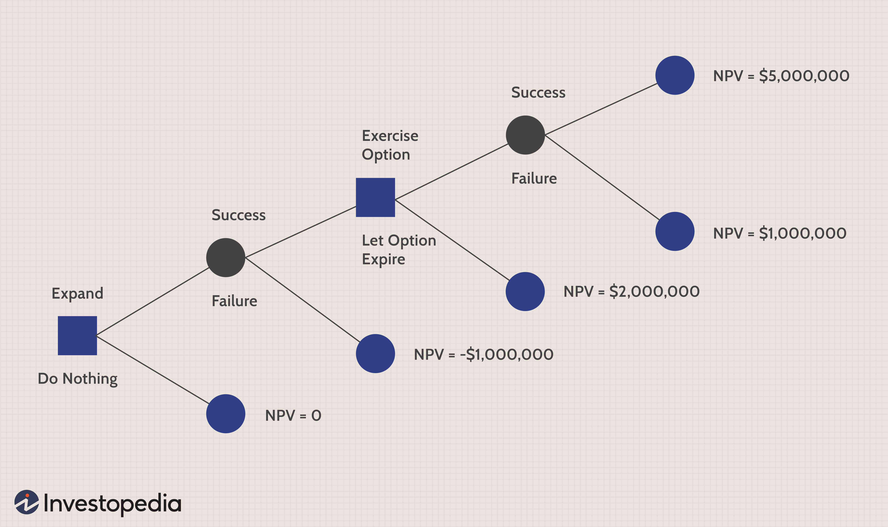

Understanding options trading is crucial in navigating the complexities of financial markets. As financial instruments, options provide investors with the right, but not the obligation, to buy or sell an underlying asset at a predetermined price, known as the strike price, within a specified time frame. This inherent flexibility allows traders to implement various strategies tailored to different market conditions and investment goals.

Options trading enhances risk management by offering strategies such as hedging, which helps to mitigate potential losses. For instance, purchasing put options can provide insurance against a decline in the price of an asset already held in a portfolio. In addition, options can be leveraged for speculation, enabling traders to capitalize on anticipated market movements with a relatively lower upfront investment compared to directly investing in the underlying assets. Another advantage is income generation through strategies like writing covered calls, where traders sell call options against assets they own to earn premium income.



Integrating algorithmic trading into options trading strategies can significantly enhance their effectiveness. Algorithmic trading involves using computer programs to execute trades based on predefined criteria, enabling faster decision-making and execution. This capability is valuable in the options markets, where timing and precision can greatly influence profitability. Algorithms can efficiently handle complex strategies such as volatility arbitrage and delta hedging, allowing traders to balance risk and reward dynamically.

This article aims to provide a comprehensive overview of options trading by exploring its fundamental aspects, addressing common challenges faced by traders, and discussing the importance of sound financial management. It will also highlight the role of algorithmic trading in optimizing options market strategies, demonstrating how technology can aid in developing successful trading frameworks. By understanding and applying these concepts, traders can better navigate volatile markets and enhance their potential for success.

## Table of Contents

## Understanding Options Trading

Options trading is a dynamic facet of financial markets that involves contracts providing the right, but not the obligation, to buy or sell a security at a predetermined price within a specified time frame. This feature of options makes them a powerful tool for various strategic financial activities, offering traders flexibility and leverage in executing their market positions.

There are two primary types of options: calls and puts. A call option gives the holder the right to purchase the underlying asset at the strike price, while a put option allows the holder to sell the asset at the strike price. These instruments afford traders the opportunity to capitalize on market movements in either direction, providing strategic advantages depending on market outlook and conditions.

Options trading is not limited to one-dimensional strategies. It is employed for hedging, speculation, and income generation, reflecting its versatility. Hedging involves using options to offset potential losses in the underlying asset. For instance, an investor holding a stock can purchase a put option to hedge against potential price declines, essentially securing a minimum selling price for their stock. Conversely, options can be used for speculative purposes, where traders aim to profit from market [volatility](/wiki/volatility-trading-strategies) or directional price movements without necessarily holding the underlying asset.

Moreover, options can be instruments for generating income. Writing, or selling, options enables traders to earn premiums, which can supplement income regardless of market direction, provided the options expire worthless.

Managing options trades to minimize losses is crucial, alongside the selection of the appropriate position. The inherent leverage in options can lead to significant gains, but it also implies greater risks. Effective risk management involves strategies like setting stop-loss orders, diversifying option positions, and adhering to strict position sizing rules.

In conclusion, the nuanced nature of options trading requires a thorough understanding of its mechanics and strategic applications. Traders must continuously assess their positions and market conditions to optimize their outcomes effectively. Understanding the balance between risk and reward is integral to mastering options trading in today’s complex financial landscape.

## Common Challenges in Options Trading

Options trading presents several challenges, mainly due to the inherent volatility and complexity of financial markets. Market volatility is a significant [factor](/wiki/factor-investing), as it can swiftly convert potential profits into substantial losses. The rapid price movements inherent in options markets require traders to remain vigilant and responsive to changing conditions. Managing unrealized losses becomes essential, as failing to do so can erode trading capital quickly.

One common pitfall for options traders is the lack of preparation for potential follow-up adjustments. When a trade does not go as planned, some traders may hesitate or lack strategies for modifying their positions, thereby increasing risk exposure. Adaptability is key; traders need to swiftly alter their strategies to align with new market conditions.

Technical analysis is a valuable tool in options trading, helping traders interpret market data and predict future price movements. It involves studying chart patterns, trends, and indicators to make informed decisions. Incorporating technical analysis into trading strategies allows for more precise entry and [exit](/wiki/exit-strategy) points, potentially reducing risks and enhancing returns.

Repair strategies are also critical for mitigating losses. These strategies aim to adjust a losing position to minimize damage or convert it into a potentially profitable one. Common repair techniques include rolling options (extending the expiration or changing the strike price) and converting positions (e.g., changing a call into a spread). These approaches require a thorough understanding of options pricing and market behavior to execute effectively.

In conclusion, successfully navigating the challenges of options trading involves a comprehensive approach that includes managing volatility, preparing for strategy adjustments, and utilizing technical analysis and repair strategies. By addressing these common challenges, traders can enhance their ability to manage risks and pursue potential profits in the dynamic world of options trading.

## Financial Management in Options Trading

Financial management is a critical component of options trading, as it ensures the sustainability and growth of a trading portfolio. Central to effective financial management is the understanding and application of diversification and risk tolerance. Diversification involves spreading investments across different assets or options positions, which minimizes the impact of any single asset's poor performance on the overall portfolio. For instance, a trader can diversify by choosing options from various sectors or companies, reducing the correlation among positions, and thus moderating potential losses.

Risk tolerance is the degree of variability in investment returns that an investor is willing to withstand. It is important for traders to assess their risk appetite and align their strategies accordingly. A high-risk tolerance may lead to opting for strategies with potentially higher rewards but greater volatility, while a low-risk tolerance might focus on safer, more predictable returns.

To optimize trading outcomes, consistent analysis and strategic adjustments are necessary. Analytical tools and market data should be employed to monitor the performance of options positions regularly. This ongoing evaluation allows for the timely adjustment of strategies to adapt to changing market conditions. For example, if a particular strategy, like a covered call, is underperforming due to declining market conditions, a trader may adjust by switching to a different strategy such as protective puts.

Effective financial management also involves balancing capital allocation across different options positions. Over-concentration in a single position can amplify risk, just as under-allocation can reduce potential rewards. Mathematical models, such as the Mean-Variance Optimization concept from Modern Portfolio Theory, can be utilized to determine the optimal allocation of resources:

$$

w^* = \underset{w}{\arg\min} \left( \frac{1}{2} w^T \Sigma w - \lambda \cdot \mu^T w \right)
$$

Here, $w$ represents the weighting of options in the portfolio, $\Sigma$ is the covariance matrix of returns, $\lambda$ is the risk aversion coefficient, and $\mu$ is the expected returns vector.

Ultimately, effective financial management in options trading requires a thoughtful approach to diversification, consistent analysis, and strategic allocation of capital, all tailored to individual risk tolerances and market conditions.

## The Role of Algorithmic Trading in Options Markets

Algorithmic trading plays a transformative role in options markets by automating trades through predefined strategies, significantly reducing the risk of human error and elevating operational efficiency. The automation aspect ensures that trades can be executed with remarkable speed, enabling traders to capitalize on market opportunities that could swiftly dissolve in the highly volatile environment typical of options markets.

High-speed analysis and execution provided by [algorithmic trading](/wiki/algorithmic-trading) are particularly crucial in these volatile markets. The ability of algorithms to process vast amounts of data in real time facilitates rapid decision-making, an essential capability when market conditions shift abruptly. For example, algorithms can be programmed to execute trades immediately once certain market conditions are met, maintaining a level of agility that manual trading cannot achieve.

In addition to managing simple trades, algorithms are instrumental in executing complex strategies like volatility [arbitrage](/wiki/arbitrage) and delta hedging. Volatility arbitrage involves profiting from the difference between the forecasted future volatility of a security and the implied volatility priced into options markets. Delta hedging, on the other hand, requires the constant adjustment of option positions to maintain a delta-neutral stance, offsetting price movements in the underlying asset. Algorithms efficiently perform these sophisticated tasks by continuously analyzing market data and adjusting positions in response to changes in volatility or price levels.

A key advantage of algorithmic trading lies in its ability to leverage technology for [backtesting](/wiki/backtesting) and optimizing trading strategies. Backtesting involves running trading algorithms on historical data to assess their viability and refine their parameters before implementing them in live markets. This process is essential for minimizing risk and ensuring that the strategies can withstand various market conditions. Python, for instance, offers libraries such as `Backtrader` or `Zipline`, which can be used to simulate trading strategies:

```python
import backtrader as bt

class TestStrategy(bt.Strategy):
    def __init__(self):
        # Initialize indicators, etc.
        self.dataclose = self.datas[0].close

    def next(self):
        # Trading logic
        if self.dataclose[0] < self.dataclose[-1]:
            if self.dataclose[-1] < self.dataclose[-2]:
                self.buy()

if __name__ == '__main__':
    cerebro = bt.Cerebro()
    cerebro.addstrategy(TestStrategy)
    # Load data, set cash, etc.
    cerebro.run()
```

The application of such tools allows traders to test various strategies under different scenarios, fine-tuning them to optimize performance while considering both potential risks and rewards. This iterative process of backtesting and optimization makes algorithmic trading a potent approach in the dynamic and often unpredictable options markets.

## Implementing Algo Trading for Options

To effectively implement algorithmic trading in options markets, establishing a set of clear rules and criteria is essential. These rules typically define the conditions under which trades will be executed, such as specific price movements, [volume](/wiki/volume-trading-strategy) changes, or time frames. By clearly defining these parameters, traders can ensure that their algorithms adhere to a consistent strategy, minimizing emotional biases and increasing the likelihood of reliable trading outcomes.

Backtesting is a critical step in the development process, as it involves testing the algorithm against historical market data to evaluate its performance. This process allows traders to assess how their strategies would have performed in past market conditions. Backtesting can help identify potential flaws or weaknesses in the algorithm, providing an opportunity to refine the strategy before it is deployed in live trading. Python, with libraries such as Pandas and [backtrader](/wiki/backtrader), is a popular choice for backtesting due to its powerful data manipulation and financial analysis capabilities. Here's a simple example of how backtesting might be implemented in Python:

```python
import pandas as pd
import backtrader as bt

class MyStrategy(bt.Strategy):
    def __init__(self):
        self.sma = bt.indicators.SimpleMovingAverage(self.data.close, period=15)

    def next(self):
        if self.data.close[-1] > self.sma[-1]:
            self.buy()
        elif self.data.close[-1] < self.sma[-1]:
            self.sell()

data = bt.feeds.YahooFinanceData(dataname='AAPL', fromdate=pd.Timestamp('2020-01-01'), todate=pd.Timestamp('2021-01-01'))
cerebro = bt.Cerebro()
cerebro.addstrategy(MyStrategy)
cerebro.adddata(data)
cerebro.run()
```

Optimization and re-evaluation of algorithms are also necessary as market conditions evolve. This could involve tweaking parameters or introducing new indicators to better capture market dynamics. As market behavior changes, continuous monitoring and adjustment of algorithms ensure they remain effective. The process of optimization may employ techniques such as grid search or genetic algorithms to identify the combination of parameters that yield the best results.

An additional consideration is the impact of algorithmic decisions on risk and potential rewards. Risk management is a fundamental aspect of successful algo trading. Traders should incorporate risk metrics, such as Value at Risk (VaR) or expected shortfall, into their algorithms to gauge the potential downside of their trading strategies. Furthermore, algorithms can be designed to manage complex strategies, such as volatility arbitrage or delta hedging, which involve nuanced assessments of risk and reward dynamics.

Finally, robust technology infrastructure is essential to support algo trading efforts. This includes reliable data feeds, low-latency execution systems, and secure, high-performance computing environments. By ensuring that both the technical and strategic aspects of algorithmic trading are well-aligned, traders can capitalize on the efficiencies and opportunities that this method offers within the options market.

## Conclusion

Incorporating traditional options strategies with algorithmic trading significantly enhances the potential for successful trading outcomes. By leveraging advanced technological tools, traders can effectively address common issues, such as market volatility and the need for quick strategic adjustments. Algorithmic trading offers a systematic approach to executing and managing trades, reducing the likelihood of human error and improving financial management. For instance, automated systems can rapidly analyze market data to execute trades based on predefined criteria, ensuring precise timing and minimizing emotional decision-making.

Successful options trading necessitates well-planned and executed strategies. Traditional methods, when augmented by algorithmic systems, allow traders to implement complex strategies like volatility arbitrage and delta hedging with greater efficiency. These strategies help in balancing risk and optimizing returns, thus forming the backbone of a robust trading portfolio.

As financial markets continue to evolve, the importance of staying informed and adaptable cannot be overstated. Market conditions, influenced by geopolitical events, economic indicators, and technological advancements, require trading strategies to be flexible and responsive. Continuous learning and adaptation to new market dynamics are essential for sustained success in options trading. By integrating cutting-edge algorithmic solutions with established trading techniques, traders can not only navigate the complexities of the options market but also take advantage of emerging opportunities. This strategic synergy ensures a competitive edge in an ever-changing financial landscape.

## References & Further Reading

[1]: Hull, J. C. (2017). ["Options, Futures, and Other Derivatives"](https://www.semanticscholar.org/paper/Options%2C-Futures%2C-and-Other-Derivatives-Hull/89bdee500c8623864fc9eb7a471546aa713acc44) (10th Edition). Pearson.

[2]: Luenberger, D. G. (1998). ["Investment Science"](https://www.amazon.com/Investment-Science-David-G-Luenberger/dp/0199740089). Oxford University Press.

[3]: Black, F., & Scholes, M. (1973). ["The Pricing of Options and Corporate Liabilities"](https://www.cs.princeton.edu/courses/archive/fall09/cos323/papers/black_scholes73.pdf). Journal of Political Economy, 81(3), 637-654.

[4]: Jorion, P. (2006). ["Value at Risk: The New Benchmark for Managing Financial Risk"](https://books.google.com/books/about/Value_at_Risk_3rd_Ed.html?id=nnblKhI7KP8C) (3rd Edition). McGraw-Hill.

[5]: Chan, E. (2009). ["Quantitative Trading: How to Build Your Own Algorithmic Trading Business"](https://github.com/ftvision/quant_trading_echan_book). Wiley.

[6]: Narang, R. (2013). ["Inside the Black Box: A Simple Guide to Quantitative and High-Frequency Trading"](https://onlinelibrary.wiley.com/doi/book/10.1002/9781118662717). Wiley.

[7]: Jansen, S. (2020). ["Machine Learning for Algorithmic Trading: Predictive models to extract signals from market and alternative data for systematic trading strategies with Python"](https://www.amazon.com/Machine-Learning-Algorithmic-Trading-alternative/dp/1839217715). Packt Publishing.