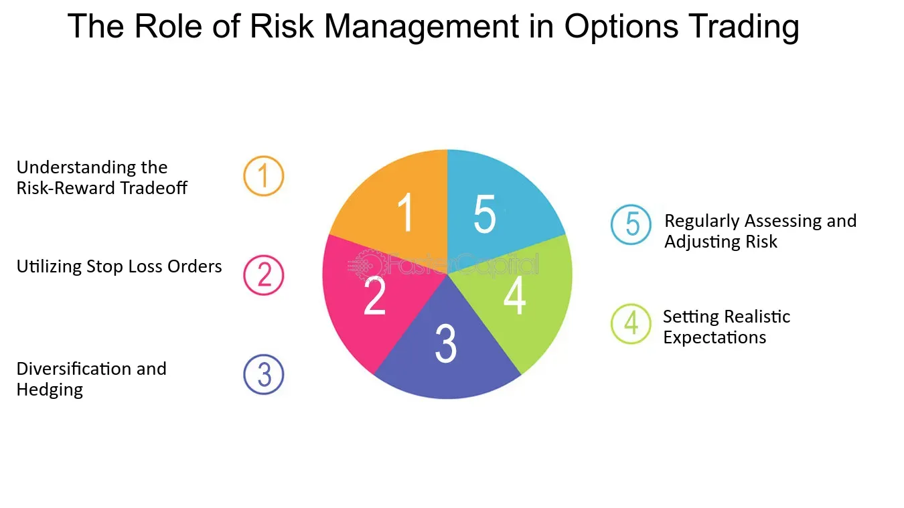

## Table of Contents

## What are the basic concepts of options trading?

Options trading involves buying and selling contracts that give the holder the right, but not the obligation, to buy or sell an underlying asset at a specific price within a certain time frame. These contracts are known as options, and they come in two main types: call options and put options. A call option gives the buyer the right to purchase the underlying asset at the strike price before the option expires, while a put option gives the buyer the right to sell the underlying asset at the strike price before expiration. Options are commonly traded on stocks, but they can also be based on other assets like commodities or indices.

The price of an option is influenced by several factors, including the price of the underlying asset, the time until expiration, and the volatility of the underlying asset. The value of an option can be broken down into its intrinsic value and its time value. Intrinsic value is the difference between the current price of the underlying asset and the strike price of the option, if that difference is positive. Time value is the additional amount that traders are willing to pay for the possibility that the option might become profitable before it expires. Understanding these concepts can help traders make informed decisions about when to buy or sell options.

## How can beginners identify common issues in options trading?

Beginners in options trading often struggle with understanding the basics, like the difference between call and put options, and how factors like time and volatility affect the price of an option. One common issue is not knowing how to properly assess the risk and reward of an options trade. For example, beginners might not realize that buying options can lead to a total loss of the premium paid if the option expires worthless. On the other hand, selling options can lead to unlimited losses if the market moves against the position. It's important for beginners to start with small trades and learn how to manage these risks.

Another issue beginners face is overtrading or making too many trades without a clear strategy. This can lead to high transaction costs and poor decision-making. It's easy to get caught up in the excitement of trading, but it's better to take a step back and plan each trade carefully. Beginners should also be aware of the emotional side of trading, as fear and greed can lead to mistakes. It's helpful to set clear goals and stick to a trading plan to avoid these pitfalls. Learning from experienced traders and using educational resources can also help beginners identify and overcome common issues in options trading.

## What are the risks associated with options trading for novice traders?

Options trading can be risky for new traders because they might not understand how it works. One big risk is losing all the money they put into buying an option if it expires without being worth anything. This is called the premium, and it's the price paid to buy the option. If the option doesn't go in the direction the trader hoped, they lose the entire premium. Selling options can be even riskier because if the market moves the wrong way, the losses can be much bigger than the money received from selling the option.

Another risk is that new traders might trade too much or make decisions based on emotions like fear or excitement. This can lead to a lot of mistakes and losing money. It's important for beginners to have a clear plan and stick to it, rather than making quick decisions based on feelings. Also, options trading involves complicated terms and strategies, which can be confusing for someone just starting out. This confusion can lead to more mistakes and bigger losses.

## How can one manage emotional responses to losses in options trading?

Managing emotions when you lose money in options trading can be tough, but it's important. One way to handle it is by setting clear rules for yourself before you start trading. Decide how much money you can afford to lose and stick to that limit. If you lose that amount, stop trading for the day. This helps you avoid making more trades just because you feel upset or want to win back your money quickly.

Another good idea is to take a break when you feel stressed or angry about a loss. Step away from your trading screen and do something else to calm down. Maybe go for a walk or talk to a friend. When you come back, you'll be able to think more clearly and make better decisions. Remember, it's normal to feel upset when you lose money, but the key is to not let those feelings control your actions.

## What strategies can be used to mitigate risks in options trading?

One way to lower the risks in options trading is to start small. Instead of jumping into big trades right away, begin with small amounts of money that you can afford to lose. This helps you learn without putting too much at risk. Another strategy is to use stop-loss orders. These are orders you set up to automatically sell your option if it reaches a certain price, which can help limit your losses if the market moves against you.

It's also smart to spread out your risks by diversifying. Instead of putting all your money into one type of option or one stock, you can buy options on different stocks or even different types of assets. This way, if one trade goes bad, you won't lose everything. Lastly, always have a plan and stick to it. Decide ahead of time when you'll buy and sell, and don't let your emotions change your mind. Following a plan helps you stay calm and make better decisions.

## How do market conditions affect options trading and what adjustments should be made?

Market conditions can have a big impact on options trading. When the market is going up, call options might be more valuable because people expect stock prices to keep rising. On the other hand, if the market is going down, put options might be more in demand because people want to protect their investments or bet on falling prices. Also, when the market is very volatile, meaning prices are moving a lot, options can become more expensive because there's a higher chance they will end up being worth something. But if the market is calm and prices aren't changing much, options might be cheaper because there's less chance of big moves.

To adjust to these market conditions, traders need to be flexible. In a rising market, they might want to buy call options or sell put options to take advantage of the upward trend. In a falling market, buying put options or selling call options could be a better strategy. When the market is volatile, traders might use strategies like straddles or strangles, which involve buying both a call and a put option on the same stock, to profit from big price swings. In calm markets, they might focus on selling options to collect the premium, since the chances of the options expiring worthless are higher. The key is to always keep an eye on what the market is doing and adjust your trading plan accordingly.

## What are advanced techniques for managing a diversified options portfolio?

Managing a diversified options portfolio means spreading your investments across different types of options and assets. One advanced technique is using delta hedging. Delta is a number that shows how much an option's price will change if the price of the underlying stock changes. By buying or selling stocks to balance out the delta of your options, you can protect your portfolio from big price swings. This helps keep your portfolio stable even when the market is moving a lot. Another technique is using options spreads, like vertical spreads or calendar spreads. These involve buying and selling options at different strike prices or expiration dates. Spreads can help you control risk by limiting how much you can lose on a trade, while still giving you a chance to make money.

Another advanced technique is using implied [volatility](/wiki/volatility-trading-strategies) to your advantage. Implied volatility is a measure of how much the market expects the price of a stock to move. By trading options based on whether you think the actual volatility will be higher or lower than what's implied, you can make trades that profit from these differences. For example, if you think a stock will move more than the market expects, you might buy options to benefit from the larger price swings. Lastly, using a strategy called portfolio margin can also help manage a diversified options portfolio. Portfolio margin looks at the overall risk of your portfolio, not just individual positions, which can let you use less money to hold the same positions. This can free up capital for other investments or help you take bigger positions when you're confident in your trades.

## How can traders use options Greeks to manage and predict trading outcomes?

Options Greeks are important tools that help traders understand and predict how their options will behave. The main Greeks are Delta, Gamma, Theta, Vega, and Rho. Delta tells you how much the price of an option will change if the price of the underlying stock changes. For example, if a call option has a Delta of 0.5, the option's price will go up by about 50 cents for every dollar the stock price goes up. Gamma shows how much Delta will change when the stock price changes. Theta measures how much an option's value decreases as time passes, which is important because options lose value as they get closer to expiring. Vega tells you how much an option's price will change with changes in the stock's volatility. Rho shows how much the option's price will change with changes in interest rates, but it's usually less important for most traders.

Traders use these Greeks to make better decisions and manage their risks. For example, if a trader is worried about big price swings in the stock, they might look at Vega to see how much the options will be affected by changes in volatility. If they want to protect their portfolio from sudden moves in the stock price, they might use Delta and Gamma to set up a delta-hedged position. This means buying or selling stocks to balance out the Delta of their options, which can help keep their portfolio stable. By keeping an eye on Theta, traders can also decide when to close out a position before it loses too much value due to time decay. Understanding and using the Greeks helps traders predict how their options will perform and adjust their strategies accordingly.

## What are the tax implications of options trading and how should they be managed?

When you trade options, you need to think about taxes. If you hold an option for less than a year before you sell it, any profit you make is taxed as short-term capital gains. This is usually taxed at the same rate as your regular income, which can be pretty high. But if you hold the option for more than a year, the profit is considered a long-term capital gain, which is usually taxed at a lower rate. Also, if you're selling options, the money you get from selling them is called a premium, and it's taxed as ordinary income. Keeping track of how long you hold each option is important because it can affect how much tax you have to pay.

Managing the tax side of options trading can be tricky, but there are some things you can do to help. One way is to keep good records of all your trades, including when you bought and sold each option and how much you made or lost. This makes it easier to figure out your taxes at the end of the year. Another tip is to think about tax-loss harvesting, which means selling options that have lost value to offset any gains you've made. This can help lower your overall tax bill. It's also a good idea to talk to a tax professional who can give you advice that fits your specific situation and help you make the most of your options trading from a tax perspective.

## How can algorithmic trading be utilized to enhance options trading strategies?

Algorithmic trading can make options trading better by using computer programs to find and make trades quickly. These programs can look at a lot of information at once, like stock prices, how much the market is moving, and even news, to decide when to buy or sell options. This can help traders make decisions faster than they could on their own. For example, an algorithm might see that a stock's price is about to move a lot and buy options to take advantage of that move before a human trader could even react.

Using algorithms can also help traders stick to their plans and not let feelings get in the way. Sometimes, people might feel scared or excited and make bad trading choices because of it. But a computer program follows the rules you set for it, so it won't get scared or greedy. This can help traders keep their strategies on track and maybe make more money in the long run. Plus, algorithms can trade all the time, even when the market is closed, which means they can find opportunities that human traders might miss.

## What are the best practices for monitoring and adjusting long-term options positions?

Keeping an eye on long-term options positions means checking them regularly to see how they're doing. You should look at the price of the stock the option is based on, how much time is left until the option expires, and any news or events that might affect the stock. It's a good idea to set up alerts or use trading software to help you keep track of these things. If the stock price moves a lot or something important happens, you'll want to know about it quickly so you can decide what to do next.

Adjusting long-term options positions might mean buying or selling more options to balance out your risks or take advantage of new opportunities. For example, if the stock price goes up a lot, you might want to sell some of your call options to lock in profits. Or if the stock price goes down, you might buy more put options to protect your position. It's important to have a plan and stick to it, but also be ready to change your plan if the market does something unexpected. Talking to other traders or a financial advisor can also help you make better decisions about when and how to adjust your positions.

## How can expert traders leverage volatility to optimize their options trading performance?

Expert traders can use volatility to their advantage in options trading by understanding how it affects option prices. Volatility measures how much a stock's price is expected to move, and options with higher volatility are usually more expensive because there's a bigger chance they'll end up being worth something. Traders can look at the implied volatility of options to see if the market thinks a stock will move a lot. If they think the stock will move more than the market expects, they might buy options to profit from the bigger price swings. On the other hand, if they think the stock will move less than expected, they might sell options to collect the premium and hope the options expire worthless.

To optimize their performance, expert traders can use strategies like straddles or strangles, which involve buying both a call and a put option on the same stock. These strategies can make money if the stock price moves a lot in either direction, which is more likely when volatility is high. Traders can also use volatility to time their trades, buying options when volatility is low and selling them when it's high. By keeping a close eye on volatility and adjusting their strategies accordingly, expert traders can better manage their risks and potentially increase their profits in options trading.

## What is Financial Management in Options Trading?

Financial management is a critical component of options trading, as it ensures the sustainability and growth of a trading portfolio. Central to effective financial management is the understanding and application of diversification and risk tolerance. Diversification involves spreading investments across different assets or options positions, which minimizes the impact of any single asset's poor performance on the overall portfolio. For instance, a trader can diversify by choosing options from various sectors or companies, reducing the correlation among positions, and thus moderating potential losses.

Risk tolerance is the degree of variability in investment returns that an investor is willing to withstand. It is important for traders to assess their risk appetite and align their strategies accordingly. A high-risk tolerance may lead to opting for strategies with potentially higher rewards but greater volatility, while a low-risk tolerance might focus on safer, more predictable returns.

To optimize trading outcomes, consistent analysis and strategic adjustments are necessary. Analytical tools and market data should be employed to monitor the performance of options positions regularly. This ongoing evaluation allows for the timely adjustment of strategies to adapt to changing market conditions. For example, if a particular strategy, like a covered call, is underperforming due to declining market conditions, a trader may adjust by switching to a different strategy such as protective puts.

Effective financial management also involves balancing capital allocation across different options positions. Over-concentration in a single position can amplify risk, just as under-allocation can reduce potential rewards. Mathematical models, such as the Mean-Variance Optimization concept from Modern Portfolio Theory, can be utilized to determine the optimal allocation of resources:

$$

w^* = \underset{w}{\arg\min} \left( \frac{1}{2} w^T \Sigma w - \lambda \cdot \mu^T w \right)
$$

Here, $w$ represents the weighting of options in the portfolio, $\Sigma$ is the covariance matrix of returns, $\lambda$ is the risk aversion coefficient, and $\mu$ is the expected returns vector.

Ultimately, effective financial management in options trading requires a thoughtful approach to diversification, consistent analysis, and strategic allocation of capital, all tailored to individual risk tolerances and market conditions.

## References & Further Reading

[1]: Hull, J. C. (2017). ["Options, Futures, and Other Derivatives"](https://www.semanticscholar.org/paper/Options%2C-Futures%2C-and-Other-Derivatives-Hull/89bdee500c8623864fc9eb7a471546aa713acc44) (10th Edition). Pearson.

[2]: Luenberger, D. G. (1998). ["Investment Science"](https://www.amazon.com/Investment-Science-David-G-Luenberger/dp/0199740089). Oxford University Press.

[3]: Black, F., & Scholes, M. (1973). ["The Pricing of Options and Corporate Liabilities"](https://www.cs.princeton.edu/courses/archive/fall09/cos323/papers/black_scholes73.pdf). Journal of Political Economy, 81(3), 637-654.

[4]: Jorion, P. (2006). ["Value at Risk: The New Benchmark for Managing Financial Risk"](https://books.google.com/books/about/Value_at_Risk_3rd_Ed.html?id=nnblKhI7KP8C) (3rd Edition). McGraw-Hill.

[5]: Chan, E. (2009). ["Quantitative Trading: How to Build Your Own Algorithmic Trading Business"](https://github.com/ftvision/quant_trading_echan_book). Wiley.

[6]: Narang, R. (2013). ["Inside the Black Box: A Simple Guide to Quantitative and High-Frequency Trading"](https://onlinelibrary.wiley.com/doi/book/10.1002/9781118662717). Wiley.

[7]: Jansen, S. (2020). ["Machine Learning for Algorithmic Trading: Predictive models to extract signals from market and alternative data for systematic trading strategies with Python"](https://www.amazon.com/Machine-Learning-Algorithmic-Trading-alternative/dp/1839217715). Packt Publishing.