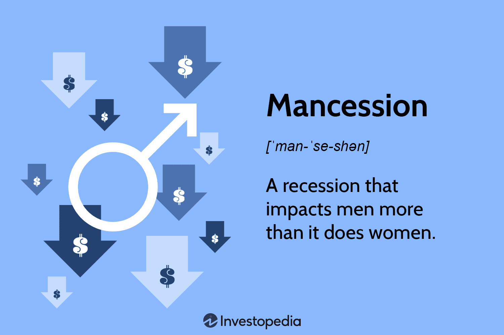

Economic recessions have long been a focal point for analyzing various socio-economic dynamics, notably the employment disparities between genders. Traditionally, these downturns have led to significant shifts in the labor market landscape, often disproportionately affecting different demographic groups. One such phenomenon is the 'mancession,' a term that captures recession-driven employment losses that predominantly affect men. This article examines the key elements of this phenomenon, including the industries most impacted and the statistics surrounding male unemployment in recession periods.

The concept of a mancession emerged prominently during the Great Recession of 2007-2009. During this time, sectors heavily populated by male workers, particularly manufacturing and construction, saw significant job losses. These industries are typically more volatile and sensitive to economic fluctuations, which explains their susceptibility during downturns. Consequently, recessions can intensify existing gender employment gaps, revealing critical vulnerabilities in labor market structures.



Exploring the disparities in gender employment during various economic downturns provides insights into underlying societal and economic structures. The observed trends show that men are more likely to be employed in cyclical industries that contract sharply during recessions. Conversely, women frequently occupy roles in more stable sectors like healthcare and education. This segmentation affects the severity of employment impacts across genders.

Moreover, the rise of algorithmic trading and advancements in financial technology present additional layers of complexity to employment trends. As automated systems increasingly influence market dynamics, traditional male-dominated sectors may face further instability. Understanding these interactions could highlight how technological progress might reshape employment landscapes during economic recessions.

This article will address these issues by exploring historical data, examining industry trends, and considering how technological innovation influences employment sectors. Recognizing these patterns is crucial for developing policy interventions and achieving economic resilience, ultimately fostering an equitable labor market for future generations.

## Table of Contents

## Understanding Mancession

The term 'mancession' emerged prominently during the Great Recession of 2007-2009 to describe a distinctive pattern where economic downturns disproportionately affect male employment relative to female employment. This phenomenon is primarily attributed to the structure of job losses in male-dominated industries such as manufacturing and construction, sectors that are particularly sensitive to economic cycles.

Historically, industries like manufacturing and construction have provided a substantial portion of employment for men. During recessions, demand for goods and new construction projects typically declines, leading to significant layoffs within these industries. This impact was evident during the Great Recession when the steep decline in manufacturing and construction activity resulted in pronounced job losses for men. According to data from the U.S. Bureau of Labor Statistics, men accounted for roughly 70% of the job losses during the Great Recession [1]. This disparity underscores the vulnerability of industries heavily staffed by men to cyclical economic contractions.

Additionally, statistical analysis reveals the substantial gender gap in employment during economic downturns. For instance, during the Great Recession, the unemployment rate for men peaked at 11.2%, compared to 8.8% for women [2]. This significant difference highlights the severity of 'mancession' and its impact on male workers, as these figures exceed the pre-recession unemployment rates markedly.

Moreover, the mancession phenomenon is further understood through quantitative evaluations of employment trends. Consider the following illustrative Python code to model job loss rates based on historical data:

```python
import numpy as np
import matplotlib.pyplot as plt

# Hypothetical data: Job loss rates during recession
male_job_loss_rate = [5.0, 7.2, 9.3, 11.2]  # Percentage points over four quarters
female_job_loss_rate = [4.0, 5.6, 6.7, 8.8]

quarters = ['Q1', 'Q2', 'Q3', 'Q4']

plt.plot(quarters, male_job_loss_rate, label='Men', marker='o')
plt.plot(quarters, female_job_loss_rate, label='Women', marker='x')
plt.title('Job Loss Rates During Recession by Gender')
plt.xlabel('Quarter')
plt.ylabel('Job Loss Rate (%)')
plt.legend()
plt.grid(True)
plt.show()
```

This code visually demonstrates how job loss rates for men consistently exceed those for women during the recessionary period, aligning with the concept of mancession.

In summary, the mancession highlights critical vulnerabilities in male-dominated industries during economic downturns. Understanding these trends through statistical data and analytical models such as the one demonstrated can guide policymakers and economists in crafting strategies to mitigate the adverse impacts on male employment sectors during future recessions.

References:
1. U.S. Bureau of Labor Statistics – Labor data analysis and report on job losses.
2. Economic Policy Institute – The Recession's impact on unemployment rates by gender.

## Economic Recession and Gender Employment Gap

Economic recessions have historically impacted employment sectors differently, often exacerbating gender disparities in the labor market. Statistical patterns demonstrate that men are more likely to be employed in industries such as manufacturing, construction, and finance, which tend to suffer significant downturns during economic recessions. In contrast, women are frequently employed in sectors like healthcare, education, and social services, which typically experience more stability during economic fluctuations. This sectoral division is pivotal in understanding the divergent impacts of recessions on male and female employment.

During the 2007-2009 Great Recession, a substantial number of job losses occurred in traditionally male-dominated sectors such as construction and manufacturing. For instance, by mid-2009, nearly three-quarters of job cuts in the United States were in industries where men comprised the majority of employees. Such industries are often characterized by higher [volatility](/wiki/volatility-trading-strategies) during economic downturns due to reduced investments and infrastructure projects, leading to heightened job insecurity for male workers.

Conversely, female-dominated sectors, such as healthcare and education, exhibited relative resilience. These fields are generally invariant to recessionary pressures due to their fundamental necessity in society and continued public funding, thus preserving employment for women. The healthcare industry, in particular, continued to expand during the Great Recession, driven by an aging population and increased demand for health services. 

Policy impacts also play a crucial role in shaping the gender employment gap during economic recessions. Government interventions, such as fiscal stimulus packages, can either alleviate or exacerbate these disparities. Policies targeted at infrastructure development often disproportionately benefit male-dominated sectors and can help buffer employment losses. On the other hand, cuts in public sector funding can adversely affect female-dominated fields like education and social services, potentially widening the gender employment gap.

Addressing these gender disparities calls for strategic policy frameworks and economic adaptations. Recognizing the tendency of certain sectors to be more recession-prone is essential for establishing supportive measures that cushion vulnerable segments of the workforce. Policymakers need to consider the differential impacts of sector-specific employment and devise comprehensive strategies that promote gender equity in employment opportunities, particularly during economic downturns.

## Shifts from Mancession to Shecession

The COVID-19 pandemic profoundly affected global labor markets, introducing new dynamics in gender employment disparities. The term "shecession" emerged to describe the particularly acute impact on women's employment during this period. Unlike typical recessions, where males traditionally suffer higher unemployment rates due to declines in male-dominated industries such as manufacturing and construction, the pandemic led to notable employment setbacks for women. This shift was largely attributable to the unique characteristics of the COVID-19 recession, which contrasted significantly with previous downturns in several ways.

First, the sector-specific impacts of the pandemic were distinct. Industries such as hospitality, retail, and personal services, which predominantly employ women, experienced massive shutdowns and demand collapses. For instance, in the United States, the leisure and hospitality sector alone shed nearly 8 million jobs in the early months of the pandemic, according to the U.S. Bureau of Labor Statistics. This was exacerbated by the closure of schools and childcare facilities, which intensified childcare responsibilities largely shouldered by women. As a result, many women were compelled to reduce work hours or [exit](/wiki/exit-strategy) the workforce entirely to manage household demands.

In traditional recessions, men's employment tends to be more adversely affected due to contractions in industries that are more cyclically sensitive. For example, the Great Recession of 2007–2009 hit sectors like construction and manufacturing heavily, both of which employ more males. This pattern underscored the "mancession" phenomenon, where male unemployment rates surged significantly compared to female rates.

Another significant [factor](/wiki/factor-investing) contributing to the shift from mancession to shecession during the pandemic was the capacity for occupations to adapt to telecommuting. Many roles in male-dominated fields were better suited for remote work, whereas numerous female-dominated roles required physical presence and face-to-face interactions. This disparity in telecommuting feasibility further entrenched gender discrepancies in employment impacts. Research by Jonathan Dingel and Brent Neiman at the University of Chicago found that jobs held by women were less likely to be performed remotely, contributing to the disproportionate job losses among women.

The interplay of industry vulnerability and telecommuting capabilities illustrates a critical shift in the gender employment gap under pandemic-induced conditions. The "shecession" phenomenon underscores the need for policy interventions and structural changes to support gender parity in employment, particularly in the face of crises that disrupt traditional labor market dynamics.

## The Role of Algorithmic Trading

Algorithmic trading has significantly transformed financial markets, impacting employment dynamics within numerous industries. As a subset of fintech, [algorithmic trading](/wiki/algorithmic-trading) utilizes complex algorithms to make fast-paced trading decisions, often outpacing human traders. This shift has substantial implications for employment, particularly in traditionally male-dominated sectors such as finance and technology.

Advancements in fintech have led to the increased adoption of algorithmic trading, resulting in a need for specialized skills in data analysis, programming, and [machine learning](/wiki/machine-learning). Consequently, there is a growing demand for professionals who can develop, manage, and maintain these sophisticated systems. This demand has created new job opportunities while simultaneously reducing the need for conventional trading roles, which have historically been dominated by men. The transition from manual to automated trading processes has caused a decline in traditional trading roles, potentially increasing unemployment in this sector for those unable to adapt to the new skill requirements.

The impact of algorithmic trading on job stability is twofold. On one hand, it offers opportunities for higher-skilled roles, contributing to job creation in fintech and related fields. On the other hand, it diminishes positions dependent on human judgment and manual processes. This duality may widen the employment gap among those unable to transition to these more technical roles. Industries traditionally dominated by men, such as stockbrokerage and trading floors, are significantly affected, highlighting the importance of reskilling and continuous education to mitigate job displacement effects.

Moreover, algorithmic trading influences the broader economic landscape by altering how markets react to various stimuli, potentially increasing market volatility. Rapid, data-driven decision-making can lead to flash crashes or sudden market shifts, which may affect economic sectors relying on market stability. These effects can exacerbate employment disparities, as industries sensitive to economic fluctuations may experience more frequent disruptions.

To better understand the influence of algorithmic trading on traditional sectors, consider the following Python code snippet illustrating a basic trading algorithm using moving averages:

```python
import numpy as np
import pandas as pd

# Example price data
prices = pd.Series([100, 101, 102, 98, 97, 99, 101, 102, 100, 98])

# Calculate moving averages
short_window = 3
long_window = 5
signals = pd.DataFrame(index=prices.index)
signals['price'] = prices
signals['short_mavg'] = prices.rolling(window=short_window, min_periods=1, center=False).mean()
signals['long_mavg'] = prices.rolling(window=long_window, min_periods=1, center=False).mean()

# Generate signals
signals['signal'] = 0.0
signals['signal'][short_window:] = np.where(signals['short_mavg'][short_window:] 
</= signals['long_mavg'][short_window:], 1.0, 0.0)

# Calculate positions
signals['positions'] = signals['signal'].diff()

print(signals)
```

This example illustrates the use of moving averages to determine when to buy or sell assets, showcasing how algorithmic trading strategies rely on predefined rules and data analysis. The increased focus on such quantitative methods underscores the necessity for skills in data science and algorithm development within the workforce.

In conclusion, algorithmic trading continues to reshape employment landscapes, demanding a shift in the skill sets of those involved in financial markets. Job stability and the employment gap are directly influenced by these technological advances, underscoring the need for workforce adaptation through education and reskilling initiatives. As industries evolve, understanding and anticipating the implications of algorithmic trading on employment will be crucial for maintaining economic resilience and ensuring balanced job opportunities across genders.

## Strategies to Mitigate Gender Employment Gaps

To address gender employment gaps during economic recessions, a multifaceted approach encompassing education, policy frameworks, and workforce development is essential.

**Education and Skill Development**: An essential strategy to mitigate gender employment disparities involves enhancing educational opportunities and skill development programs for both men and women. Career counseling and vocational training should prioritize fields with stable demand despite economic volatility, such as healthcare, information technology, and renewable energy. Encouraging women to pursue careers in Science, Technology, Engineering, and Mathematics (STEM) can also help balance the gender employment gap, as these sectors often display resilience in economic downturns (Bureau of Labor Statistics, 2021).

**Policy Frameworks**: Governments must craft policies aimed at equitable employment opportunities. Implementing gender-sensitive policies, such as paid parental leave and subsidized childcare services, can alleviate the burden on women and enable a more balanced workforce participation. Additionally, enforcing anti-discrimination laws and promoting inclusive workplaces are crucial steps.

**Workforce Development**: Workforce development programs should be inclusive and adaptable, focusing on reskilling and upskilling initiatives tailored to emerging market needs. Public and private partnerships can facilitate the creation of training programs aligned with industry demands, ensuring that both men and women can transition to sectors less affected by recessions.

**Leveraging Technology and Innovation**: Embracing technology is vital for creating equitable employment landscapes. Remote work opportunities enabled by digital technologies can bridge the gender employment gap by offering flexibility, especially beneficial for women managing childcare responsibilities. Developing platforms that match job seekers with remote opportunities can further enhance access to employment.

Moreover, technology-driven entrepreneurship provides an avenue for women to enter and thrive in new markets, supported by digital platforms for marketing and distribution. Initiatives that focus on women's access to digital tools and financial capital can foster business innovation and economic independence.

By addressing these key areas, strategies can effectively reduce gender disparities in employment during economic fluctuations, fostering a more resilient and inclusive workforce.

## Conclusion

Throughout the analysis of economic recessions and their impacts, the concept of "mancession" has been pivotal in understanding gender-specific employment dynamics. Key points highlighted include the disproportionate impact of job losses on men during traditional economic downturns, primarily due to the vulnerability of male-dominated industries such as manufacturing and construction. Historical data underscores the severity of this phenomenon, resulting in measurable gender employment gaps.

Comprehending these dynamics is crucial for effective policy-making aimed at enhancing economic resilience. Policies that acknowledge these patterns can better support those most affected during recessions and help mitigate the adverse effects on employment. For instance, targeted training programs and educational initiatives can reskill workers transitioning from declining industries, while also fostering more gender-equitable employment opportunities.

Looking toward the future, emerging technologies hold the potential to significantly alter gender employment landscapes. Developments in fields such as algorithmic trading and fintech could redefine job stability and availability in sectors traditionally dominated by men. These innovations offer the promise of expanded job roles that could balance employment opportunities across genders, provided that there is adequate access to training and skill development.

In conclusion, understanding the intricacies of economic recessions and their gendered effects remains vital as we navigate an evolving labor market. The need for responsive, informed policy-making is evident, ensuring that both men and women can effectively adapt to economic challenges and technological advancements.

## References & Further Reading

[1]: U.S. Bureau of Labor Statistics. ["The Recession's impact on unemployment rates by gender"](https://www.bls.gov/opub/mlr/2018/article/great-recession-great-recovery.htm)

[2]: Economic Policy Institute. ["The Great Recession's impact on unemployment rates by gender"](https://www.epi.org/research/great-recession/)

[3]: Dingel, J., & Neiman, B. (2020). ["How Many Jobs Can be Done at Home?"](https://www.nber.org/papers/w26948) National Bureau of Economic Research Working Paper No. 26948.

[4]: Lopez de Prado, M. (2018). ["Advances in Financial Machine Learning"](https://www.amazon.com/Advances-Financial-Machine-Learning-Marcos/dp/1119482089) John Wiley & Sons.

[5]: Aronson, D. (2011). ["Evidence-Based Technical Analysis: Applying the Scientific Method and Statistical Inference to Trading Signals"](https://www.amazon.com/Evidence-Based-Technical-Analysis-Scientific-Statistical/dp/0470008741) Wiley.

[6]: Chan, E. P. (2008). ["Quantitative Trading: How to Build Your Own Algorithmic Trading Business"](https://github.com/ftvision/quant_trading_echan_book) Wiley.

[7]: Jansen, S. (2018). ["Machine Learning for Algorithmic Trading"](https://github.com/stefan-jansen/machine-learning-for-trading) Packt Publishing.

[8]: Pew Research Center. ["Rise in women’s employment helps narrow the gender gap, but inequality persists"](https://www.pewresearch.org/topic/economy-work/business-workplace/gender-work/) 

[9]: Goldin, C. (2014). ["A Grand Gender Convergence: Its Last Chapter"](https://scholar.harvard.edu/files/goldin/files/goldin_aeapress_2014_1.pdf) Journal of Economic Perspectives, Volume 22, Number 4, Pages 115–144.