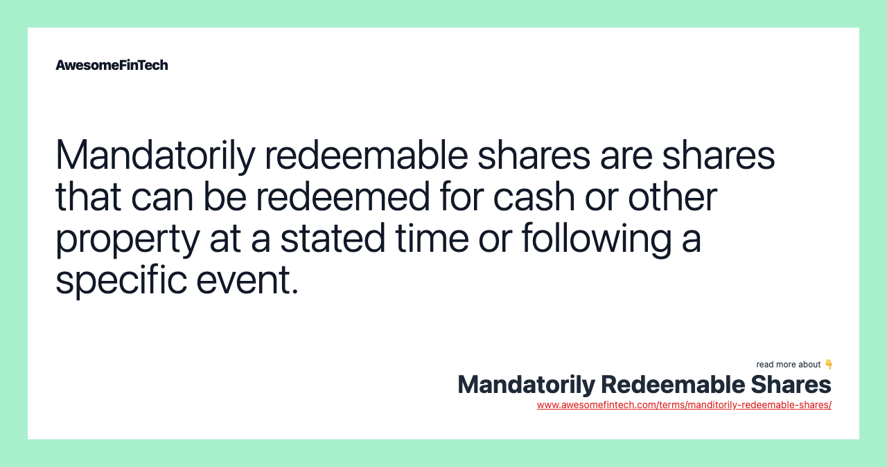

## Table of Contents

## What are mandatorily redeemable shares?

Mandatorily redeemable shares are a type of stock that a company is required to buy back from shareholders at a specific time or upon a certain event. These shares are different from regular stocks because the company has to take them back, not just because they might want to. This means that shareholders know they will get their money back at some point, which can make these shares attractive to some investors.

These shares are often used by companies that want to raise money but don't want to dilute their ownership permanently. For example, a company might issue mandatorily redeemable shares to get cash for a project, knowing they will have to pay back the investors later. This can be a good option for both the company and the investors, as long as everyone understands the terms and the company can afford to redeem the shares when the time comes.

## How do mandatorily redeemable shares differ from common stock?

Mandatorily redeemable shares and common stock are both types of shares that companies can issue, but they work differently. Common stock is the most basic type of stock. When you buy common stock, you become a part-owner of the company. You might get to vote on company decisions and you might get dividends if the company makes money. But, there's no guarantee that you'll get your money back. You can sell your shares to someone else if you want to get your money out, but the company doesn't have to buy them back from you.

On the other hand, mandatorily redeemable shares come with a promise. When you buy these shares, the company agrees to buy them back from you at a certain time or when something specific happens. This means you know you'll get your money back, as long as the company can afford it. Because of this promise, mandatorily redeemable shares can be more attractive to some investors, especially if they want a safer investment. But, these shares usually don't come with voting rights or dividends like common stock might.

## What are the typical terms and conditions associated with mandatorily redeemable shares?

The terms and conditions of mandatorily redeemable shares can vary, but they usually include a specific date or event when the company has to buy back the shares. This could be a certain number of years after the shares were issued, or it could be tied to something like the completion of a project or the company reaching a certain financial goal. The price at which the shares will be redeemed is also set in advance, so investors know how much they will get back. Sometimes, the redemption price might be the original purchase price plus some interest, or it might be based on the company's performance.

Another important term is what happens if the company can't afford to buy back the shares when the time comes. In some cases, the company might be able to delay the redemption or pay it back in installments. There might also be penalties or higher interest rates if the company is late with the redemption. It's also common for mandatorily redeemable shares to not come with voting rights, so shareholders don't get a say in how the company is run. And, while common stock might pay dividends, mandatorily redeemable shares usually don't, because the return for investors is the guaranteed redemption at the end.

## Why might a company issue mandatorily redeemable shares?

A company might issue mandatorily redeemable shares to raise money without permanently diluting its ownership. When a company issues regular stock, it gives away a piece of the company forever. But with mandatorily redeemable shares, the company can borrow money from investors and then pay them back later. This can be a good option if the company needs money for a project or to grow, but wants to keep control over the business in the long run.

Another reason is that these shares can attract investors who want a safer investment. Since the company promises to buy back the shares at a set time, it can be less risky than regular stock. This can make it easier for the company to get the money it needs. But, the company has to be sure it can afford to pay back the investors when the time comes, or it could get into financial trouble.

## What are the financial implications for a company issuing mandatorily redeemable shares?

When a company issues mandatorily redeemable shares, it gets money right away, which can be used for things like growing the business or starting new projects. But, the company also takes on a big responsibility because it has to pay back the investors at a set time in the future. This means the company needs to plan carefully to make sure it will have enough money to buy back the shares. If the company can't pay back the investors, it could face serious financial problems, like not being able to pay its bills or even going bankrupt.

Another thing to think about is that mandatorily redeemable shares usually don't come with voting rights, so the company doesn't have to share control with the investors. This can be good for the company's current owners who want to keep running the business their way. But, because these shares are less risky for investors, the company might have to offer a good redemption price or [interest rate](/wiki/interest-rate-trading-strategies) to make them attractive. This could mean the company ends up paying more in the long run than if it had used a different way to raise money.

## How are mandatorily redeemable shares accounted for on a company's balance sheet?

Mandatorily redeemable shares are usually shown on a company's balance sheet as a liability, not as part of the company's equity. This is because the company has to pay back the money to the shareholders at a certain time, so it's more like a debt than a part of the company's ownership. The amount shown on the balance sheet is the amount the company will have to pay back, which could be the original price of the shares plus any interest or other payments agreed upon.

This way of showing mandatorily redeemable shares on the balance sheet helps everyone see the company's financial situation more clearly. It shows that the company has a responsibility to pay back money in the future, which is important for investors and other people who look at the company's financial health. By treating these shares as a liability, the company makes sure it doesn't look like it has more money or less debt than it really does.

## What are the tax implications of mandatorily redeemable shares for both the issuer and the shareholder?

For the issuer of mandatorily redeemable shares, the tax implications can be a bit complicated. When the company issues these shares, it gets money right away, but it doesn't count as income for tax purposes because it's more like a loan. The company has to pay back the money later, so it's treated as a liability. When the company redeems the shares, it doesn't get a tax deduction for the payment, but it also doesn't have to pay taxes on the money it got when it issued the shares. The company needs to keep good records and follow the tax rules carefully to make sure it's doing everything right.

For shareholders, the tax implications depend on how they got the shares and how they're redeemed. If a shareholder buys the shares, the money they pay is not deductible for tax purposes. When the shares are redeemed, the shareholder might have to pay taxes on any profit they make. If the redemption price is more than what they paid for the shares, that extra amount could be taxed as a capital gain. If the shareholder gets the shares as part of their job, like a bonus, there could be different tax rules. They might have to pay income tax on the value of the shares when they get them, and then pay capital gains tax on any profit when the shares are redeemed. It's always a good idea for shareholders to talk to a tax professional to understand their specific situation.

## How do mandatorily redeemable shares affect a company's capital structure?

When a company issues mandatorily redeemable shares, it changes the way its money is organized. These shares are not like regular stock, where the money becomes part of the company's ownership forever. Instead, mandatorily redeemable shares are treated like a loan that the company has to pay back. So, they add to the company's debt, not its ownership. This means the company's balance sheet will show more liabilities, which can make it look like the company has more debt than it would if it had issued regular stock.

This change in the capital structure can have big effects on how the company is seen by investors and lenders. Because mandatorily redeemable shares are treated as a debt, they can make the company's financial situation look riskier. Lenders might be less willing to give the company more money if they see a lot of debt on the balance sheet. On the other hand, the company might like issuing these shares because it can get money without giving up control. But, the company needs to be careful to make sure it can pay back the money when the time comes, or it could get into financial trouble.

## What are the legal and regulatory considerations for issuing mandatorily redeemable shares?

When a company wants to issue mandatorily redeemable shares, it has to follow certain rules and laws. These rules can be different depending on where the company is located and what kind of business it does. For example, in the United States, the Securities and Exchange Commission (SEC) has rules about how companies can issue these shares. The company has to make sure it follows all the rules about telling investors what they're buying and how the shares will work. If the company doesn't follow these rules, it could get in trouble with the government or be sued by investors.

Another important thing to think about is how the company's own rules, like its bylaws or articles of incorporation, might affect issuing mandatorily redeemable shares. Sometimes, these rules say what kinds of shares the company can issue and how it has to treat shareholders. The company also needs to think about any contracts it has with banks or other lenders, because these contracts might say the company can't take on more debt, which is what mandatorily redeemable shares are considered. If the company doesn't follow its own rules or its contracts, it could face legal problems or have to pay money to fix things.

## How do mandatorily redeemable shares impact shareholder rights and corporate governance?

Mandatorily redeemable shares usually don't come with voting rights, which means shareholders who own these shares don't get to vote on important company decisions. This can be good for the company because it keeps more control in the hands of the people who own the regular stock. But, it can be bad for the shareholders of mandatorily redeemable shares because they don't have a say in how the company is run, even though they've given the company money.

Because these shares are treated as a debt that the company has to pay back, they can affect how the company is managed. The company has to make sure it has enough money to buy back the shares when the time comes, which can change how it makes decisions about spending and saving. If the company can't pay back the money, it could have big problems, so the board of directors and the managers have to be careful and plan ahead to make sure the company stays financially healthy.

## What are the risks associated with investing in mandatorily redeemable shares?

Investing in mandatorily redeemable shares can be risky. One big risk is that the company might not have enough money to buy back the shares when it's supposed to. If that happens, the company might delay paying you back, or it might have to pay you back in smaller amounts over time. In the worst case, if the company goes bankrupt, you might not get all your money back. This means you need to think carefully about whether the company can really afford to pay you back before you invest.

Another risk is that mandatorily redeemable shares usually don't come with voting rights. This means you don't get to vote on important company decisions, even though you've given the company your money. If the company makes bad decisions, you can't do anything about it. Also, these shares usually don't pay dividends, so the only way you get a return on your investment is if the company buys back the shares at a higher price than you paid. If the redemption price isn't good enough, you might not make as much money as you hoped.

## How do mandatorily redeemable shares fit into advanced financial strategies and portfolio management?

Mandatorily redeemable shares can be a useful tool in advanced financial strategies and portfolio management because they offer a mix of safety and potential returns. Investors who want a safer investment might like these shares because the company promises to buy them back at a set time. This can be good for people who want to know they'll get their money back, as long as the company can afford it. Portfolio managers might use these shares to balance out riskier investments, like regular stocks or bonds, to make the whole portfolio less risky. They can also help investors plan for the future because they know when the shares will be redeemed and how much they'll get back.

However, using mandatorily redeemable shares in a portfolio also means thinking about the risks. If the company can't pay back the money when it's supposed to, the investor might lose money. This means that portfolio managers need to be careful about which companies they choose to invest in. They need to look at the company's financial health and make sure it can afford to redeem the shares. Also, since these shares usually don't come with voting rights or dividends, the return on the investment depends on the redemption price being good enough. So, these shares can be a good part of a financial strategy, but they need to be used carefully and with a good understanding of the risks involved.

## References & Further Reading

[1]: Bergstra, J., Bardenet, R., Bengio, Y., & Kégl, B. (2011). ["Algorithms for Hyper-Parameter Optimization."](https://dl.acm.org/doi/10.5555/2986459.2986743) Advances in Neural Information Processing Systems 24.

[2]: ["Advances in Financial Machine Learning"](https://www.amazon.com/Advances-Financial-Machine-Learning-Marcos/dp/1119482089) by Marcos Lopez de Prado

[3]: ["Evidence-Based Technical Analysis: Applying the Scientific Method and Statistical Inference to Trading Signals"](https://www.amazon.com/Evidence-Based-Technical-Analysis-Scientific-Statistical/dp/0470008741) by David Aronson

[4]: ["Machine Learning for Algorithmic Trading"](https://github.com/stefan-jansen/machine-learning-for-trading) by Stefan Jansen

[5]: ["Quantitative Trading: How to Build Your Own Algorithmic Trading Business"](https://www.amazon.com/Quantitative-Trading-Build-Algorithmic-Business/dp/1119800064) by Ernest P. Chan