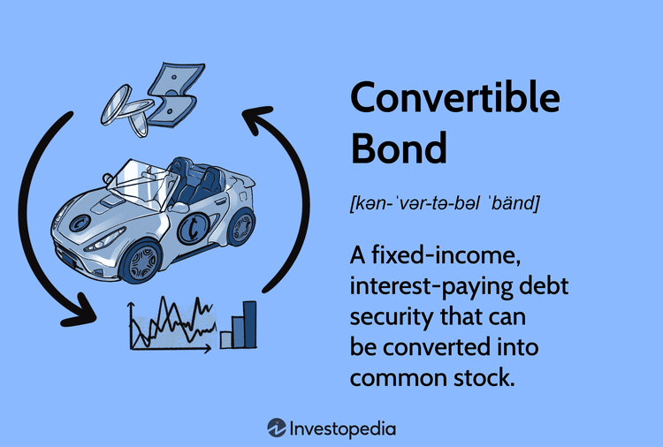

Convertible bonds are financial instruments that serve as a hybrid between debt and equity, offering unique benefits for both issuers and investors. They grant the bondholder the option to convert the bond into a predetermined number of shares of the issuing company's stock, thus allowing investors to benefit from fixed income during the bond's tenure while also participating in the company's equity upside. This duality imbues convertible bonds with significant strategic importance in financial markets, as they can be an effective tool for managing a company's capital structure and investor portfolio diversification.

Mandatory convertible bonds, a specific type of convertible bond, come with a compulsory conversion feature, meaning they automatically convert into equity at a set date. This characteristic differentiates them from traditional convertible bonds where conversion is at the discretion of the bondholder. The compulsory conversion can help companies manage equity dilution in a more predictable manner, while often offering higher yields to compensate investors for the mandatory transition from debt to equity.



Algorithmic trading plays a crucial role in the modern trading ecosystem of convertible bonds. By utilizing complex algorithms and high-speed computational power, it enhances market efficiency, ensuring better pricing accuracy and increased liquidity. Algorithms can quickly analyze vast datasets, identify trading opportunities, and execute trades with minimal human intervention, making the market for convertible bonds more robust and attractive to both institutional and individual investors.

Despite the advantages, trading convertible bonds pose several challenges. The complexity of the instruments themselves, along with that introduced by algorithmic systems, requires a deep understanding of not only financial markets but also sophisticated trading technology. Risks such as interest rate fluctuations, stock performance dependency, and execution errors in algorithmic trading need careful management.

This article will cover various aspects of convertible bonds, exploring their hybrid nature, the unique features of mandatory convertible bonds, the impact of algorithmic trading, and strategic considerations within corporate finance and investor perspectives. It will also touch upon the evolving roles and strategies of algorithmic trading in optimizing the trade and use of convertible bonds in financial markets.

## Table of Contents

## Understanding Convertible Bonds

Convertible bonds are financial instruments that embody a hybrid nature, combining features of both equity and debt. These securities allow holders the flexibility to convert their holdings into a predetermined number of shares of the issuing company's stock. This conversion option provides bondholders with the potential to participate in the equity appreciation of the issuing company while also benefiting from the fixed income characteristic typical of bonds.

When a company issues a convertible bond, it agrees to pay regular interest to the bondholders until the bond's maturity. Investors have the right, but not the obligation, to convert their bonds into equity at stipulated times during the bond's life or upon maturity, depending on the terms set at issuance. The conversion ratio, which specifies the number of shares per bond, and conversion price are predetermined, influencing the decision to convert based on market conditions.

For companies, issuing convertible bonds can be advantageous for several reasons. Primarily, they present a cost-effective method of raising capital. Convertibles usually offer lower interest rates compared to traditional bonds, as investors value the conversion feature. Additionally, issuing convertibles can serve as a strategy to defer equity dilution. By offering conversion options, companies can postpone the increase in outstanding shares to a future date, often beyond a period when the market perceives the company more positively.

Investors also find convertible bonds appealing due to their dual benefits. From a fixed income perspective, convertibles provide a regular income stream, reducing the downside risk inherent in equity investment. Furthermore, if the issuing company's stock performs well, bondholders can capitalize on potential gains through conversion into equity. This provides a blend of income stability and capital appreciation potential, making convertible bonds suitable for diversification strategies.

The accompanying code snippet demonstrates how to calculate the conversion value of a convertible bond given certain parameters:

```python
# Parameters
face_value = 1000  # Face value of the bond
conversion_ratio = 10  # Number of shares per bond
current_stock_price = 120  # Current price of the company's stock

# Conversion value calculation
conversion_value = conversion_ratio * current_stock_price

print(f"The conversion value of the bond is: ${conversion_value}")
```

In summary, convertible bonds provide a flexible financing alternative for companies and a versatile investment vehicle for investors. By embracing their hybrid characteristics, both parties can achieve strategic financial goals while managing risk and capitalizing on potential market opportunities.

## Mandatory Convertible Bonds: Features and Implications

Mandatory convertible bonds (MCBs) are a unique type of financial instrument characterized by their requirement that they be converted into equity at a predetermined date or upon the occurrence of certain events. Unlike traditional convertible bonds, where conversion is optional and typically at the discretion of the bondholder, mandatory convertibles stipulate a compulsory conversion into the issuer's equity. This fundamental difference influences both the structure and strategic usage of these securities.

### Comparison with Traditional Convertible Bonds

Traditional convertible bonds provide investors with the option, but not the obligation, to convert their bonds into a specified number of shares of the issuing company's stock. This option is often contingent on the stock price reaching a certain level, which can provide investors with the flexibility to benefit from favorable market conditions. In contrast, mandatory convertible bonds eliminate this optionality by enforcing a conversion at maturity, regardless of the market conditions. As a result, mandatory convertibles often [carry](/wiki/carry-trading) higher yields compared to their traditional counterparts as compensation for the lack of optionality provided to investors.

### Strategic Use in Managing Equity Dilution

From a corporate finance perspective, mandatory convertible bonds serve as an effective tool for companies seeking to manage equity dilution strategically. By issuing MCBs, companies can defer dilution until a predetermined date, allowing them to raise capital without immediately increasing the share count. This can be particularly beneficial when a company anticipates future stock price appreciation or when it seeks to improve its financial metrics, such as earnings per share (EPS), in the short term.

Moreover, MCBs can be structured to include varying thresholds for the conversion rate based on the company's share price performance, offering a degree of flexibility in managing the timing and extent of equity dilution. Companies may also use MCBs to signal confidence in their future growth prospects, as the issuance of such instruments implies an expectation of favorable stock performance at the time of conversion.

### Yield Benefits for Investors

Investors in mandatory convertible bonds typically benefit from higher yields compared to traditional convertible bonds. This is primarily due to the certainty of conversion, which removes the upside potential associated with high stock performance. To compensate for this reduced potential upside, issuers offer higher yields, making MCBs attractive to investors seeking fixed-income securities with a future equity component.

Additionally, the mandatory conversion feature can provide investors with a form of downside protection. If the issuer's stock performs poorly, the conversion price is often set such that investors receive a number of shares with a value closer to the bond's par value, mitigating potential losses compared to outright equity investment.

### Conclusion

In summary, mandatory convertible bonds are a distinct class of convertible securities with inherent characteristics that differentiate them from traditional convertible bonds. They provide a strategic advantage for companies in managing capital structures and offer investors compelling yield benefits, balanced by the certainty of eventual equity conversion. These instruments continue to play a vital role in modern corporate finance, appealing to both issuers and investors alike.

## The Impact of Algorithmic Trading on Convertible Bonds

Algorithmic trading has fundamentally transformed the landscape of convertible bond markets by enhancing both efficiency and effectiveness. Convertible bonds, which blend features of both debt and equity, present unique trading opportunities through their hybrid nature. Algorithmic trading leverages computational power to optimize these opportunities by improving pricing accuracy and [liquidity](/wiki/liquidity-risk-premium).

Algorithmic trading systems utilize complex algorithms and vast data sets to process market information faster and more accurately than traditional methods. This leads to tighter bid-ask spreads and reduced transaction costs, which in turn enhances market liquidity. For instance, by rapidly analyzing price discrepancies and executing trades, algorithms can ensure that the convertible bond prices reflect real-time market conditions, thereby improving pricing accuracy.

However, the implementation of [algorithmic trading](/wiki/algorithmic-trading) introduces several complexities. Markets can exhibit subtle but crucial anomalies that require sophisticated models to interpret correctly. One common challenge is dealing with the optionality embedded in convertible bonds, such as call and conversion features. Algorithms must be able to handle these complexities by accurately modeling their effects on bond pricing and risk management.

Navigating these complexities necessitates a deep understanding of both financial instruments and computational techniques. Traders must employ advanced strategies, such as the use of [machine learning](/wiki/machine-learning) models, to predict market movements and optimize trading outcomes. This involves rigorous testing and validation of models to maintain accuracy in dynamic market conditions.

One practical example of algorithmic trading enhancing convertible bond markets is through the execution of convertible [arbitrage](/wiki/arbitrage) strategies. These strategies involve buying a convertible bond and simultaneously shorting the underlying stock to exploit pricing inefficiencies. Algorithms can manage this complex strategy by continuously monitoring the delta (the sensitivity of the bond’s price to changes in the stock’s price) and adjusting the stock position accordingly in a process known as delta-neutral positioning.

Consider the Python code snippet for calculating the delta and adjusting a portfolio:

```python
def calculate_delta(convertible_bond, stock_price, volatility, interest_rate, time_to_maturity):
    # Use a financial model to calculate delta
    delta = financial_model.calculate_delta(
        stock_price, volatility, interest_rate, time_to_maturity
    )
    return delta

def adjust_portfolio(delta, bond_position, stock_position):
    # Adjust stock position to maintain delta-neutral
    adjusted_stock_position = bond_position * delta
    stock_position += adjusted_stock_position
    return stock_position
```

While algorithmic trading offers significant advantages in terms of efficiency and accuracy, it also demands careful risk management. Traders must establish comprehensive risk frameworks to monitor exposure and ensure that algorithms operate within predefined risk parameters. This might include implementing stop-loss algorithms and using historical data analysis to forecast and mitigate potential losses.

Overall, algorithmic trading facilitates more efficient and accurate trading of convertible bonds, offering both liquidity improvements and cost efficiencies. The successful integration of these systems rests on employing advanced technologies and robust risk management practices to navigate the associated complexities.

## Convertible Bonds in Corporate Finance: Pros and Cons

Convertible bonds are unique financial instruments that offer a blend of debt and equity features, providing strategic advantages for both issuers and investors. Issuing convertible bonds allows companies to optimize their cost of capital. By providing a lower [interest rate](/wiki/interest-rate-trading-strategies) than traditional debt due to the conversion feature, companies can reduce immediate interest expenses. This feature can delay equity dilution, as conversion into equity typically occurs at a later stage when the bond holder opts to convert bonds into shares. Therefore, companies can leverage this time to enhance their business operations without impacting their existing shareholders' equity immediately.

However, the use of convertible bonds comes with potential downsides. One primary concern is the potential equity dilution upon conversion. When bondholders convert their bonds into shares, the total number of outstanding shares increases, thereby reducing existing shareholders' ownership percentages. This can be particularly concerning for companies with a large [volume](/wiki/volume-trading-strategy) of convertible bonds, leading to significant dilution. Additionally, market perception challenges can arise due to the hybrid nature of these instruments. Investors may perceive a company's reliance on convertible bonds as an indicator of financial distress or as a signal of anticipated stock price instability, affecting the company's stock market performance.

For companies contemplating the issuance of convertible bonds, several strategic considerations are paramount. They need to evaluate their current capital structure and future funding needs carefully. It's crucial to determine whether convertible bonds align with their long-term strategic goals. The company must also monitor market conditions and interest rates, as these factors significantly impact the attractiveness of convertible bonds compared to other financing options. Engaging in comprehensive financial modeling can forecast potential dilution effects and assess the cost-benefit implications over time. Lastly, transparent communication with investors regarding the rationale behind issuing convertible bonds can help alleviate market perception concerns and enhance investor confidence.

## Investor Perspective: Benefits and Risks of Convertible Bonds

Convertible bonds represent a unique investment vehicle, blending features of both equity and debt instruments, which can be advantageous from an investor's standpoint. 

### Advantages for Investors

Convertible bonds offer several benefits, primarily due to their hybrid nature, which allows for diversification and downside protection:

1. **Diversification**: These securities provide a diversified investment approach, as they carry characteristics of both fixed income and equity markets. This dual nature enables investors to balance portfolio risk by potentially benefiting from fixed interest payments while still having the ability to convert the bonds into equity if the issuing company's stock performs well.

2. **Downside Protection**: One of the key appeals of convertible bonds is their ability to offer downside protection. In cases where the issuer’s stock price declines, the bond aspect ensures that investors receive periodic coupon payments and the principal commitment at maturity, unlike direct equity investments, where returns solely depend on stock performance.

### Risks Associated with Convertible Bonds

Despite these advantages, convertible bonds also pose certain risks that investors should consider:

1. **Stock Performance Dependency**: The potential for converting bonds into equity ties the instrument's success to the issuer’s stock performance. If the stock price does not exceed the conversion price, the bond's potential upside is limited, and investors might not realize the potential equity-associated gains. 

2. **Interest Rate Fluctuations**: Like other fixed-income instruments, convertible bonds are susceptible to interest rate risks. An increase in market interest rates makes existing bonds less attractive due to their lower fixed coupon rates, which could result in a drop in bond prices.

### Evaluating Convertible Bonds

To assess convertible bonds as a viable investment option, investors should consider several factors:

- **Credit Quality**: Evaluate the issuer’s creditworthiness to gauge the risk of default, as this will influence the bond's perceived safety and yield.

- **Conversion Premium**: Analyze the premium over the current stock price to determine potential gains from conversion. A lower premium might indicate a better opportunity for capital appreciation if the stock improves.

- **Yield Comparison**: Compare the yield on convertible bonds with other fixed-income securities of similar credit quality to identify whether the additional conversion option justifies potentially lower yields.

- **Market Conditions**: Consider the prevailing economic environment, as rising interest rates or a bearish equity market can impact the returns from convertible bonds adversely.

Investors aiming to include convertible bonds in their portfolio should weigh these advantages and risks carefully. Effective analysis requires balancing the security’s income potential against its exposure to stock price movements and interest rate changes. By comprehending these dynamics, investors can make informed decisions that align with their broader financial goals.

## Algorithmic Trading Strategies for Convertible Bonds

Algorithmic trading has become a cornerstone of modern financial markets, effectively transforming how convertible bonds are traded. By leveraging the power of algorithms, traders can execute complex strategies with increased precision and efficiency, thereby optimizing returns and mitigating risks.

**Role of Algorithms in Executing Complex Strategies**

The central role of algorithms in the trading of convertible bonds lies in their ability to process vast amounts of data rapidly and execute trades at optimal times. Algorithms can automatically adjust positions based on real-time market conditions, adhering to predefined parameters that align with the trader's strategic objectives. This mechanization reduces human error, enhances transaction speed, and improves pricing accuracy.

**Convertible Arbitrage Strategy**

Convertible arbitrage is a popular strategy that involves simultaneously holding a long position in a company's convertible bonds and a short position in its underlying stock. The goal here is to exploit pricing inefficiencies between the convertible bond and the stock, capturing the mispricing when the market corrects. This strategy is complex and sensitive to factors such as interest rates, stock [volatility](/wiki/volatility-trading-strategies), and credit risk, making algorithmic execution advantageous.

Python Strategy Example:
```python
import numpy as np
import pandas as pd
from scipy.stats import norm

# Example parameters
stock_price = 100  # Current stock price
conversion_ratio = 10  # Conversion ratio from bond to shares
bond_price = 1200  # Current bond price
risk_free_rate = 0.01  # Risk-free interest rate, annualized

# Calculate the conversion value
conversion_value = stock_price * conversion_ratio

# Define a simple arbitrage signal: if conversion value > bond price, it's a buy signal
if conversion_value > bond_price:
    print("Buy Signal for Convertible Bond Arbitrage")
else:
    print("No Arbitrage Opportunity")
```

**Delta-Neutral Positioning**

Delta-neutral positioning involves managing a portfolio such that its overall delta is zero, or neutral, to minimize the impact of small price movements in the underlying asset. This strategy uses options and various derivatives alongside the convertible bonds to hedge against market movements. Algorithms systematically rebalance the portfolio, buying and selling assets to maintain neutrality despite continuous market fluctuations.

**Risk Management and Technical Proficiency**

Effective algorithmic trading demands a robust risk management framework and deep technical proficiency. Risk management strategies involve setting stop-loss limits, stress testing algorithms under various market conditions, and continuously monitoring systems to ensure they function correctly. Technical proficiency is crucial as traders must develop, test, and optimize complex algorithms that communicate seamlessly with electronic trading platforms.

In conclusion, by employing algorithmic trading strategies such as convertible arbitrage and delta-neutral positioning, traders can better exploit market inefficiencies and manage risks in the convertible bond markets. The success of these strategies hinges not only on their design but also on the rigor of the risk management practices and the technical skills of the trading personnel.

## Conclusion

Convertible bonds represent a strategic financial instrument that blend attributes of both debt and equity, offering unique advantages and challenges for issuers and investors alike. Their hybrid nature allows companies to manage capital costs effectively while providing investors with opportunities for fixed income and potential equity participation. A central feature is the conversion option, which affords investors the right, or sometimes the obligation in the case of mandatory convertibles, to convert bonds into equity shares. This dual characteristic can optimize a company’s capital structure and delay equity dilution, proving advantageous in various corporate finance scenarios.

The evolution of algorithmic trading has significantly enhanced the trading of convertible bonds, improving market efficiency, pricing accuracy, and liquidity. Algorithmic strategies facilitate complex trades like convertible arbitrage, where traders capitalize on pricing inefficiencies. These strategies thus allow traders to navigate the complexities of convertible bonds with greater precision and reduced costs, emphasizing the importance of technical proficiency and robust risk management.

Moreover, convertible bonds are strategically advantageous for investors seeking diversification and downside protection. However, they come with inherent risks such as interest rate sensitivities and dependency on stock performance post-conversion. Investors must therefore conduct thorough evaluations to balance potential returns against risks in their portfolios.

Overall, the financial landscape continues to evolve, with convertible bonds playing an increasingly strategic role due to their flexibility and potential benefits. As market dynamics shift and technology advances, understanding and leveraging algorithmic trading techniques become crucial to optimize financial strategies. These evolutions suggest promising opportunities for innovation in trading technologies and financial instruments, making convertible bonds a vital component of the modern financial ecosystem.

## References & Further Reading

### Articles and Online Resources

1. **Investopedia: Convertible Bond** - An introductory article explaining the basics of convertible bonds, their benefits, and risks. Available at: [Investopedia](https://www.investopedia.com/terms/c/convertiblebond.asp).

2. **Nasdaq: Understanding Mandatory Convertible Bonds** - This article provides insights into the unique features of mandatory convertible bonds and their strategic uses. Visit: [Nasdaq](https://www.nasdaq.com/articles/understanding-mandatory-convertible-bonds).

3. **Bloomberg: The Role of Algorithms in Bond Trading** - An analysis of how algorithmic trading is revolutionizing bond markets, enhancing efficiency and liquidity. Read more at: [Bloomberg](https://www.bloomberg.com/markets).

4. **MarketWatch: Pros and Cons of Convertible Bonds** - A detailed exploration of the benefits and drawbacks of issuing and investing in convertible bonds. Access the article at: [MarketWatch](https://www.marketwatch.com/story/the-pros-and-cons-of-convertible-bonds).

### Books

1. **"Convertible Securities: A Guide for Investment and Risk Management" by Tracy V. Maitland and Michael T. Maloney** - This book offers comprehensive coverage of convertible securities, including investment strategies and risk management considerations.

2. **"The Handbook of Convertible Bonds: Pricing, Strategies and Risk Management" by Jan De Spiegeleer and Wim Schoutens** - A detailed guide on the pricing, strategies, and risk management of convertible bonds, combining theoretical and practical aspects for practitioners.

### Research Papers

1. **"$\textit{Algorithmic Trading and Computational Finance}$" by Carol Alexander and Douglas Cumming** - This research paper discusses the impact and methodologies of algorithmic trading in financial markets, emphasizing its role in bond markets.

2. **"Convertible Bonds and Stock Price Volatility" by L.G. Ding and S.G. Choi** - This paper explores the relationship between convertible bonds and stock price volatility, providing valuable insights for both issuers and investors.

### Further Exploration

For those interested in a deeper understanding of the connection between financial markets and technology, the following additional resources are recommended:

- **"Quantitative Finance" Journal** - A publication offering research on mathematical finance, including studies on convertible bonds and algorithmic trading strategies.

- **Coursera: Financial Markets by Yale University** - An online course providing a strong foundation in financial markets and instruments, including bonds and technological advancements in trading. Available at [Coursera](https://www.coursera.org/learn/financial-markets-global).

Examine these resources to gain more knowledge about the dynamics of convertible bonds and the technological advancements shaping modern financial strategies.

