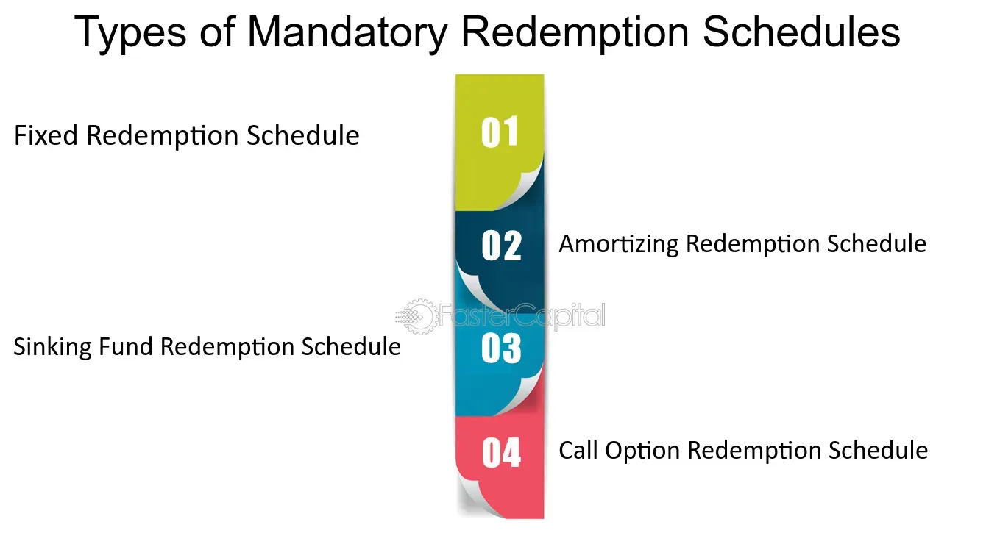

## Table of Contents

## What is a mandatory redemption schedule?

A mandatory redemption schedule is a plan that a company must follow to buy back its own shares or bonds at certain times. This schedule is usually set when the shares or bonds are first issued. It tells the company when and how much of the shares or bonds it needs to buy back. This is important because it helps investors know when they will get their money back.

These schedules are often used for preferred shares or bonds. For example, a company might have to buy back 10% of its preferred shares every year. This gives investors a clear idea of when they can expect to get their investment back. It also helps the company plan its finances because it knows when it will need to have money available to buy back the shares or bonds.

## Why is a mandatory redemption schedule important in finance?

A mandatory redemption schedule is important in finance because it helps both the company and the investors. For the company, it provides a clear plan of when it needs to buy back its shares or bonds. This helps the company manage its money better because it knows exactly when it will need to have money ready to pay back investors. It also helps the company plan for the future and make sure it has enough money to meet these obligations.

For investors, a mandatory redemption schedule is important because it tells them when they will get their money back. This is really helpful because it gives investors a clear idea of when they can expect to see a return on their investment. Knowing this schedule can help investors decide if they want to invest in a company's shares or bonds, and it can also help them plan their own finances.

## How does a mandatory redemption schedule work?

A mandatory redemption schedule is a plan that a company has to follow to buy back its shares or bonds at certain times. When the company first issues these shares or bonds, they set up this schedule. It tells the company exactly when and how much of the shares or bonds it needs to buy back. For example, a company might have to buy back 5% of its bonds every year for the next 20 years.

This schedule is important for both the company and the investors. For the company, it helps them plan their money because they know when they will need to have money ready to buy back the shares or bonds. It helps them manage their finances and make sure they can meet these obligations. For investors, the schedule is important because it tells them when they will get their money back. This helps them decide if they want to invest and plan their own finances.

## What types of securities typically have a mandatory redemption schedule?

Securities that often have a mandatory redemption schedule are preferred shares and certain types of bonds. Preferred shares are a type of stock that pays a fixed dividend before any dividends are paid to common shareholders. Because of this, companies might set up a schedule to buy back these shares at specific times. This helps the company plan its finances and gives investors a clear idea of when they will get their money back.

Bonds are another type of security that can have a mandatory redemption schedule. These are loans that investors make to a company, and the company agrees to pay back the money with interest over time. Some bonds, like callable bonds, have a schedule that says when the company can or must buy back the bonds. This helps both the company and the investors know when the bonds will be paid off.

In both cases, the mandatory redemption schedule helps everyone involved plan better. The company knows when it needs to have money ready to buy back the securities, and investors know when they can expect to get their money back. This makes the whole process more predictable and helps build trust between the company and its investors.

## Can you explain the difference between mandatory and optional redemption?

Mandatory redemption means a company has to buy back its shares or bonds at certain times. This schedule is set when the shares or bonds are first sold. It tells the company exactly when and how much it needs to buy back. This helps the company plan its money and makes sure investors know when they will get their money back. For example, a company might have to buy back 10% of its bonds every year.

Optional redemption, on the other hand, means a company can choose when to buy back its shares or bonds. The company is not forced to do it at specific times. Instead, it can decide when it wants to buy back the securities, if it wants to at all. This gives the company more flexibility. For example, a company might choose to buy back some of its shares if it has extra money and thinks it's a good time to do so.

Both types of redemption help companies manage their finances and give investors information about their investments. Mandatory redemption is more predictable because everyone knows the schedule. Optional redemption gives the company more control over when it buys back its securities.

## How is the redemption price determined in a mandatory redemption schedule?

The redemption price in a mandatory redemption schedule is usually set when the shares or bonds are first sold. This price can be a fixed amount, which means it stays the same no matter when the redemption happens. For example, if a bond has a redemption price of $1,000, the company will pay $1,000 to buy it back at each redemption date. Sometimes, the price can also be set as a formula that changes over time. This could be based on things like interest rates or the company's performance.

In some cases, the redemption price might include a premium or a discount. A premium means the company pays more than the original price to buy back the security. This can happen if the security is doing well or if the company wants to encourage investors to buy it. A discount means the company pays less than the original price. This might happen if the security is not doing well or if the company wants to save money. The exact details of how the redemption price is calculated are usually explained in the terms of the security when it is first sold.

## What are the implications of a mandatory redemption schedule for investors?

A mandatory redemption schedule is important for investors because it tells them when they will get their money back. This helps them plan their own money better. If an investor knows that a company will buy back some of its bonds every year, they can decide if they want to invest in those bonds. It also helps them know when they can use that money for other things, like buying a house or saving for retirement. Knowing when the money will come back makes investing less risky and more predictable.

But, there are also some things investors need to think about. If a company has to buy back a lot of its shares or bonds, it might not have as much money left for other things, like growing the business or paying dividends. This could affect how well the company does in the future. Also, if the redemption price is less than what the investor paid for the security, they might lose money. So, investors need to look at the whole picture and understand how the mandatory redemption schedule might affect their investment.

## How can issuers benefit from implementing a mandatory redemption schedule?

Issuers can benefit from a mandatory redemption schedule because it helps them plan their money better. When they know exactly when they need to buy back their shares or bonds, they can make sure they have enough money at those times. This can help them avoid financial problems and make sure they can meet their promises to investors. It also helps them manage their cash flow, which means they can use their money more effectively for other things like growing the business or paying off other debts.

Another benefit for issuers is that a mandatory redemption schedule can make their securities more attractive to investors. When investors know when they will get their money back, they might be more likely to buy the shares or bonds. This can help the issuer raise money more easily. Plus, having a clear schedule can build trust with investors, which is good for the company's reputation and can make it easier to get money in the future.

## What are the potential risks associated with a mandatory redemption schedule?

A mandatory redemption schedule can be risky for a company because it has to buy back its shares or bonds at certain times, no matter what. If the company is not doing well and doesn't have enough money, it might struggle to pay back investors. This could lead to financial problems or even bankruptcy. The company might have to use money it needs for other important things, like growing the business or paying its bills, to meet the redemption schedule.

For investors, there are also risks. If the redemption price is lower than what they paid for the shares or bonds, they might lose money. Also, if the company is having financial problems, it might not be able to pay back the investors at all. This can make the investment less safe. Investors need to think carefully about these risks before deciding to invest in securities with a mandatory redemption schedule.

## How do regulatory requirements affect mandatory redemption schedules?

Regulatory requirements can change how a company sets up its mandatory redemption schedule. Different countries and financial authorities have rules about when and how companies can buy back their shares or bonds. These rules might say that a company needs to have enough money to cover the redemption or that it has to tell investors about the schedule in a certain way. If a company doesn't follow these rules, it could get in trouble with the regulators, which might lead to fines or other problems.

These regulations are important because they help protect investors and make sure the financial market works fairly. For example, a rule might say that a company can't buy back its shares too quickly, because that could hurt the value of the shares that are still out there. By following these rules, companies can make sure they are doing things the right way and that investors know what to expect. This can help build trust and make the investment process safer for everyone involved.

## What strategies can investors use to manage investments with a mandatory redemption schedule?

Investors can manage investments with a mandatory redemption schedule by looking closely at when the company will buy back its shares or bonds. They need to know the dates and how much money they will get back. This helps them plan their own money better. For example, if an investor knows they will get some money back every year, they can use that money to pay for things like a new car or a vacation. They should also think about how much they paid for the shares or bonds and compare it to the redemption price to see if they will make money or lose money.

Another strategy is to keep an eye on the company's financial health. If the company is doing well and has enough money, it's more likely to meet its redemption schedule. But if the company is struggling, it might not be able to buy back the shares or bonds on time. Investors should also read the terms of the security carefully to understand any rules or conditions that might affect their investment. By staying informed and planning ahead, investors can make smarter choices and manage their investments better.

## How do changes in market conditions impact the effectiveness of a mandatory redemption schedule?

Changes in market conditions can make a mandatory redemption schedule harder or easier for a company to follow. If the market is doing well and the company is making a lot of money, it will be easier for the company to buy back its shares or bonds on time. But if the market goes down and the company is not making as much money, it might struggle to find the money it needs to meet its redemption schedule. This can cause problems for the company and make investors worried about getting their money back.

Investors also need to pay attention to market conditions because they can affect how much money they will get back. If interest rates go up, the value of the shares or bonds might go down, and the redemption price might not be as good as it was before. On the other hand, if the market is doing well, the redemption price might be better than expected. Investors should always keep an eye on the market and be ready to change their plans if things change.

## References & Further Reading

[1]: ["Fixed Income Analysis"](https://en.wikipedia.org/wiki/Fixed_income_analysis) by Barbara S. Petitt and Jerald E. Pinto

[2]: Fabozzi, F. J. (2012). ["Bond Markets, Analysis, and Strategies"](https://books.google.com/books/about/Bond_Markets_Analysis_and_Strategies_ten.html?id=bQpNEAAAQBAJ). Pearson Education.

[3]: ["Handbook of Fixed Income Securities"](https://www.amazon.com/Handbook-Fixed-Income-Securities-Ninth/dp/1260473899) by Frank J. Fabozzi

[4]: Kolanovic, M., & Krishnamachari, R. (2017). ["Big Data and AI Strategies: Machine Learning and Alternative Data Approach to Investing."](https://docslib.org/doc/12945320/big-data-and-ai-strategies-machine-learning-and-alternative-data-approach-to-investing)

[5]: ["Algorithmic and High-Frequency Trading"](https://www.amazon.com/Algorithmic-High-Frequency-Trading-Mathematics-Finance/dp/1107091144) by Álvaro Cartea, Sebastian Jaimungal, and Jose Penalva

[6]: ["The Impact of Pseudo Market Making on Bond Market Liquidity"](https://www.sciencedirect.com/science/article/pii/S1059056016302003) by Zhiguo He and Konstantin Milbradt

[7]: ["Corporate Bond Redemption Policies: Evidence from Closed-end Bond Funds"](https://www.bundesbank.de/resource/blob/793226/b1a87022880d8cd1203212a1acb84531/mL/2019-04-05-dkp-11-data.pdf) by Barnes, M.L.

[8]: ["The Yield Book: Valuation Measures in Fixed Income"](https://books.google.com/books/about/Bond_Valuation_Yield_Measures_and_the_Te.html?id=qVu3C3EY2GYC) by Martin L. Leibowitz

[9]: ["Introduction to Fixed Income Analytics: Relative Value Analysis, Risk Measures and Valuation"](https://onlinelibrary.wiley.com/doi/book/10.1002/9781118266649) by Frank J. Fabozzi and Steven V. Mann