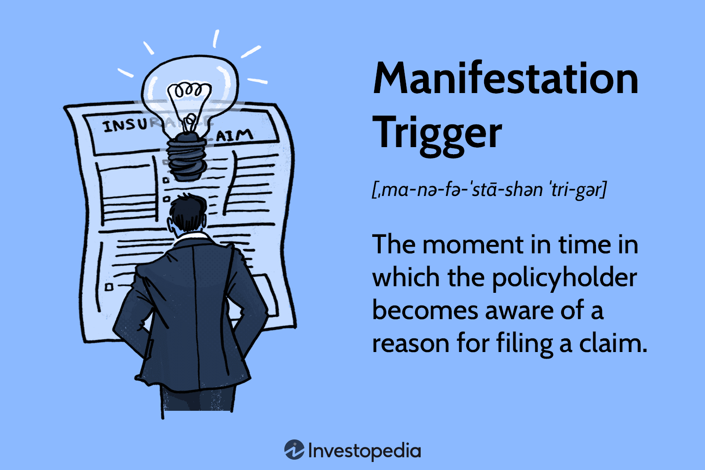

In contemporary data analysis, mastering the nuances of different variable types is essential. With the rise of algorithmic trading—a method that uses computer algorithms to automatically execute trades—the understanding of statistical variables has become increasingly significant. Algorithmic trading relies heavily on data-driven decisions, where both manifest and latent variables play pivotal roles in crafting effective trading strategies.

This article aims to clarify the concepts of manifest variables, latent variables, and statistical variables within the context of algorithmic trading. Manifest variables, also known as observable variables, are those that can be directly measured. These include tangible metrics like stock prices and trading volumes, which are critical inputs for algorithms that seek to identify profitable trading opportunities. Conversely, latent variables are not directly observable but can be inferred from manifest variables. In financial markets, these might include aspects such as market sentiment or investor confidence—factors that are essential for a deeper understanding of market dynamics but are not directly quantifiable.



The exploration of these variable types is fundamental for enhancing trading strategies using statistical models. By integrating both observable and hidden factors, traders can develop more sophisticated models that anticipate market movements with greater accuracy. This foundational knowledge empowers traders to refine their algorithms continually, adapting to the ever-evolving financial landscape. As we progress, the interplay between these variables will be key to leveraging statistical methods for superior algorithmic trading outcomes.

This introduction sets the stage for a detailed examination of the roles these variables play in algorithmic trading, offering insights into how their effective application can yield a competitive edge in the complex world of finance.

## Table of Contents

## Manifest Variables Explained

Manifest variables, often referred to as observable variables, are fundamental to any study as they can be directly measured or observed. In financial contexts, manifest variables are indispensable to algorithmic trading algorithms, forming the cornerstone from which insights are derived. Examples of such variables include stock prices, trading volumes, and various economic indicators, all of which are quantifiable and provide concrete data for analysts and traders.

In a trading context, stock prices are a quintessential example of manifest variables. They encapsulate the market's assessment of a company's value at any given time, derived directly from public trading data. Similarly, trading volumes, which indicate the number of shares or contracts traded in a given period, serve as another critical manifest variable. High trading volumes often suggest strong investor interest or confidence, while low volumes might indicate the opposite.

Economic indicators, such as interest rates, inflation rates, and employment figures, also serve as manifest variables in financial analysis. These indicators are regularly released and directly measured by government entities or financial institutions, providing traders with real-time assessments of economic health that can affect market conditions.

To leverage these variables in [algorithmic trading](/wiki/algorithmic-trading), one might incorporate them into models that predict price movements or [volatility](/wiki/volatility-trading-strategies). Algorithms typically ingest data from these manifest variables, applying statistical techniques to identify patterns or signals that might suggest profitable trading opportunities. For example, a simple moving average (SMA) could be calculated from stock prices to detect trends over time:

```python
def simple_moving_average(prices, window_size):
    sma = []
    for i in range(len(prices) - window_size + 1):
        window = prices[i:i + window_size]
        sma.append(sum(window) / window_size)
    return sma

prices = [100, 102, 104, 103, 101, 99, 98, 97, 100, 102]
sma = simple_moving_average(prices, 3)
print(sma)
```

Understanding manifest variables is crucial because they provide the tangible metrics upon which trading algorithms base their decisions. The ability to accurately measure and analyze these variables allows traders to develop models that effectively interpret market data, offering a foundation for more complex analysis involving latent variables that are not directly observable. As such, mastery of manifest variables is an essential skill for anyone aiming to excel in the field of algorithmic trading.

## Latent Variables in Algorithmic Trading

Latent variables are crucial in algorithmic trading as they represent hidden factors that influence observable outcomes but cannot be measured directly. These variables play a significant role in financial markets by affecting asset prices through mechanisms like market sentiment, prevailing economic conditions, and overall investor confidence.

Market sentiment, for instance, reflects the general mood of market participants, such as optimism or pessimism, which can drive price movements despite not being directly quantifiable. Economic conditions encompass broader trends like GDP growth rates, unemployment, and inflation, which underpin financial markets' behaviors. Investor confidence similarly impacts decisions, shifting the demand and supply dynamics and influencing prices.

In algorithmic trading, latent variables are typically inferred from manifest variables. Manifest variables, such as stock prices, trading volumes, and historical data, serve as proxies from which latent constructs are estimated. The relationship between manifest and latent variables is often modeled using statistical techniques. One common approach is structural equation modeling (SEM) which allows for the estimation of latent variables by leveraging available data.

For instance, consider an algorithm that uses trading [volume](/wiki/volume-trading-strategy) and price movements to infer market sentiment. The latent variable $L$ (market sentiment) can be modeled as a function of manifest variables $X_1$ (trading volume) and $X_2$ (price movements), with the model utilizing historical relationships to estimate $L$:

$$
L = \beta_1 X_1 + \beta_2 X_2 + \varepsilon
$$

where $\beta_1$ and $\beta_2$ are parameter estimates and $\varepsilon$ is the error term. By estimating $L$, the algorithm gains deeper insights that could inform trade decisions, like anticipating trends not immediately visible through raw price and volume data.

Python, a preferred language in algorithmic trading, can be used to execute such analyses. The following pseudocode illustrates a basic outline for using manifest variables to estimate latent variables:

```python
import numpy as np
import statsmodels.api as sm

# Example data for manifest variables
trading_volume = np.array([...])  # hypothetical trading volume data
price_movements = np.array([...])  # hypothetical price movement data

# Combine manifest variables into a matrix
X = np.column_stack((trading_volume, price_movements))
X = sm.add_constant(X)  # Add a constant term to the model

# Generate the latent variable model
model = sm.OLS(endog=latent_variable_proxy, exog=X)
results = model.fit()

# Print the estimation results
print(results.summary())
```

Harnessing latent variables in algorithmic trading can lead to more sophisticated models that incorporate underlying market dynamics, supporting more effective and strategic decision-making processes. This methodology not only aids in modeling complex interactions but also enhances trading strategies by providing a more nuanced understanding of market movements.

## Statistical Variables and Their Role

Statistical variables play a pivotal role in algorithmic trading by providing the foundation for predictive models that are essential for making informed trading decisions. These variables can be categorized into two main types: manifest variables, which are directly observable, and latent variables, which are not directly measured but inferred from manifest variables. Together, they form the backbone of statistical models used in trading algorithms.

Manifest variables include directly measurable factors such as stock prices, trading volumes, and economic indicators. These variables provide the raw data input for trading algorithms and serve as the observable metrics upon which predictions and strategies are based. For instance, historical stock prices and trading volumes are often used to determine future price movements and identify potential entry or [exit](/wiki/exit-strategy) points for trades.

Latent variables, on the other hand, represent hidden factors that influence the manifest variables. These could include market sentiment, investor confidence, or macroeconomic conditions. Although latent variables cannot be observed directly, they can significantly affect the behavior of observable market data. Therefore, advanced statistical techniques, such as [factor](/wiki/factor-investing) analysis or state-space models, are developed to infer these latent variables from observable data.

Incorporating both manifest and latent variables allows algorithmic trading models to comprehensively analyze historical data and predict future market trends more accurately. For example, the standard linear regression model can be extended to include latent variables using the following formula:

$$
Y = \beta_0 + \beta_1 X_1 + \beta_2 X_2 + \epsilon
$$

Here, $Y$ represents the response variable (e.g., future stock price), $X_1$ and $X_2$ are manifest and latent variables respectively, and $\epsilon$ signifies the error term. The coefficients $\beta_0$, $\beta_1$, and $\beta_2$ are determined through model training on historical data.

Understanding the interplay between manifest and latent variables is crucial for refining trading strategies. By harnessing the predictive power of these variables, algorithmic traders can develop models that are adaptive to changing market environments. This adaptability is achieved through continuous model validation and adjustment, ensuring that trading systems remain robust against diverse market scenarios.

Moreover, the integration of advanced statistical methods, such as [machine learning](/wiki/machine-learning) algorithms, has further enhanced the ability to process and analyze these variables. Python, being a popular language for data analysis and trading, offers libraries like pandas, NumPy, and sklearn to facilitate the development of sophisticated algorithmic trading models. For instance, the following Python code snippet demonstrates a simple linear regression model using manifest variables:

```python
import pandas as pd
from sklearn.linear_model import LinearRegression

# Load historical stock data
data = pd.read_csv('historical_data.csv')
X = data[['trading_volume', 'economic_indicator']]
Y = data['stock_price']

# Train linear regression model
model = LinearRegression()
model.fit(X, Y)

# Predict future stock price
future_X = [[100000, 3.5]]  # example future trading volume and economic indicator
predicted_price = model.predict(future_X)
```

In summary, statistical variables are fundamental to the development and success of algorithmic trading models. They provide the essential data inputs and insights necessary for predicting market behavior and shaping trading strategies that can adapt to new information and conditions effectively.

## The Importance of Variable Models in Algotrading

Latent variable models, such as factor models and state-space models, play a pivotal role in algorithmic trading by uncovering hidden patterns within financial time series data. These statistical models enable traders to gain insights into underlying factors that are not directly observable yet significantly influence asset prices. 

Factor models decompose the returns of assets into common factors and idiosyncratic components. The general form of a factor model can be expressed as:

$$
R_i = \alpha_i + \beta_{i1} F_1 + \beta_{i2} F_2 + ... + \beta_{ik} F_k + \epsilon_i
$$

where $R_i$ represents the return of asset $i$, $\alpha_i$ is the asset's alpha, $\beta_{ik}$ is the sensitivity of asset $i$ to factor $k$, $F_k$ are the factors, and $\epsilon_i$ is the idiosyncratic component.

These models are crucial in developing trading strategies as they can anticipate market shifts by understanding macroeconomic factors, sectors, or specific attributes influencing asset prices. For instance, a factor model can help identify which sectors are likely to outperform based on economic conditions, allowing traders to adjust their portfolio accordingly.

State-space models, on the other hand, allow for the modeling of dynamic systems by considering both observable measurements and unobservable states. They are beneficial for financial time series analysis as they accommodate varying variance and autocorrelation structures within data. A basic state-space model consists of:

- **State Equation**: $X_t = AX_{t-1} + BW_t$
- **Observation Equation**: $Y_t = CX_t + DV_t$

where $X_t$ represents the state vector at time $t$, $Y_t$ denotes the observation vector, and $W_t$, $V_t$ are process and observation noise, respectively.

Incorporating state-space models into algorithmic trading allows for the anticipation of regime changes in financial markets, enhancing decision-making processes. By dynamically adjusting to shifts in market behavior, traders can mitigate risks and identify lucrative opportunities.

The intelligent application of latent variable models in trading enhances a trader's ability to manage risks and capitalize on market inefficiencies. By identifying latent factors influencing asset prices, these models enable the construction of robust trading strategies that can adapt to evolving market dynamics, ultimately leading to improved performance and competitive advantage. Using these advanced statistical tools, traders are better equipped to navigate complex market environments, reduce uncertainty, and optimize profitability.

## Building Robust Trading Strategies

Creating effective trading algorithms necessitates a comprehensive understanding and application of both manifest and latent variables. The integration of these variable types in algorithmic trading facilitates the development of strategies capable of adapting to the dynamic nature of financial markets.

Manifest variables, which are directly observable metrics such as stock prices and trading volumes, provide tangible data points for initial analysis. These variables act as the groundwork upon which trading algorithms base their initial configurations. For instance, a simple moving average (SMA) strategy might rely on manifest variables such as historical closing prices:

```python
def simple_moving_average(prices, window):
    return [sum(prices[i:i+window])/window for i in range(len(prices) - window + 1)]
```

Conversely, latent variables, which represent unobservable influences like market sentiment or economic expectations, require inference through statistical models. Methods such as Principal Component Analysis (PCA) or latent factor models can extract latent structures from manifest data, providing a more nuanced understanding of market behaviors. 

The synergy between these variable types is paramount for building adaptive trading strategies. By combining manifest and latent data, traders can construct models that not only react to explicit market conditions but also anticipate underlying trends and shifts. For example, a trading strategy might incorporate sentiment analysis, leveraging natural language processing (NLP) to quantify investor emotions and fuse these insights with pricing data.

Moreover, employing advanced statistical techniques ensures that trading systems remain robust under various market scenarios. Techniques such as Vector Autoregression (VAR) can model multivariate time series data, capturing the dynamic interplay between multiple financial variables. In practice, this involves forecasting future values based on past data, accounting for potential correlations among variable sets.

```python
from statsmodels.tsa.vector_ar.var_model import VAR

def forecast_var(data, steps):
    model = VAR(data)
    model_fitted = model.fit()
    return model_fitted.forecast(model_fitted.y, steps=steps)
```

Incorporating these methodologies into trading algorithms helps enhance model resilience and adaptability. By continuously refining these strategies through [backtesting](/wiki/backtesting) and validation, traders ensure their systems perform consistently well across different economic environments, thus maintaining a competitive edge in the marketplace. 

Ultimately, the effective integration of manifest and latent variables within sophisticated statistical frameworks empowers traders to develop robust algorithms capable of navigating the complexities of evolving financial markets.

## Challenges and Considerations

When leveraging statistical and latent variable models in algorithmic trading, traders face several challenges that need to be addressed to ensure model efficacy and robustness. One significant challenge is the complexity inherent in these models. Statistical models, especially those involving latent variables, can become quite intricate, necessitating a deep understanding of both the mathematical theories and their application to financial data. Complexity can lead to overfitting, where the model performs exceptionally well on historical data but fails to generalize to new, unseen data. Overfitting occurs when a model learns not only the underlying patterns but also the noise present in the training dataset, reducing its predictive power in real-world scenarios. 

A practical approach to mitigating overfitting involves techniques such as cross-validation and regularization. Cross-validation divides the data into subsets, training the model on some and validating it on others to ensure its performance is robust across different data samples. Regularization techniques like L1 or L2 can be utilized to penalize model complexity and to ensure simpler, more general models.

Data quality presents another major hurdle. Algorithmic trading relies heavily on the accuracy and reliability of data inputs. Poor quality data, possibly due to errors in collection, low resolution, or infrequent updates, can lead to models producing misleading predictions. For instance, missing or incorrect data points can significantly distort the results of statistical analyses, leading to erroneous trading decisions. Ensuring data integrity involves implementing rigorous data cleaning processes and using high-fidelity data sources to minimize errors.

Additionally, continuous validation is vital to maintaining the effectiveness of algorithmic trading systems. Financial markets are dynamic, with conditions changing rapidly due to political, economic, or social factors. A model that was effective in one market environment might become obsolete in another. Hence, regular back-testing and updating of models are necessary tasks. Back-testing against historical data can confirm whether a model remains relevant under current conditions, while ongoing updates can allow the model to adapt to new trends or anomalies in the market.

In summary, while statistical and latent variable models offer powerful tools for algotrading, attention to model complexity and data quality is crucial. By employing best practices in model validation and data management, traders can significantly enhance the reliability and performance of their algorithmic trading systems.

## Conclusion

Incorporating statistical, manifest, and latent variables in algorithmic trading offers a competitive edge in the financial markets by enabling traders to utilize a comprehensive set of tools to understand and predict market behavior. Manifest variables, such as stock prices and trading volumes, provide the foundational data necessary for initial analyses and strategy formulation. Latent variables, on the other hand, uncover deeper insights into factors like market sentiment and investor confidence that are not directly observable but significantly influence market dynamics.

As traders deepen their understanding of these concepts, they are better equipped to navigate the complexities of market behavior with precision. The integration of statistical variables allows for the development of robust predictive models that enhance decision-making processes and optimize trading outcomes. These sophisticated models, which may employ techniques such as regression analysis or factor models, facilitate the detection of subtle market patterns and investment opportunities.

Further, the ongoing advancements in technology and statistical methodologies open new avenues for refining and advancing trading strategies. With the increasing availability of big data and machine learning tools, algorithmic traders can enhance predictive accuracy and model sophistication. This continuous evolution underscores the increasing importance of leveraging statistical, manifest, and latent variables, ensuring that trading systems remain adaptable and competitive in ever-changing financial environments. The ability to harness these elements effectively is a critical factor in achieving sustained success and capitalizing on new trading opportunities in a rapidly evolving market landscape.

## References & Further Reading

[1]: Bergstra, J., Bardenet, R., Bengio, Y., & Kégl, B. (2011). ["Algorithms for Hyper-Parameter Optimization."](https://dl.acm.org/doi/10.5555/2986459.2986743) Advances in Neural Information Processing Systems 24.

[2]: ["Advances in Financial Machine Learning"](https://www.amazon.com/Advances-Financial-Machine-Learning-Marcos/dp/1119482089) by Marcos Lopez de Prado

[3]: ["Evidence-Based Technical Analysis: Applying the Scientific Method and Statistical Inference to Trading Signals"](https://www.amazon.com/Evidence-Based-Technical-Analysis-Scientific-Statistical/dp/0470008741) by David Aronson

[4]: ["Machine Learning for Algorithmic Trading"](https://github.com/stefan-jansen/machine-learning-for-trading) by Stefan Jansen

[5]: ["Quantitative Trading: How to Build Your Own Algorithmic Trading Business"](https://www.amazon.com/Quantitative-Trading-Build-Algorithmic-Business/dp/1119800064) by Ernest P. Chan