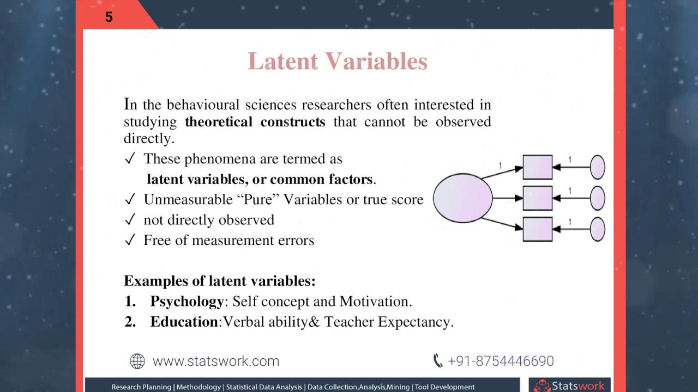

## Table of Contents

## What is a manifest variable?

A manifest variable is something you can directly see or measure in research or statistics. It's like when you count the number of apples in a basket or measure someone's height. These are things you can easily observe and record without any guesswork.

In contrast, manifest variables are different from latent variables, which are things you can't see directly. For example, intelligence or satisfaction are latent variables because you can't measure them directly; you need to use other signs or tests to figure them out. Manifest variables help researchers because they give clear, direct information that can be used in studies and experiments.

## How does a manifest variable differ from a latent variable?

A manifest variable is something you can see and measure directly. It's like counting the number of cars in a parking lot or measuring the temperature outside. These are things you can observe easily and record without any guesswork. In research, manifest variables are important because they give clear, direct information that can be used in studies and experiments.

On the other hand, a latent variable is something you can't see directly. It's like trying to measure happiness or intelligence. You can't just look at someone and know how happy or smart they are. Instead, you have to use other signs or tests to figure it out. For example, you might ask people questions or observe their behavior to estimate their level of happiness or intelligence. Latent variables are important in research too, but they need more indirect methods to be measured.

## Can you provide examples of manifest variables in everyday life?

Manifest variables are things you can see and count easily in everyday life. For example, when you go to the grocery store, the number of apples in your basket is a manifest variable. You can simply count them and know exactly how many there are. Another example is the amount of money in your wallet. You can open it up, look inside, and see how many dollars or coins you have.

Another everyday example of a manifest variable is the temperature outside. You can use a thermometer to measure it directly and get a precise number. The time it takes to drive to work is also a manifest variable. You can start a timer when you leave home and stop it when you arrive at work, giving you an exact measurement of your commute time. These are all things that are easy to observe and record without any guesswork.

## What role do manifest variables play in statistical analysis?

In statistical analysis, manifest variables are really important because they give us clear, direct information that we can use in our studies. When we do research, we often need to measure things like how many people showed up to an event, how much it rained last week, or how long it takes to complete a task. These are all manifest variables because we can see and count them easily. By using manifest variables, we can make our data more reliable and easier to understand. This helps us to draw better conclusions from our research.

Manifest variables also help us to test our theories and models. For example, if we want to study how exercise affects weight loss, we can use manifest variables like the number of minutes someone exercises each day and their weight before and after the study. These variables are easy to measure and record, so we can see if there's a clear link between exercise and weight loss. By using manifest variables, we can make our statistical analysis more straightforward and our results more trustworthy.

## How are manifest variables used in psychological research?

In psychological research, manifest variables are used to measure things that we can see directly. For example, if a psychologist wants to study how much time kids spend playing video games, they can ask the kids or their parents to keep track of the hours. This is a manifest variable because it's easy to count and record. Psychologists use these variables to gather clear and reliable data, which helps them understand behaviors and patterns better.

Manifest variables are also important when psychologists want to test their theories. Let's say a researcher wants to see if eating breakfast affects how well students do in school. They can measure the number of days a student eats breakfast (a manifest variable) and compare it with their test scores. By using manifest variables, psychologists can make their research more straightforward and their conclusions more trustworthy. This helps them draw better connections between what they can see and what they want to understand about human behavior.

## What are the common methods for measuring manifest variables?

Measuring manifest variables is usually pretty simple because they are things you can see and count directly. One common way to measure them is by using tools like rulers, scales, or thermometers. For example, if you want to know someone's height, you can use a tape measure to find out exactly how tall they are. If you're checking the temperature outside, a thermometer gives you a precise number. These tools help make sure your measurements are accurate and easy to record.

Another way to measure manifest variables is by counting or observing them directly. For example, if you want to know how many people attended a meeting, you can just count the number of people in the room. If you're studying how many hours someone spends studying, you can ask them to keep a log or use a timer to track their study time. These methods are straightforward and don't need any guesswork, making them reliable for collecting data in research.

## How do manifest variables contribute to the validity of a study?

Manifest variables help make a study more valid because they are things you can see and measure directly. When researchers use manifest variables, they get clear and reliable data. This makes it easier to trust the results of the study. For example, if a study is about how much exercise people do, using a manifest variable like the number of minutes they exercise each day gives a clear picture. This clear data helps make sure the study's findings are accurate and believable.

Using manifest variables also helps researchers test their theories more easily. When they can measure something directly, like the amount of time someone spends on a task, it's simpler to see if their theory holds up. This direct measurement reduces the chance of mistakes and makes the study's conclusions stronger. By using manifest variables, researchers can make their studies more straightforward and their results more trustworthy, which is important for the overall validity of the research.

## What challenges are associated with using manifest variables in research?

Using manifest variables in research can seem easy because they are things you can see and measure directly. But there are some challenges. One challenge is making sure the measurements are accurate. Even though manifest variables are easy to measure, mistakes can happen. For example, if you're counting the number of people at an event, someone might be missed or counted twice. These small errors can affect the results of the study.

Another challenge is that manifest variables might not always tell the whole story. They give you clear information, but they don't show what's going on inside someone's mind or feelings. For example, if you measure how many hours someone studies, you can't tell if they were focused or distracted during that time. This means that while manifest variables are helpful, researchers need to use other methods too to get a complete picture of what they're studying.

## How can the reliability of manifest variables be assessed?

To assess the reliability of manifest variables, researchers often use something called test-retest reliability. This means they measure the same manifest variable at different times to see if the results stay the same. For example, if they're counting the number of people at a meeting, they might count again a few days later to make sure the numbers match. If the numbers are similar, it shows that the measurement is reliable. But if the numbers are different, it might mean there were mistakes in how the variable was measured.

Another way to check the reliability of manifest variables is by using inter-rater reliability. This involves having different people measure the same thing to see if they get the same results. For example, if two researchers are counting the number of cars in a parking lot, their counts should be close to each other. If they are, it shows that the way the variable is being measured is reliable. But if their counts are very different, it might mean that the method needs to be improved or that the variable is hard to measure accurately.

## In what ways do manifest variables interact with latent variables in structural equation modeling?

In structural equation modeling, manifest variables and latent variables work together to help researchers understand complex relationships. Manifest variables are the things you can see and measure directly, like how many hours someone sleeps or how much money they earn. These are used to represent or measure the latent variables, which are things you can't see directly, like stress levels or intelligence. For example, if you want to study stress, you might use manifest variables like the number of hours someone works or how often they exercise to help figure out their stress level, which is the latent variable.

The way manifest variables interact with latent variables in this type of modeling is by serving as indicators. Researchers use statistical methods to see how well the manifest variables can predict or represent the latent variables. If the manifest variables are good indicators, it means they are reliable ways to measure the things you can't see directly. This helps make the overall model stronger and more accurate. By understanding how these variables interact, researchers can draw better conclusions about the relationships between different factors in their study.

## What advanced statistical techniques are used to analyze the relationships between multiple manifest variables?

When researchers want to understand how different things they can see and measure (manifest variables) relate to each other, they often use a technique called multivariate analysis. This technique helps them look at many manifest variables at the same time to see how they work together. For example, if they're studying how much people exercise, what they eat, and how much they weigh, multivariate analysis can show how these things are connected. It's like looking at a big puzzle and figuring out how all the pieces fit together. By using this method, researchers can find patterns and connections that they might miss if they looked at each variable by itself.

Another advanced technique is factor analysis. This is used when researchers want to see if there are any hidden patterns or groups among the manifest variables. For example, if they're studying different behaviors like how much someone reads, how often they go to the library, and how many books they own, factor analysis can help them see if these behaviors are related to a bigger idea, like a love for reading. It helps simplify a lot of information into something easier to understand. Both multivariate analysis and factor analysis are powerful tools that help researchers make sense of the relationships between many manifest variables.

## How have the applications of manifest variables evolved in modern research methodologies?

In modern research, the use of manifest variables has grown a lot because of new technology and methods. Before, researchers mostly used simple tools like rulers and timers to measure things they could see directly. Now, they use computers and special software to collect and analyze data from manifest variables more easily and accurately. For example, wearable devices like fitness trackers can measure how many steps someone takes or how well they sleep. These devices give researchers a lot of detailed information that they can use to study things like health and behavior.

Also, the way researchers use manifest variables has changed with new methods like big data and machine learning. These methods let researchers look at huge amounts of data from manifest variables to find patterns and make predictions. For example, in social media research, the number of likes, shares, and comments on a post are manifest variables that can be used to understand how people think and feel. By using these new tools and methods, researchers can learn more from manifest variables and make their studies more detailed and useful.

## What are Latent Variables in Algorithmic Trading?

Latent variables are crucial in algorithmic trading as they represent hidden factors that influence observable outcomes but cannot be measured directly. These variables play a significant role in financial markets by affecting asset prices through mechanisms like market sentiment, prevailing economic conditions, and overall investor confidence.

Market sentiment, for instance, reflects the general mood of market participants, such as optimism or pessimism, which can drive price movements despite not being directly quantifiable. Economic conditions encompass broader trends like GDP growth rates, unemployment, and inflation, which underpin financial markets' behaviors. Investor confidence similarly impacts decisions, shifting the demand and supply dynamics and influencing prices.

In algorithmic trading, latent variables are typically inferred from manifest variables. Manifest variables, such as stock prices, trading volumes, and historical data, serve as proxies from which latent constructs are estimated. The relationship between manifest and latent variables is often modeled using statistical techniques. One common approach is structural equation modeling (SEM) which allows for the estimation of latent variables by leveraging available data.

For instance, consider an algorithm that uses trading [volume](/wiki/volume-trading-strategy) and price movements to infer market sentiment. The latent variable $L$ (market sentiment) can be modeled as a function of manifest variables $X_1$ (trading volume) and $X_2$ (price movements), with the model utilizing historical relationships to estimate $L$:

$$
L = \beta_1 X_1 + \beta_2 X_2 + \varepsilon
$$

where $\beta_1$ and $\beta_2$ are parameter estimates and $\varepsilon$ is the error term. By estimating $L$, the algorithm gains deeper insights that could inform trade decisions, like anticipating trends not immediately visible through raw price and volume data.

Python, a preferred language in algorithmic trading, can be used to execute such analyses. The following pseudocode illustrates a basic outline for using manifest variables to estimate latent variables:

```python
import numpy as np
import statsmodels.api as sm

# Example data for manifest variables
trading_volume = np.array([...])  # hypothetical trading volume data
price_movements = np.array([...])  # hypothetical price movement data

# Combine manifest variables into a matrix
X = np.column_stack((trading_volume, price_movements))
X = sm.add_constant(X)  # Add a constant term to the model

# Generate the latent variable model
model = sm.OLS(endog=latent_variable_proxy, exog=X)
results = model.fit()

# Print the estimation results
print(results.summary())
```

Harnessing latent variables in algorithmic trading can lead to more sophisticated models that incorporate underlying market dynamics, supporting more effective and strategic decision-making processes. This methodology not only aids in modeling complex interactions but also enhances trading strategies by providing a more nuanced understanding of market movements.

## What are statistical variables and what is their role?

Statistical variables play a pivotal role in algorithmic trading by providing the foundation for predictive models that are essential for making informed trading decisions. These variables can be categorized into two main types: manifest variables, which are directly observable, and latent variables, which are not directly measured but inferred from manifest variables. Together, they form the backbone of statistical models used in trading algorithms.

Manifest variables include directly measurable factors such as stock prices, trading volumes, and economic indicators. These variables provide the raw data input for trading algorithms and serve as the observable metrics upon which predictions and strategies are based. For instance, historical stock prices and trading volumes are often used to determine future price movements and identify potential entry or [exit](/wiki/exit-strategy) points for trades.

Latent variables, on the other hand, represent hidden factors that influence the manifest variables. These could include market sentiment, investor confidence, or macroeconomic conditions. Although latent variables cannot be observed directly, they can significantly affect the behavior of observable market data. Therefore, advanced statistical techniques, such as [factor](/wiki/factor-investing) analysis or state-space models, are developed to infer these latent variables from observable data.

Incorporating both manifest and latent variables allows algorithmic trading models to comprehensively analyze historical data and predict future market trends more accurately. For example, the standard linear regression model can be extended to include latent variables using the following formula:

$$
Y = \beta_0 + \beta_1 X_1 + \beta_2 X_2 + \epsilon
$$

Here, $Y$ represents the response variable (e.g., future stock price), $X_1$ and $X_2$ are manifest and latent variables respectively, and $\epsilon$ signifies the error term. The coefficients $\beta_0$, $\beta_1$, and $\beta_2$ are determined through model training on historical data.

Understanding the interplay between manifest and latent variables is crucial for refining trading strategies. By harnessing the predictive power of these variables, algorithmic traders can develop models that are adaptive to changing market environments. This adaptability is achieved through continuous model validation and adjustment, ensuring that trading systems remain robust against diverse market scenarios.

Moreover, the integration of advanced statistical methods, such as [machine learning](/wiki/machine-learning) algorithms, has further enhanced the ability to process and analyze these variables. Python, being a popular language for data analysis and trading, offers libraries like pandas, NumPy, and sklearn to facilitate the development of sophisticated algorithmic trading models. For instance, the following Python code snippet demonstrates a simple linear regression model using manifest variables:

```python
import pandas as pd
from sklearn.linear_model import LinearRegression

# Load historical stock data
data = pd.read_csv('historical_data.csv')
X = data[['trading_volume', 'economic_indicator']]
Y = data['stock_price']

# Train linear regression model
model = LinearRegression()
model.fit(X, Y)

# Predict future stock price
future_X = [[100000, 3.5]]  # example future trading volume and economic indicator
predicted_price = model.predict(future_X)
```

In summary, statistical variables are fundamental to the development and success of algorithmic trading models. They provide the essential data inputs and insights necessary for predicting market behavior and shaping trading strategies that can adapt to new information and conditions effectively.

## What is the importance of variable models in algotrading?

Latent variable models, such as factor models and state-space models, play a pivotal role in algorithmic trading by uncovering hidden patterns within financial time series data. These statistical models enable traders to gain insights into underlying factors that are not directly observable yet significantly influence asset prices. 

Factor models decompose the returns of assets into common factors and idiosyncratic components. The general form of a factor model can be expressed as:

$$
R_i = \alpha_i + \beta_{i1} F_1 + \beta_{i2} F_2 + ... + \beta_{ik} F_k + \epsilon_i
$$

where $R_i$ represents the return of asset $i$, $\alpha_i$ is the asset's alpha, $\beta_{ik}$ is the sensitivity of asset $i$ to factor $k$, $F_k$ are the factors, and $\epsilon_i$ is the idiosyncratic component.

These models are crucial in developing trading strategies as they can anticipate market shifts by understanding macroeconomic factors, sectors, or specific attributes influencing asset prices. For instance, a factor model can help identify which sectors are likely to outperform based on economic conditions, allowing traders to adjust their portfolio accordingly.

State-space models, on the other hand, allow for the modeling of dynamic systems by considering both observable measurements and unobservable states. They are beneficial for financial time series analysis as they accommodate varying variance and autocorrelation structures within data. A basic state-space model consists of:

- **State Equation**: $X_t = AX_{t-1} + BW_t$
- **Observation Equation**: $Y_t = CX_t + DV_t$

where $X_t$ represents the state vector at time $t$, $Y_t$ denotes the observation vector, and $W_t$, $V_t$ are process and observation noise, respectively.

Incorporating state-space models into algorithmic trading allows for the anticipation of regime changes in financial markets, enhancing decision-making processes. By dynamically adjusting to shifts in market behavior, traders can mitigate risks and identify lucrative opportunities.

The intelligent application of latent variable models in trading enhances a trader's ability to manage risks and capitalize on market inefficiencies. By identifying latent factors influencing asset prices, these models enable the construction of robust trading strategies that can adapt to evolving market dynamics, ultimately leading to improved performance and competitive advantage. Using these advanced statistical tools, traders are better equipped to navigate complex market environments, reduce uncertainty, and optimize profitability.

## References & Further Reading

[1]: Bergstra, J., Bardenet, R., Bengio, Y., & Kégl, B. (2011). ["Algorithms for Hyper-Parameter Optimization."](https://dl.acm.org/doi/10.5555/2986459.2986743) Advances in Neural Information Processing Systems 24.

[2]: ["Advances in Financial Machine Learning"](https://www.amazon.com/Advances-Financial-Machine-Learning-Marcos/dp/1119482089) by Marcos Lopez de Prado

[3]: ["Evidence-Based Technical Analysis: Applying the Scientific Method and Statistical Inference to Trading Signals"](https://www.amazon.com/Evidence-Based-Technical-Analysis-Scientific-Statistical/dp/0470008741) by David Aronson

[4]: ["Machine Learning for Algorithmic Trading"](https://github.com/stefan-jansen/machine-learning-for-trading) by Stefan Jansen

[5]: ["Quantitative Trading: How to Build Your Own Algorithmic Trading Business"](https://www.amazon.com/Quantitative-Trading-Build-Algorithmic-Business/dp/1119800064) by Ernest P. Chan