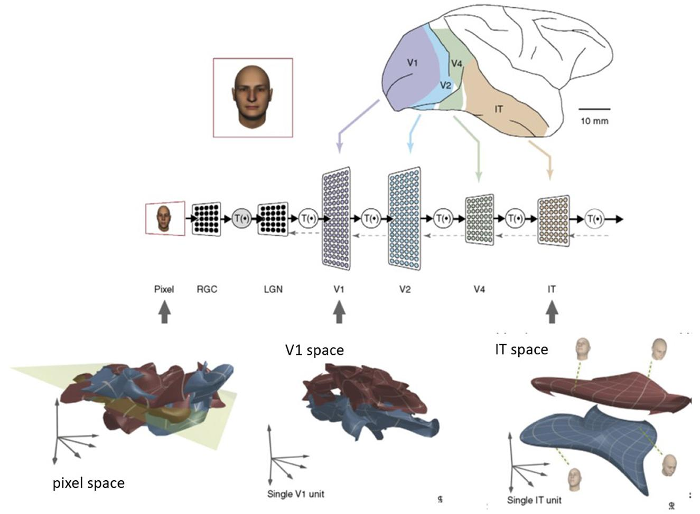

## Table of Contents

## What is manifold disentangling in the context of machine learning?

Manifold disentangling in machine learning is about understanding and separating the different aspects or features of data that are mixed together. Imagine you have a picture of a face. The face has many features like the shape of the eyes, the color of the hair, and the expression on the mouth. These features are all mixed up in the picture, but they each change independently of the others. Manifold disentangling tries to find a way to separate these features so that you can change one without affecting the others. This is useful because it helps machines learn and generate new data more effectively.

To do this, machine learning models use techniques to represent the data in a way that separates these independent features onto different 'manifolds' or spaces. For example, one manifold might represent the color of the hair, while another represents the shape of the eyes. By learning how to move along these manifolds independently, the model can change the hair color without changing the eye shape. This separation helps in creating more flexible and controllable models, which is important for tasks like generating new images or improving the performance of other machine learning tasks.

## How does manifold disentangling differ from traditional dimensionality reduction techniques?

Manifold disentangling and traditional dimensionality reduction techniques both aim to simplify complex data, but they do so in different ways. Traditional dimensionality reduction, like Principal Component Analysis (PCA) or t-SNE, focuses on reducing the number of variables in the data while keeping as much information as possible. These methods look at the overall structure of the data and try to find a lower-dimensional space that captures the most important features. For example, PCA finds new axes (principal components) along which the data varies the most, and then projects the data onto these axes.

In contrast, manifold disentangling goes a step further by not just reducing the dimensions but also trying to separate the underlying independent factors of variation in the data. Imagine a picture of a face where the age, expression, and hair color are all mixed together. Manifold disentangling tries to find separate 'manifolds' or spaces for each of these factors, so that changing one factor (like hair color) doesn't affect the others (like age or expression). This separation helps in creating models that can generate new data or modify existing data more precisely, which is useful in tasks like image generation or data augmentation.

To sum up, while traditional dimensionality reduction techniques focus on simplifying data by reducing its dimensions, manifold disentangling aims to both simplify and separate the data into meaningful, independent components. This makes manifold disentangling particularly useful in applications where understanding and controlling the individual aspects of the data is important.

## What are the key benefits of using manifold disentangling in machine learning models?

Manifold disentangling helps machine learning models by making them better at understanding and working with data. It does this by breaking down complex data into simpler parts that can be changed without affecting each other. For example, if you have a picture of a face, manifold disentangling can separate the age, hair color, and expression into different parts. This means you can change the hair color without making the face look older or changing the expression. This separation makes models more flexible and easier to control, which is really useful in tasks like creating new images or improving how models learn.

Another big benefit is that manifold disentangling can help models learn more efficiently. When data is separated into independent parts, the model can focus on learning each part separately, which can make the learning process faster and more accurate. This is especially helpful when you have a lot of data with many different features. By understanding and controlling these features separately, the model can make better predictions and create new data that looks more realistic. This makes manifold disentangling a powerful tool for improving the performance of machine learning models in many different applications.

## Can you explain the concept of a manifold in relation to data representation?

A manifold is a way to think about data in a simpler form. Imagine you have a lot of pictures of dogs. Each picture has many details like the dog's size, color, and breed. These details can be thought of as living on a 'surface' or 'space' called a manifold. This manifold helps us see how these details are related to each other. For example, the size and breed of the dog might be closely linked, so they would be close together on this surface. By understanding the manifold, we can better see the patterns and relationships in our data.

In machine learning, we use manifolds to make sense of complex data. Instead of looking at all the details at once, we can focus on the important parts that change together. This makes it easier to work with the data and learn from it. For example, if we want to change the color of the dog in our pictures, we can move along the manifold that represents color without changing other details like size or breed. This helps us create more accurate and flexible models that can handle different tasks, like generating new pictures or improving how we classify data.

## What role does GEOMANCER play in manifold disentangling?

GEOMANCER is a tool that helps with manifold disentangling in machine learning. It works by finding and separating the different parts of data that change independently. Imagine you have a picture of a face. The face has many features like the shape of the eyes, the color of the hair, and the expression on the mouth. GEOMANCER helps to find a way to separate these features so that you can change one without affecting the others. This is useful because it helps machines learn and generate new data more effectively.

GEOMANCER uses special math to understand how these features are related and how they can be separated. It looks at the data and tries to find the best way to represent it in a way that makes these independent features clear. By doing this, GEOMANCER helps create models that can change one part of the data without messing up the other parts. This makes the models more flexible and better at tasks like creating new images or improving how they learn from data.

## How is the process of disentangling manifolds implemented in GEOMANCER?

GEOMANCER helps with disentangling manifolds by looking at the data and finding the best way to separate its different parts. Imagine you have a picture of a face with features like the shape of the eyes, the color of the hair, and the expression on the mouth. GEOMANCER uses math to understand how these features are related and how they can be separated. It does this by creating a special map of the data, where each feature lives in its own space or manifold. By moving along these manifolds, GEOMANCER can change one feature, like the hair color, without changing others, like the eye shape or the expression.

The process starts with GEOMANCER analyzing the data to find the underlying structure. It uses techniques like non-linear dimensionality reduction to understand how the data points are related and to identify the independent factors of variation. Once these factors are identified, GEOMANCER creates separate manifolds for each factor. This allows the model to navigate these manifolds independently, making it possible to modify one aspect of the data without affecting others. This separation is crucial for tasks like generating new images or improving the performance of machine learning models, as it gives more control and flexibility over the data.

## What are some common challenges faced when applying manifold disentangling techniques?

One common challenge in applying manifold disentangling techniques is the complexity of real-world data. Data often has many different features that are mixed together in complicated ways. For example, in a picture of a face, the age, hair color, and expression are all mixed up. It's hard for a machine learning model to separate these features into different manifolds because they can be very intertwined. This makes it difficult to change one feature without accidentally changing others.

Another challenge is the need for a lot of data to train the models effectively. Manifold disentangling requires the model to learn the underlying structure of the data, which means it needs to see many examples to understand how different features change independently. If there isn't enough data, the model might not be able to separate the features correctly, leading to poor performance. Additionally, the computational resources needed to process and analyze large datasets can be significant, making it a practical challenge for many applications.

## How can manifold disentangling improve the interpretability of machine learning models?

Manifold disentangling can make machine learning models easier to understand by breaking down complex data into simpler, independent parts. Imagine you have a picture of a face. The face has many features like the shape of the eyes, the color of the hair, and the expression on the mouth. These features are all mixed up in the picture, but they each change independently of the others. Manifold disentangling helps separate these features into different spaces or manifolds. By doing this, you can see how each feature affects the picture without the others getting in the way. This separation makes it easier to understand how the model works and what it's learning from the data.

For example, if a model is trying to predict someone's age from a picture, manifold disentangling can help by separating the age from other features like hair color or expression. This means you can see clearly how the model is using the age information to make its prediction, without other features confusing the picture. This clarity helps people trust the model more because they can see exactly what it's doing. It also makes it easier to explain the model's decisions to others, which is important in many fields like healthcare or finance where understanding why a model makes a certain prediction is crucial.

## What types of data are best suited for manifold disentangling techniques?

Manifold disentangling techniques work best with data that has clear, independent features that can be separated from each other. For example, images of faces are great for this because each face has features like the shape of the eyes, the color of the hair, and the expression on the mouth. These features can change without affecting each other, making it easier to separate them into different manifolds. This separation helps machine learning models understand and work with the data more effectively.

Another type of data that benefits from manifold disentangling is time-series data, like stock prices or weather patterns. These datasets often have multiple factors that change independently over time, such as the overall trend, seasonal patterns, and random fluctuations. By separating these factors into different manifolds, models can better predict future values and understand the underlying patterns in the data. This makes manifold disentangling a powerful tool for improving the performance of machine learning models in many different applications.

## How does manifold disentangling contribute to the field of generative models?

Manifold disentangling helps generative models by breaking down complex data into simpler, independent parts. Imagine you have a picture of a face. The face has many features like the shape of the eyes, the color of the hair, and the expression on the mouth. These features are all mixed up in the picture, but they each change independently of the others. Manifold disentangling separates these features into different spaces or manifolds. By doing this, generative models can change one feature, like the hair color, without messing up the others, like the eye shape or the expression. This makes the models more flexible and better at creating new, realistic images.

In the field of generative models, this separation is really important because it allows for more control over what the model creates. For example, if you want to generate a picture of a person with different hair colors but the same face, manifold disentangling makes it easier. By moving along the manifold that represents hair color, the model can change the hair without changing other features. This not only improves the quality of the generated images but also helps in tasks like data augmentation, where you need to create new data that looks realistic and varied.

## What advanced metrics are used to evaluate the performance of manifold disentangling methods?

Advanced metrics used to evaluate the performance of manifold disentangling methods often focus on how well the model can separate and control different features of the data. One common metric is the Mutual Information Gap (MIG), which measures how much information about one feature can be gained by knowing another feature. A higher MIG means the features are more independent, which is what we want in manifold disentangling. Another metric is the Disentanglement Score, which looks at how changing one feature affects others. If changing one feature doesn't change others, the model is doing a good job at disentangling.

Another important metric is the FactorVAE metric, which checks how well the model can identify and separate the underlying factors of variation in the data. This metric helps us understand if the model is truly learning to disentangle the data into meaningful parts. Additionally, the DCI (Disentanglement, Completeness, and Informativeness) metric is used to evaluate how well the model can represent each factor of variation in the data. A good manifold disentangling method will score high on these metrics, showing that it can effectively separate and control the independent features of the data.

## Can you discuss any recent advancements or research directions in manifold disentangling?

Recent advancements in manifold disentangling have focused on improving the ability of models to separate and control different features of data more effectively. One significant direction is the development of self-supervised learning methods, which allow models to learn from the data itself without needing labeled examples. For instance, researchers have been exploring techniques like contrastive learning, where the model learns to distinguish between different features by comparing similar and dissimilar data points. This approach helps the model better understand the underlying structure of the data, leading to more accurate disentanglement. Another advancement is the use of generative adversarial networks (GANs) combined with disentangling techniques, which can generate new data that looks realistic while maintaining control over individual features. These methods are showing promising results in fields like image generation and data augmentation.

In addition to these technical improvements, there is growing interest in applying manifold disentangling to new types of data and applications. For example, researchers are working on disentangling manifolds in audio data to separate different sound sources, like music and speech, which could improve audio processing and noise cancellation technologies. Another exciting area is the application of manifold disentangling in healthcare, where models can separate different factors affecting patient outcomes, such as genetics and lifestyle, to provide more personalized and effective treatments. These new directions highlight the versatility and potential of manifold disentangling in solving real-world problems across various domains.